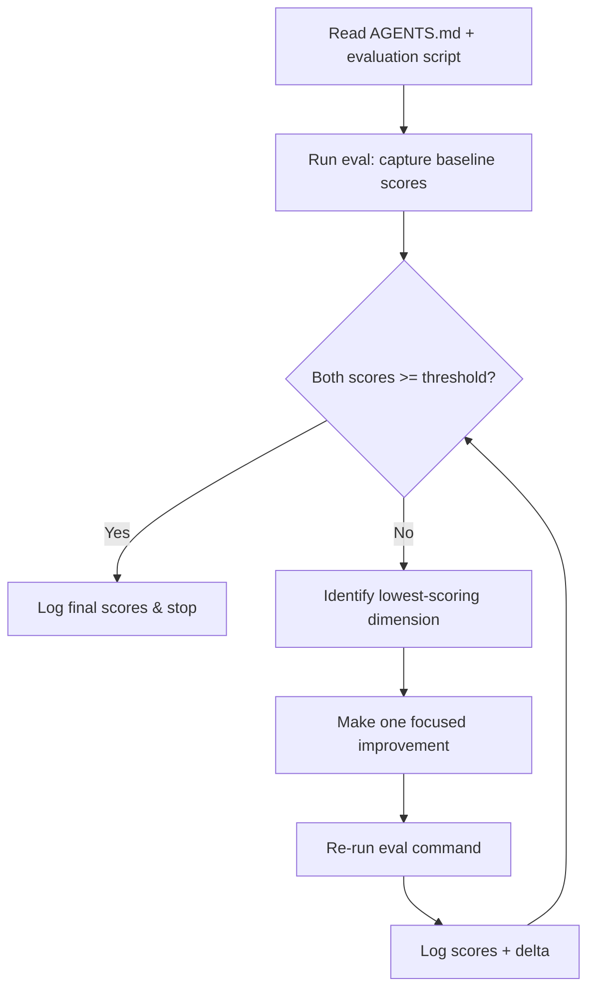
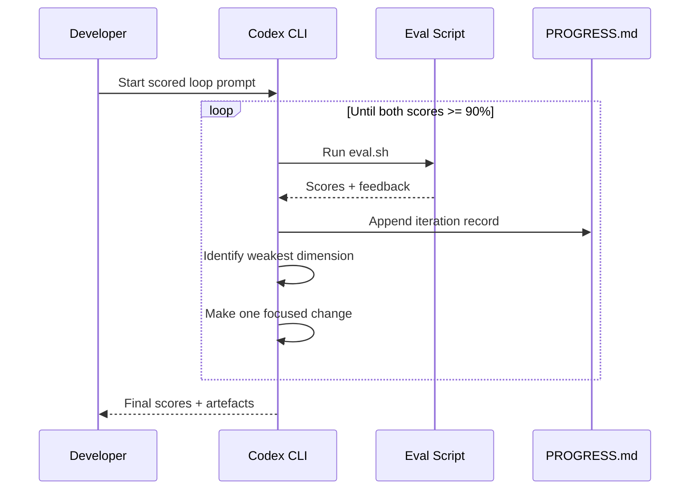

# Scored Improvement Loops with Codex CLI: Eval-Driven Iterative Problem-Solving


Some problems refuse to yield to a single prompt. Generating a production-quality SVG illustration, tuning a complex regex pipeline, or optimising a layout algorithm all share a common trait: they need many passes, each scored against concrete criteria, before the result is good enough to ship. Codex CLI's **scored improvement loop** pattern addresses this head-on — combining deterministic evaluation scripts with LLM-as-judge rubric scoring to let the agent iterate autonomously until both quantitative and qualitative thresholds are met [^1].

This article walks through the pattern end-to-end: designing the evaluation harness, configuring Codex CLI for long-running scored sessions, interpreting the telemetry, and avoiding the pitfalls that cause loops to stall or regress.

## Why Scored Loops Matter

The standard agent loop — plan, act, observe, reflect — works well for tasks with a clear binary success signal such as "tests pass" or "build succeeds" [^2]. But many real-world problems have **gradient success**: a generated chart might score 62% on data accuracy while scoring only 40% on visual clarity. A refactored module might pass all tests yet violate half the team's style conventions.

Scored improvement loops make that gradient explicit. Instead of the agent guessing whether its work is "done," it runs an evaluation command after every iteration and compares the numbers against predefined thresholds [^1]. The agent continues until both the **deterministic score** and the **LLM-judge average** exceed the target — commonly 90% [^1].



## Designing the Evaluation Harness

The evaluation harness is the backbone of the loop. OpenAI's guidance recommends splitting checks into two complementary layers [^1]:

### Deterministic Checks

These are scripts that produce machine-readable scores for objectively measurable properties. Examples include constraint violation counts, pixel-distance metrics, test pass rates, and performance benchmarks.

```bash
#!/usr/bin/env bash
# eval.sh — deterministic scoring for a layout optimisation task
set -euo pipefail

SCORE_FILE="eval-results.json"

# Run layout validator
node validate-layout.js --output "$SCORE_FILE"

# Run performance benchmark
node benchmark.js --append "$SCORE_FILE"

echo "Deterministic eval complete. Results in $SCORE_FILE"
```

### LLM-as-Judge Checks

For subjective qualities — readability, visual resemblance to a reference, prose quality — a second model scores the output against a rubric [^1] [^3]. The rubric should define explicit 0–100 scales for each dimension:

```json
{
  "rubric": {
    "visual_fidelity": "How closely does the output match the reference image? 0=unrecognisable, 100=pixel-perfect",
    "code_readability": "How easy is the generated code to understand? 0=obfuscated, 100=exemplary",
    "constraint_adherence": "Does the output respect all stated constraints? 0=none, 100=all"
  }
}
```

The OpenAI eval-skills blog post recommends structuring LLM-judge output with `--output-schema` to guarantee parseable JSON [^4]:

```json
{
  "type": "object",
  "properties": {
    "overall_pass": { "type": "boolean" },
    "score": { "type": "integer", "minimum": 0, "maximum": 100 },
    "checks": {
      "type": "array",
      "items": {
        "type": "object",
        "properties": {
          "dimension": { "type": "string" },
          "score": { "type": "integer" },
          "reasoning": { "type": "string" }
        },
        "required": ["dimension", "score", "reasoning"],
        "additionalProperties": false
      }
    }
  },
  "required": ["overall_pass", "score", "checks"],
  "additionalProperties": false
}
```

### Four-Category Success Model

The eval-skills framework suggests evaluating across four goal categories [^4]:

| Category | What it measures | Example check |
|---|---|---|
| **Outcome** | Did the task complete? | Output file exists, valid JSON |
| **Process** | Did the agent follow the intended path? | Correct tools invoked, no unnecessary file writes |
| **Style** | Does the output follow conventions? | Naming, formatting, documentation |
| **Efficiency** | Was the path economical? | Command count, token usage, iteration count |

## Configuring Codex CLI for Scored Sessions

### AGENTS.md Setup

Encode the evaluation contract directly in your `AGENTS.md` so the agent knows where the eval script lives and what the thresholds are:

```markdown
## Evaluation Loop

- **Eval command:** `bash eval.sh`
- **Results file:** `eval-results.json`
- **Deterministic target:** overall_score >= 90
- **LLM-judge target:** average rubric score >= 90
- **Iteration discipline:** one focused change per cycle
- **Running log:** append each iteration to `PROGRESS.md`
```

### Config Profile for Long-Running Loops

Scored loops tend to run for many iterations. Use a dedicated config profile with appropriate model and reasoning settings:

```toml
[profile.eval-loop]
model = "gpt-5.5"
reasoning_effort = "high"
approval_mode = "auto-edit"

[profile.eval-loop.features]
unified_exec = true
```

Launch with:

```bash
codex --profile eval-loop
```

For particularly long sessions, consider pairing with a `PLANS.md` file that defines milestones and checkpoints [^5], enabling the agent to maintain coherence across dozens of iterations.

### The Starter Prompt

OpenAI documents a recommended prompt pattern for initiating the loop [^1]:

> I have a difficult task in this workspace and I want you to run it as an eval-driven improvement loop. Before changing anything: Read `AGENTS.md`. Find the script or command that scores the current output. Then iterate: make one focused improvement, re-run the eval, log the scores and what changed, and inspect the generated artifacts. Continue until both the overall score and the LLM average are above 90%.

The key elements are: explicit reference to AGENTS.md, single-change discipline, mandatory logging, and dual-threshold stopping criteria.

## Tracking Progress with JSONL Telemetry

When running scored loops via `codex exec --json`, each iteration emits structured events that you can pipe into monitoring dashboards [^6]:

```bash
codex exec --json \
  --profile eval-loop \
  "Run the eval-driven improvement loop as described in AGENTS.md" \
  2>telemetry.jsonl
```

The `turn.completed` events include token usage data — `input_tokens`, `cached_input_tokens`, and `output_tokens` — making it straightforward to track cost accumulation across iterations [^6]. With the v0.125.0 update, reasoning tokens are also reported, giving full visibility into where compute is spent [^7].



## Common Pitfalls and Mitigations

| Pitfall | Symptom | Mitigation |
|---|---|---|
| **Multi-change iterations** | Scores fluctuate unpredictably | Enforce single-change discipline in AGENTS.md |
| **Score plateau** | Same score for 3+ consecutive iterations | Instruct agent to try a fundamentally different approach |
| **Metric gaming** | Deterministic score rises but output quality drops | Ensure LLM-judge rubric covers qualitative dimensions |
| **Context exhaustion** | Agent loses track of progress in long sessions | Use PROGRESS.md running log + PLANS.md milestones [^5] |
| **Eval script fragility** | Eval crashes on unexpected output format | Wrap eval in error handling; fail gracefully with score 0 |
| **Runaway cost** | Token spend spirals over many iterations | Set a `max_turns` limit or monitor reasoning tokens via telemetry [^7] |

## When to Use Scored Loops

This pattern shines for specific problem shapes [^1]:

- **Gradient-success tasks** — where "better" is measurable but "done" is subjective
- **Visual or creative outputs** — image generation, CSS layouts, chart design
- **Optimisation problems** — performance tuning, compression ratios, algorithm refinement
- **Multi-constraint satisfaction** — outputs must balance competing requirements

It is overkill for binary-outcome tasks (tests pass/fail, build succeeds/fails) where the standard agent loop already provides clear termination signals.

## Headless CI Integration

Scored loops integrate naturally with CI pipelines via `codex exec`. A GitHub Actions workflow might run the loop on a schedule to optimise a performance-critical module:


```yaml
- name: Run scored improvement loop
  uses: openai/codex-action@v1
  with:
    codex-args: "--profile eval-loop"
    prompt-file: ".codex/prompts/perf-optimise.md"
    sandbox: "workspace-write"
  env:
    OPENAI_API_KEY: ${{ secrets.OPENAI_API_KEY }}
```


Pair this with a step that parses `eval-results.json` and fails the job if scores regress below a floor, creating a **ratchet** that prevents quality from slipping [^4].

## Model Selection for Scored Loops

| Phase | Recommended model | Rationale |
|---|---|---|
| **Implementation changes** | `gpt-5.5` | Complex reasoning for targeted improvements [^8] |
| **LLM-as-judge scoring** | `gpt-5.5` or `gpt-5.4` | Balanced accuracy for rubric evaluation [^3] |
| **Quick deterministic checks** | `gpt-5.3-codex-spark` | Fast, low-cost for script execution [^8] |

⚠️ Using the same model as both implementer and judge can introduce self-preference bias. Where budget allows, consider using a different model for the judge step [^3].

## Conclusion

Scored improvement loops transform Codex CLI from a single-shot code generator into a persistent optimisation engine. The pattern is straightforward: define what "good" looks like with deterministic checks and LLM rubrics, enforce single-change iteration discipline, and let the agent grind through cycles until both scores clear the bar. For gradient-success problems that resist one-shot solutions, this is the most reliable approach available in the current agentic coding toolkit.

## Citations

[^1]: OpenAI, "Iterate on difficult problems," *Codex Use Cases*, [https://developers.openai.com/codex/use-cases/iterate-on-difficult-problems](https://developers.openai.com/codex/use-cases/iterate-on-difficult-problems)

[^2]: OpenAI, "Unrolling the Codex agent loop," *OpenAI Blog*, [https://openai.com/index/unrolling-the-codex-agent-loop/](https://openai.com/index/unrolling-the-codex-agent-loop/)

[^3]: SurePrompts, "LLM-as-Judge: A Practical Guide to Automating Prompt Evaluation (2026)," [https://sureprompts.com/blog/llm-as-judge-prompting-guide](https://sureprompts.com/blog/llm-as-judge-prompting-guide)

[^4]: OpenAI, "Testing Agent Skills Systematically with Evals," *OpenAI Developers Blog*, [https://developers.openai.com/blog/eval-skills](https://developers.openai.com/blog/eval-skills)

[^5]: OpenAI, "Using PLANS.md for multi-hour problem solving," *OpenAI Cookbook*, [https://developers.openai.com/cookbook/articles/codex_exec_plans](https://developers.openai.com/cookbook/articles/codex_exec_plans)

[^6]: OpenAI, "Non-interactive mode," *Codex Documentation*, [https://developers.openai.com/codex/noninteractive](https://developers.openai.com/codex/noninteractive)

[^7]: OpenAI, "Codex CLI Changelog — v0.125.0," *Codex Changelog*, [https://developers.openai.com/codex/changelog](https://developers.openai.com/codex/changelog)

[^8]: OpenAI, "Models," *Codex Documentation*, [https://developers.openai.com/codex/models](https://developers.openai.com/codex/models)
