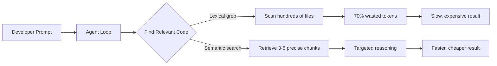
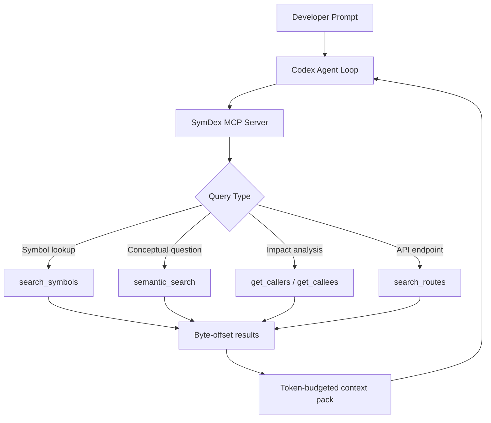

# Semantic Code Search for Codex CLI: CocoIndex, SymDex, and GitNexus for Better Agent Navigation


---

Codex CLI excels at local agentic coding, but it struggles with a fundamental limitation: reliably finding the right code in medium-to-large codebases. The agent's default strategy — scanning directory trees, grepping for patterns, and reading entire files — wastes an estimated 70% of token budget on irrelevant content[^1]. Two long-standing feature requests (Issues #5181 and #609) have accumulated over 50 combined thumbs-up reactions asking for native semantic indexing, yet OpenAI has not committed to a timeline[^2].

The community has responded with three distinct tools that plug this gap through MCP servers and CLI integration: **CocoIndex Code** (AST-based semantic search), **SymDex** (symbolic indexing with call graphs), and **GitNexus** (knowledge-graph structural analysis). This article evaluates each tool, shows how to integrate them with Codex CLI, and offers a decision framework for choosing between them.

## Why Codex CLI Needs External Code Search

When you prompt Codex to fix a bug or refactor a module, the agent loop follows a predictable pattern: discover files, read them, reason about changes, execute tools, and validate. Research from the April 2026 "Amazing Agent Race" study found that navigation errors dominate agent failures at 27–52% of trials, whilst tool-use errors remain below 17%[^3]. The bottleneck is not reasoning — it is finding the right code to reason about.

Codex CLI's built-in tools — `read_file`, `list_dir`, `grep` — are lexical. They cannot answer questions like "where is email validation handled?" or "what calls the payment service?" without the developer explicitly naming files or patterns. On a 500-file codebase this is manageable; on a 5,000-file monorepo it becomes the dominant cost driver.



## The Three Tools Compared

| Feature | CocoIndex Code | SymDex | GitNexus |
|---|---|---|---|
| **Approach** | AST-based semantic vector search | Symbolic index + semantic search | Knowledge graph + Graph RAG |
| **Languages** | 40+ via Tree-sitter[^1] | 21 via Tree-sitter[^4] | 14 (8 with deep semantic analysis)[^5] |
| **Integration** | CLI (`ccc`) + MCP server | CLI + MCP server (21 tools) | MCP server (7 tools + 2 prompts) |
| **Embedding** | Local (SentenceTransformers) or cloud (LiteLLM) | Local or cloud (Voyage, OpenAI, Gemini) | Built-in with Tree-sitter AST |
| **Unique strength** | Zero-config, 70% token reduction | Call graphs, route extraction, context packs | Impact analysis, rename coordination, Mermaid diagrams |
| **GitHub stars** | ~1,500[^1] | ~174[^4] | Trending #1 (April 2026)[^5] |
| **Install** | `pipx install 'cocoindex-code[full]'` | `pip install symdex` | `npx gitnexus@latest` |

## CocoIndex Code: The Lightweight Default

CocoIndex Code is the most straightforward option. It parses source files using Tree-sitter into AST-aware chunks — functions, classes, methods, type definitions — then embeds them locally using SentenceTransformers (no API key required with the `full` edition)[^1]. The index lives in a local SQLite database, and re-indexing only processes changed files, achieving 80–90% cache hits on subsequent runs[^6].

### Setup for Codex CLI

Install the tool and configure it as an MCP server in your Codex `config.toml`:

```bash
pipx install 'cocoindex-code[full]'
cd /path/to/your/repo
ccc init    # Interactive setup, defaults to snowflake-arctic-embed-xs
ccc index   # Build the initial index
```

```toml
# ~/.config/codex/config.toml
[mcp_servers.cocoindex-code]
command = "ccc"
args = ["mcp"]
```

Once configured, Codex can call the search tool automatically when it needs to find relevant code. A typical interaction:

```bash
codex "Find and fix the email validation bug in the user registration flow"
# Agent calls cocoindex-code.search("email validation user registration")
# Returns 3-5 precise function chunks instead of scanning the entire codebase
```

### When to Choose CocoIndex

- You want the simplest possible setup with no external dependencies
- Your codebase is primarily a single language or a standard polyglot mix
- Token cost reduction is your primary concern
- You prefer local-only embedding (no API keys, no data leaving your machine)

## SymDex: Symbolic Precision and Call Graphs

SymDex takes a different approach: rather than just searching for semantically similar code, it builds a full symbolic index with byte-offset precision for every function, class, and method[^4]. Its 21 MCP tools include capabilities that go well beyond text search — call graph traversal, HTTP route extraction across 9 frameworks, and token-budgeted context packs.

### Setup for Codex CLI

```bash
pip install symdex
symdex index ./myproject --repo myproject
```

```toml
# ~/.config/codex/config.toml
[mcp_servers.symdex]
command = "symdex"
args = ["serve"]
```

SymDex also ships as an installable skill:

```bash
npx skills add https://github.com/husnainpk/SymDex --skill symdex-code-search --yes --global
```

### Key Differentiators

**Call graph analysis** answers questions CocoIndex cannot: "What functions call `processPayment`?" or "Show me the circular dependencies in the auth module." This is invaluable for refactoring tasks where understanding the blast radius of a change matters more than finding the change target.

**Route extraction** across Flask, FastAPI, Express, Spring, Laravel, Rails, Phoenix, ASP.NET, and Actix means SymDex can answer "which endpoint handles `/api/v2/users`?" directly[^4].

**Context packs** assemble evidence bundles within a specified token budget — effectively letting you ask "give me everything relevant to this query in under 4,000 tokens." This maps naturally to Codex CLI's context window management concerns.



### When to Choose SymDex

- You need call graph analysis for refactoring or impact assessment
- Your project uses HTTP frameworks and you want route-level queries
- You want fine-grained control over token budgets via context packs
- You work across multiple languages (21 supported) and need consistent coverage

## GitNexus: Knowledge Graphs for Architectural Awareness

GitNexus takes the most ambitious approach: it builds a full knowledge graph of your codebase, mapping every function call, import, class inheritance, and execution flow[^5]. Rather than returning code snippets, it gives the agent structural understanding of how the codebase fits together.

### Setup for Codex CLI

```bash
npx gitnexus@latest analyze   # Index the current repository
```

```toml
# ~/.config/codex/config.toml
[mcp_servers.gitnexus]
command = "npx"
args = ["-y", "gitnexus@latest", "mcp"]
```

### Key Differentiators

**Impact analysis with confidence scoring**: the `detect_changes` tool evaluates pre-commit risk by traversing the knowledge graph to identify everything affected by a change[^5]. This is a higher-level capability than SymDex's call graph — it considers inheritance, interface implementation, and transitive dependencies.

**Coordinated rename**: the `rename` tool performs multi-file symbol renames by tracing all references through the graph[^5]. Where Codex might miss a reference in a distant test file, GitNexus has already indexed the relationship.

**Auto-generated architecture diagrams**: the `generate_map` tool produces Mermaid diagrams directly from the knowledge graph[^5], useful for onboarding or verifying that a refactoring preserved the expected module boundaries.

### When to Choose GitNexus

- You need architectural-level understanding, not just code search
- Impact analysis before risky changes is a priority
- You want automated architecture diagrams for documentation or review
- Your codebase has complex inheritance or cross-module dependencies

## Combining Tools: The Layered Approach

These tools are not mutually exclusive. A pragmatic setup for a large codebase layers them:

```toml
# ~/.config/codex/config.toml

# Fast semantic search for everyday code finding
[mcp_servers.cocoindex-code]
command = "ccc"
args = ["mcp"]

# Symbolic precision for refactoring tasks
[mcp_servers.symdex]
command = "symdex"
args = ["serve"]

# Architectural awareness for design reviews
[mcp_servers.gitnexus]
command = "npx"
args = ["-y", "gitnexus@latest", "mcp"]
```

Guide the agent's tool selection through AGENTS.md:

```markdown
## Code Search Strategy

- For finding relevant code: use cocoindex-code search
- For understanding call chains and dependencies: use symdex get_callers/get_callees
- For impact analysis before large refactors: use gitnexus detect_changes
- Always search before reading entire files
- Prefer context packs over raw file reads for large files
```

⚠️ Running all three MCP servers adds schema overhead to every prompt turn. The MCP schema bloat tax can consume 2,000–4,000 tokens per server[^7]. On cost-sensitive workflows, pick one or two rather than all three.

## Performance and Cost Considerations

| Metric | CocoIndex Code | SymDex | GitNexus |
|---|---|---|---|
| **Initial index time** (10K files) | 2–5 min | 3–8 min | 5–15 min |
| **Re-index (incremental)** | Seconds (changed files only) | Seconds | Minutes (full re-analysis) |
| **MCP tools exposed** | 3–5 | 21 | 7 + 2 prompts |
| **Schema overhead** | Low | High | Medium |
| **Embedding requirement** | Yes (local or cloud) | Optional (enhances semantic search) | No (AST-only) |
| **Storage** | ~50 MB per 10K files | ~100 MB per 10K files | ~200 MB per 10K files |

For most teams, CocoIndex Code offers the best cost-to-value ratio. Its 70% token reduction claim[^1] is backed by AST-aware chunking that returns coherent code units rather than arbitrary line ranges. SymDex adds value when you need structural queries, and GitNexus shines for architectural governance.

## The Road Ahead: Native Semantic Search

The community demand for built-in semantic search is clear: Issue #5181 has 36 thumbs-up reactions and proposes `codex index` and `codex search` commands using OpenAI embeddings with a local FAISS vector store[^2]. A complementary proposal (Issue #609) suggests vector-space code indexing with incremental updates[^8]. Neither has received an official OpenAI response.

Until native support lands, the MCP-based tools described here are the production-ready answer. They transform Codex CLI from a tool that searches blindly to one that navigates with intent — and the token savings alone justify the setup time.

## Citations

[^1]: CocoIndex Code GitHub repository — [github.com/cocoindex-io/cocoindex-code](https://github.com/cocoindex-io/cocoindex-code)
[^2]: "Semantic codebase indexing and search" — GitHub Issue #5181, openai/codex — [github.com/openai/codex/issues/5181](https://github.com/openai/codex/issues/5181)
[^3]: Kim et al., "The Amazing Agent Race," arXiv:2604.10261, April 2026
[^4]: SymDex GitHub repository — [github.com/husnainpk/SymDex](https://github.com/husnainpk/SymDex)
[^5]: GitNexus — MarkTechPost coverage, April 24 2026 — [marktechpost.com](https://www.marktechpost.com/2026/04/24/meet-gitnexus-an-open-source-mcp-native-knowledge-graph-engine-that-gives-claude-code-and-cursor-full-codebase-structural-awareness/)
[^6]: CocoIndex blog, "We Launched a Code Search CLI for AI Agents" — [cocoindexio.substack.com](https://cocoindexio.substack.com/p/we-launched-a-code-search-cli-for)
[^7]: "MCP Schema Bloat and System Prompt Tax," codex.danielvaughan.com, April 2026
[^8]: "feat: add vector-space code indexing and semantic search support" — GitHub Issue #609, openai/codex — [github.com/openai/codex/issues/609](https://github.com/openai/codex/issues/609)
