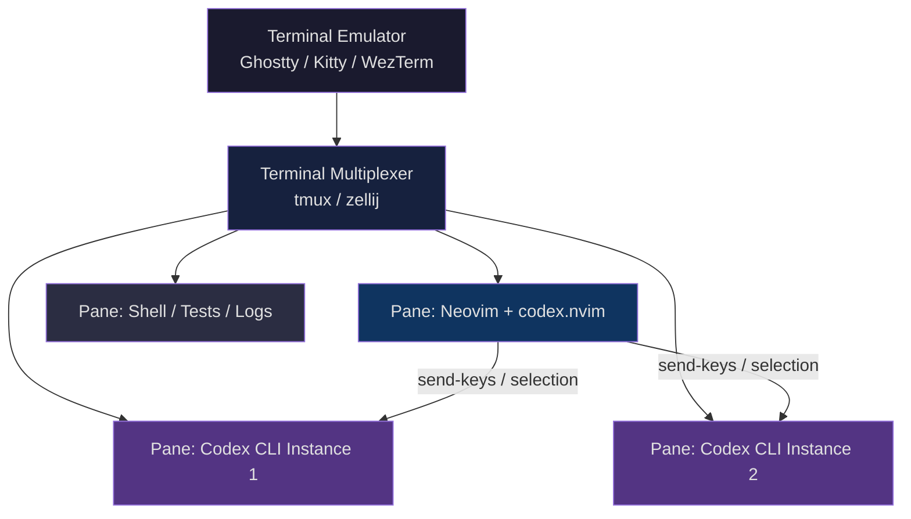
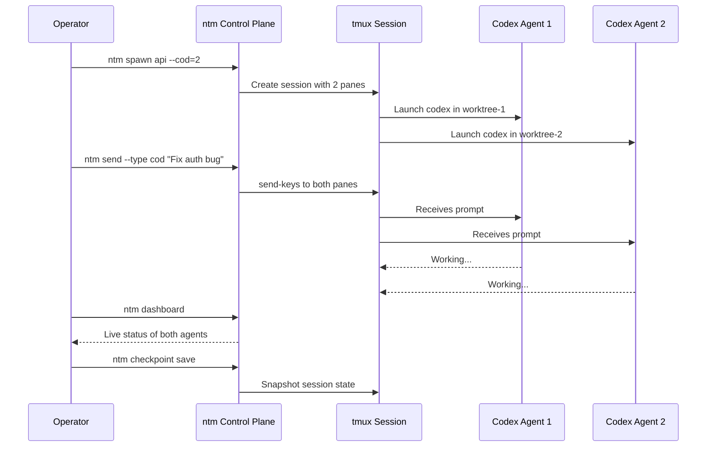

# Terminal-Native Codex CLI Workflows: Neovim, tmux, and the Multiplexer-Driven Development Stack


Codex CLI runs in a terminal. Neovim runs in a terminal. tmux multiplexes terminals. The logical conclusion — a fully keyboard-driven development environment where your editor, your agent, and your orchestration layer share a single session — has quietly become the dominant workflow pattern among terminal-native developers in 2026[^1][^2].

This article maps the ecosystem of Neovim plugins, tmux session managers, and orchestration tools that turn Codex CLI from a standalone agent into an integrated component of a terminal-native development stack.

## Why Terminal-Native Matters for Codex CLI

IDE extensions wrap Codex in a GUI. The terminal-native approach takes the opposite path: Codex CLI stays in its natural habitat — a terminal pane — while the editor and multiplexer provide the integration glue[^3].

The advantages compound:

- **Zero context switch** — your editor, agent, and shell share a single viewport
- **Session persistence** — tmux sessions survive SSH disconnects, reboots, and lunch breaks
- **Parallel agents** — each tmux pane can run an independent Codex instance against a separate git worktree[^4]
- **Scriptability** — tmux `send-keys` enables programmatic interaction with Codex from any process
- **Resource efficiency** — no Electron, no browser runtime, no WebSocket overhead

## The Three-Layer Stack



### Layer 1: Terminal Emulator

Codex CLI generates substantial output during long sessions. Your terminal emulator needs to handle high-throughput rendering without dropping frames. In 2026, the three serious contenders for AI CLI work are Ghostty, Kitty, and WezTerm[^5].

| Feature | Ghostty | Kitty | WezTerm |
|---------|---------|-------|---------|
| Rendering throughput | Highest (2–5× WezTerm)[^5] | High | Moderate |
| Kitty image protocol | Yes | Yes | Yes |
| Sixel images | No | No | Yes |
| Shift+Enter passthrough | Native | Native | Native |
| Desktop notifications | Native | Native | Via plugin |
| GPU acceleration | Yes | Yes | Yes |

For Codex CLI specifically, Ghostty's rendering performance matters when agents produce long diffs. WezTerm's broader graphics protocol support matters if you use image-aware MCP servers[^5].

### Layer 2: Terminal Multiplexer

tmux remains the default for Codex CLI workflows because of its mature `send-keys` API, which every Neovim plugin in this space depends on[^6]. zellij is supported by sidekick.nvim but lacks the `send-keys` equivalent that makes programmatic agent interaction possible[^7].

A minimal tmux configuration for Codex CLI work:

```bash
# ~/.tmux.conf additions for Codex CLI workflows
set -g mouse on
set -g history-limit 50000          # Codex sessions produce long output
set -g default-terminal "tmux-256color"
set -ag terminal-overrides ",*:RGB"  # True colour for diffs

# Quick pane navigation
bind -n M-h select-pane -L
bind -n M-l select-pane -R
bind -n M-k select-pane -U
bind -n M-j select-pane -D

# Resize panes for Codex output
bind -n M-H resize-pane -L 5
bind -n M-L resize-pane -R 5
```

### Layer 3: Editor + Agent Plugins

This is where the integration happens. Four Neovim plugins currently bridge the editor-agent gap.

## Neovim Plugin Ecosystem for Codex CLI

### codex.nvim (rhart92)

The most focused option. It opens Codex CLI in a dedicated terminal split or float and provides a `send_selection` action for piping visual selections directly into the agent[^8].

```lua
-- lazy.nvim setup
{
  "rhart92/codex.nvim",
  config = function()
    require("codex").setup({
      split = "vertical",     -- "horizontal", "vertical", or "float"
      size = 0.4,             -- 40% of the window
      focus_after_send = false, -- keep cursor in editor
      autostart = true,       -- start Codex in background
    })
  end,
  keys = {
    { "<leader>cc", function() require("codex").toggle() end, desc = "Toggle Codex" },
    { "<leader>cs", function() require("codex").actions.send_selection() end, mode = "v", desc = "Send to Codex" },
  },
}
```

The workflow: select a function in visual mode, press `<leader>cs`, and the selection arrives in the Codex CLI pane as context. Codex can then edit the file directly, and Neovim's autoread picks up the changes[^8].

### codex-cli.nvim (dukjjang)

Takes a different approach: it detects an existing tmux pane running Codex CLI and sends prompts to it via `tmux send-keys`. If no Codex pane exists, it falls back to an embedded terminal split[^9].

```lua
{
  "dukjjang/codex-cli.nvim",
  config = function()
    require("codex_cli").setup()
  end,
}
```

Default keybindings[^9]:

- `<leader>aa` (normal mode) — prompt with current file as context
- `<leader>aa` (visual mode) — prompt with selected line range as context
- `<leader>at` — toggle terminal

The tmux detection is the key differentiator. If you already have a tmux session with a dedicated Codex pane, codex-cli.nvim finds it and sends prompts there rather than spawning a new instance. This fits naturally into the multiplexer-first workflow[^9].

### sidekick.nvim (folke)

The most ambitious option. It combines Copilot's Next Edit Suggestions with an integrated terminal for any AI CLI tool — Claude Code, Gemini CLI, Grok Build, and Codex CLI are all pre-configured[^7].

```lua
{
  "folke/sidekick.nvim",
  config = function()
    require("sidekick").setup({
      tools = {
        codex = { enabled = true },
      },
      window = { position = "right" },
      mux = "tmux",  -- or "zellij" for session persistence
    })
  end,
}
```

sidekick.nvim adds context-aware prompts that include file content, cursor position, and LSP diagnostics. Its prompt library provides templates for common tasks (explain, refactor, test, review). The tmux/zellij backend ensures sessions persist across editor restarts[^7].

For teams running multiple coding agents, sidekick.nvim is the natural choice — you can switch between Codex CLI and Claude Code in the same terminal pane without reconfiguring[^7].

## tmux Session Orchestration

Running a single Codex pane alongside Neovim is the starting point. The real power emerges when you orchestrate multiple agents across tmux panes.

### codex-cli-farm

A Bash-based session manager purpose-built for running multiple Codex CLI instances[^10]:

```bash
# Install
source ./setup.sh

# Add instances targeting different worktrees
codex-add work ~/project/worktree-auth
codex-add work ~/project/worktree-api
codex-add work ~/project/worktree-tests

# Monitor all instances
codex-watch

# Save and restore across reboots
codex-save
codex-restore -a
```

Each instance gets its own timestamped log file. The `codex-watch` command tails all logs simultaneously via multitail. Window title annotations show RUN/READY/ERR status at a glance[^10].

codex-cli-farm also provides equivalent `claude-*` and `gemini-*` commands, making it agent-agnostic. The systemd integration enables hourly autosave and login-time restore for truly persistent agent farms[^10].

### Named Tmux Manager (ntm)

A Go-based control plane that elevates tmux from a terminal multiplexer to a multi-agent orchestration system[^11]. Where codex-cli-farm manages sessions, ntm manages workflows:

```bash
# Spawn a mixed-agent session
ntm spawn api --cc=2 --cod=1 --gmi=1

# Broadcast a prompt to all Codex instances
ntm send --type cod "Refactor the auth middleware to use JWT"

# Live dashboard
ntm dashboard

# Checkpoint and restore
ntm checkpoint save pre-refactor
ntm checkpoint restore pre-refactor
```

ntm adds safety policies, approval workflows, file reservation (lock) management, and audit trails[^11]. The `ntm work triage` command integrates with dependency graphs to suggest which agent should tackle which task. The REST/WebSocket API (`ntm serve`) enables external tooling to interact with the agent swarm programmatically[^11].



## Putting It Together: A Reference Layout

Here is a practical tmux layout for a senior developer working on a feature branch with Codex CLI assistance:

```bash
#!/usr/bin/env bash
# codex-dev-session.sh — spin up a terminal-native Codex workspace

SESSION="codex-dev"
PROJECT="$HOME/project"

tmux new-session -d -s "$SESSION" -c "$PROJECT"

# Pane 0: Neovim (main editor)
tmux send-keys -t "$SESSION" "nvim" Enter

# Pane 1: Codex CLI (agent)
tmux split-window -h -t "$SESSION" -c "$PROJECT"
tmux send-keys -t "$SESSION" "codex" Enter

# Pane 2: Shell (tests, git, builds)
tmux split-window -v -t "$SESSION" -c "$PROJECT"

# Pane 3: Codex watch / logs
tmux split-window -v -t "$SESSION:0.1" -c "$PROJECT"
tmux send-keys -t "$SESSION" "git log --oneline -20" Enter

# Set layout: editor left, agent top-right, shell bottom-right
tmux select-layout -t "$SESSION" main-vertical

tmux attach -t "$SESSION"
```

### Workflow Patterns

**Pattern 1: Select-and-Send** — Highlight code in Neovim, send to Codex via codex.nvim or codex-cli.nvim. Codex edits the file. Neovim's `autoread` reloads it. Review the diff with `:Gvdiffsplit`[^8][^9].

**Pattern 2: Parallel Worktrees** — Assign each Codex pane a separate git worktree. One agent works on the API, another on tests, a third on documentation. Merge results after all agents complete[^4][^10].

**Pattern 3: Agent + Test Loop** — Codex runs in one pane, a continuous test runner (`cargo watch`, `jest --watch`, `pytest-watch`) in another. Codex edits code; the test pane provides immediate feedback. Wire a PostToolUse hook to echo test results back[^3].

**Pattern 4: Remote Pair Programming** — SSH into a development machine, attach to a tmux session, and interact with a Codex agent that has been running for hours. mosh support in codex-cli-farm handles unreliable connections[^10].

## Configuration for the Full Stack

### Codex CLI config.toml

Ensure Codex CLI plays well with the terminal stack:

```toml
# ~/.codex/config.toml

[features]
memories = true
voice_transcription = false  # not needed in tmux workflows

[history]
persistence = "full"
max_conversations = 100

[model]
default = "gpt-5.5"
```

### Neovim Autoread

Critical for the select-and-send pattern — Codex edits files outside Neovim, so the editor must reload:

```lua
-- init.lua
vim.o.autoread = true
vim.api.nvim_create_autocmd({ "FocusGained", "BufEnter", "CursorHold" }, {
  command = "checktime",
})
```

## Trade-Offs and Limitations

**Learning curve** — the tmux + Neovim + Codex triple requires fluency in all three tools. This is not a beginner workflow[^1].

**No GUI diff review** — terminal-based diffs via `delta` or `difftastic` are good but lack the interactive staging of VS Code's built-in diff viewer. Neovim's Fugitive plugin partially closes this gap.

**Agent output scrollback** — long Codex sessions can exceed tmux's `history-limit`. Set it to 50,000+ lines or pipe agent output to log files via codex-cli-farm[^10].

**Image limitations** — Codex CLI can attach images, but terminal image protocol support varies. Ghostty and Kitty handle the Kitty protocol; WezTerm adds Sixel. iTerm2 users get the iTerm protocol. If your workflow involves screenshot-to-code, verify your terminal supports inline images[^5].

**Session state vs. Codex state** — tmux saves window/pane layout, not Codex conversation history. Use `codex exec resume --last` or the app-server sync to carry conversation context across restarts[^3].

## When to Use This Stack

| Scenario | Recommended? |
|----------|-------------|
| Solo developer, single feature branch | Yes — select-and-send is fast |
| Parallel feature development (3–8 agents) | Yes — tmux + worktrees shine here |
| Enterprise team with shared standards | Consider — ntm adds governance |
| Occasional Codex user | Overkill — VS Code extension is simpler |
| Remote/SSH development | Strongly yes — tmux persistence is essential |
| Pair programming with voice | Partial — add Codex voice transcription if needed |

## Citations

[^1]: [I Switched to Neovim + Tmux for AI Coding Agents — YouTube](https://www.youtube.com/watch?v=C8EdaqLAxl8)
[^2]: [My Terminal Setup in 2026: Ghostty, tmux, and Neovim — Nick Liu](https://www.nick-liu.com/posts/my-terminal-setup-2026/)
[^3]: [Codex CLI Features — OpenAI Developers](https://developers.openai.com/codex/cli/features)
[^4]: [Parallel Coding Agents with Git Worktree × tmux — Sho Ito, Medium](https://medium.com/@sean0628/parallel-coding-agents-with-git-worktree-x-tmux-be2a5a290f18)
[^5]: [Ghostty vs Warp 2.0 vs WezTerm: Best Terminal for AI CLI in 2026 — Termdock](https://www.termdock.com/en/blog/best-terminal-emulator-ai-cli-2026)
[^6]: [tmux + Neovim + AI: My tdev Workflow — Asaduzzaman Pavel](https://iampavel.dev/blog/tmux-neovim-opencode-workflow)
[^7]: [sidekick.nvim — GitHub (folke)](https://github.com/folke/sidekick.nvim)
[^8]: [codex.nvim — GitHub (rhart92)](https://github.com/rhart92/codex.nvim)
[^9]: [codex-cli.nvim — GitHub (dukjjang)](https://github.com/dukjjang/codex-cli.nvim)
[^10]: [codex-cli-farm — GitHub (waskosky)](https://github.com/waskosky/codex-cli-farm)
[^11]: [Named Tmux Manager (ntm) — GitHub (Dicklesworthstone)](https://github.com/Dicklesworthstone/ntm)
