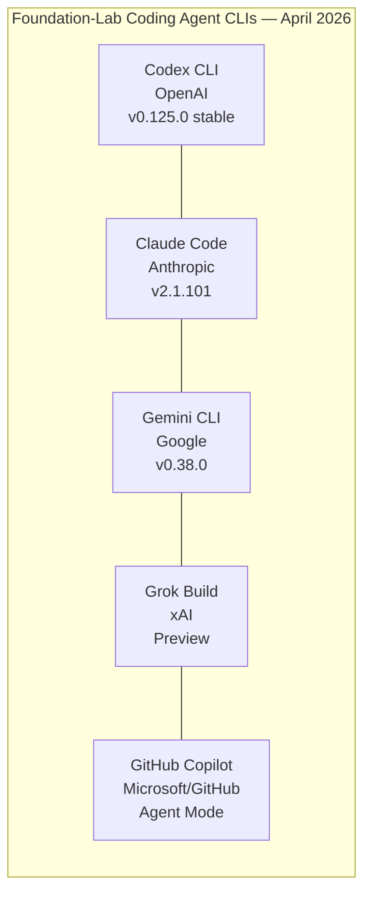
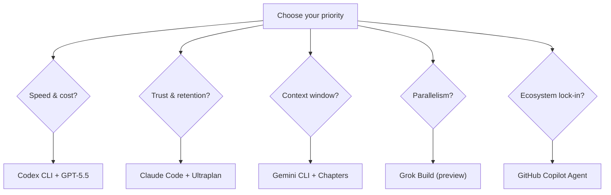

# The Coding Agent CLI Landscape in Late April 2026: GPT-5.5, Five-Way Competition, and What Changed This Month

---

Two weeks ago, the coding agent CLI market was a three-horse race. Today it is five — and the dynamics have shifted more in April 2026 than in any month since these tools emerged. GPT-5.5 has landed, xAI's Grok Build has entered the arena, GitHub Copilot has restructured its pricing, and both Claude Code and Gemini CLI have shipped features that redefine their competitive positions. This article maps the landscape as it stands on 27 April 2026, with a focus on what matters for Codex CLI practitioners.

## The Five Foundation-Lab CLIs

Each tool is built by the same organisation that trains the model it defaults to. This vertical integration — model lab and tool lab as one — is the defining structural feature of this market. Third-party agents like Cursor, Windsurf, and Aider remain important, but the foundation-lab CLIs set the pace.

## Codex CLI: GPT-5.5 and the Speed Advantage

The headline event for Codex CLI this month is the 23 April launch of GPT-5.5, OpenAI's new flagship model[^1]. GPT-5.5 succeeds GPT-5.4 as the default model for Codex CLI and brings a reported leap in reasoning capability, particularly for multi-file architectural tasks where earlier GPT-5 variants sometimes lost coherence across large context windows.

Codex CLI itself reached v0.125.0 stable on 25 April, with v0.126.0-alpha.4 available for early adopters[^2]. The April release cadence has been extraordinary — versions 0.119.0 through 0.125.0 shipped in under three weeks, bringing WebRTC voice input, MCP output schema support, background agent streaming, and a 60+ crate workspace extraction from the Rust rewrite[^2].

The numbers remain strong: 75,000 GitHub stars, 3 million weekly users across the full Codex platform (CLI, IDE extension, and cloud), and Apache 2.0 licensing that gives enterprise teams full source access[^3][^4]. On Terminal-Bench 2.0, Codex CLI scores 77.3% — the highest of any foundation-lab CLI[^5].

The persistent challenge is the adoption gap. The JetBrains survey of 10,000+ developers shows only 3% CLI work adoption, compared to Claude Code's 18%[^6]. GPT-5.5 may narrow this gap if its quality improvements translate into the kind of trust that drives daily use rather than occasional experimentation.

## Claude Code: Ultraplan and the Trust Moat

Anthropic has not been standing still. Claude Code's April releases — v2.1.69 through v2.1.101 — introduced several features that deepen its lead in developer trust[^7].

**Ultraplan** is the most significant: an extended-thinking planning mode that generates comprehensive multi-step execution plans before touching code. For complex refactors spanning dozens of files, Ultraplan lets developers review the full strategy before committing to execution. This addresses the "false confidence" problem that plagues all coding agents — the tendency to generate plausible-looking changes that introduce subtle regressions.

The **Monitor tool** adds real-time observation of long-running processes, letting Claude Code watch test suites, build pipelines, or server logs and react to output as it arrives. **Session recap** provides context summaries when resuming interrupted work. The `/team-onboarding` command generates project-specific onboarding guides from the codebase — a feature that turns Claude Code from a coding tool into an institutional knowledge tool[^7].

Claude Code's 2 million+ weekly active CLI users, 41% weekly retention rate, and NPS of 54 remain the benchmarks the other four are chasing[^8]. The `CLAUDE.md` convention — encoding team standards, architectural decisions, and review criteria in a committed file — has become a switching cost that competitors have not yet matched with equivalent depth.

## Gemini CLI: Chapters and the Context Window Play

Google's Gemini CLI v0.38.0 shipped **Chapters**, a narrative flow system that segments long coding sessions into semantically meaningful sections[^9]. Combined with the **Context Compression Service**, which intelligently summarises earlier conversation turns, Chapters lets Gemini CLI maintain coherence across sessions that would exhaust other tools' context windows.

The `/memory inbox` feature adds persistent cross-session memory — facts, preferences, and project context that survive between invocations[^9]. These are smart architectural choices that lean into Gemini's genuine advantage: the 1 million token context window on Gemini 3 Pro, five times Claude Code's standard 200K.

The free tier remains the most generous in the market: 1,000 requests per day on Flash, 180,000 completions per month[^10]. On SWE-bench Verified, Gemini 3 Pro through Google's Antigravity scores 76.2%[^11].

The reliability problems documented in March — 429 rate limiting affecting paying customers, silent model downgrades, file destruction incidents — have not fully resolved[^12]. Developer trust, once lost, recovers slowly. Gemini CLI's 6% adoption in the JetBrains survey places it firmly third among the established three, and the arrival of two new competitors makes the path to growth harder[^6].

## Grok Build: The Aggressive New Entrant

xAI announced Grok Build in mid-April, bringing a fifth foundation lab into the coding agent CLI space[^13]. The headline feature is **eight parallel agents** — Grok Build can spawn up to eight concurrent coding agents working on different parts of a task simultaneously. **Arena Mode** lets developers pit different approaches against each other and select the best result.

The dedicated coding model, `grok-code-fast-1`, is optimised for low-latency code generation. xAI claims 70.8% on SWE-Bench Verified[^13].

⚠️ Grok Build is in preview and independently verified benchmark data is limited. The 70.8% SWE-Bench claim and the parallel agent architecture have not been widely validated by third-party evaluators at the time of writing. Treat these figures as provisional.

The parallel agent approach is genuinely novel among foundation-lab CLIs. If it delivers on its promise, it could redefine expectations for throughput on large tasks. But parallel execution introduces coordination complexity — merge conflicts, redundant changes, and inconsistent architectural decisions across agents — that sequential tools avoid by design.

## GitHub Copilot: Pricing Restructure and Model Access

GitHub restructured Copilot pricing on 20 April 2026, introducing a consumption-based model alongside the existing subscription tiers[^14]. The most notable change for CLI users: access to Claude Opus 4.7 — widely regarded as the strongest available coding model — is now restricted to Pro+ subscribers at \$39/month.

Copilot's agent mode has matured significantly, with metrics dashboards showing task completion rates, token usage, and time-to-resolution. The tool remains the default recommendation for developers already embedded in the GitHub ecosystem, particularly those using GitHub Actions, Codespaces, and the PR review workflow[^14].

Copilot's position is unique among the five: it is the only tool that does not default to its parent company's own model. Microsoft's partnership with OpenAI means Copilot can offer GPT-5.5, but it also offers Claude and Gemini models — making it more of a multi-model orchestrator than a single-model agent.

## What This Means for Codex CLI Practitioners

The five-way market makes Codex CLI's open-source positioning more valuable, not less. With GPT-5.5 as the default model, the extensible provider framework means Codex CLI can also target Claude, Gemini, or any provider speaking the Chat Completions API[^15]. You are not locked into OpenAI's model — you are locked into a tool that can point at any of them.

The practical advice for April 2026:

- **Upgrade to v0.125.0** and test GPT-5.5 on your most complex workflows. The model change alone may close the quality gap with Claude Code for your specific use cases.
- **Watch Grok Build's parallel agent model** — if it matures, the pattern will likely influence Codex CLI's roadmap.
- **Do not underestimate Claude Code's trust moat**. Ultraplan and the `CLAUDE.md` ecosystem create switching costs that raw performance cannot overcome. If your team uses Claude Code, understand why before proposing a switch.
- **Use the provider framework** to experiment. Point Codex CLI at Gemini via LiteLLM for large-context tasks, at Claude for complex refactors, and at GPT-5.5 for speed-sensitive workflows[^15]. The multi-provider capability is Codex CLI's structural advantage in a five-way market.

The coding agent CLI landscape in late April 2026 is more competitive, more capable, and more fragmented than at any point in its short history. The tools are converging on capability. They are diverging on experience, trust, and ecosystem. Choose accordingly.

---

## Citations

[^1]: OpenAI, "Introducing GPT-5.5," 23 April 2026. [openai.com/index/introducing-gpt-5-5](https://openai.com/index/introducing-gpt-5-5)

[^2]: OpenAI, "Changelog — Codex CLI," [developers.openai.com/codex/changelog](https://developers.openai.com/codex/changelog) — v0.119.0–v0.125.0, April 2026.

[^3]: GitHub, openai/codex repository. 75K stars, Apache 2.0 licence, as of 27 April 2026.

[^4]: BusinessToday, "OpenAI Codex celebrates 3 million weekly users," 8 April 2026. The 3 million figure spans the full Codex platform (CLI, IDE extensions, and cloud), not CLI alone.

[^5]: Morphllm, "We Tested 15 AI Coding Agents (2026)." Terminal-Bench 2.0 scores: Codex CLI 77.3%, Claude Code 65.4%.

[^6]: JetBrains Research, "Which AI Coding Tools Do Developers Actually Use at Work?" April 2026. Survey of 10,000+ developers. Claude Code 18% work adoption, Codex CLI 3%, Google Antigravity 6%.

[^7]: Anthropic, Claude Code changelog and release notes, April 2026. Versions v2.1.69–v2.1.101 covering Ultraplan, Monitor tool, session recap, and /team-onboarding.

[^8]: Gradually.ai, "Claude Code Statistics 2026," April 2026. 2M+ weekly active CLI users, 41% weekly retention, NPS 54.

[^9]: Google, Gemini CLI release notes v0.38.0, April 2026. Chapters narrative flow, Context Compression Service, /memory inbox.

[^10]: Google, Gemini CLI pricing and free tier documentation, April 2026.

[^11]: LocalAI Master, "SWE-Bench 2026 Leaderboard." Antigravity (Gemini 3 Pro) 76.2%.

[^12]: HackerNoon, "Google's Gemini CLI Has a Reliability Problem Developers Can't Ignore," April 2026.

[^13]: xAI, Grok Build announcement, April 2026. Eight parallel agents, Arena Mode, grok-code-fast-1 model. ⚠️ SWE-Bench claim (70.8%) not independently verified at time of writing.

[^14]: GitHub, "Copilot pricing updates," 20 April 2026. Claude Opus 4.7 restricted to Pro+ tier (\$39/month), consumption-based pricing introduced.

[^15]: OpenAI, "Advanced Configuration — Codex CLI," [developers.openai.com/codex/config-advanced](https://developers.openai.com/codex/config-advanced) — extensible provider framework and LiteLLM proxy configuration.
