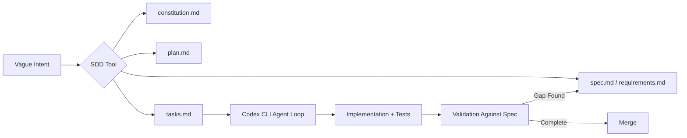
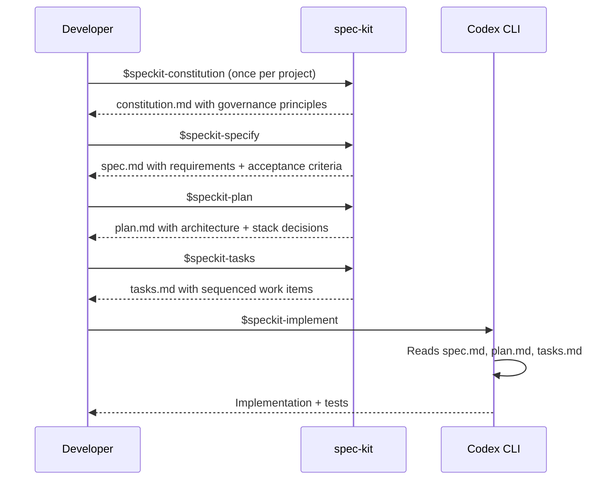
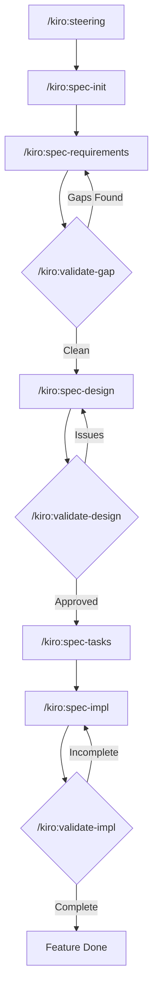
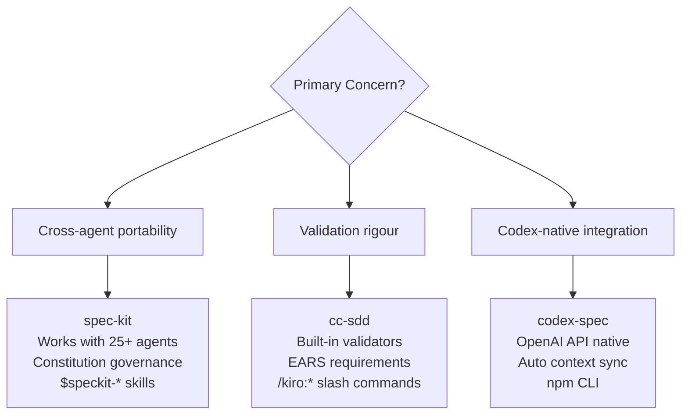

# SDD Tooling for Codex CLI: spec-kit, cc-sdd, and codex-spec Compared


Spec-Driven Development (SDD) has gone from academic curiosity to mainstream practice in under six months. GitHub's spec-kit crossed 80,000 stars by April 2026[^1], cc-sdd added Codex CLI support in its v2 release[^2], and codex-spec remains the most Codex-native option for teams already embedded in the OpenAI ecosystem[^3]. Martin Fowler's October 2025 analysis identified three maturity tiers — spec-first, spec-anchored, and spec-as-source — and warned that the tooling had not yet caught up with the ambition[^4]. Seven months later, it has.

This article evaluates the three dominant SDD tools through the lens of a Codex CLI practitioner: how each integrates, what artefacts it produces, where it excels, and where it creates friction.

---

## Why SDD Matters More for Agents Than for Humans

A human developer who receives a vague ticket still carries implicit context from sprint planning, codebase familiarity, and organisational norms. A coding agent starts each session with only what you explicitly provide[^5]. Specification files resolve the decision space *before* the first line of code is written, turning ambiguous intent into a verifiable contract between human and machine.

The OpenAI best practices documentation puts it directly: include goal, context, constraints, and completion criteria in every prompt[^6]. SDD tools automate this discipline, ensuring that every agent session begins with structured context rather than improvised prose.



---

## The Three Tools at a Glance

| Dimension | spec-kit | cc-sdd | codex-spec |
|-----------|----------|--------|------------|
| **Maintainer** | GitHub (official) | gotalab (community) | shenli (community) |
| **Stars (Apr 2026)** | ~80K[^1] | ~12K[^2] | ~8K[^3] |
| **Agents supported** | 25+ (Copilot, Claude, Codex, Gemini, etc.)[^1] | 8 (Claude Code, Codex, Cursor, Gemini CLI, etc.)[^2] | 1 (Codex-native, OpenAI API fallback)[^3] |
| **Codex integration** | Skills mode (`$speckit-*`)[^7] | Slash commands (`/kiro:*`)[^2] | Standalone CLI (`codex-spec <cmd>`)[^3] |
| **Phases** | 5 (Constitution → Specify → Plan → Tasks → Implement)[^1] | 7 (Steering → Init → Requirements → Design → Tasks → Implement → Validate)[^2] | 8 (Setup → Context → Spec → Requirements → Plan → Execute → Track → Maintain)[^3] |
| **Spec format** | Markdown with acceptance criteria[^1] | EARS-format requirements (When/If/Then/Where)[^2] | Structured markdown with dependencies[^3] |
| **Validation** | Manual review[^1] | Built-in gap, design, and implementation validators[^2] | Progress tracking per task[^3] |
| **Installation** | `uv tool install specify-cli`[^1] | Git clone + agent config[^2] | `npm install -g codex-spec`[^3] |

---

## GitHub spec-kit: The Cross-Agent Standard

spec-kit is the broadest SDD tool — designed to work with every major coding agent, not just Codex CLI[^1]. Its philosophy is agent-agnostic: the same specification artefacts feed Copilot, Claude Code, Gemini CLI, or Codex CLI without modification.

### Setting Up spec-kit with Codex CLI

```bash
# Install the specify CLI
uv tool install specify-cli \
  --from git+https://github.com/github/spec-kit.git@v2.1.0

# Initialise a project with Codex CLI skills integration
specify init my-project \
  --here \
  --integration codex \
  --integration-options="--skills"
```

This creates a `.specify/` directory, a `constitution.md` at the project root, and installs Codex skills into `.agents/skills/`[^7]. Unlike Claude Code or Copilot (which use `/speckit.*` slash commands), Codex CLI exposes spec-kit through skills using the `$speckit-*` naming convention[^7].

### The Five-Phase Workflow



The **constitution** phase is unique to spec-kit — it establishes project-level governance principles (coding standards, testing requirements, security policies) that persist across all features[^1]. This maps naturally to Codex CLI's AGENTS.md, and teams often cross-reference the two:

```markdown
<!-- In AGENTS.md -->
## Specifications
All features MUST have a spec-kit specification before implementation.
See `constitution.md` for project governance principles.
Run `$speckit-specify` before starting any new feature.
```

### Where spec-kit Excels

- **Cross-agent portability**: Specifications created for Codex CLI work identically with Claude Code or Gemini CLI[^1]
- **Governance layer**: The constitution phase provides organisational guardrails that survive team member turnover
- **Ecosystem**: Over 100 community extensions and presets[^1]

### Where spec-kit Creates Friction

- **Codex skills syntax**: The `$speckit-*` convention is less ergonomic than slash commands — autocomplete does not trigger, and developers must remember the exact skill name[^7]
- **No built-in validation**: Unlike cc-sdd, spec-kit does not provide gap analysis or design validation phases; teams must add their own review gates
- **Python dependency**: The `specify` CLI requires `uv` or `pip`, adding a runtime dependency to projects that may not otherwise use Python

---

## cc-sdd: The Validation-Heavy Workflow

cc-sdd, from gotalab, takes a different approach: it treats SDD as a rigorous engineering process with built-in validation at every phase[^2]. Where spec-kit trusts the developer to review artefacts, cc-sdd provides explicit validation commands that verify requirements against code, design against requirements, and implementation against design.

### Setting Up cc-sdd with Codex CLI

```bash
# Clone and install
git clone https://github.com/gotalab/cc-sdd.git
cd cc-sdd

# Install with Codex CLI integration (commands mode)
./install.sh --agent codex --mode commands --lang en
```

cc-sdd installs slash commands directly into the Codex CLI command surface, using the `/kiro:*` namespace[^2]. This provides better discoverability than spec-kit's skills approach — typing `/kiro:` in the TUI reveals all available commands.

### The Seven-Phase Workflow with Validation Gates



The EARS-format requirements (Easy Approach to Requirements Syntax) produce testable statements that the validation phases can verify programmatically[^2]:

```markdown
## Requirements (EARS Format)

- **When** a user submits a payment, **the system shall** validate the card
  details against the payment gateway within 3 seconds.
- **If** the gateway returns a transient error, **the system shall** retry
  up to 3 times with exponential backoff.
- **Where** the transaction amount exceeds £10,000, **the system shall**
  require additional identity verification.
```

### The Steering Phase

cc-sdd's `/kiro:steering` command analyses the existing codebase and generates a project memory file containing architecture patterns, tech stack details, and product context[^2]. This is analogous to running `codex init` to scaffold AGENTS.md, but produces a richer, more structured output. Teams using both typically let cc-sdd steering inform the AGENTS.md rather than duplicating effort.

### Where cc-sdd Excels

- **Built-in validation**: The three validation commands (`validate-gap`, `validate-design`, `validate-impl`) catch drift between phases before implementation begins[^2]
- **Parallel task waves**: Tasks are organised into P0, P1, P2 waves for parallel-safe execution — a natural fit for Codex CLI's subagent capabilities[^2]
- **Slash command integration**: The `/kiro:*` commands are more discoverable in the TUI than spec-kit's skills approach

### Where cc-sdd Creates Friction

- **Claude-first design**: Command templates were originally built for Claude Code, and while Codex CLI support is stable, some agent-specific nuances (e.g., tool calling conventions) may not be fully optimised[^2]
- **17 skills per install**: The framework loads a substantial number of skills, which can contribute to MCP schema bloat in sessions with many other tools configured[^8]
- **No constitution equivalent**: cc-sdd lacks spec-kit's project-level governance layer, relying instead on the steering file for cross-feature consistency

---

## codex-spec: The Codex-Native Pipeline

codex-spec is purpose-built for the OpenAI ecosystem[^3]. It uses the OpenAI API directly for generation and planning, and optionally calls Codex CLI for implementation. Where spec-kit and cc-sdd are agent-agnostic frameworks that happen to support Codex, codex-spec is a Codex-specific tool that happens to work without the CLI installed.

### Setting Up codex-spec

```bash
# Install globally
npm install -g codex-spec

# Set API key
export OPENAI_API_KEY=sk-...

# Initialise project context
codex-spec context-setup --force
```

This creates a `.codex-specs/` directory with three context layers[^3]:

```
.codex-specs/
├── context/
│   ├── product.md      # Product vision, user personas, business rules
│   ├── tech.md         # Stack, architecture, constraints
│   └── structure.md    # Auto-generated codebase map
└── features/
    └── 2026-04-27-auth-refresh/
        ├── specification.md
        ├── requirements.md
        ├── plan.md
        └── tasks.json
```

### The Eight-Stage Workflow

```bash
# 1. Create a feature specification
codex-spec create auth-token-refresh

# 2. Generate detailed requirements
codex-spec requirements

# 3. Create implementation plan with task extraction
codex-spec plan

# 4. List tasks with status
codex-spec tasks

# 5. Execute a specific task (injects full context into Codex CLI)
codex-spec execute task-001

# 6. Track progress
codex-spec status

# 7. Update context after implementation
codex-spec context-update --auto
```

The `context-update --auto` command uses `git diff` to synchronise the project context files with actual code changes[^3], solving the documentation drift problem that plagues manual SDD workflows.

### Where codex-spec Excels

- **Automatic context synchronisation**: The `context-update` command keeps specifications aligned with code changes using git history[^3]
- **Task-level execution**: Each task carries its full dependency context, enabling precise agent sessions without re-explaining prior work
- **No agent-specific configuration**: Works via the OpenAI API regardless of which Codex surface you use (CLI, IDE extension, or cloud)

### Where codex-spec Creates Friction

- **Node.js dependency**: Requires Node.js 16+, which may conflict with project toolchains[^3]
- **Single-agent lock-in**: Unlike spec-kit and cc-sdd, specifications are not portable to Claude Code or Gemini CLI
- **Smaller community**: At ~8K stars, the ecosystem of extensions and presets is considerably smaller than spec-kit's[^3]

---

## Choosing the Right Tool



| Scenario | Recommended Tool | Rationale |
|----------|-----------------|-----------|
| Multi-tool team (Codex + Claude Code) | spec-kit | Specifications port across agents without modification[^1] |
| Regulated environment needing audit trail | cc-sdd | Validation gates create verifiable quality checkpoints[^2] |
| Solo developer, Codex-only workflow | codex-spec | Lightest setup, deepest Codex integration[^3] |
| Large organisation, governance-first | spec-kit | Constitution layer + 100+ community presets[^1] |
| Complex feature, parallel implementation | cc-sdd | P0/P1/P2 task waves map to subagent delegation[^2] |

---

## Combining SDD Tools with Codex CLI Primitives

Whichever tool you choose, it should complement — not replace — Codex CLI's native planning capabilities. The recommended layering:

1. **AGENTS.md** for durable, cross-session project context[^6]
2. **SDD tool** for per-feature specification, planning, and task decomposition
3. **Plan mode** (`/plan`) for within-session reasoning before implementation[^6]
4. **Hooks** for automated quality enforcement (PostToolUse for test execution, PreToolUse for policy checks)[^9]

```toml
# config.toml — combining spec-kit with hooks
[hooks.post_tool_use]
# After any file write, verify spec compliance
command = "bash -c 'if [ -f spec.md ]; then echo \"Verify against spec.md acceptance criteria\"; fi'"

[hooks.pre_tool_use]
# Before implementation, ensure spec exists
command = "bash -c 'if [ ! -f spec.md ] && [ ! -f .codex-specs/features/*/specification.md ]; then echo \"WARNING: No specification found. Run SDD workflow first.\"; fi'"
```

---

## The Martin Fowler Warning

Fowler's analysis identified a critical risk: SDD tools can reproduce the failures of Model-Driven Development by combining "inflexibility and non-determinism"[^4]. His three concerns remain valid:

1. **Workflow mismatch**: Not every task needs a full specification pipeline. A one-line bug fix should not require a constitution review[^4].
2. **Review burden**: SDD tools generate substantial markdown that must be reviewed. Unreviewed specifications are worse than no specifications — they create false confidence[^4].
3. **False control**: Despite detailed specs, agents may still ignore instructions or over-interpret them[^4].

The practical mitigation: **use SDD selectively**. Reserve full specification workflows for features with multiple acceptance criteria, cross-cutting concerns, or team-boundary implications. For focused tasks, Codex CLI's native plan mode is sufficient. ⚠️ No current SDD tool automatically determines when a full specification is warranted versus when lightweight planning suffices.

---

## Citations

[^1]: [GitHub spec-kit repository — github/spec-kit](https://github.com/github/spec-kit) — Open-source SDD toolkit, 80K+ stars, 25+ agent integrations (accessed April 2026)
[^2]: [cc-sdd repository — gotalab/cc-sdd](https://github.com/gotalab/cc-sdd) — SDD harness with validation commands, EARS requirements, multi-agent support (accessed April 2026)
[^3]: [codex-spec repository — shenli/codex-spec](https://github.com/shenli/codex-spec) — Codex-native SDD pipeline with automatic context synchronisation (accessed April 2026)
[^4]: [Martin Fowler, "Understanding Spec-Driven-Development: Kiro, spec-kit, and Tessl"](https://martinfowler.com/articles/exploring-gen-ai/sdd-3-tools.html) — Analysis of SDD tool maturity tiers and risks (October 2025)
[^5]: [OpenAI, "Best practices — Codex"](https://developers.openai.com/codex/learn/best-practices) — Official guidance on context, planning, and AGENTS.md (accessed April 2026)
[^6]: [OpenAI, "Best practices — Codex: AGENTS.md for Reusable Guidance"](https://developers.openai.com/codex/learn/best-practices) — Documentation on AGENTS.md structure and plan mode usage (accessed April 2026)
[^7]: [spec-kit Codex CLI integration — specify init documentation](https://deepwiki.com/github/spec-kit/4.1-specify-init) — Skills-based integration details for Codex CLI `$speckit-*` commands (accessed April 2026)
[^8]: [Daniel Vaughan, "MCP Schema Bloat: The System Prompt Tax on Tool Definition Performance"](https://codex.danielvaughan.com/2026/04/23/mcp-schema-bloat-system-prompt-tax-tool-definition-performance/) — Analysis of tool definition overhead in agent sessions (April 2026)
[^9]: [OpenAI, "Hooks — Codex CLI"](https://developers.openai.com/codex/cli/hooks) — PostToolUse and PreToolUse hook configuration for quality enforcement (accessed April 2026)
