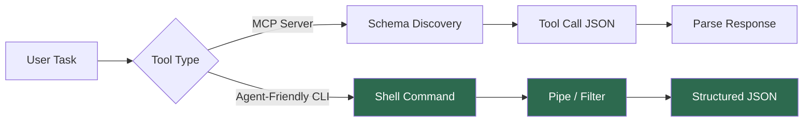
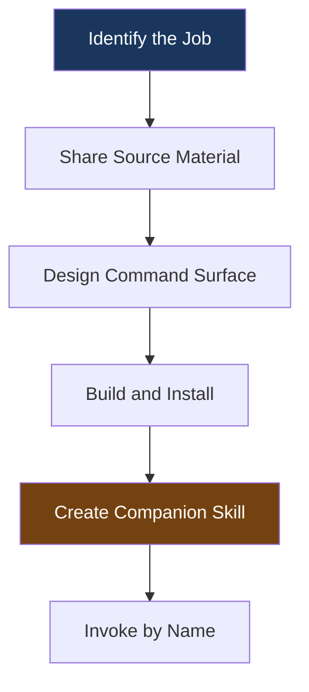

# Building Agent-Friendly CLIs with Codex CLI: Composable Tool Design for the Agentic Era


---

The fastest-growing consumer of command-line interfaces in 2026 is not a person — it is an AI agent. Six major repositories built around the premise of giving existing software a structured CLI interface for agents accumulated over 130,000 GitHub stars in Q1 2026 alone, with fork ratios of 5–9% signalling genuine production adoption rather than social virality[^1]. Language models have been trained on millions of examples of shell scripting and Unix pipes; the composability grammar is baked into their weights[^2]. Yet most CLIs remain hostile to autonomous consumers: interactive prompts block execution, pretty-printed tables resist parsing, and verbose help text wastes context tokens.

This article covers how to design, build, and ship CLIs that Codex CLI can reliably operate — and why this matters more than adding another MCP server.

## Why CLIs Beat MCP for Many Agent Workflows

Model Context Protocol servers are the standard way to expose tools to coding agents. But CLIs have a structural advantage for a large class of tasks. One comparative study ran 75 tests between MCP-based and CLI-based agents doing identical work: the CLI won every efficiency metric, proving 10–32× cheaper on tokens with roughly 100% reliability versus MCP's 72%[^2].

The reason is straightforward: LLMs already know how to compose shell commands. When you give Codex a well-structured CLI, it can pipe, filter, and chain commands using patterns it has seen millions of times in training data. An MCP tool call, by contrast, requires the model to learn a bespoke schema every time.



This does not mean CLIs replace MCP — they complement it. Use MCP for stateful, session-scoped tools (database connections, browser sessions). Use CLIs for stateless, composable operations (searching logs, querying APIs, downloading artefacts).

## The Seven Principles of Agent-Friendly CLI Design

OpenAI's official `$cli-creator` skill encodes a specific design philosophy for agent-consumable CLIs[^3]. Distilled to principles:

### 1. Structured Output by Default

Every command must return parseable JSON, not human-formatted tables. Keep default responses narrow — if the full payload is large, write it to a file and return the path[^3].

```bash
# Bad: human-friendly table output
$ myctl list-builds
BUILD ID   STATUS   DURATION
b-1234     failed   4m 12s
b-1235     passed   2m 03s

# Good: narrow JSON, agent-parseable
$ myctl list-builds --json
[
  {"id": "b-1234", "status": "failed", "duration_s": 252},
  {"id": "b-1235", "status": "passed", "duration_s": 123}
]
```

### 2. Discovery Before Detail

Structure commands so agents can search first, then read by ID. A `list` operation with filters should precede an `get <id>` operation that returns the full object[^3]. This mirrors how humans navigate APIs and matches the explore-then-drill pattern agents naturally follow.

```bash
# Step 1: discover
$ tickets search --query "login timeout" --limit 5 --json

# Step 2: read full detail
$ tickets get TICKET-4821 --json
```

### 3. Explicit Authentication Boundaries

Tell the agent which environment variable or config file holds credentials. Setup checks should fail loudly and clearly when credentials are missing[^3]. Never require interactive login flows — use device-code or token-file patterns instead.

```bash
$ myctl auth check
Error: MYCTL_API_TOKEN is not set.
Set it with: export MYCTL_API_TOKEN="your-token-here"
```

### 4. File Paths Over Inline Content

When output exceeds a few hundred tokens, write to a file and return the path. This prevents context-window pollution and lets the agent decide whether to read the file[^3].

```bash
$ ci-logs download --build-url https://ci.example.com/build/1234
{"downloaded": 3, "path": "./logs/build-1234/", "files": ["step-1.log", "step-2.log", "step-3.log"]}
```

### 5. Approval Boundaries for Writes

The companion skill must declare which operations are safe (reads, searches, downloads) and which require human approval (deletes, deployments, writes to production)[^3]. This maps directly to Codex CLI's approval mode system.

### 6. PATH-Installable and Folder-Independent

The CLI must work from any directory, not just the project root. Install to PATH so Codex can invoke it regardless of current working directory[^3].

### 7. Predictable Error Codes

Use standard exit codes and structured error JSON. Agents cannot interpret vague error messages — they need a machine-readable `error.code` field to decide whether to retry, escalate, or abort.

```bash
$ myctl deploy --env staging
{"error": {"code": "AUTH_EXPIRED", "message": "Token expired. Re-authenticate with: myctl auth login"}}
# Exit code: 1
```

## Building a CLI with Codex CLI's $cli-creator

OpenAI ships a built-in `$cli-creator` skill that scaffolds agent-friendly CLIs from source material[^3]. The workflow has five stages:



### Step 1: Identify the Job

Start with what work needs doing, not the technology. Good candidates include[^3]:

- Downloading CI logs from build pages to local folders
- Indexing and searching support ticket exports
- Querying oversized API responses and reading by ID
- Searching Slack exports with thread context
- Splitting multi-step team scripts into discrete commands

### Step 2: Share Source Material

Feed Codex the concrete inputs: API documentation, OpenAPI specifications, redacted curl commands, export files, or existing scripts[^3]. For authenticated commands, specify the environment variable name without sharing the actual secret.

```
Use $cli-creator to build a CLI called "ci-logs" that:
- Accepts a CI build URL
- Downloads failed job logs to ./logs/<build-id>/
- Returns file paths as JSON
- Auth via CI_TOKEN env var

Here's the API docs: @docs/ci-api.md
Here's an example curl: curl -H "Authorization: Bearer $CI_TOKEN" https://ci.example.com/api/builds/1234/logs
```

### Step 3: Design Before Building

The `$cli-creator` skill will propose a command surface and ask for confirmation before writing code. This is the critical review point — get the interface right before implementation.

### Step 4: Verify From External Folders

Test that the CLI works from an unrelated directory[^3]:

```bash
# Verify installation
$ command -v ci-logs && ci-logs --help

# Test discovery command
$ ci-logs list-builds --repo my-org/my-repo --status failed --json

# Test read command
$ ci-logs download --build-url https://ci.example.com/build/1234
```

### Step 5: Create the Companion Skill

Use `$skill-creator` in the same thread to generate a SKILL.md that teaches future Codex sessions how to use the CLI[^3]. The skill declares which commands are safe and which need approval:

```markdown
# ci-logs

CLI for downloading and searching CI build logs.

## Safe commands (no approval needed)
- `ci-logs list-builds` — search builds by repo, status, date
- `ci-logs download` — download logs to local folder
- `ci-logs search-logs` — grep across downloaded log files

## Requires approval
- `ci-logs delete-logs` — remove local log cache
- `ci-logs retry-build` — trigger a new CI build
```

## Worked Example: A Support Ticket CLI

Suppose your team exports support tickets as CSV files and you want Codex to search and summarise them. Here is the complete flow:

```bash
# Prompt to Codex:
# "Use $cli-creator to build a CLI called 'tickets' that indexes CSV exports,
#  supports full-text search, and reads tickets by ID. No auth needed."

# After creation, the CLI exposes:
$ tickets index ./exports/april-2026.csv
{"indexed": 1847, "file": "./exports/april-2026.csv"}

$ tickets search "password reset timeout" --limit 3 --json
[
  {"id": "T-9281", "subject": "Password reset link times out", "score": 0.94},
  {"id": "T-9103", "subject": "Reset flow timeout on mobile", "score": 0.87},
  {"id": "T-8744", "subject": "Session timeout after password change", "score": 0.72}
]

$ tickets get T-9281 --json
{"id": "T-9281", "subject": "Password reset link times out", "customer": "acme-corp", "created": "2026-04-15", "body": "...full ticket content...", "comments": [...]}
```

The companion skill then lets any future Codex session invoke this directly:

```
Use $tickets to find all tickets about "OAuth redirect loop" from the last week.
Summarise the common thread and draft a response template.
```

## Anti-Patterns to Avoid

| Anti-Pattern | Why It Fails | Fix |
|---|---|---|
| Interactive prompts (`y/n?`) | Blocks agent execution in non-interactive mode | Use `--yes` flag or `--dry-run` + `--confirm` two-step |
| Pretty tables as default output | Agents waste tokens parsing alignment characters | Default to `--json`; add `--table` for humans |
| Requiring project-root context | Breaks when Codex runs from a different directory | Install to PATH; use absolute paths internally |
| Giant response payloads inline | Fills context window with irrelevant data | Write to file, return path |
| Vague error messages | Agent cannot decide retry vs abort | Structured error JSON with codes |
| Missing `--help` | Agent has no command discovery | Comprehensive help with examples |

## Integrating Agent-Friendly CLIs Into Codex Workflows

Once built, these CLIs slot into broader Codex patterns:

**Skills integration** — the companion SKILL.md teaches Codex when and how to invoke the CLI, including approval boundaries[^3].

**Pipeline composition** — chain CLI commands in `codex exec` for automated workflows[^4]:

```bash
codex exec "Use $ci-logs to download the failed logs for build https://ci.example.com/build/5678, then use $tickets to find related support tickets. Summarise the root cause."
```

**Hooks enforcement** — use PostToolUse hooks to audit or validate CLI invocations[^5]:

```toml
[hooks.post_tool_use]
command = "python3 audit-cli-call.py"
match_tools = ["shell"]
```

## The Bigger Picture: CLIs as the Agent Interface Layer

The pattern documented here is part of a broader architectural shift. In 2007–2012, REST APIs enabled mobile development. In 2026, structured CLIs with agent-discoverable skill files are enabling AI agent viability[^1]. The principle is simple: everything software does should be expressible as a CLI command with structured output.

This does not mean wrapping every API in a CLI. It means recognising that when you have a repeated, composable, stateless task — searching logs, querying databases, downloading artefacts — a well-designed CLI is often the shortest path between your agent and the work.

⚠️ The `$cli-creator` and `$skill-creator` skills are built into Codex but their interfaces may evolve. Check the official skills documentation for the latest invocation patterns.

## Citations

[^1]: OSS Insight, "The Agent Interface Layer: Software's New Platform Primitive," [https://ossinsight.io/blog/agent-native-cli-wave-2026](https://ossinsight.io/blog/agent-native-cli-wave-2026)

[^2]: D. Minh K., "Designing CLIs for AI Agents: Patterns That Work in 2026," Medium, [https://medium.com/@dminhk/designing-clis-for-ai-agents-patterns-that-work-in-2026-29ac725850de](https://medium.com/@dminhk/designing-clis-for-ai-agents-patterns-that-work-in-2026-29ac725850de)

[^3]: OpenAI, "Create a CLI Codex can use," Codex Use Cases, [https://developers.openai.com/codex/use-cases/agent-friendly-clis](https://developers.openai.com/codex/use-cases/agent-friendly-clis)

[^4]: OpenAI, "Non-interactive mode," Codex Developer Docs, [https://developers.openai.com/codex/noninteractive](https://developers.openai.com/codex/noninteractive)

[^5]: OpenAI, "Hooks," Codex Developer Docs, [https://developers.openai.com/codex/cli/features](https://developers.openai.com/codex/cli/features)
