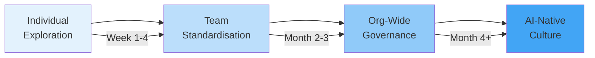
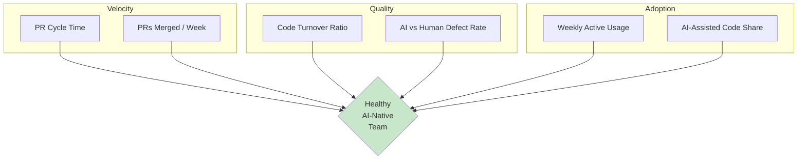

# Building AI-Native Engineering Teams with Codex CLI: The Seven-Phase SDLC Adoption Playbook


---

Coding agents have crossed the chasm from novelty to infrastructure. OpenAI reports three million weekly active Codex users as of April 2026 [^1], and internally nearly all OpenAI engineers use Codex — resulting in 70% more pull requests merged weekly [^2]. Yet most teams still deploy agents as glorified autocomplete, limiting adoption to individual developers rather than transforming how the team operates across the entire software development lifecycle.

OpenAI's "Building an AI-Native Engineering Team" guide [^3] formalises what early adopters discovered empirically: the compounding gains come not from faster typing but from systematically delegating mechanical work at every SDLC phase while retaining human ownership of architecture, intent, and quality. This article translates that framework into concrete Codex CLI configuration, team workflows, and measurable adoption targets.

## The Delegate–Review–Own Framework

The core operating model for AI-native teams reduces to three categories of work per SDLC phase [^3]:

| Category | Who | What |
|----------|-----|------|
| **Delegate** | Agent | Mechanical, well-specified, reversible work |
| **Review** | Engineer + Agent output | Verify correctness, convention compliance, intent alignment |
| **Own** | Engineer | Architecture, strategic trade-offs, ambiguous requirements |

The ownership matrix is not static. As your AGENTS.md, skills, and hooks mature, work migrates from *Own* through *Review* into *Delegate* — but the migration only succeeds when verification infrastructure (tests, linters, type checkers) can confirm the agent's output independently [^4].

## Seven Phases, Seven Configurations

### Phase 1: Plan

The agent reads specifications, cross-references codebases, flags ambiguities, and decomposes work into sub-tasks [^3]. In Codex CLI, this maps to a read-only exploratory session:

```bash
codex --approval-mode suggest \
  "Read the spec in docs/rfc-0042.md, trace the affected code paths \
   in src/payments/, and produce a PLAN.md with sub-tasks and estimates"
```

**AGENTS.md excerpt for planning:**

```markdown
## Planning Phase
- Always produce a PLAN.md before writing code
- Cross-reference existing tests to validate feasibility
- Flag any ambiguity with ⚠️ markers and proposed clarifications
- Never modify source files during planning
```

**Delegate:** initial feasibility analysis, dependency mapping, sub-task generation.
**Review:** validate findings, assess completeness, confirm estimates.
**Own:** strategic prioritisation, long-term direction, trade-off decisions.

### Phase 2: Design

Agents scaffold boilerplate, implement design tokens, convert mockups to code, and suggest accessibility improvements [^3]. With GPT-5.5's multimodal capabilities, Codex CLI accepts image attachments for screenshot-to-code workflows [^5]:

```bash
codex "Here is the Figma export for the dashboard header. \
       Generate a React Server Component matching our design system \
       in src/components/ui/. Use Tailwind classes from our tokens." \
  < dashboard-header.png
```

**Delegate:** project scaffolding, boilerplate, design-to-component translation.
**Review:** convention compliance, accessibility standards, system integration.
**Own:** design system, UX patterns, architectural direction.

### Phase 3: Build (Highest Impact)

This is where the productivity multiplier is largest. Agents generate complete features across multiple files, fix build errors iteratively, and write tests alongside implementation code [^3].

```toml
# .codex/config.toml — build profile
[profile.build]
model = "gpt-5.5"
approval_policy = "auto-edit"
sandbox_mode = "workspace-write"

[profile.build.hooks.post_tool_use.build_verify]
event = "post_tool_use"
command = "npm run typecheck && npm test -- --bail"
```

The `auto-edit` approval mode lets the agent modify files freely while still requiring confirmation for shell commands — the right trade-off for feature implementation where the test suite serves as the verification gate [^6].

**Delegate:** first-pass implementation, scaffolding, CRUD logic, wiring, refactors, tests.
**Review:** design choices, performance evaluation, security review, migration risk.
**Own:** new abstractions, cross-cutting architectural changes, ambiguous requirements.

Cloudwalk reports delivering scripts, fraud rules, and microservices in minutes using this pattern, effectively eliminating busy work from the build phase [^3].

### Phase 4: Test

Agents suggest test cases and edge cases, maintain tests as code evolves, and reduce brittleness [^3]. The critical principle is **test-first verification** — the agent must confirm tests fail before writing implementation:

```markdown
## Testing Policy (AGENTS.md)
- Write tests BEFORE implementation code
- Verify each test fails with the expected error before making it pass
- Minimum coverage: 80% line, 70% branch for new modules
- Use `$tdd` skill for red-green-refactor workflows
- Never mock the module under test
```

A PostToolUse hook enforces test presence after any source file modification:

```toml
[hooks.post_tool_use.test_gate]
event = "post_tool_use"
command = "bash -c 'git diff --name-only | grep -q src/ && npm test || true'"
```

**Delegate:** initial test case generation, edge case identification from specs.
**Review:** validate test quality, ensure no shortcuts, confirm tests are runnable.
**Own:** coverage strategy, adversarial thinking, intent validation.

### Phase 5: Review

Agents execute baseline code review, identifying potential bugs through logic tracing and runtime analysis [^3]. Sansan reports catching race conditions, database issues, and scalability concerns through agent-driven review [^3].

```bash
codex exec --model gpt-5.5 \
  --output-schema ./review-schema.json \
  "Review the changes in this PR for bugs, security issues, \
   and architectural concerns. Focus on logic errors, not style." \
  < <(git diff main...HEAD)
```

The `--output-schema` flag produces structured JSON output suitable for CI integration — post findings as PR comments, gate merges on severity thresholds [^7].

**Delegate:** initial code review pass (may run multiple rounds before human review).
**Review:** architectural alignment, pattern consistency, requirements verification.
**Own:** final approval and production deployment responsibility.

### Phase 6: Document

Agents summarise functionality, generate system diagrams, update documentation automatically, and integrate into release workflows [^3]:

```bash
codex exec --model codex-spark \
  "Scan src/api/ and update docs/api-reference.md. \
   Add any missing endpoint documentation. \
   Do not remove existing content." \
  --approval-mode full-auto
```

Using Codex-Spark for documentation tasks optimises cost — documentation generation is token-heavy but reasoning-light [^8].

**Delegate:** file summaries, input/output descriptions, dependency lists, PR change summaries.
**Review:** service overviews, public APIs, runbooks, architecture pages.
**Own:** documentation strategy, standards, templates, external-facing content.

### Phase 7: Deploy and Maintain

Agents parse logs, surface anomalies, identify suspect code changes, propose hotfixes, and correlate deployment context [^3]. Virgin Atlantic integrated Codex with Azure DevOps and Databricks MCPs for unified logging, code tracing, and change review [^3].

```toml
# MCP servers for production observability
[mcp_servers.sentry]
type = "remote"
url = "https://mcp.sentry.io/sse"
auth = { type = "oauth" }

[mcp_servers.datadog]
type = "stdio"
command = "npx"
args = ["@datadog/mcp-server"]
```

```bash
codex --approval-mode suggest \
  "The /api/payments endpoint is returning 503s since deploy v2.41.0. \
   Query Sentry for recent errors, check the diff between v2.40.0 \
   and v2.41.0, and propose a fix with rollback steps."
```

**Delegate:** log parsing, metric anomalies, suspect change identification, hotfix proposals.
**Review:** vet diagnostics, confirm accuracy, approve remediation steps.
**Own:** novel incidents, sensitive changes, low-confidence situations.

## The Adoption Lifecycle



### Stage 1: Individual Exploration (Weeks 1–4)

Engineers experiment with Codex CLI on self-selected tasks. Key actions:

- Install Codex CLI across the team with a shared `requirements.toml` enforcing minimum sandbox and approval policies [^9]
- Create a `#codex-wins` channel for sharing successful workflows (Kapwing credits this pattern for driving adoption from 0 to 100% [^10])
- Assign pre-vetted backlog items as first Codex tasks — scoped, well-specified, low-risk [^10]

### Stage 2: Team Standardisation (Months 2–3)

Workflows crystallise into shared configuration:

- Write a project-level AGENTS.md encoding conventions, testing policies, and architectural constraints
- Convert repeatable prompts into skills (`~/.codex/skills/`)
- Configure PostToolUse hooks for lint, typecheck, and test enforcement
- Establish a shared `config.toml` with team-standard profiles

### Stage 3: Organisation-Wide Governance (Months 4+)

Enterprise controls via managed configuration:

```toml
# managed_config.toml (deployed via MDM or cloud admin)
[policy]
approval_policy = "auto-edit"   # minimum floor
sandbox_mode = "workspace-write"

[policy.deny_read]
paths = ["**/.env*", "**/secrets/**", "**/*.pem"]

[policy.hooks.required.test_gate]
event = "post_tool_use"
command = "make test-fast"
```

## Measuring What Matters

The productivity benchmarks for AI-native teams in 2026 converge on five metrics [^11]:

| Metric | Industry Average | Elite Teams |
|--------|-----------------|-------------|
| Weekly active usage (WAU) | 30–40% | 80%+ |
| AI-assisted code share | 15–25% | 60–75% |
| PR cycle time (AI-assisted) | 24–36 hours | <8 hours |
| 30-day code turnover (AI) | <12% healthy | >25% critical |
| AI vs human turnover ratio | <1.3× healthy | >1.5× warning |

The turnover ratio is the most important quality signal. If AI-assisted code is being reverted or rewritten at a higher rate than human-written code, the delegation boundary is wrong — tasks are being delegated that should be reviewed or owned [^11].

Healthy ROI on AI coding tools runs 2.5–3.5× on average, reaching 4–6× in top-quartile teams — but only when the cost denominator includes actual token and usage-based costs, not just licence fees [^11].



## Anti-Patterns to Avoid

**The "throw it over the wall" pattern.** Teams that delegate entire features without review gates produce code with 50% higher defect rates. Every delegated task needs a verification step — tests, type checks, or human review [^4].

**The "AI wrote it" abdication.** Every diff needs a named engineer who can explain the intent, the constraints applied, and the rollback plan [^12]. "The AI suggested it" is not an acceptable explanation in a post-mortem.

**Speed-only measurement.** Organisations measuring quality alongside velocity consistently outperform those focused solely on speed [^11]. Stanford's analysis of 51 enterprise AI deployments found that 77% of challenges came from invisible costs such as change management and process documentation, not model capability [^13].

**Premature full-auto.** Start with `suggest` mode until the team understands Codex behaviour in the codebase. Graduate to `auto-edit` once AGENTS.md and hooks provide sufficient guardrails. Reserve `full-auto` for CI pipelines inside sandboxed environments [^6].

## Getting Started This Week

1. **Monday:** Install Codex CLI for the team. Deploy a `requirements.toml` with `approval_policy = "auto-edit"` and `sandbox_mode = "workspace-write"`.
2. **Tuesday:** Write a minimal AGENTS.md for your primary repository — coding conventions, test requirements, and forbidden patterns.
3. **Wednesday:** Pick three well-specified backlog items and assign them as first Codex tasks to willing engineers.
4. **Thursday:** Add a PostToolUse hook that runs your existing test suite after file modifications.
5. **Friday:** Review the week's Codex-assisted PRs as a team. Discuss what worked, what didn't, and what should become a skill or hook.

Repeat weekly. By week four, you will have a shared configuration, a growing library of skills, and empirical data on where agents deliver value in your specific codebase. That is the foundation of an AI-native engineering team — not a tooling decision, but a systematic delegation of mechanical work backed by verification infrastructure.

## Citations

[^1]: OpenAI, "Codex CLI 3 Million Users: Growth Trajectory," April 2026. [https://openai.com/codex/](https://openai.com/codex/)
[^2]: OpenAI, "Scaling Codex to enterprises worldwide," March 2026. [https://openai.com/index/scaling-codex-to-enterprises-worldwide/](https://openai.com/index/scaling-codex-to-enterprises-worldwide/)
[^3]: OpenAI, "Building an AI-Native Engineering Team," OpenAI Developer Docs, 2026. [https://developers.openai.com/codex/guides/build-ai-native-engineering-team](https://developers.openai.com/codex/guides/build-ai-native-engineering-team)
[^4]: OpenAI, "Best practices – Codex," OpenAI Developer Docs, 2026. [https://developers.openai.com/codex/learn/best-practices](https://developers.openai.com/codex/learn/best-practices)
[^5]: OpenAI, "GPT-5.5 Announcement and Models," April 2026. [https://developers.openai.com/codex/models](https://developers.openai.com/codex/models)
[^6]: OpenAI, "Agent approvals & security – Codex," OpenAI Developer Docs, 2026. [https://developers.openai.com/codex/agent-approvals-security](https://developers.openai.com/codex/agent-approvals-security)
[^7]: OpenAI, "Non-interactive mode – Codex," OpenAI Developer Docs, 2026. [https://developers.openai.com/codex/noninteractive](https://developers.openai.com/codex/noninteractive)
[^8]: OpenAI, "Speed – Codex," OpenAI Developer Docs, 2026. [https://developers.openai.com/codex/speed](https://developers.openai.com/codex/speed)
[^9]: OpenAI, "Managed configuration – Codex," OpenAI Developer Docs, 2026. [https://developers.openai.com/codex/enterprise/managed-configuration](https://developers.openai.com/codex/enterprise/managed-configuration)
[^10]: Kapwing, "How We Achieved 100% Adoption of AI Coding Agents," 2026. [https://www.kapwing.com/blog/how-we-achieved-100-adoption-of-ai-coding-agents/](https://www.kapwing.com/blog/how-we-achieved-100-adoption-of-ai-coding-agents/)
[^11]: Larridin, "Developer Productivity Benchmarks 2026: AI-Native Engineering Data," 2026. [https://larridin.com/developer-productivity-hub/developer-productivity-benchmarks-2026](https://larridin.com/developer-productivity-hub/developer-productivity-benchmarks-2026)
[^12]: PwC, "Agentic SDLC in Practice: The Rise of Autonomous Software Delivery," 2026. [https://www.pwc.com/m1/en/publications/2026/docs/future-of-solutions-dev-and-delivery-in-the-rise-of-gen-ai.pdf](https://www.pwc.com/m1/en/publications/2026/docs/future-of-solutions-dev-and-delivery-in-the-rise-of-gen-ai.pdf)
[^13]: Stanford Digital Economy Lab, "The Enterprise AI Playbook: Lessons from 51 Successful Deployments," March 2026. [https://digitaleconomy.stanford.edu/app/uploads/2026/03/EnterpriseAIPlaybook_PereiraGraylinBrynjolfsson.pdf](https://digitaleconomy.stanford.edu/app/uploads/2026/03/EnterpriseAIPlaybook_PereiraGraylinBrynjolfsson.pdf)
