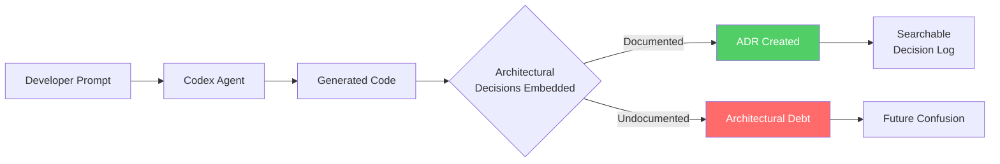
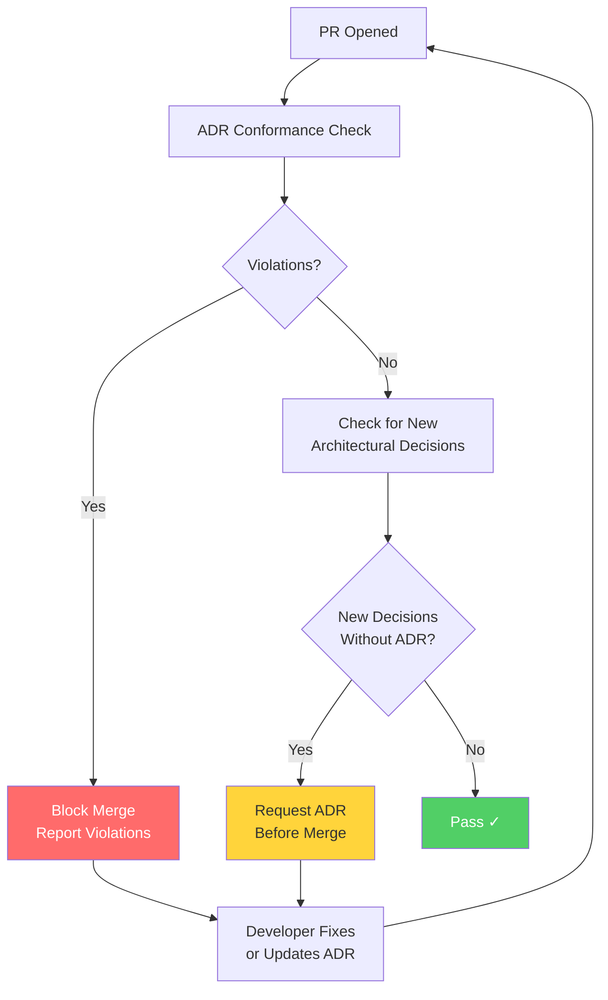

# Architecture Decision Records with Codex CLI: Automated ADR Generation, Governance, and the Agent-Architecture Gap


---

Every team says they will write Architecture Decision Records. Few actually do. The friction is well understood: by the time a decision matters enough to document, the developers who made it have moved on to the next sprint. Codex CLI changes the economics of that equation — it can draft ADRs in seconds, scan codebases for undocumented decisions, and enforce architectural constraints through hooks and fitness functions. But it also introduces a new problem: when an AI agent scaffolds your system in minutes, the architectural decisions it makes are buried in generated code with no recorded rationale [^1].

This article covers both sides: using Codex CLI to *create* ADRs, and using ADRs to *govern* Codex CLI.

## The Agent-Architecture Gap

A recent study found that prompt wording alone can cause a 5.9× code growth and 3× file increase for the same task [^1]. The researchers identified five mechanisms through which agents implicitly determine system structure — model selection, task decomposition, default configuration, scaffolding, and integration protocols — and coined the term "vibe architecting" [^1].

The critical finding: "Agents scaffold systems in minutes; teams need hours or days to audit them" [^1].



## ADR Fundamentals for Agentic Workflows

The Markdown Any Decision Records (MADR) format provides a lightweight structure that works well with agent-generated content [^2]. The essential sections:

```markdown
# ADR-0042: Use PostgreSQL for Event Sourcing

## Status
Accepted

## Context
The event store requires append-only writes, temporal queries,
and JSONB support for flexible event payloads.

## Decision
Use PostgreSQL 16 with JSONB columns and partitioned tables
rather than a dedicated event store (EventStoreDB, Axon Server).

## Consequences
- Team already has PostgreSQL operational expertise
- Partitioned tables require periodic maintenance automation
- No built-in projection engine — must implement in application layer
```

The key insight for agentic workflows: ADRs should document not just *what* was decided, but *who* decided it — human or agent — and *what context* the agent had at decision time [^1].

## Generating ADRs with Codex CLI

### One-Shot Generation from a Decision Kernel

The "kernel of truth" method starts with a one-sentence decision statement and expands it into a full ADR [^3]. With Codex CLI:

```bash
codex exec "We decided to use Redis for session caching because \
our P99 latency budget is 5ms and PostgreSQL queries average 12ms. \
Write an ADR in MADR format as docs/adrs/0015-redis-session-cache.md. \
Include at least three alternatives considered with trade-offs."
```

For structured output in CI pipelines, use `--output-schema` to validate the ADR contains required sections [^8]:

```bash
codex exec --json --output-schema adr-schema.json \
  "Generate an ADR for the decision to migrate from REST to gRPC \
   for inter-service communication"
```

### Scanning a Codebase for Undocumented Decisions

GPT-5.5's 400K token context window in Codex [^4] makes it practical to scan substantial portions of a codebase for implicit architectural decisions:

```bash
codex exec -m gpt-5.5 \
  "Scan this repository for architectural decisions that are NOT \
   documented in docs/adrs/. Look for: framework choices, database \
   schemas, API protocols, authentication mechanisms, deployment \
   patterns, and dependency selections. For each undocumented \
   decision, create a new ADR file in docs/adrs/ using MADR format. \
   Number them sequentially from the highest existing ADR number."
```

⚠️ Agent-generated ADRs from codebase scans will capture *what* was decided but may fabricate the *why*. Always review the "Context" and "Consequences" sections against actual team knowledge.

### Building an ADR Skill

Package the ADR workflow as a reusable Codex skill for consistent generation across your organisation:

```
docs/skills/adr-writer/
└── SKILL.md
```

```markdown
---
name: adr-writer
description: Generate Architecture Decision Records in MADR format
metadata:
  short-description: Write ADRs from decision kernels
---

## Instructions

Generate an Architecture Decision Record following MADR 4.0.

### Required Sections
1. **Title** — ADR-NNNN format, sequential numbering
2. **Status** — proposed, accepted, deprecated, or superseded
3. **Context** — Business and technical drivers (minimum 3 sentences)
4. **Decision** — The choice made and its rationale
5. **Consequences** — At least 3 (positive and negative)

### Optional Sections
- **Alternatives Considered** — At least 2 with trade-offs
- **Agent Attribution** — Model, prompt context, confidence level

Save to `docs/adrs/NNNN-<slug>.md` and update the index.
```

Invoke with `$adr-writer` or let Codex match it implicitly when you mention "write an ADR" or "document this decision" [^5].

## Governing Codex CLI with ADRs

The harder problem is ensuring Codex *respects* existing ADRs when generating code. Three mechanisms work together.

### AGENTS.md as Architectural Constraint

Reference your ADR directory in the project's `AGENTS.md` to ensure Codex reads existing decisions before making new ones [^6]:

```markdown
## Architecture

This project uses Architecture Decision Records.
Before making any architectural choice (framework, database,
protocol, deployment pattern), check `docs/adrs/` for existing
decisions. Do not contradict accepted ADRs.

Key active decisions:
- ADR-0012: PostgreSQL for all persistence (no new databases)
- ADR-0019: gRPC for inter-service, REST for public APIs
- ADR-0023: Feature flags via LaunchDarkly, not environment variables

When you make a new architectural decision not covered by an
existing ADR, create a new one in `docs/adrs/` before implementing.
```

This ensures AGENTS.md files at the repository root provide durable context that persists across sessions [^6]. Because Codex merges AGENTS.md files from root to current directory, you can add service-specific constraints in subdirectories [^6].

### PostToolUse Hooks for ADR Conformance

As of v0.124, hooks are stable and configurable in `config.toml` [^7]. Use a PostToolUse hook to verify that generated code does not violate accepted ADRs:

```toml
[hooks.post_tool_use.adr_conformance]
command = "python scripts/check_adr_conformance.py"
description = "Verify generated code respects accepted ADRs"
```

### Architectural Fitness Functions in CI

Combine `codex exec` with fitness functions that run in your CI pipeline to catch ADR violations before merge [^8]:

```yaml
# .github/workflows/adr-fitness.yml
name: ADR Conformance
on: [pull_request]
jobs:
  check:
    runs-on: ubuntu-latest
    steps:
      - uses: actions/checkout@v4
      - name: Verify ADR conformance
        run: |
          codex exec --json \
            "Review this PR against accepted ADRs in docs/adrs/. \
             Report violations as JSON. Empty array if none."
      - name: Check for missing ADRs
        run: |
          codex exec \
            "Does this PR introduce architectural changes needing \
             a new ADR? If so, list them and exit 1."
```



## Agent Attribution in ADRs

When Codex makes or influences an architectural decision, the ADR should record that fact. Add an "Agent Context" section to your MADR template:

```markdown
## Agent Context
- **Model:** gpt-5.5 via Codex CLI v0.125
- **Reasoning effort:** high
- **Prompt summary:** "Recommend a message queue for async job processing"
- **Confidence:** The agent considered RabbitMQ, Amazon SQS, and Redis
  Streams. The recommendation of SQS was based on existing AWS
  infrastructure (ADR-0008) and the team's operational constraints.
- **Human review:** Accepted after team discussion on 2026-04-25.
  Modified consequence #3 to note SQS FIFO queue ordering limitations.
```

This attribution becomes essential for audit trails, particularly in regulated environments where decision provenance matters [^1].

## Continuous ADR Maintenance

The real value emerges when ADR generation becomes continuous [^9]. Add an ADR policy section to your AGENTS.md instructing Codex to check `docs/adrs/` before any architectural choice, create proposed ADRs for new decisions before implementing, and mark superseded ADRs when decisions evolve. This turns every Codex session into an opportunity to capture architectural knowledge that would otherwise be lost [^9].

## Practical Recommendations

1. **Start retroactively** — scan your codebase with `codex exec` for decisions already embedded in code
2. **Constrain via AGENTS.md** — prevent Codex from contradicting established decisions
3. **Standardise with `$adr-writer`** — consistent format and quality across the team
4. **Attribute agent decisions** — record model, prompt context, and human review status
5. **Enforce in CI** — fitness functions to catch violations before merge

The agent-architecture gap will only widen. Teams that instrument their ADR workflows now will maintain architectural coherence while their less disciplined competitors accumulate invisible technical debt.

## Citations

[^1]: Arrighi, A. et al. (2026). "Architecture Without Architects: How AI Coding Agents Shape Software Architecture." *arXiv:2604.04990*. [https://arxiv.org/abs/2604.04990](https://arxiv.org/abs/2604.04990)

[^2]: Markdown Any Decision Records (MADR). "About MADR." [https://adr.github.io/madr/](https://adr.github.io/madr/)

[^3]: Equal Experts. "Accelerating Architectural Decision Records (ADRs) with Generative AI." [https://www.equalexperts.com/blog/our-thinking/accelerating-architectural-decision-records-adrs-with-generative-ai/](https://www.equalexperts.com/blog/our-thinking/accelerating-architectural-decision-records-adrs-with-generative-ai/)

[^4]: OpenAI. "Introducing GPT-5.5." April 2026. [https://openai.com/index/introducing-gpt-5-5/](https://openai.com/index/introducing-gpt-5-5/)

[^5]: OpenAI Developers. "Agent Skills — Codex." [https://developers.openai.com/codex/skills](https://developers.openai.com/codex/skills)

[^6]: OpenAI Developers. "Custom instructions with AGENTS.md — Codex." [https://developers.openai.com/codex/guides/agents-md](https://developers.openai.com/codex/guides/agents-md)

[^7]: OpenAI Developers. "Changelog — Codex." Codex CLI v0.124.0, April 23 2026. [https://developers.openai.com/codex/changelog](https://developers.openai.com/codex/changelog)

[^8]: OpenAI Developers. "Non-interactive mode — Codex." [https://developers.openai.com/codex/noninteractive](https://developers.openai.com/codex/noninteractive)

[^9]: Adolfi, A. "AI-generated Architecture Decision Records (ADR)." [https://adolfi.dev/blog/ai-generated-adr/](https://adolfi.dev/blog/ai-generated-adr/)
