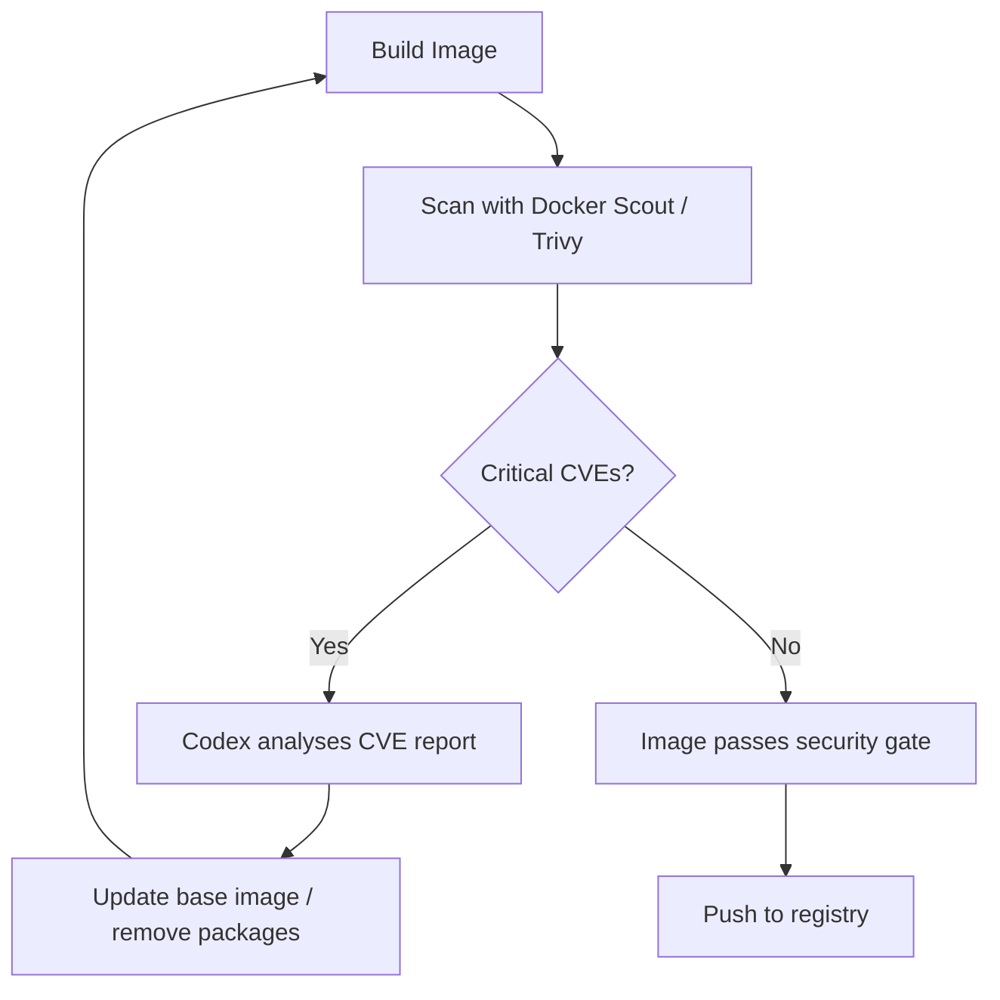

# Codex CLI for Dockerfile Optimisation: Multi-Stage Builds, Layer Caching, and Security Hardening


---

Dockerfiles look simple. They are deceptively hard to get right. A naively written Dockerfile for a Node.js application can produce a 1.2 GB image with a shell, package manager, build tools, and dozens of known CVEs baked in. A well-engineered one — multi-stage, distroless, non-root — compresses that to under 80 MB with zero critical vulnerabilities. Codex CLI, powered by GPT-5.5 [^1], is remarkably good at bridging that gap. This article covers practical patterns for using Codex CLI to write, audit, and harden Dockerfiles across your projects.

## Why Dockerfiles Are a Good Fit for Agent Assistance

Dockerfiles sit at an intersection that plays to a coding agent's strengths: they are declarative, well-documented, and the feedback loop is tight. Run `docker build`, observe the output, adjust. Codex CLI's agent loop — read, propose, execute, verify — maps cleanly onto this cycle [^2].

More importantly, Dockerfile best practices are stable and well-codified. The Sysdig top-21 checklist [^3], Docker's own security guidance [^4], and Chainguard's hardened-image methodology [^5] have converged on a set of principles that GPT-5.5 has thoroughly internalised from training data. The result is that Codex generates solid Dockerfiles on first pass, typically including multi-stage builds and proper `COPY` ordering for layer caching without being prompted [^6].

## Setting Up Your AGENTS.md for Docker Workflows

Before asking Codex to touch your Dockerfiles, encode your organisation's container standards in `AGENTS.md` at the repository root [^7]. This ensures every session respects your constraints:

```markdown
## Docker Standards

- Base images: use Chainguard or distroless variants. Never use `:latest` tags.
- Pin base image digests in production Dockerfiles.
- All containers run as non-root (UID 1000+).
- No secrets in build args or environment variables.
- Multi-stage builds required for compiled languages.
- Final stage must not contain build toolchains, shells, or package managers.
- Layer ordering: OS deps → app deps → source code → build → copy artefacts.
```

With these constraints set, every Codex session in the repository will respect them without re-prompting [^7].

## Pattern 1: Generating an Optimised Dockerfile from Scratch

The simplest workflow is asking Codex to scaffold a Dockerfile for an existing project:

```bash
codex "Create an optimised production Dockerfile for this Node.js application. \
Use multi-stage builds, pin the base image digest, run as non-root, \
and ensure the final image is distroless."
```

Codex will inspect your `package.json`, identify the Node.js version, and produce something structurally similar to:

```dockerfile
# Stage 1: Build
FROM node:22.15-slim@sha256:abc123... AS builder
WORKDIR /app
COPY package.json package-lock.json ./
RUN npm ci --production=false
COPY . .
RUN npm run build

# Stage 2: Production
FROM gcr.io/distroless/nodejs22-debian12@sha256:def456...
WORKDIR /app
COPY --from=builder /app/dist ./dist
COPY --from=builder /app/node_modules ./node_modules
COPY --from=builder /app/package.json ./
USER 1000
EXPOSE 3000
CMD ["dist/server.js"]
```

The key optimisations Codex applies automatically:

1. **Dependency layer caching** — `package.json` and lockfile are copied before source code, so `npm ci` only re-runs when dependencies change [^3].
2. **Digest pinning** — base images are pinned by SHA256 digest, not just tag, preventing silent upstream changes [^5].
3. **Distroless final stage** — no shell, no package manager, dramatically reduced attack surface [^8].
4. **Non-root execution** — `USER 1000` prevents container breakout escalation [^4].

## Pattern 2: Auditing an Existing Dockerfile

For legacy projects, the audit-and-fix workflow is more valuable than starting fresh:

```bash
codex "Audit this Dockerfile for security issues, layer caching inefficiencies, \
and image size problems. Fix everything you find, explain each change."
```

Codex reads the Dockerfile, identifies anti-patterns, and applies fixes. Common issues it catches:

| Anti-Pattern | Fix Applied | Impact |
|---|---|---|
| `FROM ubuntu:latest` | Pin to specific digest | Reproducibility, security |
| `RUN apt-get update && apt-get install` on separate lines | Combine into single `RUN` | Prevents stale cache |
| `COPY . .` before dependency install | Reorder to copy lockfile first | Cache hit rate |
| Running as root | Add `USER` directive | CVE mitigation |
| Secrets in `ENV` or `ARG` | Use `--mount=type=secret` | Credential safety |
| No `.dockerignore` | Generate `.dockerignore` | Build context size |

## Pattern 3: Multi-Stage Build for Compiled Languages

Multi-stage builds shine brightest with compiled languages. Here is a workflow for a Go service:

```bash
codex "Write a multi-stage Dockerfile for this Go service. \
The final image should be scratch-based with only the static binary. \
Include a health check endpoint on /healthz."
```

The resulting Dockerfile typically follows this architecture:

```mermaid
graph LR
    A["Stage 1: Builder<br/>golang:1.24-alpine"] --> B["go mod download"]
    B --> C["go build -ldflags '-s -w'<br/>CGO_ENABLED=0"]
    C --> D["Stage 2: Final<br/>scratch"]
    D --> E["COPY --from=builder<br/>/app/server /server"]
    E --> F["USER 65534<br/>ENTRYPOINT [\"/server\"]"]
```

The critical flags Codex includes for Go builds:

- `CGO_ENABLED=0` for fully static binaries that run on `scratch` [^9]
- `-ldflags '-s -w'` to strip debug symbols (typically 30-40% size reduction)
- `HEALTHCHECK` directive pointing at the health endpoint

## Pattern 4: Layer Cache Optimisation with a Skill

For teams that repeatedly optimise Dockerfiles, wrap the workflow in a Codex skill [^10]:

```markdown
---
name: docker-optimise
description: >
  Audit and optimise Dockerfiles for image size, layer caching,
  security hardening, and build speed. Trigger when user mentions
  Dockerfile, container image, or Docker build optimisation.
---

## Steps

1. Read all Dockerfiles and .dockerignore files in the repository.
2. For each Dockerfile:
   - Check base image for known CVEs using `docker scout cves` if available.
   - Verify layer ordering follows: OS deps → app deps → source → build → copy.
   - Confirm multi-stage build separates build and runtime.
   - Verify non-root USER directive exists.
   - Check for secrets in ENV/ARG directives.
   - Verify base images are digest-pinned.
3. Generate a report table with findings and severity.
4. Apply fixes automatically, preserving existing functionality.
5. Run `docker build` to verify the fixed Dockerfile builds successfully.
```

Place this in `.agents/skills/docker-optimise/SKILL.md` and it activates automatically whenever you mention Docker optimisation in a Codex session [^10].

## Pattern 5: Security Hardening Pipeline

Combine Codex with Docker Scout or Trivy for a closed-loop security workflow:

```bash
codex "Run docker scout on the built image, analyse the CVE report, \
and fix any vulnerabilities by updating base images or removing \
unnecessary packages. Iterate until zero critical CVEs remain."
```

This leverages Codex's agent loop to create an iterative hardening cycle:



For CI integration, use `codex exec` in non-interactive mode [^11]:

```bash
codex exec --approval-mode full-auto \
  "Scan the Docker image with trivy and fix any HIGH or CRITICAL \
  vulnerabilities found. Output a summary of changes made." \
  | tee docker-security-report.txt
```

## Chainguard and Distroless: Choosing Your Base

The base image choice is the single most impactful security decision in a Dockerfile [^3]. Codex understands the trade-offs between the major options:

| Base Image | Shell | Package Manager | Typical CVEs | Best For |
|---|---|---|---|---|
| `ubuntu:24.04` | Yes | apt | 50-100+ | Development only |
| `alpine:3.21` | Yes (ash) | apk | 5-20 | Small images, needs shell |
| `gcr.io/distroless/*` | No | No | 0-5 | Production, Google ecosystem |
| `cgr.dev/chainguard/*` | No | No | 0 (rebuilt daily) | Production, compliance-heavy [^5] |
| `scratch` | No | No | 0 | Static binaries (Go, Rust) |

When prompting Codex, specify your preference explicitly:

```bash
codex "Migrate this Dockerfile from ubuntu:22.04 to a Chainguard base image. \
Preserve all functionality and test that the application starts correctly."
```

## Integrating with Docker Model Runner

Docker Desktop 4.42+ includes Docker Model Runner, which provides local LLM inference via `docker model` commands [^12]. While this does not replace Codex CLI for Dockerfile engineering, it enables an interesting hybrid pattern: use Codex CLI (with GPT-5.5) for the heavy lifting of Dockerfile creation and optimisation, then use Docker Model Runner with a local model for quick, offline validation checks during the build cycle.

## Common Pitfalls and How Codex Handles Them

**Build context bloat.** If you forget a `.dockerignore`, Codex will notice the build context size and generate one. It typically excludes `node_modules`, `.git`, `dist`, `*.log`, and IDE configuration directories.

**Layer cache invalidation.** Codex understands that `COPY . .` early in a Dockerfile invalidates the cache on every source change. It reorders instructions to maximise cache reuse.

**Multi-platform builds.** When asked, Codex generates `docker buildx` commands for multi-architecture images (`linux/amd64,linux/arm64`), including the correct `--platform` flags in both the Dockerfile `FROM` directives and the build command.

**Secret leakage.** Codex uses `RUN --mount=type=secret,id=npm_token` for private registry authentication rather than `ARG NPM_TOKEN`, preventing secrets from persisting in image layers [^4].

## Putting It All Together

A complete workflow for a team adopting Codex-driven Dockerfile management:

1. **Encode standards** in `AGENTS.md` with your base image policy, CVE thresholds, and layer ordering rules.
2. **Create a `docker-optimise` skill** in `.agents/skills/` for repeatable audits.
3. **Run initial audit** with `codex "Audit all Dockerfiles in this repository"`.
4. **Integrate into CI** with `codex exec` scanning on every PR that modifies a Dockerfile.
5. **Iterate** — Codex's agent loop handles the build-scan-fix cycle until your images meet your security bar.

The combination of GPT-5.5's understanding of container best practices, Codex CLI's ability to execute `docker build` and scanning tools in its agent loop, and the AGENTS.md constraint system makes Dockerfile engineering one of the most productive Codex CLI workflows available today.

## Citations

[^1]: [Introducing GPT-5.5](https://openai.com/index/introducing-gpt-5-5/) — OpenAI, April 2026. GPT-5.5 is OpenAI's newest frontier model, recommended for complex coding tasks.
[^2]: [Features — Codex CLI](https://developers.openai.com/codex/cli/features) — OpenAI Developers. Describes the agent loop, tool execution, and iterative workflow.
[^3]: [Top 21 Dockerfile Best Practices for Container Security](https://www.sysdig.com/learn-cloud-native/dockerfile-best-practices) — Sysdig. Comprehensive Dockerfile security and optimisation checklist.
[^4]: [Docker Container Security Best Practices in 2026](https://www.techsaas.cloud/blog/docker-container-security-best-practices-2026/) — TechSaaS. Covers non-root execution, secret management, and runtime hardening.
[^5]: [Getting Started with Distroless Container Images](https://edu.chainguard.dev/chainguard/chainguard-images/about/getting-started-distroless/) — Chainguard Academy. Chainguard's approach to minimal, CVE-free base images.
[^6]: [Claude Code vs Codex CLI vs Gemini CLI — 2026 Comparison](https://www.deployhq.com/blog/comparing-claude-code-openai-codex-and-google-gemini-cli-which-ai-coding-assistant-is-right-for-your-deployment-workflow) — DeployHQ. Notes Codex produced solid Dockerfiles with multi-stage builds on first pass in ~45 seconds.
[^7]: [Custom Instructions with AGENTS.md](https://developers.openai.com/codex/guides/agents-md) — OpenAI Developers. How AGENTS.md files provide persistent per-repository instructions to Codex.
[^8]: [How to Build Minimal Container Images with Distroless and Chainguard](https://oneuptime.com/blog/post/2026-02-09-distroless-chainguard-minimal-images/view) — OneUptime. Comparison of distroless and Chainguard approaches to minimal images.
[^9]: [Docker Multi-Stage Builds: The Complete Guide for 2026](https://devtoolbox.dedyn.io/blog/docker-multi-stage-builds-guide) — DevToolbox. Covers Go static binary patterns, CGO_ENABLED=0, and scratch images.
[^10]: [Agent Skills — Codex](https://developers.openai.com/codex/skills) — OpenAI Developers. Skill creation, SKILL.md format, and discovery locations.
[^11]: [Best Practices — Codex](https://developers.openai.com/codex/learn/best-practices) — OpenAI Developers. Guidance on non-interactive `codex exec` usage in CI/CD pipelines.
[^12]: [Docker Model Skills](https://docs.docker.com/reference/cli/docker/model/skills/) — Docker Docs. Docker Model Runner for local LLM inference alongside container workflows.
