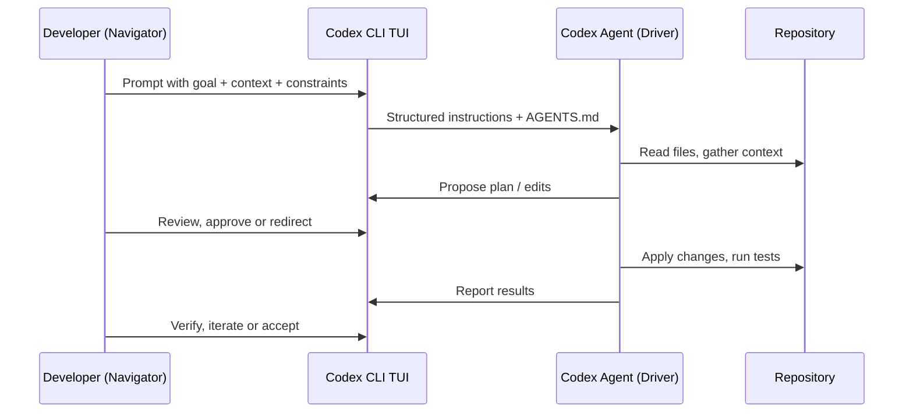

# Codex CLI for Pair Programming: Interactive Patterns, Conversation Strategies, and the Human-Agent Collaboration Loop


Most Codex CLI coverage focuses on headless automation, CI/CD pipelines, or framework-specific configuration. Yet the mode most developers actually use day-to-day is the **interactive TUI** — a full-screen terminal session where you and the agent iterate together in real time. This article codifies the patterns that make that collaboration effective, drawn from OpenAI's official workflows documentation, community practice, and the pair-programming research that emerged through early 2026.

## Why Interactive Codex Differs from Traditional Pair Programming

Traditional pair programming rotates a **driver** (typing) and a **navigator** (reviewing). With Codex CLI, you are always the navigator: you set direction, approve actions, and verify results. The agent is always the driver: it reads files, proposes edits, runs commands, and reports outcomes[^1].

This asymmetry changes the economics. You no longer need to maintain two equally-skilled humans on the same task; instead, you invest your cognitive budget in **steering** while the agent handles mechanical execution[^2]. The trade-off is that you must learn to communicate intent precisely — the agent cannot read body language or infer frustration from a sigh.



## The Five Interactive Patterns

After studying how effective practitioners use the TUI, five distinct interaction patterns emerge. Each maps to a different task shape.

### Pattern 1: Scout-Then-Act

**When:** You are unfamiliar with the code area.

Start with a read-only exploration prompt, then pivot to implementation once you understand the landscape:

```bash
# Phase 1 — Scout
codex
> Trace the request lifecycle for POST /api/orders from the Express
> router through to the database write. Note validation steps,
> middleware, and error handlers. Do not change any files.
```

Review the agent's summary. Then, in the same session:

```bash
> Now add input validation for the `quantity` field using zod,
> following the pattern you found in the existing validators.
```

This pattern leverages the agent's context accumulation — it already knows the codebase layout from the scout phase, so the implementation prompt can be terse[^3].

### Pattern 2: Plan-Execute-Review

**When:** The change is complex enough to warrant explicit design before coding.

```bash
> /plan Add rate limiting to all public API endpoints using
> express-rate-limit, with per-route configuration stored
> in config/rate-limits.yaml
```

Codex enters plan mode via the `/plan` slash command (or `Shift+Tab`)[^4]. It gathers context, proposes a structured implementation plan, and waits for your approval. You can:

- **Approve** the plan as-is
- **Redirect** with feedback ("Use a Redis-backed store, not in-memory")
- **Fork** with `Esc` navigation to branch from a specific point

After plan approval, let the agent execute. Then trigger review:

```bash
> /review
```

This three-phase rhythm — plan, execute, review — mirrors the gold-standard code review workflow OpenAI recommends[^5].

### Pattern 3: Incremental Tightening

**When:** You have a rough idea but need to refine iteratively.

Start with a broad prompt and progressively tighten constraints:

```bash
> Write a React component that displays a sortable data table
> for the /users endpoint.

# After reviewing the first draft:
> Good start. Now make the sort state URL-driven using
> useSearchParams, and add aria-sort attributes for accessibility.

# After second iteration:
> The column header click handler has a race condition when
> double-clicking. Add a debounce and write a test for it.
```

Each follow-up prompt adds constraints rather than restating the entire requirement. The agent retains the full conversation context, so you only need to specify the **delta**[^6].

### Pattern 4: Diverge-Converge

**When:** You want to explore multiple approaches before committing.

Use conversation forking to create parallel branches:

```bash
> Implement the caching layer using node-cache with TTL-based
> expiration.

# Review the result, then fork to try an alternative:
# Press Esc twice to walk back, then Enter to fork
> Instead, implement the caching layer using Redis with
> cache-aside pattern.
```

Each fork preserves the original transcript. You can then compare the two approaches using `/diff` in each branch and choose the better one[^7]. This is the agent equivalent of `git stash` experimentation, but with full conversation context preserved.

### Pattern 5: Verify-First Delegation

**When:** The task is well-defined and you want maximum autonomy.

Provide a complete specification upfront, including verification criteria:

```bash
codex --approval-mode full-auto
> Refactor the authentication module from callbacks to async/await.
> Constraints:
> - Preserve all existing test assertions
> - Run `npm test` after each file change
> - If any test fails, revert that file and try a different approach
> Done when: all 47 existing tests pass and no callback patterns remain
```

The `full-auto` approval mode (`/permissions` > Full Access) lets the agent work without per-step approval[^8]. This is appropriate only when you have strong test coverage and clear rollback criteria.

## Conversation Management Strategies

Long sessions accumulate context. Mismanaging that context is the primary cause of degraded agent performance.

### Token Budget Awareness

Use `/status` to monitor token consumption. GPT-5.5 provides a 400K-token context window in Codex CLI[^9], but effective context is smaller because earlier turns lose salience as the window fills.

### When to Compact

Run `/compact` when:

- `/status` shows context usage above 60%
- The agent starts repeating earlier suggestions
- You are pivoting to an unrelated task within the same session

Compaction summarises the conversation into a condensed handoff note, freeing tokens while preserving critical decisions[^10]. Codex sessions have been observed running continuously for up to seven hours using periodic compaction[^10].

### When to Start Fresh

Use `/new` or `/clear` when:

- The task is completely unrelated to the current conversation
- You have made significant manual changes the agent does not know about
- The session has accumulated more than three compaction cycles

Starting fresh is cheaper than working against stale context. The anti-pattern of "kitchen-sink sessions" — mixing unrelated tasks in one thread — is the single most common cause of poor agent output[^11].

### When to Fork

Use fork (`Esc` > navigate > `Enter`) when:

- You want to try an alternative approach without losing progress
- A conversation has reached a decision point with multiple valid paths
- You want to preserve a known-good state before a risky change

```mermaid
graph TD
    A[Session Start] --> B[Scout Phase]
    B --> C[Plan Approved]
    C --> D{Decision Point}
    D -->|Fork A| E[Redis Approach]
    D -->|Fork B| F[In-Memory Approach]
    E --> G[Compare & Choose]
    F --> G
    G --> H[Continue on Chosen Branch]
    H --> I{Context Full?}
    I -->|Yes| J[/compact]
    I -->|No| K[Continue Work]
    J --> K
    K --> L{New Task?}
    L -->|Related| K
    L -->|Unrelated| M[/new]
```

## Steering Techniques That Work

### The Four-Part Prompt

OpenAI's official prompting guidance recommends structuring every interactive prompt with four elements[^5]:

1. **Goal** — what you want changed or built
2. **Context** — specific files, errors, or examples (`@mention` files directly)
3. **Constraints** — standards, architecture rules, things to avoid
4. **Done when** — clear, testable completion criteria

```bash
# Weak prompt:
> Fix the login bug

# Strong prompt:
> Fix the 401 error when logging in with OAuth2 Google provider.
> See src/auth/google.ts and the error log in /tmp/auth-error.log.
> Keep the existing session cookie mechanism unchanged.
> Done when: the integration test in tests/auth/google.test.ts passes.
```

### Reasoning Effort Tuning

Adjust reasoning effort mid-session using `Alt+,` (lower) and `Alt+.` (raise)[^12]:

| Task Type | Reasoning Level | Rationale |
|---|---|---|
| Boilerplate generation | Low | Pattern matching, minimal ambiguity |
| Bug investigation | Medium | Needs analysis but scope is bounded |
| Architectural refactoring | High | Multi-file reasoning, trade-off evaluation |
| Complex debugging | Extra High | Deep causal analysis required |

Lowering reasoning for simple tasks reduces latency and token cost. Raising it for complex tasks improves first-attempt accuracy[^5].

### Mid-Turn Injection

Press `Enter` during an active agent turn to inject new instructions without cancelling the current work[^13]. This is the interactive equivalent of tapping your pair-programming partner on the shoulder:

```bash
# Agent is mid-way through a refactoring...
> [Enter] Also update the JSDoc comments as you go.
```

### The Interview Pattern

For ambiguous requirements, ask the agent to interview you before writing code[^5]:

```bash
> I want to add caching to the API. Before writing any code,
> ask me 3-5 clarifying questions about requirements.
```

This front-loads the design conversation and produces better first drafts than iterating on wrong assumptions.

## Approval Mode Progression

The three approval modes map to trust levels that should evolve as your session progresses[^8]:

```toml
# ~/.codex/config.toml — start conservative, escalate as needed
[profiles.explore]
approval_policy = "unless-allow-listed"

[profiles.implement]
approval_policy = "auto-edit"

[profiles.ship]
approval_policy = "full-auto"
```

Switch profiles mid-session with `/permissions` or launch with `codex --profile implement`. A practical progression:

1. **Explore** (`unless-allow-listed`) — when you do not yet understand the code
2. **Implement** (`auto-edit`) — once you have a plan and test coverage
3. **Ship** (`full-auto`) — for well-tested, bounded final tasks like formatting or documentation

## Anti-Patterns to Avoid

| Anti-Pattern | Symptom | Fix |
|---|---|---|
| Kitchen-sink sessions | Agent confuses contexts from unrelated tasks | `/new` between unrelated work |
| Correction spirals | Three+ failed attempts at the same change | Start fresh with a rewritten prompt |
| Over-specification | Agent ignores rules buried in lengthy prompts | Move durable rules to AGENTS.md |
| Trust-then-verify gap | Accepting code without running tests | Always include "Done when" criteria |
| Infinite exploration | Agent reads dozens of files without acting | Scope with `@mention` specific files |
| Premature full-auto | Giving full autonomy without test coverage | Stay in `auto-edit` until tests exist |

## Session Lifecycle: A Worked Example

Here is a complete interactive session lifecycle for adding a feature:

```bash
# 1. Start with exploration
codex --profile explore
> Explain how the notification system works. Focus on
> src/notifications/ and the message queue integration.

# 2. Escalate once you understand the code
> /permissions   # Switch to auto-edit

# 3. Plan the change
> /plan Add email digest notifications that batch individual
> notifications into a daily summary. Use the existing
> Handlebars templates in src/templates/.

# 4. Review and approve the plan, then let it execute

# 5. Verify
> /review

# 6. Check context budget
> /status

# 7. Compact if needed
> /compact

# 8. Continue iterating on the same feature
> Add a user preference to opt out of digest emails.
> Store it in the existing UserPreferences model.

# 9. Final review and commit
> /diff
> !git add -A && git commit -m "feat: email digest notifications"
```

## Measuring Collaboration Effectiveness

Track these metrics to assess whether your pair-programming workflow is improving:

- **First-attempt acceptance rate** — percentage of agent outputs you accept without revision
- **Turns per task** — fewer turns indicate clearer prompts and better AGENTS.md
- **Compaction frequency** — high frequency suggests sessions are too long or too broad
- **Fork-to-merge ratio** — frequent forks that get abandoned suggest unclear requirements upfront

Use `/status` token counts and the JSONL session logs under `~/.codex/sessions/` to compute these retroactively[^14].

## Citations

[^1]: OpenAI, "CLI — Codex," [https://developers.openai.com/codex/cli](https://developers.openai.com/codex/cli)
[^2]: Dave Patten, "The State of AI Coding Agents (2026): From Pair Programming to Autonomous AI Teams," Medium, March 2026, [https://medium.com/@dave-patten/the-state-of-ai-coding-agents-2026-from-pair-programming-to-autonomous-ai-teams-b11f2b39232a](https://medium.com/@dave-patten/the-state-of-ai-coding-agents-2026-from-pair-programming-to-autonomous-ai-teams-b11f2b39232a)
[^3]: OpenAI, "Workflows — Codex," [https://developers.openai.com/codex/workflows](https://developers.openai.com/codex/workflows)
[^4]: OpenAI, "Slash Commands in Codex CLI," [https://developers.openai.com/codex/cli/slash-commands](https://developers.openai.com/codex/cli/slash-commands)
[^5]: OpenAI, "Best Practices — Codex," [https://developers.openai.com/codex/learn/best-practices](https://developers.openai.com/codex/learn/best-practices)
[^6]: OpenAI, "Prompting — Codex," [https://developers.openai.com/codex/prompting](https://developers.openai.com/codex/prompting)
[^7]: OpenAI, "Features — Codex CLI," [https://developers.openai.com/codex/cli/features](https://developers.openai.com/codex/cli/features)
[^8]: OpenAI, "Agent Approvals and Security — Codex," [https://developers.openai.com/codex/agent-approvals-security](https://developers.openai.com/codex/agent-approvals-security)
[^9]: OpenAI, "Introducing Upgrades to Codex," [https://openai.com/index/introducing-upgrades-to-codex/](https://openai.com/index/introducing-upgrades-to-codex/)
[^10]: Justin3go, "Shedding Heavy Memories: Context Compaction in Codex, Claude Code, and OpenCode," April 2026, [https://justin3go.com/en/posts/2026/04/09-context-compaction-in-codex-claude-code-and-opencode](https://justin3go.com/en/posts/2026/04/09-context-compaction-in-codex-claude-code-and-opencode)
[^11]: Groundy, "The Art of AI Pair Programming: Patterns That Actually Work," [https://groundy.com/articles/art-ai-pair-programming-patterns-that-actually/](https://groundy.com/articles/art-ai-pair-programming-patterns-that-actually/)
[^12]: OpenAI, "Changelog — Codex," [https://developers.openai.com/codex/changelog](https://developers.openai.com/codex/changelog)
[^13]: OpenAI, "Features — Codex CLI," [https://developers.openai.com/codex/cli/features](https://developers.openai.com/codex/cli/features)
[^14]: SmartScope, "Complete Guide to Codex Plan Mode (2026)," [https://smartscope.blog/en/generative-ai/chatgpt/codex-plan-mode-complete-guide/](https://smartscope.blog/en/generative-ai/chatgpt/codex-plan-mode-complete-guide/)
