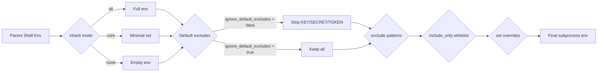
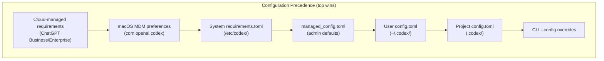

# Codex CLI Shell Environment Policy: Controlling What Your Agent's Subprocesses Can See


Every command Codex CLI executes — `npm test`, `git push`, `python manage.py migrate` — runs as a subprocess that inherits environment variables from your shell. Those variables routinely contain API keys, cloud credentials, database connection strings, and session tokens. Without deliberate control, every tool invocation the model proposes becomes a potential exfiltration vector. The `shell_environment_policy` configuration block exists to close that gap, and most developers leave it at the default without understanding what that default actually does.

This article is a practitioner's reference for the `shell_environment_policy` section of `config.toml`, covering the inheritance model, the automatic secret filter, layered filtering, enterprise enforcement, and battle-tested profiles for common workflows.

## Why This Matters More Than You Think

In December 2025, researchers at Check Point disclosed CVE-2025-61260: a `.env` file inside a cloned repository could redirect `CODEX_HOME` to an attacker-controlled path, loading a rogue configuration that executed arbitrary commands [^1]. The fix landed in v0.23.0, but the broader lesson remains: **environment variables are an attack surface**, and any subprocess the agent spawns can read them.

A separate vulnerability disclosed in March 2026 showed that GitHub tokens stored in environment variables could be harvested through crafted MCP server configurations [^2]. The `shell_environment_policy` is one of Codex CLI's primary defences against this entire class of attack.

## The Inheritance Model

The `shell_environment_policy` table controls which environment variables reach subprocesses. It evaluates in a strict pipeline:



### The Three Inheritance Modes

| Mode | Behaviour | Use case |
|------|-----------|----------|
| `all` | Starts with every variable from the parent shell | Development machines where convenience matters |
| `core` | Starts with a minimal set: `PATH`, `HOME`, `USER`, `SHELL`, `TERM`, `LANG`, `LC_*` | CI runners and shared environments |
| `none` | Starts with an empty environment | Maximum isolation; air-gapped or regulated contexts |

The default is `inherit = "all"` [^3], which surprises many developers who assume the sandbox strips everything.

### The Default Excludes Trap

Even with `inherit = "all"`, Codex applies an automatic filter that strips any variable whose name contains `KEY`, `SECRET`, or `TOKEN` (case-insensitive) [^3]. This is controlled by `ignore_default_excludes`, which defaults to `false`.

This creates a common gotcha documented in GitHub issue #3064 [^4]: tools that depend on variables like `SENTRY_API_TOKEN` or `GITHUB_TOKEN` fail silently because the default filter removes them before any user-defined rules execute. The symptom is an opaque "authentication failed" error from the tool, with no indication that Codex stripped the credential.

## Configuration Reference

The full `shell_environment_policy` block in `config.toml`:

```toml
[shell_environment_policy]
# Baseline: "all" (default) | "core" | "none"
inherit = "core"

# Disable the built-in KEY/SECRET/TOKEN filter. Default: false
ignore_default_excludes = false

# Case-insensitive glob patterns to remove after default filtering
exclude = ["AWS_*", "AZURE_*", "GCP_*", "DOCKER_*"]

# Whitelist — if non-empty, only matching vars survive
include_only = ["PATH", "HOME", "LANG", "NODE_ENV", "RAILS_ENV"]

# Explicit key/value pairs injected into every subprocess (always win)
set = { CI = "true", NODE_ENV = "test" }

# Experimental: source the user's shell profile before execution
experimental_use_profile = false
```

### Evaluation Order

1. **Inherit** — load the baseline set
2. **Default excludes** — strip `*KEY*`, `*SECRET*`, `*TOKEN*` (unless `ignore_default_excludes = true`)
3. **exclude** — remove variables matching any glob pattern
4. **include_only** — if non-empty, discard everything not matching the whitelist
5. **set** — inject explicit overrides (these always win, even over `include_only`)

Patterns use case-insensitive glob syntax: `*` matches any sequence, `?` matches a single character, `[A-Z]` matches character ranges [^3].

## Profiles for Common Workflows

### Profile 1: Secure Default for Daily Development

For general development where you need build tools and language runtimes to work, but want to keep cloud credentials out of agent-spawned subprocesses:

```toml
[shell_environment_policy]
inherit = "all"
ignore_default_excludes = false
exclude = [
  "AWS_*", "AZURE_*", "GCP_*", "GOOGLE_*",
  "DOCKER_*", "NPM_TOKEN", "PYPI_*",
  "*PASSWORD*", "*CREDENTIAL*",
]
```

This preserves the default `KEY/SECRET/TOKEN` filter, then adds explicit exclusions for cloud provider variables and package registry tokens.

### Profile 2: Locked-Down CI Runner

For `codex exec` in a GitHub Actions or GitLab CI pipeline where the environment is ephemeral and you want maximum control:

```toml
[shell_environment_policy]
inherit = "none"
set = { PATH = "/usr/local/bin:/usr/bin:/bin", HOME = "/tmp/codex-home", CI = "true" }
```

Starting from `none` means no credentials leak even if the CI runner has injected secrets into the environment. You explicitly provide only what the build needs [^5].

### Profile 3: Selective Credential Pass-Through

When a specific tool genuinely needs an API token — for instance, running Sentry error triage via an MCP server:

```toml
[shell_environment_policy]
inherit = "core"
ignore_default_excludes = true
include_only = [
  "PATH", "HOME", "LANG", "SHELL",
  "SENTRY_AUTH_TOKEN", "SENTRY_ORG", "SENTRY_PROJECT",
]
```

Setting `ignore_default_excludes = true` prevents the automatic filter from stripping `SENTRY_AUTH_TOKEN`. The `include_only` whitelist then ensures *only* the listed variables reach the subprocess — nothing else from the parent shell [^4].

### Profile 4: Enterprise Managed Deployment

For organisations using `requirements.toml` to enforce policy across all developer machines:

```toml
# /etc/codex/requirements.toml (Unix) or
# %ProgramData%\OpenAI\Codex\requirements.toml (Windows)

allowed_sandbox_modes = ["read-only", "workspace-write"]

[permissions.filesystem]
deny_read = [
  "~/.ssh",
  "~/.aws/credentials",
  "~/.config/gcloud",
  ".env",
  ".env.*",
]
```

Combined with a `managed_config.toml` that sets the environment policy:

```toml
# /etc/codex/managed_config.toml

[shell_environment_policy]
inherit = "core"
ignore_default_excludes = false
exclude = ["*SECRET*", "*CREDENTIAL*", "*PASSWORD*"]
```

Managed requirements take precedence over user configuration and cannot be overridden locally [^6]. This layering — `requirements.toml` for hard constraints, `managed_config.toml` for defaults — maps to the same split that macOS MDM profiles support via `com.openai.codex` preference keys [^6].



## The `allow_login_shell` Companion Setting

A related boolean, `allow_login_shell`, controls whether shell-based tools can use login-shell semantics (sourcing `~/.bash_profile`, `~/.zprofile`, etc.) [^3]. When disabled, login-shell requests are rejected and the subprocess falls back to a non-login shell. This matters because login profiles often `export` credentials, and an agent requesting a login shell could inadvertently pull in secrets you excluded from the environment policy.

The recommendation for production workloads: keep `allow_login_shell = false` and use `set` to inject any variables the build genuinely needs.

## Debugging Environment Issues

When a tool fails with an authentication or "command not found" error, the most likely cause is environment stripping. To diagnose:

```bash
# Check what Codex actually passes to subprocesses
codex --approval-mode on-request -c 'shell_environment_policy.inherit="all"' \
  "Run: env | sort"
```

Compare the output against your shell's `env | sort`. The diff reveals what the policy filtered.

For `codex exec` in CI, the `--json` flag (added in v0.125) now reports reasoning-token usage [^7], but you can also wrap the invocation to capture the subprocess environment:

```bash
codex exec "Run: env | grep -i sentry" 2>/dev/null
```

If the variable is missing, check your `config.toml` layering by running:

```bash
codex --show-resolved-config 2>&1 | grep -A 10 shell_environment
```

## Common Pitfalls

| Pitfall | Symptom | Fix |
|---------|---------|-----|
| Default excludes strip a needed token | Silent auth failure in tool | Set `ignore_default_excludes = true` and use `include_only` to whitelist |
| `inherit = "all"` leaks cloud creds | Credentials visible in subprocess | Switch to `inherit = "core"` with explicit `set` |
| `include_only` is empty | Treated as "no filter" (all pass) | Always populate `include_only` when using it |
| `set` values visible to model | Model can `echo $MY_VAR` | Acceptable — the model can already see tool output; the risk is exfiltration, which the sandbox's network policy mitigates |
| `experimental_use_profile = true` sources secrets | Login profile exports tokens | Keep `false`; use `set` instead |
| MDM policy overrides local config | Developer's custom policy ignored | Check MDM profile with `defaults read com.openai.codex` on macOS |

## Defence in Depth

`shell_environment_policy` is one layer in a multi-layer defence. Combine it with:

- **`deny_read` filesystem policies** to block agent access to credential files like `~/.aws/credentials` and `~/.ssh/` [^8]
- **Sandbox network policy** (`network_access = false`) to prevent exfiltration even if a credential does reach a subprocess [^3]
- **PreToolUse hooks** to scan proposed commands for patterns that would dump environment variables or read credential files [^9]
- **Managed requirements** to enforce these policies organisation-wide and prevent local overrides [^6]

No single control is sufficient. The environment policy stops credentials entering the subprocess; the network policy stops them leaving; the hooks policy stops the model asking for them in the first place.

## Citations

[^1]: Check Point Research, "OpenAI Codex CLI Vulnerability: Command Injection (CVE-2025-61260)," December 2025. [https://research.checkpoint.com/2025/openai-codex-cli-command-injection-vulnerability/](https://research.checkpoint.com/2025/openai-codex-cli-command-injection-vulnerability/)

[^2]: The Hacker News, "OpenAI Patches ChatGPT Data Exfiltration Flaw and Codex GitHub Token Vulnerability," March 2026. [https://thehackernews.com/2026/03/openai-patches-chatgpt-data.html](https://thehackernews.com/2026/03/openai-patches-chatgpt-data.html)

[^3]: OpenAI, "Advanced Configuration — Codex," April 2026. [https://developers.openai.com/codex/config-advanced](https://developers.openai.com/codex/config-advanced)

[^4]: GitHub, "Configuration for inherited environment variables — Issue #3064," openai/codex, 2026. [https://github.com/openai/codex/issues/3064](https://github.com/openai/codex/issues/3064)

[^5]: OpenAI, "Non-interactive mode — Codex," April 2026. [https://developers.openai.com/codex/noninteractive](https://developers.openai.com/codex/noninteractive)

[^6]: OpenAI, "Managed configuration — Codex," April 2026. [https://developers.openai.com/codex/enterprise/managed-configuration](https://developers.openai.com/codex/enterprise/managed-configuration)

[^7]: OpenAI, "Codex Changelog — v0.125.0," 24 April 2026. [https://developers.openai.com/codex/changelog](https://developers.openai.com/codex/changelog)

[^8]: OpenAI, "Configuration Reference — Codex," April 2026. [https://developers.openai.com/codex/config-reference](https://developers.openai.com/codex/config-reference)

[^9]: OpenAI, "Hooks — Codex CLI," April 2026. [https://developers.openai.com/codex/cli/hooks](https://developers.openai.com/codex/cli/hooks)
