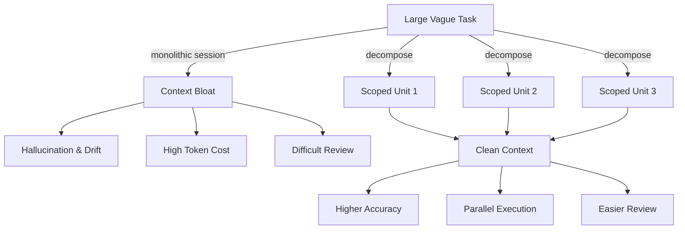
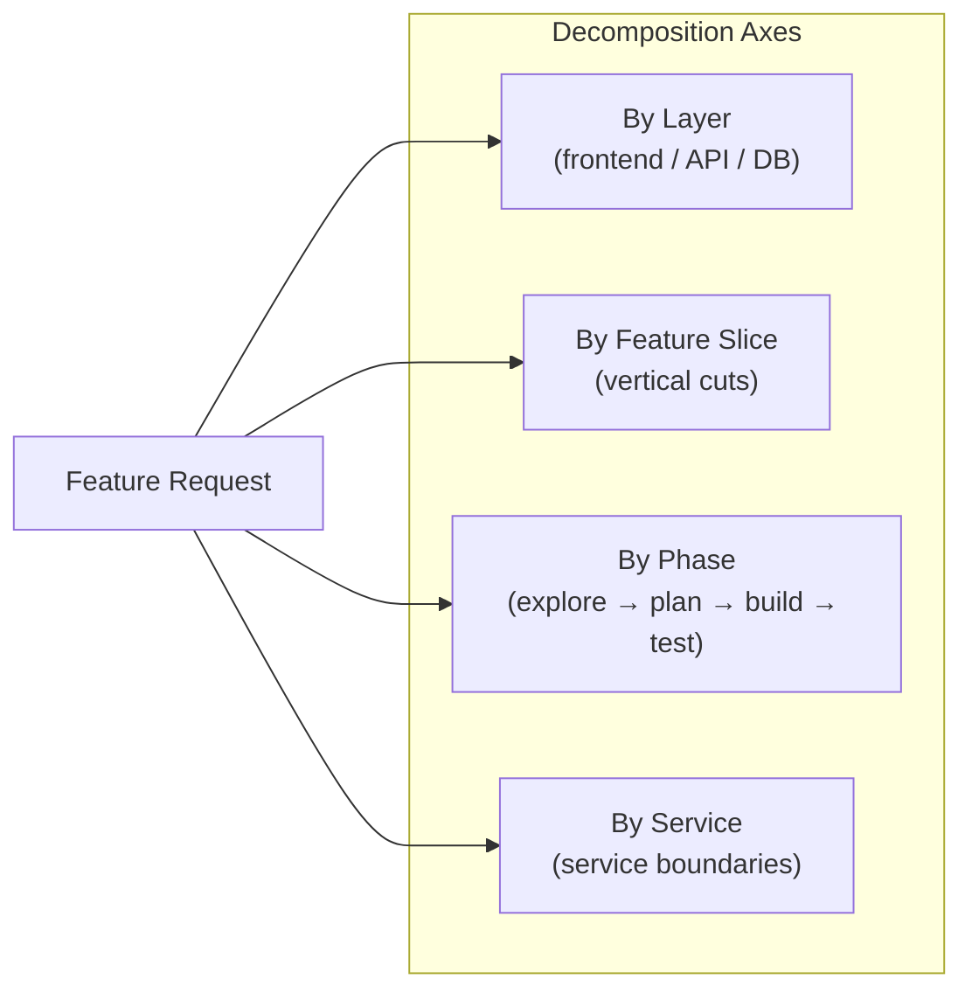
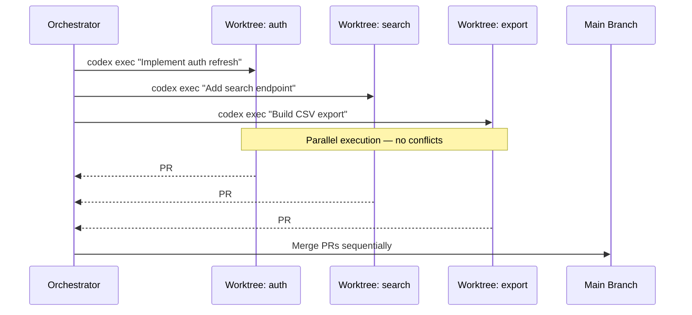
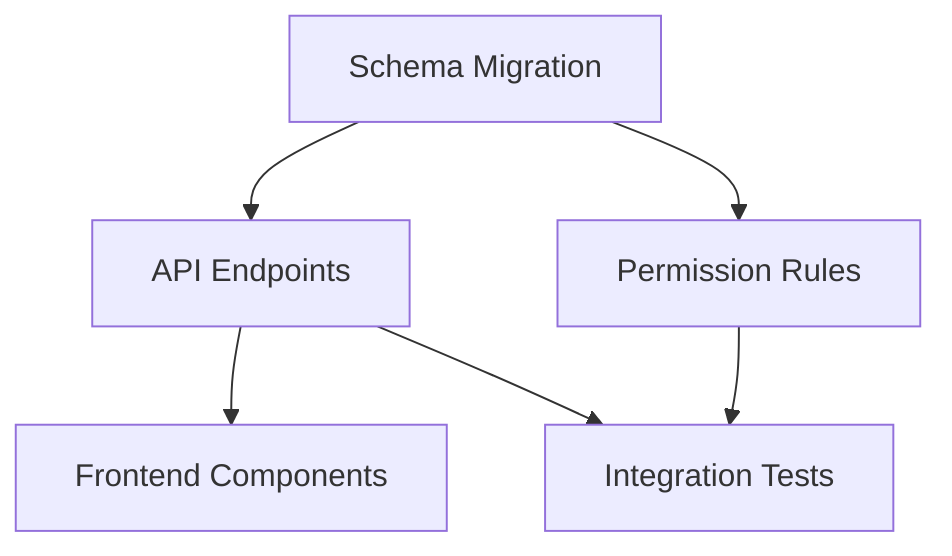

# Task Decomposition for Codex CLI: Right-Sizing Agent Work for Reliability, Speed, and Cost


---

The single biggest determinant of whether a Codex CLI session succeeds or spirals into wasted tokens is not the model you pick — it is how you scope the work you hand to the agent. OpenAI's own best practices page states it bluntly: *"Using one thread per project instead of one thread per task … leads to bloated context and worse results over time."*[^1] Yet most practitioners still drop an entire feature request into a single prompt and hope for the best.

This article provides a systematic framework for decomposing developer work into agent-friendly units, drawing on OpenAI's long-horizon task guidance[^2], the subagents documentation[^3], Addy Osmani's multi-agent orchestration research[^4], and community patterns that have emerged since GPT-5.5 shipped on 23 April 2026[^5].

## Why Decomposition Matters More for Agents

Human developers context-switch constantly — reading a file, running a test, checking a ticket — but they carry the project's *gestalt* in long-term memory. An LLM-backed agent has no such luxury. Its entire world is the context window, and that window has a fixed budget: 400K tokens for GPT-5.5 in Codex, 1M via the raw API[^5]. Every file read, every tool result, every prior turn consumes budget that cannot be reclaimed without compaction[^6].

Research from early 2026 confirms the intuition: *"Results will tend to be better when the context window is 'less full'"*[^7]. Coding agents function as long-context processors that dynamically adjust strategy based on task demands[^8], but signal-to-noise ratio degrades as irrelevant context accumulates. Decomposition is the primary lever for keeping that ratio high.



Three concrete benefits fall out of disciplined decomposition:

1. **Reliability** — smaller, well-defined tasks produce verifiable outputs. The agent can run tests, check types, and confirm "done" before the session ends[^1].
2. **Speed** — independent units run in parallel via subagents or worktrees, collapsing wall-clock time[^3].
3. **Cost** — fewer wasted tokens on irrelevant context, higher prompt-cache hit rates, and the option to route simple subtasks to cheaper models like `gpt-5.4-mini` or `gpt-5.3-codex-spark`[^9].

## The Decomposition Framework

### Step 1: Define "Done" Before Anything Else

Every unit of work needs an unambiguous acceptance criterion the agent can verify programmatically. OpenAI's best practices recommend including four elements in every prompt: **Goal**, **Context**, **Constraints**, and **Done when**[^1].

```markdown
## Task: Add rate-limiting middleware to /api/v2/*

**Goal:** Implement sliding-window rate limiting (100 req/min per API key).
**Context:** Express 5.x, Redis for state, existing auth middleware in src/middleware/auth.ts.
**Constraints:** No new npm dependencies beyond ioredis (already installed). British English in comments.
**Done when:** `npm test` passes, new tests cover 429 responses, `npm run lint` clean.
```

If you cannot write a concrete "done when" clause, the task is too vague to hand to an agent. Use plan mode (`/plan`) to have Codex interview you first[^1].

### Step 2: Apply the Task-Sizing Heuristic

Not every task should be a separate session. Decomposing too aggressively introduces coordination overhead. The sweet spot depends on three variables:

| Factor | Keep Together | Split Apart |
|---|---|---|
| **File scope** | Changes touch 1–3 tightly coupled files | Changes span 5+ loosely related files |
| **Verification** | Single test suite validates the change | Multiple independent test suites needed |
| **Context dependency** | Each step depends on the previous step's output | Steps are independent and parallelisable |
| **Token budget** | Estimated context stays under ~100K tokens | Context likely exceeds 150K tokens |

A practical rule of thumb: if you would review the change as a single pull request, it is probably a single agent task. If it would naturally split into multiple PRs, split the agent work too.

### Step 3: Choose a Decomposition Axis

Most developer work decomposes along one of four axes:

**By layer** — frontend, API, database, infrastructure. Each layer has distinct tooling, test suites, and file patterns. This is the natural axis for full-stack features.

**By feature slice** — vertical slices that cut across layers but implement one user-facing behaviour. This suits iterative product development where each slice ships independently.

**By phase** — explore, plan, implement, test, document. The PLANS.md / ExecPlan pattern formalises this axis for long-horizon work[^2]. Each phase can run in a separate session or as a milestone within a single long session.

**By service** — in microservice architectures, each service boundary is a natural decomposition point. Use `--add-dir` to scope the agent to one service's directory[^10].



### Step 4: Map Units to Execution Strategy

Once you have a set of scoped tasks, decide how each runs:

| Strategy | When to Use | Codex Primitive |
|---|---|---|
| **Sequential sessions** | Tasks depend on each other's output | `codex resume <SESSION_ID>` |
| **Parallel subagents** | Read-heavy or independently writable tasks | Prompt: *"spawn two agents, one per module"*[^3] |
| **Parallel worktrees** | Write-heavy tasks that modify different branches | `git worktree add` + separate `codex` processes[^11] |
| **Hierarchical delegation** | Large projects needing coordination layers | Custom agent definitions in `.codex/agents/`[^12] |

## Subagent Delegation in Practice

Codex does not spawn subagents automatically — you must ask for them explicitly[^3]. A well-structured delegation prompt clarifies three things: the work division, whether to wait for all agents, and what summaries to return.

```bash
# Interactive TUI prompt
"Spawn three subagents in parallel:
 1. Agent A: audit src/auth/ for OWASP Top 10 issues, return a markdown table of findings.
 2. Agent B: run the test suite in tests/integration/ and summarise any failures.
 3. Agent C: scan package.json for dependencies with known CVEs using npm audit.
 Wait for all three, then synthesise a single risk report."
```

### Model Selection per Subagent

Not every subtask needs the frontier model. The subagents documentation recommends[^3]:

- **`gpt-5.5`** — complex reasoning, multi-step implementation, security review
- **`gpt-5.4-mini`** — fast scans, boilerplate generation, log analysis
- **`gpt-5.3-codex-spark`** — latency-critical text work where speed matters more than depth

Configure per-agent model selection in `.codex/agents/`:

```toml
# .codex/agents/scanner.toml
name = "scanner"
model = "gpt-5.4-mini"
reasoning_effort = "low"
instructions = """
You are a fast code scanner. Read files, identify patterns, return structured findings.
Do not modify any files.
"""
```

### Subagent Configuration

Control parallel execution in `config.toml`[^12]:

```toml
[agents]
max_threads = 6        # concurrent subagent cap
max_depth = 2          # prevent recursive delegation
job_max_runtime_seconds = 300  # timeout per worker
```

## The Worktree Pattern for Write-Heavy Parallelism

When multiple tasks need to modify files simultaneously, subagents sharing a single working directory will create conflicts. The community has converged on git worktrees as the isolation layer[^11][^13].

```bash
# Create isolated worktrees for parallel agent work
git worktree add ../feature-auth feature/auth
git worktree add ../feature-search feature/search
git worktree add ../feature-export feature/export

# Launch agents in parallel (tmux or separate terminals)
cd ../feature-auth && codex exec --full-auto \
  "Implement JWT refresh token rotation per spec in docs/auth-spec.md"

cd ../feature-search && codex exec --full-auto \
  "Add full-text search to the products endpoint using pg_trgm"

cd ../feature-export && codex exec --full-auto \
  "Implement CSV export for the /reports endpoint"
```

Each worktree shares the `.git` object database but has its own working directory, HEAD, and staging area — preventing the index-lock contention that plagued early multi-agent setups[^13].



## The PLANS.md Pattern for Long-Horizon Work

For tasks that exceed a single session — multi-day refactors, framework migrations, new feature epics — OpenAI's cookbook recommends the ExecPlan pattern[^2]. Four markdown files create a durable project memory that survives compaction and session boundaries:

| File | Purpose | Updated By |
|---|---|---|
| `Prompt.md` | Frozen specification — goals, constraints, "done when" | Human |
| `Plan.md` | Ordered milestones with acceptance criteria | Agent (human-approved) |
| `Implement.md` | Operational runbook — how to work, when to validate | Human |
| `Documentation.md` | Living status log — current milestone, decisions, blockers | Agent |

The key insight is that milestones replace monolithic task descriptions. Each milestone is independently verifiable, creating natural checkpoints where the agent validates its work before proceeding[^2].

```bash
# Kick off a long-horizon task with plan mode
codex --full-auto \
  "Read Prompt.md and Plan.md. Follow Implement.md exactly. \
   Start from the first incomplete milestone in Documentation.md. \
   After completing each milestone, run the acceptance tests listed \
   in Plan.md before proceeding to the next."
```

## Anti-Patterns to Avoid

### The Kitchen-Sink Prompt

Dumping an entire feature specification, database schema, API contract, and UI mockup into a single prompt. The agent spends tokens processing irrelevant context and produces unfocused output.

**Fix:** split by decomposition axis. Hand the API contract to one session and the UI implementation to another.

### Premature Parallelisation

Spawning five subagents for tasks that have sequential dependencies. Agent B needs Agent A's output but starts before it is available, leading to hallucinated assumptions.

**Fix:** map dependencies explicitly. Only parallelise tasks where the dependency graph has no edges between them.

### Over-Decomposition

Breaking a three-file change into nine separate sessions, then spending more time coordinating and reviewing than the work itself would have taken.

**Fix:** apply the sizing heuristic. If it is one PR, it is one session.

### Context Hoarding

Keeping a session alive across unrelated tasks because it "already knows the codebase". Accumulated context from Task A pollutes reasoning about Task B.

**Fix:** one thread per coherent unit of work. Use `/fork` only when work truly branches from a shared starting point[^1].

## Putting It Together: A Worked Example

Suppose you need to add a new "Teams" feature to a SaaS application: database schema, API endpoints, frontend components, permissions, and tests.

**Step 1 — Define units:**

| Unit | Axis | Files | Dependencies |
|---|---|---|---|
| Schema migration | Layer | `migrations/`, `src/models/` | None |
| API endpoints | Layer | `src/routes/teams/`, `src/services/` | Schema |
| Permission rules | Feature | `src/middleware/rbac.ts` | Schema |
| Frontend components | Layer | `src/components/teams/` | API |
| Integration tests | Phase | `tests/integration/teams/` | API + Permissions |

**Step 2 — Execution plan:**



Schema runs first (sequential). API and permissions run in parallel (worktrees). Frontend and integration tests run after their dependencies complete.

**Step 3 — Execute:**

```bash
# Phase 1: Schema (single session)
codex exec --full-auto "Create Teams schema migration per docs/teams-spec.md. \
  Run 'npm run migrate' and 'npm test -- --grep teams' to validate."

# Phase 2: API + Permissions (parallel worktrees)
git worktree add ../teams-api feature/teams-api
git worktree add ../teams-rbac feature/teams-rbac

cd ../teams-api && codex exec --full-auto \
  "Implement Teams CRUD endpoints per docs/teams-api-spec.md. \
   Run tests. Lint clean."

cd ../teams-rbac && codex exec --full-auto \
  "Add Teams permission rules to RBAC middleware per docs/teams-rbac-spec.md. \
   Run 'npm test -- --grep rbac' to validate."

# Phase 3: Frontend + Integration (after merging Phase 2)
git worktree add ../teams-fe feature/teams-fe
cd ../teams-fe && codex exec --full-auto \
  "Build Teams UI components per Figma export in docs/teams-mockups/. \
   Run 'npm run test:components' to validate."
```

## Key Takeaways

1. **One thread per coherent unit of work** — not per project, not per file. Match session scope to PR scope.
2. **Define "done when" before starting** — if the agent cannot verify completion programmatically, the task is not ready for delegation.
3. **Parallelise reads, serialise writes** — subagents for exploration and analysis, worktrees for concurrent implementation.
4. **Route subtasks to appropriate models** — use GPT-5.5 for complex reasoning, Spark or mini for fast scans, and save tokens on both axes.
5. **Use PLANS.md for anything exceeding a single session** — durable project memory survives compaction and provides human-reviewable checkpoints.

Task decomposition is not overhead — it is the engineering discipline that turns a powerful but bounded language model into a reliable development partner.

---

## Citations

[^1]: OpenAI, "Best practices — Codex," [https://developers.openai.com/codex/learn/best-practices](https://developers.openai.com/codex/learn/best-practices)
[^2]: OpenAI Cookbook, "Using PLANS.md for multi-hour problem solving," [https://developers.openai.com/cookbook/articles/codex_exec_plans](https://developers.openai.com/cookbook/articles/codex_exec_plans)
[^3]: OpenAI, "Subagents — Codex," [https://developers.openai.com/codex/concepts/subagents](https://developers.openai.com/codex/concepts/subagents)
[^4]: Addy Osmani, "The Code Agent Orchestra — what makes multi-agent coding work," [https://addyosmani.com/blog/code-agent-orchestra/](https://addyosmani.com/blog/code-agent-orchestra/)
[^5]: OpenAI, "Introducing GPT-5.5," [https://openai.com/index/introducing-gpt-5-5/](https://openai.com/index/introducing-gpt-5-5/)
[^6]: OpenAI, "Features — Codex CLI," [https://developers.openai.com/codex/cli/features](https://developers.openai.com/codex/cli/features)
[^7]: Zylos Research, "Long-Running AI Agents and Task Decomposition 2026," [https://zylos.ai/research/2026-01-16-long-running-ai-agents](https://zylos.ai/research/2026-01-16-long-running-ai-agents)
[^8]: Wang et al., "Coding Agents are Effective Long-Context Processors," arXiv:2603.20432, March 2026, [https://arxiv.org/html/2603.20432v1](https://arxiv.org/html/2603.20432v1)
[^9]: OpenAI, "Codex CLI Changelog — v0.125.0," [https://developers.openai.com/codex/changelog](https://developers.openai.com/codex/changelog)
[^10]: OpenAI, "Command line options — Codex CLI," [https://developers.openai.com/codex/cli/reference](https://developers.openai.com/codex/cli/reference)
[^11]: Particula Tech, "Run Parallel Coding Agents With the oh-my-codex Pattern," [https://particula.tech/blog/parallel-coding-agents-worktree-pattern-oh-my-codex](https://particula.tech/blog/parallel-coding-agents-worktree-pattern-oh-my-codex)
[^12]: OpenAI, "Subagents — Configuration," [https://developers.openai.com/codex/subagents](https://developers.openai.com/codex/subagents)
[^13]: Penligent AI, "Git Worktrees Need Runtime Isolation for Parallel AI Agent Development," [https://www.penligent.ai/hackinglabs/git-worktrees-need-runtime-isolation-for-parallel-ai-agent-development/](https://www.penligent.ai/hackinglabs/git-worktrees-need-runtime-isolation-for-parallel-ai-agent-development/)
