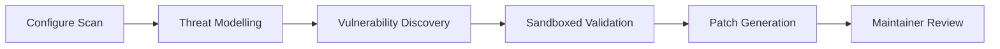

# Codex for Open Source: What the Programme Offers Maintainers and How to Make the Most of It


---

Open-source maintainers do critical infrastructure work — triaging issues, reviewing pull requests, cutting releases, keeping dependencies current — often unpaid and under-tooled. On 7 March 2026 OpenAI announced **Codex for Open Source**, a programme that bundles six months of ChatGPT Pro (with Codex), up to $25,000 in API credits, and conditional access to Codex Security into a single package aimed squarely at the people who keep the software ecosystem running [^1][^2]. This article explains what the programme includes, who qualifies, and — most importantly — how to integrate these resources into real maintainer workflows using Codex CLI.

## What the Programme Includes

The Codex for Open Source programme delivers three tiers of support [^1][^3]:

| Benefit | Details |
|---------|---------|
| **ChatGPT Pro with Codex** | Six months of full Pro access for day-to-day coding, triage, review, and maintainer workflows |
| **API Credits** | Grants up to $25,000 from the $1 million Codex Open Source Fund, for projects using Codex in PR review, maintainer automation, or release workflows |
| **Codex Security** | Conditional access to OpenAI's vulnerability-scanning agent for repositories that need deeper security coverage |

ChatGPT Pro access is the immediate, lowest-friction benefit: every accepted maintainer gets the interactive Codex agent in the web UI, the desktop app, and the CLI [^1]. The API credits unlock programmatic use via `codex exec`, the TypeScript SDK, or the Responses API — essential for CI/CD automation and batch workflows [^4]. Codex Security access is reviewed case-by-case, reflecting the additional diligence required for security-sensitive scanning [^1].

## Eligibility and Application

### Who Qualifies

The primary criterion is straightforward: **core maintainers of public GitHub-hosted projects with at least 1,000 stars** [^2][^5]. OpenAI verifies identity through a GitHub partnership, so you authenticate with your GitHub account during the application process.

However, the programme explicitly welcomes edge cases. The official guidance states: *"If your project doesn't fit the criteria but it plays an important role in the ecosystem, apply anyway and explain why"* [^1]. This means maintainers of critical-but-niche infrastructure (package registries, build tools, specification implementations) should still apply.

### Application Process

1. Visit the application page at [openai.com/form/codex-for-oss](https://openai.com/form/codex-for-oss/) [^1]
2. Authenticate via your GitHub account
3. Provide project details and describe how you intend to use Codex
4. Accept the Codex for Open Source Programme Terms

Applications are reviewed on a rolling basis — there is no fixed deadline, but the fund is capped at $1 million total, so earlier applications are advisable [^4]. Successful applicants receive immediate access upon approval [^5].

## Practical Workflows for Maintainers

Having the tools is one thing; wiring them into your daily workflow is another. The sections below cover the three most valuable patterns for open-source maintainers.

### Automated PR Review with `codex exec`

High-volume projects often struggle with PR review throughput. Codex CLI's non-interactive mode slots directly into a GitHub Actions workflow:

```yaml
# .github/workflows/codex-review.yml
name: Codex PR Review
on:
  pull_request:
    types: [opened, synchronize]

jobs:
  review:
    runs-on: ubuntu-latest
    steps:
      - uses: actions/checkout@v4
        with:
          fetch-depth: 0

      - name: Install Codex CLI
        run: npm install -g @openai/codex

      - name: Run Codex review
        env:
          CODEX_API_KEY: ${{ secrets.CODEX_API_KEY }}
        run: |
          git diff origin/main...HEAD > /tmp/diff.txt
          cat /tmp/diff.txt | codex exec \
            --full-auto \
            --sandbox read-only \
            --ephemeral \
            "Review this diff for bugs, security issues, and style violations. \
             Output a markdown summary with severity ratings." \
            -o /tmp/review.md

      - name: Post review comment
        uses: marocchino/sticky-pull-request-comment@v2
        with:
          path: /tmp/review.md
```

The `--sandbox read-only` flag ensures Codex cannot modify your repository during review, whilst `--ephemeral` avoids persisting session files to the CI runner [^6][^7].

### Triage and Issue Classification

For projects receiving dozens of issues per day, Codex can classify and label incoming issues using the API credits:

```bash
#!/usr/bin/env bash
# triage-issue.sh — called by a GitHub webhook or scheduled action
ISSUE_BODY="$1"
ISSUE_NUMBER="$2"

LABEL=$(echo "$ISSUE_BODY" | codex exec \
  --full-auto \
  --sandbox read-only \
  --ephemeral \
  --output-schema ./triage-schema.json \
  "Classify this GitHub issue. Categories: bug, feature-request, \
   question, documentation, security. Output JSON with 'category' \
   and 'priority' (P0-P3) fields." \
  -o /dev/stdout | jq -r '.category')

gh issue edit "$ISSUE_NUMBER" --add-label "$LABEL"
```

The `--output-schema` flag enforces structured JSON output, making downstream parsing reliable [^6].

### Security Scanning with Codex Security

For maintainers granted Codex Security access, the agent scans repositories in three phases [^8]:



Codex Security operates more like a security researcher than a traditional static analyser: it reads code, generates a project-specific threat model, explores realistic attack paths, and produces minimal patches for validated findings [^8]. In its research preview, it has scanned over 1.2 million commits across beta repositories, identifying 792 critical findings and more than 10,000 high-severity issues, with false-positive rates falling by over 50% during the beta period [^9].

Maintainers integrate findings into their existing workflow — Codex Security surfaces results as reviewable items, not automated commits, keeping humans firmly in the approval loop.

## Configuration for OSS Workflows

Once accepted into the programme, configure your Codex CLI installation for maintainer-centric work:

```toml
# ~/.codex/config.toml — maintainer profile

[profiles.review]
model = "gpt-5.5"
model_reasoning_effort = "high"
sandbox = "read-only"

[profiles.triage]
model = "o4-mini"
model_reasoning_effort = "medium"
sandbox = "read-only"

[profiles.autofix]
model = "gpt-5.5"
model_reasoning_effort = "high"
sandbox = "workspace-write"
```

Switch profiles on the fly:

```bash
# Deep review of a complex PR
codex --profile review

# Quick issue triage
codex --profile triage

# Automated dependency update
codex --profile autofix "Update all outdated npm dependencies and run tests"
```

Profiles keep token spend predictable. Use `o4-mini` with medium reasoning for high-volume, low-complexity triage; reserve `gpt-5.5` with high reasoning for security-sensitive reviews or complex refactoring [^10][^11].

## Budget Management

The $25,000 API credit grant sounds generous, but sustained CI automation can consume tokens rapidly. Key strategies:

- **Gate on diff size** — skip Codex review for trivial changes (dependency bumps under 10 lines, documentation-only PRs)
- **Use `--ephemeral`** — avoids writing session rollout files, reducing storage and cleanup overhead [^6]
- **Prefer `o4-mini`** for classification and triage tasks — it is significantly cheaper per token than `gpt-5.5` [^10]
- **Cache structured outputs** — if multiple workflows consume the same analysis, write the JSON output to an artefact and share it across jobs
- **Monitor with `codex exec --json`** — the JSONL stream now includes reasoning-token usage, enabling precise per-run cost tracking [^12]

## Who Should Apply

If you maintain a project with 1,000+ GitHub stars, the application is a straightforward value proposition: six months of free tooling with no strings beyond the programme terms. But even if your project falls below the star threshold, consider applying if:

- Your project is a transitive dependency of many larger projects (build tools, linters, serialisation libraries)
- You maintain critical ecosystem infrastructure (package registries, CI tooling, specification implementations)
- Your project handles security-sensitive workloads where Codex Security access would be particularly valuable

The programme is designed to support the maintainers who keep the broader ecosystem healthy — and OpenAI has explicitly stated that edge cases are welcome [^1].

## Current Limitations

- ⚠️ The $1 million fund is finite and first-come-first-served; there is no public dashboard showing remaining capacity
- ⚠️ Codex Security access is not guaranteed — it is assessed case-by-case based on the repository's security needs [^1]
- ⚠️ ChatGPT Pro access is for six months; there has been no announcement regarding renewal or extension
- ⚠️ The programme requires GitHub authentication; projects hosted on GitLab, Codeberg, or other forges are not currently eligible

## Citations

[^1]: OpenAI, "Codex for Open Source," OpenAI Developers, 2026. [https://developers.openai.com/community/codex-for-oss](https://developers.openai.com/community/codex-for-oss)

[^2]: OpenAI, "Codex for Open Source Application," OpenAI, 2026. [https://openai.com/form/codex-for-oss/](https://openai.com/form/codex-for-oss/)

[^3]: MLQ AI, "OpenAI Rolls Out Free ChatGPT Pro and Codex Access for Open Source Maintainers," MLQ AI News, March 2026. [https://mlq.ai/news/openai-rolls-out-free-chatgpt-pro-and-codex-access-for-open-source-maintainers/](https://mlq.ai/news/openai-rolls-out-free-chatgpt-pro-and-codex-access-for-open-source-maintainers/)

[^4]: OpenAI, "Codex Open Source Fund," openai/codex GitHub repository, 2026. [https://github.com/openai/codex/blob/main/docs/open-source-fund.md](https://github.com/openai/codex/blob/main/docs/open-source-fund.md)

[^5]: WinBuzzer, "OpenAI Launches Codex for Open Source With Free ChatGPT Pro," WinBuzzer, March 2026. [https://winbuzzer.com/2026/03/09/openai-codex-open-source-maintainers-free-chatgpt-pro-xcxwbn/](https://winbuzzer.com/2026/03/09/openai-codex-open-source-maintainers-free-chatgpt-pro-xcxwbn/)

[^6]: OpenAI, "Non-interactive mode," OpenAI Developers, 2026. [https://developers.openai.com/codex/noninteractive](https://developers.openai.com/codex/noninteractive)

[^7]: OpenAI, "Agent approvals & security," OpenAI Developers, 2026. [https://developers.openai.com/codex/agent-approvals-security](https://developers.openai.com/codex/agent-approvals-security)

[^8]: OpenAI, "Codex Security: now in research preview," OpenAI Blog, March 2026. [https://openai.com/index/codex-security-now-in-research-preview/](https://openai.com/index/codex-security-now-in-research-preview/)

[^9]: The Hacker News, "OpenAI Codex Security Scanned 1.2 Million Commits and Found 10,561 High-Severity Issues," The Hacker News, March 2026. [https://thehackernews.com/2026/03/openai-codex-security-scanned-12.html](https://thehackernews.com/2026/03/openai-codex-security-scanned-12.html)

[^10]: OpenAI, "Models," OpenAI Developers, 2026. [https://developers.openai.com/codex/models](https://developers.openai.com/codex/models)

[^11]: OpenAI, "Config basics," OpenAI Developers, 2026. [https://developers.openai.com/codex/config-basic](https://developers.openai.com/codex/config-basic)

[^12]: OpenAI, "Changelog," OpenAI Developers, 2026. [https://developers.openai.com/codex/changelog](https://developers.openai.com/codex/changelog)
