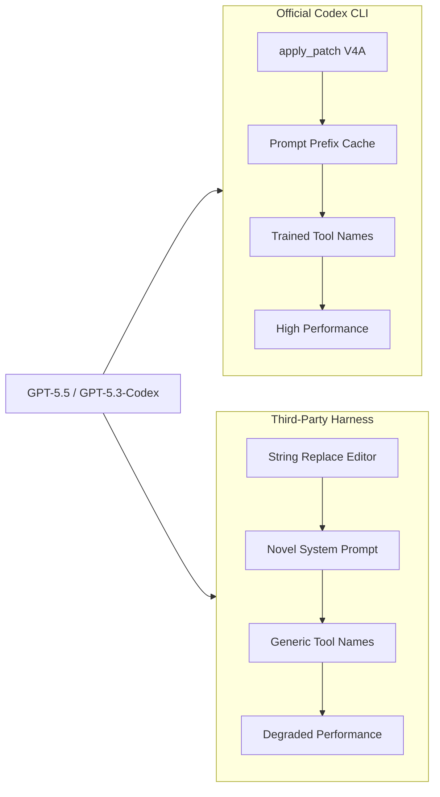
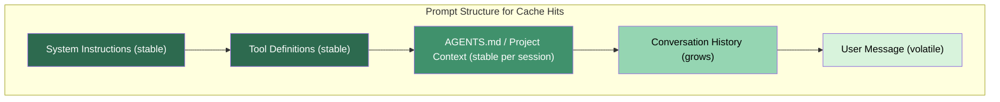
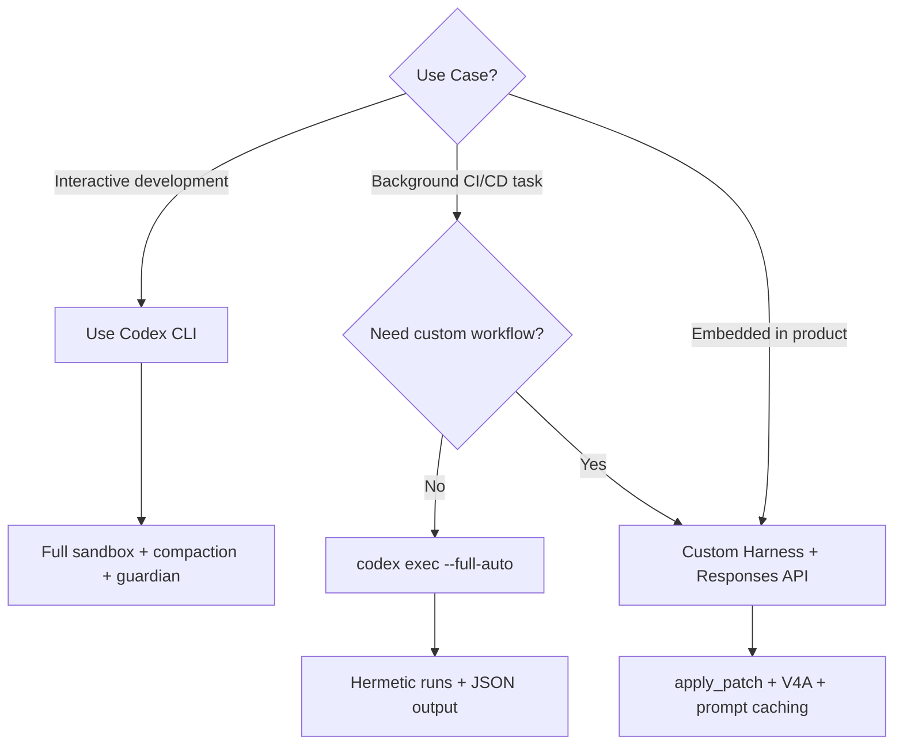

# Codex Models in Third-Party Harnesses: apply_patch, V4A Diffs, and Building a Portable Coding Agent


---

GPT-5.5 and its Codex-tuned siblings are trained on a specific harness: the official Codex CLI loop, its `apply_patch` tool, and a carefully ordered system prompt [^1]. Run these models inside that harness and they perform at the top of coding benchmarks. Drop them into a generic Chat Completions wrapper with a string-replacement editor and performance craters — sometimes by double-digit percentages [^2].

This article explains why the harness matters so much, how third-party tools like Warp and OpenCode solved the integration problem, and how to build your own minimal harness that gets close to official CLI performance using the Responses API and the V4A diff format.

---

## Why the Harness Is the Product

The central insight of 2026's coding agent landscape is that **frontier models are post-trained on their harnesses** [^3]. GPT-5.3-Codex was fine-tuned with the `apply_patch` tool, specific tool names like `rg` (not `grep`), and a prompt structure that places durable context — system instructions, tool definitions, sandbox configuration — in a stable prefix to maximise prompt cache hits [^1][^4].

When you move the model to a different harness, three things break:

1. **Tool mismatch** — the model emits V4A diffs but your harness expects string replacements.
2. **Prompt cache miss** — your system prompt layout differs, so every request pays full input-token cost.
3. **Behavioural drift** — without the preamble and personality tuning from the Codex prompting guide, the model stalls, loops, or over-explains [^5].



The solution is straightforward: replicate the critical harness surfaces. Three integrations have done this publicly, and their approaches are instructive.

---

## Case Study 1: Warp's Codex Integration

Warp shipped GPT-5.1-Codex and GPT-5.1-Codex-Max in December 2025, making it one of the first third-party terminals to run Codex models [^5]. Their engineering blog documents two changes that unlocked performance.

### Implementing apply_patch

Warp built a full V4A diff parser and applicator, touching both the agent harness and the Warp client [^5]. The result was "more reliable and higher-fidelity file edits, particularly when making larger refactors that span multiple files" compared to their previous string-replacement approach [^5].

During implementation, the Warp team discovered an edge case: the Codex CLI's own V4A parser did not correctly handle more than one `change_context` operation in a single patch [^5]. They reported the bug upstream — a reminder that even the official harness has rough edges.

### Tool Name Alignment

Warp renamed internal tools to match Codex training data. For example, `grep` became `ripgrep`, aligning with the Codex prompting guide's recommendation to use semantically correct tool names [^5][^1]. They also removed instructional preamble prompts that caused the model to stall or loop — the model's post-training already encodes the desired behaviour, and redundant instructions interfere with it [^5].

### Results

Warp reported a 3–5% performance improvement over standard GPT equivalents across agentic coding tasks after these changes [^5].

---

## Case Study 2: OpenCode's apply_patch Adapter

OpenCode (112K+ GitHub stars by April 2026) took a different approach [^6]. As an open-source Claude Code alternative built on the Vercel AI SDK, its native editing tools use string replacement. But when users pointed it at GPT-5.x models, performance dropped noticeably.

The fix was to **add an `apply_patch` tool specifically for GPT/Codex models** while keeping the standard edit tools for Claude and other providers [^3]. The harness detects the active model family and presents the appropriate tool set. This dual-tool approach avoids forcing non-Codex models through a diff format they were not trained on.

---

## Case Study 3: Building Your Own Minimal Harness

If you are embedding Codex models in a custom application — a code review bot, a migration script, or an internal developer tool — the Responses API plus `apply_patch` gets you 80% of the way to official CLI performance with minimal code.

### Step 1: Use the Built-in apply_patch Tool

The Responses API offers `apply_patch` as a first-class tool type [^7]. No custom schema needed:

```python
from openai import OpenAI

client = OpenAI()

response = client.responses.create(
    model="gpt-5.5",
    input=[
        {
            "role": "user",
            "content": "Refactor the logging module to use structured JSON output"
        }
    ],
    tools=[{"type": "apply_patch"}],
)
```

Each `apply_patch_call` in the response contains an `operation` object with `type` (`create`, `update`, or `delete`), `path`, and `diff` [^7].

### Step 2: Implement the Patch Applicator

The V4A format uses contextual anchors rather than line numbers, making it resilient to minor file changes between the model's read and the patch application [^7]. Reference implementations exist in the OpenAI Agents SDK for both Python and TypeScript [^7]:

- **Python**: [`openai-agents-python/src/agents/apply_diff.py`](https://github.com/openai/openai-agents-python/blob/main/src/agents/apply_diff.py)
- **TypeScript**: [`openai-agents-js/packages/agents-core/src/utils/applyDiff.ts`](https://github.com/openai/openai-agents-js/blob/main/packages/agents-core/src/utils/applyDiff.ts)

A minimal Python implementation:

```python
from agents import apply_diff  # from openai-agents-python

for item in response.output:
    if item.type == "apply_patch_call":
        op = item.operation
        if op.type == "create":
            content = apply_diff(diff=op.diff, source="", create=True)
            Path(op.path).write_text(content)
        elif op.type == "update":
            source = Path(op.path).read_text()
            content = apply_diff(diff=op.diff, source=source)
            Path(op.path).write_text(content)
        elif op.type == "delete":
            Path(op.path).unlink()
```

### Step 3: Feed Back Results

The model improves with feedback. Return `apply_patch_call_output` items indicating success or failure [^7]:

```python
feedback = {
    "type": "apply_patch_call_output",
    "call_id": item.call_id,
    "status": "completed",  # or "failed"
    "output": ""  # error message if failed
}
```

### Step 4: Adopt the Starter System Prompt

The Codex prompting guide provides a battle-tested system prompt [^1]. The critical sections for third-party harnesses are:

- **Tool preference hierarchy**: instruct the model to prefer `apply_patch` over shell commands for file edits.
- **Parallelisation directive**: use `multi_tool_use.parallel` for independent file reads and searches.
- **Autonomy framing**: "You are autonomous senior engineer" — this primes the model to complete tasks end-to-end rather than stopping at analysis [^1].

Keep the system prompt stable across requests to maximise prompt caching. Cache hits reduce input token costs by up to 90% and time-to-first-token latency by up to 80% [^4].

---

## The V4A Diff Format in Detail

The V4A format begins with `*** Begin Patch` and ends with `*** End Patch`. Each file operation is prefixed with a path and operation type [^1][^7]:

```
*** Begin Patch
--- a/src/logger.ts
+++ b/src/logger.ts
@@@ context_line_anchor @@@
- old_line_to_remove
+ new_line_to_add
  unchanged_context_line
*** End Patch
```

Key characteristics:

| Property | V4A | String Replacement |
|----------|-----|-------------------|
| Anchor type | Contextual lines | Exact string match |
| Multi-file | Single patch block | Separate calls per file |
| Renames | Supported natively | Shell command required |
| Deletions | `delete_file` operation | Shell command required |
| Model training | GPT-5.x post-trained | General LLM training |

The Codex prompting guide emphasises: "We strongly recommend using our exact `apply_patch` implementation as the model has been trained to excel at this diff format" [^1].

---

## Prompt Caching Across Harnesses

The single highest-impact optimisation for any harness — official or third party — is prompt caching [^4]. The rules are simple:

1. **Place durable content first**: system instructions, tool definitions, AGENTS.md content.
2. **Keep the prefix identical** across requests: identical byte-for-byte, including whitespace.
3. **Move volatile content to the end**: user messages, conversation history, dynamic context.

Cache hits require a minimum prefix of 1,024 tokens, with incremental matching in 128-token chunks [^4]. In practice, a well-structured harness achieves cache hits on 60–80% of requests during multi-turn sessions, cutting costs substantially.



---

## What You Lose Outside the Official CLI

Even with `apply_patch` and a tuned system prompt, third-party harnesses lack several official CLI features:

- **Seatbelt sandbox** — the Codex CLI's macOS and Linux sandboxing restricts file and network access per session [^8]. Third-party harnesses must implement their own isolation.
- **Server-side compaction** — the proprietary `POST /v1/responses/compact` endpoint returns encrypted compaction items that preserve the model's latent understanding [^9]. Third-party harnesses fall back to local summarisation, which loses internal state markers.
- **Guardian auto-review** — the automatic review agent that gates risky operations before execution [^10]. Harness builders need to implement their own approval workflows.
- **Permission profiles** — round-trip permission persistence across TUI sessions, MCP state, and shell escalation [^11].

These are meaningful gaps for production use cases, but for targeted automation — code review bots, migration scripts, batch refactoring — the `apply_patch` + Responses API combination is sufficient.

---

## Decision Framework: Official CLI vs Custom Harness



| Criterion | Official CLI | `codex exec` | Custom Harness |
|-----------|-------------|--------------|----------------|
| Sandbox isolation | Seatbelt | Seatbelt | BYO |
| Server-side compaction | Yes | Yes | No |
| apply_patch | Built-in | Built-in | Must implement |
| Prompt caching | Automatic | Automatic | Must structure |
| Custom approval flow | Guardian | `--full-auto` | Full control |
| Embedding in apps | No | Shell invocation | Native API |

---

## Getting Started Checklist

1. **Choose your API surface**: Responses API with `{"type": "apply_patch"}` for new projects. The Chat Completions path is deprecated for Codex models [^12].
2. **Copy the reference V4A parser**: use the Python or TypeScript Agents SDK implementation as your starting point [^7].
3. **Adopt the starter system prompt**: copy the Codex prompting guide's recommended prompt verbatim, then customise the personality and domain-specific sections [^1].
4. **Align tool names**: name your file-search tool `rg` or `ripgrep`, your directory listing `list_dir`, and your file reader `read_file` to match the model's training [^1][^5].
5. **Structure for caching**: stable prefix, volatile suffix, and monitor cache hit rates via the `usage.prompt_tokens_details.cached_tokens` field in API responses [^4].
6. **Add feedback loops**: return `apply_patch_call_output` items with status and error messages to improve multi-turn accuracy [^7].

---

## Citations

[^1]: OpenAI, "Codex Prompting Guide," OpenAI Cookbook, 2026. [https://developers.openai.com/cookbook/examples/gpt-5/codex_prompting_guide](https://developers.openai.com/cookbook/examples/gpt-5/codex_prompting_guide)

[^2]: blog.can.ac, "I Improved 15 LLMs at Coding in One Afternoon. Only the Harness Changed," February 2026. [https://blog.can.ac/2026/02/12/the-harness-problem/](https://blog.can.ac/2026/02/12/the-harness-problem/)

[^3]: HumanLayer, "Skill Issue: Harness Engineering for Coding Agents," 2026. [https://www.humanlayer.dev/blog/skill-issue-harness-engineering-for-coding-agents](https://www.humanlayer.dev/blog/skill-issue-harness-engineering-for-coding-agents)

[^4]: OpenAI, "Prompt Caching," OpenAI API Documentation, 2026. [https://developers.openai.com/api/docs/guides/prompt-caching](https://developers.openai.com/api/docs/guides/prompt-caching)

[^5]: Warp, "Codex Models Now Available in Warp," Warp Blog, December 2025. [https://www.warp.dev/blog/codex-models-in-warp-apply-patch-and-prompting-changes](https://www.warp.dev/blog/codex-models-in-warp-apply-patch-and-prompting-changes)

[^6]: OpenCode GitHub Repository, 2026. [https://github.com/anomalyco/opencode](https://github.com/anomalyco/opencode)

[^7]: OpenAI, "Apply Patch Tool," OpenAI API Documentation, 2026. [https://developers.openai.com/api/docs/guides/tools-apply-patch](https://developers.openai.com/api/docs/guides/tools-apply-patch)

[^8]: OpenAI, "Codex CLI Features," OpenAI Developer Documentation, 2026. [https://developers.openai.com/codex/cli/features](https://developers.openai.com/codex/cli/features)

[^9]: Justin3go, "Shedding Heavy Memories: Context Compaction in Codex, Claude Code, and OpenCode," April 2026. [https://justin3go.com/en/posts/2026/04/09-context-compaction-in-codex-claude-code-and-opencode](https://justin3go.com/en/posts/2026/04/09-context-compaction-in-codex-claude-code-and-opencode)

[^10]: OpenAI, "Codex Changelog," OpenAI Developer Documentation, 2026. [https://developers.openai.com/codex/changelog](https://developers.openai.com/codex/changelog)

[^11]: OpenAI, "Codex CLI v0.125.0 Release Notes," GitHub, April 2026. [https://github.com/openai/codex/releases](https://github.com/openai/codex/releases)

[^12]: OpenAI, "Codex Models," OpenAI Developer Documentation, 2026. [https://developers.openai.com/codex/models](https://developers.openai.com/codex/models)
