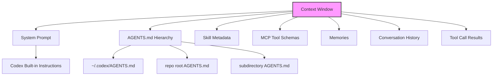
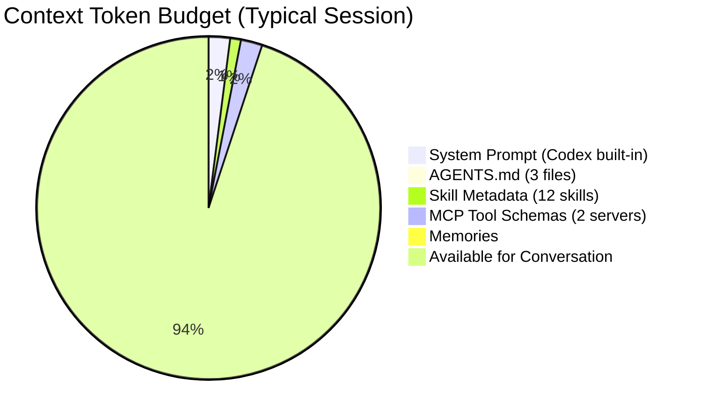
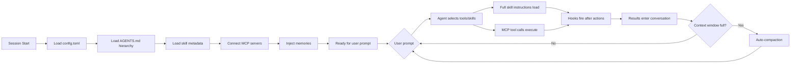

# Context Engineering for Codex CLI: A Practical Guide to Curating What Your Agent Sees


---

Prompt engineering asks *how you phrase a request*. Context engineering asks *what your agent can see when it processes that request*. As coding agents mature — Codex CLI is now used by more than three million developers weekly[^1] — the latter question matters far more than the former. A well-structured context window turns a mediocre model into a reliable teammate; a noisy one turns a frontier model into an expensive random-text generator.

This article maps the emerging discipline of context engineering[^2] onto the five customisation layers Codex CLI exposes: **AGENTS.md**, **skills**, **MCP servers**, **config.toml**, and **memories**. It distils practices from Martin Fowler's harness-engineering framework[^3], Anthropic's context-engineering guide[^4], Addy Osmani's 2026 coding workflow[^5], and OpenAI's own Codex Prompting Guide[^6] into concrete, Codex-specific patterns.

## Why Context Engineering, Not Prompt Engineering?

Prompt engineering treats the context window as a given and optimises the words inside it. Context engineering actively curates the entire information environment the model operates in — instructions, retrieved documents, tool definitions, conversation history, and memory[^7]. For an agentic loop that may make hundreds of tool calls in a single turn[^8], the distinction is critical: the agent's *own actions* continuously reshape what is in context.



Anthropic frames the challenge as finding "the smallest set of high-signal tokens that maximise the likelihood of some desired outcome"[^4]. For Codex CLI, that translates to a layered architecture where each layer loads at a different time and carries a different cost.

## The Five Context Layers in Codex CLI

OpenAI's customisation documentation describes these layers as "complementary, not competing"[^9]. Understanding *when* each layer loads — and how much of your context budget it consumes — is the foundation of effective context engineering.

### Layer 1: AGENTS.md — Always-On Guidance

AGENTS.md files load before the agent starts work and persist for the entire session[^9]. They are the cheapest, most reliable context injection point.

```
~/.codex/AGENTS.md              ← personal defaults (global)
repo-root/AGENTS.md             ← team conventions (repo-scoped)
repo-root/src/api/AGENTS.md     ← module-specific rules (directory-scoped)
```

Files closer to the working directory take precedence[^10]. A well-structured hierarchy avoids repetition:

```markdown
<!-- repo-root/AGENTS.md -->
## Build & Test
- Run `pnpm test` for unit tests, `pnpm e2e` for integration
- All tests must pass before committing

## Conventions
- TypeScript strict mode, no `any`
- Use named exports, no default exports
- British English in user-facing strings
```

```markdown
<!-- repo-root/src/api/AGENTS.md -->
## API Module
- Controllers in `controllers/`, services in `services/`
- Every endpoint needs an OpenAPI annotation
- Use `zod` for request validation, not manual checks
```

**Budget tip:** Keep each AGENTS.md under 800 tokens. If you find yourself writing pages, extract the detail into a skill instead.

### Layer 2: Skills — Progressive Disclosure

Skills are the context-engineering workhorse because they use *progressive disclosure*[^11]. Codex loads only metadata (name, description, path) at session start — roughly 2% of the context window or 8,000 characters across all installed skills[^11]. Full SKILL.md instructions load only when the agent decides to use a particular skill.

```
~/.agents/skills/                     ← personal skills
.agents/skills/                       ← repo-scoped skills
```

A typical skill directory:

```
.agents/skills/api-endpoint/
├── SKILL.md
├── template.ts
└── openapi-snippet.yaml
```

```markdown
<!-- SKILL.md -->
---
name: create-api-endpoint
description: >
  Scaffold a new REST API endpoint with controller, service, Zod schema,
  and OpenAPI annotation. Triggers on: "new endpoint", "add route", "API scaffold"
---

## Steps
1. Read `src/api/controllers/` for naming conventions
2. Create controller using `template.ts` as base
3. Create matching service in `services/`
4. Add Zod validation schema
5. Add OpenAPI annotation with `@ApiOperation`
6. Register route in `src/api/routes.ts`
7. Generate test stub in `__tests__/`
```

**Key insight:** Front-load trigger words in the description[^11]. When many skills are installed, Codex may truncate descriptions to fit the budget — the first 40 words matter most.

### Layer 3: MCP Servers — External Tool Access

MCP servers expose tools, resources, and prompt templates from external systems[^12]. Each server's tool definitions consume context tokens, so every registered server has a cost.

```toml
# ~/.codex/config.toml
[mcp_servers.jira]
command = "npx"
args = ["-y", "@anthropic/jira-mcp"]
env = { JIRA_URL = "https://myteam.atlassian.net" }

[mcp_servers.sentry]
url = "https://mcp.sentry.dev/sse"
```

**Context cost reality:** A single MCP server can inject 20–50 tool definitions into the system prompt. Three servers can add 5,000–15,000 tokens before the user says a word[^13]. This is the "MCP schema bloat" problem.

Mitigations:

- **Register only what you use.** If a server exposes 34 tools but you need 5, consider filtering at the server level or using a purpose-built wrapper.
- **Use project-scoped config.** Put MCP servers in `.codex/config.toml` only in repositories that need them, not in your global config.
- **Prefer skills for simple workflows.** If an MCP server just provides instructions (no live API calls), a skill is cheaper in context tokens.

### Layer 4: config.toml — Behavioural Controls

Configuration files set model selection, approval modes, reasoning effort, and sandbox behaviour[^14]. These don't consume visible context tokens but shape the agent's operating envelope:

```toml
# ~/.codex/config.toml
model = "gpt-5.5"
approval_mode = "unless-allow-listed"
reasoning_effort = "medium"

[sandbox]
permissions = [
  "disk_read_write:./src",
  "disk_read_write:./tests",
  "disk_read:./docs",
  "deny_read:./.env*",
  "deny_read:./secrets/"
]
```

**The reasoning-effort lever** is an underappreciated context-engineering tool. At `medium`, the model balances speed and intelligence for interactive coding. At `high` or `xhigh`, it engages deeper chain-of-thought for complex debugging — but consumes more reasoning tokens[^6]. The TUI shortcuts `Alt+,` (lower) and `Alt+.` (raise) let you adjust mid-session[^15].

### Layer 5: Memories — Cross-Session Continuity

Memories carry stable preferences, recurring workflows, tech stacks, and known pitfalls across sessions[^16]. They load automatically and are managed via the `/memories` command.

Memories fill the gap between *instructions* (what to do) and *experience* (what has been tried before). They are most effective for:

- Project-specific patterns the agent has learnt ("this repo's CI uses pnpm, not npm")
- Failure modes encountered in previous sessions
- Team member preferences and coding style

**Caution:** Memories are additive. Over time, they can accumulate stale or contradictory entries. Periodically review with `/memories` and prune entries that no longer apply.

## The Context Budget: A Worked Example

Understanding token costs is essential for context engineering. Here is a representative budget for a GPT-5.5 session with a 400K Codex context window[^17]:



The fixed overhead is roughly 24,000 tokens — about 6% of the window. This looks comfortable, but in a long session with many tool call results, the conversation history fills up fast. Codex's auto-compaction then kicks in, summarising older turns to reclaim space[^18]. The key insight: **what you put in the fixed layers competes with tool call results in the working conversation**.

## Guides and Sensors: The Harness-Engineering Model

Martin Fowler's harness-engineering framework[^3] classifies context-engineering interventions as *guides* (feedforward controls that prevent bad output) and *sensors* (feedback controls that detect and correct it). Mapping this to Codex CLI:

| Category | Codex CLI Mechanism | Type |
|----------|-------------------|------|
| AGENTS.md conventions | Guide | Feedforward |
| Skill instructions | Guide | Feedforward |
| MCP tool definitions | Guide | Feedforward |
| Linter hooks | Sensor | Computational feedback |
| Test execution | Sensor | Computational feedback |
| `/review` code review | Sensor | Inferential feedback |
| Guardian auto-review | Sensor | Inferential feedback |

The most robust harnesses combine both. An AGENTS.md file says "always run `pnpm lint` before committing" (guide), and a hook fires `pnpm lint` after every `apply_patch` to catch violations (sensor)[^19]:

```toml
# .codex/config.toml
[[hooks]]
event = "after_apply_patch"
command = "pnpm lint --fix"
timeout_ms = 30000
```

## Six Practical Patterns

### 1. Start Small, Grow from Failure

The best AGENTS.md files were not written all at once — they grew from observed failure modes[^10]. Begin with build commands and test instructions. Each time the agent makes a mistake that better instructions would have prevented, add a line.

### 2. The 40% Rule

Keep active context utilisation below 40% of the window[^5]. This leaves headroom for tool call results, multi-file edits, and compaction overhead. If you're consistently hitting compaction, reduce your fixed context (fewer MCP servers, shorter AGENTS.md) rather than fighting the compactor.

### 3. Isolate Concerns with Subagents

When a task requires deep context from two unrelated domains (e.g., database schema *and* frontend styling), delegate to subagents. Each subagent gets its own context window, avoiding cross-contamination[^20]:

```toml
# .codex/agents/db-migrator.toml
model = "gpt-5.5"
instructions = """
You are a database migration specialist. Use Atlas for migrations.
Never modify frontend code.
"""

[sandbox]
permissions = [
  "disk_read_write:./migrations",
  "disk_read:./src/models"
]
```

### 4. Cache-Aware Prompt Structure

Codex CLI's agent loop keeps the prompt prefix identical between iterations to maximise prompt cache hits[^18]. This means: **do not modify AGENTS.md or config.toml mid-session** — it invalidates the cache and forces a full recompute. Make structural changes between sessions, not during them.

### 5. Just-in-Time Retrieval via Skills

Rather than loading all documentation into AGENTS.md, create skills that retrieve context on demand. A skill for "migration guide" only loads its full instructions when the agent decides it needs migration guidance — keeping the baseline context lean[^4].

### 6. Computational Sensors First

Prefer deterministic feedback (linters, type checkers, tests) over inferential feedback (AI-powered review). Computational sensors are faster, cheaper, and more reliable[^3]. Configure hooks to run them automatically:

```toml
# .codex/config.toml
[[hooks]]
event = "after_apply_patch"
command = "npx tsc --noEmit"
timeout_ms = 60000

[[hooks]]
event = "before_commit"
command = "pnpm test --run"
timeout_ms = 120000
```

## A Layered Context Configuration Walkthrough

Here is a complete, minimal context-engineering setup for a TypeScript monorepo:

```
my-project/
├── AGENTS.md                          # Team conventions, build commands
├── .codex/
│   ├── config.toml                    # Model, sandbox, hooks, MCP servers
│   └── agents/
│       └── reviewer.toml             # Subagent for code review
├── .agents/
│   └── skills/
│       ├── create-endpoint/
│       │   └── SKILL.md
│       └── migration/
│           └── SKILL.md
├── packages/
│   ├── api/
│   │   └── AGENTS.md                 # API-specific conventions
│   └── web/
│       └── AGENTS.md                 # Frontend-specific conventions
```

The flow through the context layers:



## Common Anti-Patterns

**The kitchen-sink AGENTS.md.** A 3,000-token AGENTS.md that covers every edge case. The agent drowns in instructions and ignores the important ones. Split into per-directory files and extract detail into skills.

**MCP server hoarding.** Registering six MCP servers "just in case." Each adds thousands of tool-definition tokens. Register only what the current project needs.

**Ignoring compaction.** Assuming the 400K window is infinite. Long sessions with many file reads trigger compaction, which can discard important earlier context. Use `/compact` proactively before critical decision points[^18].

**Mid-session config changes.** Editing AGENTS.md or config.toml during a session breaks prompt cache alignment, potentially doubling token costs for subsequent turns[^18].

## Measuring Context Quality

Context engineering is iterative. Track these signals:

- **Prompt cache hit rate**: Higher is better. Check with `codex exec --json` which now reports cache metrics[^15].
- **Compaction frequency**: If compaction fires every 10 turns, your fixed context is too large.
- **First-attempt success rate**: If the agent frequently needs correction, your guides (AGENTS.md, skills) are missing key information.
- **Tool call efficiency**: If the agent reads the same files repeatedly, add relevant paths to AGENTS.md's file map section.

## Conclusion

Context engineering for Codex CLI is not about writing the perfect prompt — it is about designing the information architecture that surrounds every prompt. The discipline maps directly onto Codex's five customisation layers: AGENTS.md for always-on guidance, skills for progressive disclosure, MCP for external tool access, config.toml for behavioural controls, and memories for cross-session continuity.

The emerging consensus from Fowler, Osmani, Anthropic, and OpenAI converges on three principles: start small and grow from observed failures, treat context as a finite resource to be budgeted, and prefer deterministic feedback loops over inferential ones. Apply these principles to your Codex CLI setup, and you will spend less time correcting the agent and more time shipping code.

---

## Citations

[^1]: [OpenAI, "Codex for (almost) everything," openai.com, April 2026](https://openai.com/index/codex-for-almost-everything/)
[^2]: [LangChain, "The Rise of Context Engineering," blog.langchain.com, 2026](https://blog.langchain.com/the-rise-of-context-engineering/)
[^3]: [Martin Fowler, "Harness Engineering for Coding Agent Users," martinfowler.com, 2026](https://martinfowler.com/articles/harness-engineering.html)
[^4]: [Anthropic, "Effective Context Engineering for AI Agents," anthropic.com, 2026](https://www.anthropic.com/engineering/effective-context-engineering-for-ai-agents)
[^5]: [Addy Osmani, "My LLM Coding Workflow Going into 2026," addyosmani.com, 2026](https://addyosmani.com/blog/ai-coding-workflow/)
[^6]: [OpenAI, "Codex Prompting Guide," OpenAI Cookbook, 2026](https://developers.openai.com/cookbook/examples/gpt-5/codex_prompting_guide)
[^7]: [Elastic, "Context Engineering vs. Prompt Engineering," elastic.co, 2026](https://www.elastic.co/search-labs/blog/context-engineering-vs-prompt-engineering)
[^8]: [OpenAI, "Unrolling the Codex Agent Loop," openai.com, January 2026](https://openai.com/index/unrolling-the-codex-agent-loop/)
[^9]: [OpenAI, "Customization — Codex," developers.openai.com, 2026](https://developers.openai.com/codex/concepts/customization)
[^10]: [OpenAI, "Custom Instructions with AGENTS.md," developers.openai.com, 2026](https://developers.openai.com/codex/guides/agents-md)
[^11]: [OpenAI, "Agent Skills — Codex," developers.openai.com, 2026](https://developers.openai.com/codex/skills)
[^12]: [OpenAI, "Model Context Protocol — Codex," developers.openai.com, 2026](https://developers.openai.com/codex/mcp)
[^13]: [Martin Fowler, "Context Engineering for Coding Agents," martinfowler.com, 2026](https://martinfowler.com/articles/exploring-gen-ai/context-engineering-coding-agents.html)
[^14]: [OpenAI, "Configuration Reference — Codex," developers.openai.com, 2026](https://developers.openai.com/codex/config-reference)
[^15]: [OpenAI, "Codex CLI v0.125.0 Release Notes," github.com/openai/codex, April 2026](https://github.com/openai/codex/releases)
[^16]: [OpenAI, "Memories — Codex," developers.openai.com, 2026](https://developers.openai.com/codex/memories)
[^17]: [OpenAI, "Models — Codex," developers.openai.com, 2026](https://developers.openai.com/codex/models)
[^18]: [OpenAI, "Prompt Caching 201," OpenAI Cookbook, 2026](https://developers.openai.com/cookbook/examples/prompt_caching_201)
[^19]: [OpenAI, "Best Practices — Codex," developers.openai.com, 2026](https://developers.openai.com/codex/learn/best-practices)
[^20]: [OpenAI, "Advanced Configuration — Codex," developers.openai.com, 2026](https://developers.openai.com/codex/config-advanced)
