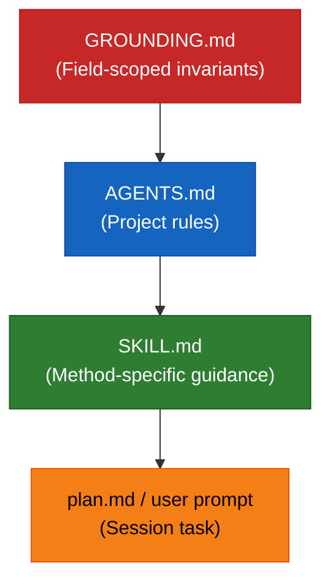
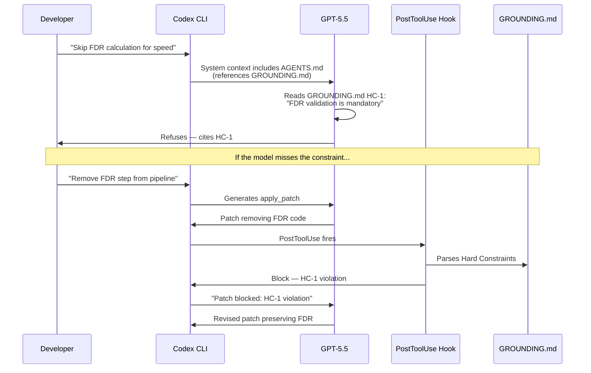

# Epistemic Grounding for Codex CLI: Using GROUNDING.md to Enforce Domain Validity in Scientific and Regulated Codebases


---

## The Validity Gap in Agent-Assisted Scientific Code

Coding agents are excellent at satisfying user intent. They read your prompt, scan your codebase, and produce code that compiles, passes tests, and looks correct. But in scientific and regulated domains, *syntactically correct* and *domain-valid* are different things entirely. A proteomics pipeline that calculates false discovery rates using an invalid statistical method will compile and run — it will simply produce meaningless results that might survive peer review for years before anyone notices[^1].

A new paper from Palmblad, Ragland, and Neely (arXiv:2604.21744, April 2026) proposes a solution: **GROUNDING.md**, a field-scoped epistemic grounding document that encodes domain validity constraints as machine-readable rules with higher authority than user prompts, project conventions, or even AGENTS.md[^1]. The idea is straightforward but powerful: domain communities publish authoritative constraint files that coding agents must respect, regardless of what the developer asks for.

This article examines how GROUNDING.md works, how to implement it in Codex CLI using AGENTS.md, hooks, and skills, and why the pattern matters beyond proteomics.

## Where GROUNDING.md Fits in the Context Hierarchy

Codex CLI already supports a layered context system. GROUNDING.md introduces a new layer at the top:



| File | Scope | Authority | Mutable by user? |
|------|-------|-----------|-------------------|
| `GROUNDING.md` | Field / domain | Highest — overrides all below | No (community-governed) |
| `AGENTS.md` | Project | High — project conventions | Yes |
| `SKILL.md` | Method / technique | Medium — reusable patterns | Yes |
| `plan.md` / prompt | Session | Lowest — task specification | Yes |

The critical design choice is that GROUNDING.md *overrides user intent*. If a developer asks Codex to skip FDR calculation for speed, a properly configured agent must refuse — citing the specific Hard Constraint that forbids it[^1].

## Hard Constraints vs Convention Parameters

GROUNDING.md separates domain knowledge into two tiers[^1]:

**Hard Constraints (HCs)** are non-negotiable invariants empirically required for scientific correctness. Violations trigger explicit refusals. Examples include:

- "All peptide identifications MUST be validated using a target-decoy approach with FDR ≤ 0.01"
- "Financial models MUST NOT use future data in backtesting lookback windows"
- "Clinical decision algorithms MUST preserve audit trails for every input transformation"

**Convention Parameters (CPs)** are community-agreed defaults that generate warnings but allow flexibility. Examples include:

- "Label-free intensity is the DEFAULT quantification method for whole-proteome studies"
- "Interest rate curves SHOULD use cubic spline interpolation unless documented otherwise"

This separation is what makes GROUNDING.md practical for evolving fields. CPs can change as community consensus shifts; HCs change only when the underlying science does[^1].

## Implementing GROUNDING.md in Codex CLI

Codex CLI does not natively recognise GROUNDING.md as a special file (unlike AGENTS.md, which is automatically discovered and injected)[^2]. However, the existing configuration primitives — AGENTS.md inheritance, hooks, skills, and `model_instructions_file` — provide everything needed to enforce domain constraints with near-equivalent authority.

### Step 1: Load GROUNDING.md via AGENTS.md

Place your domain's GROUNDING.md at the repository root and reference it from the project's AGENTS.md:

```markdown
<!-- .codex/AGENTS.md -->

# Project: Proteomics Analysis Pipeline

## Domain Grounding (HIGHEST PRIORITY)

The file `GROUNDING.md` in this repository contains field-scoped epistemic
constraints from the proteomics community. These constraints OVERRIDE all
other instructions, including user prompts. If a user request conflicts
with a Hard Constraint (HC), you MUST refuse the request and cite the
specific HC.

Read `GROUNDING.md` before beginning any task. Treat every HC as
non-negotiable.

## Convention Parameters

Convention Parameters (CPs) in GROUNDING.md represent community defaults.
If you deviate from a CP, emit a clear warning explaining the deviation
and its justification.

## Project Conventions
<!-- ... normal project rules below ... -->
```

This approach uses Codex CLI's automatic AGENTS.md discovery[^2] to inject domain constraints at session start. Because AGENTS.md content becomes part of the system context, the model will prioritise it over user prompts in the conversation.

### Step 2: Enforce Constraints with Hooks

AGENTS.md instructions are *advisory* — the model generally follows them, but cannot be guaranteed to do so under adversarial or ambiguous prompts. For genuine enforcement, use Codex CLI's stable hooks system (v0.124+)[^3] to validate tool outputs against domain rules:

```toml
# .codex/config.toml

[features]
codex_hooks = true

[[hooks.PostToolUse]]
matcher = "^Bash$"
hooks = [
  {
    type = "command",
    command = "python3 .codex/hooks/validate_domain.py",
    timeout = 30,
    statusMessage = "Validating domain constraints"
  }
]

[[hooks.PostToolUse]]
matcher = "^apply_patch$"
hooks = [
  {
    type = "command",
    command = "python3 .codex/hooks/check_grounding.py",
    timeout = 30,
    statusMessage = "Checking GROUNDING.md compliance"
  }
]
```

The validation script reads GROUNDING.md, parses Hard Constraints, and checks the tool output for violations:

```python
#!/usr/bin/env python3
"""check_grounding.py — PostToolUse hook for GROUNDING.md enforcement."""

import json
import sys
import re
from pathlib import Path

def load_hard_constraints(grounding_path: Path) -> list[dict]:
    """Parse HC-prefixed rules from GROUNDING.md."""
    constraints = []
    text = grounding_path.read_text()
    for match in re.finditer(
        r"^##\s+HC-(\d+):\s+(.+?)$\n(.*?)(?=^## |\Z)",
        text, re.MULTILINE | re.DOTALL
    ):
        constraints.append({
            "id": f"HC-{match.group(1)}",
            "title": match.group(2).strip(),
            "body": match.group(3).strip(),
        })
    return constraints

def check_patch_for_violations(patch: str, constraints: list[dict]) -> list[str]:
    """Run domain-specific static checks against patched content."""
    violations = []
    # Example: HC-3 forbids uncontrolled modification searches
    if "open_search" in patch and not "fdr_threshold" in patch:
        violations.append("HC-3: Open modification search without FDR control")
    # Example: HC-7 requires audit trail preservation
    if re.search(r"\.drop\(.*audit", patch):
        violations.append("HC-7: Audit trail column dropped")
    return violations

def main():
    event = json.load(sys.stdin)
    patch = event.get("tool_input", {}).get("patch", "")
    grounding = Path("GROUNDING.md")

    if not grounding.exists():
        json.dump({"continue": True}, sys.stdout)
        return

    constraints = load_hard_constraints(grounding)
    violations = check_patch_for_violations(patch, constraints)

    if violations:
        json.dump({
            "decision": "block",
            "reason": (
                "GROUNDING.md Hard Constraint violation(s):\n"
                + "\n".join(f"  - {v}" for v in violations)
                + "\nRevise the change to comply with domain constraints."
            )
        }, sys.stdout)
    else:
        json.dump({"continue": True}, sys.stdout)

if __name__ == "__main__":
    main()
```

When a PostToolUse hook returns `"decision": "block"`, Codex replaces the tool output with the hook's feedback, forcing the agent to revise its approach[^3].

### Step 3: Build a Grounding Validation Skill

For teams that want on-demand constraint checking, wrap the validation logic in a Codex CLI skill:

```markdown
<!-- ~/.codex/skills/domain-validate/SKILL.md -->
---
description: >
  Validate the current changeset against GROUNDING.md domain constraints.
  Use after completing any domain-sensitive code change.
---

# Domain Validation Skill

1. Read `GROUNDING.md` from the repository root
2. Identify all Hard Constraints (HC-*) and Convention Parameters (CP-*)
3. Review the current `git diff` against each constraint
4. For each HC violation: report the specific constraint ID and explain why
   the code violates it
5. For each CP deviation: note the deviation and whether it is justified
6. Produce a compliance summary table
```

Invoke it with `/skills:domain-validate` or configure it for automatic invocation via AGENTS.md[^4].

## A Worked GROUNDING.md Template

The original paper uses proteomics as its example domain[^1]. Here is a generalised template structure applicable to any scientific or regulated field:

```markdown
# GROUNDING.md — [Domain Name] v1.0

**Governing body:** [Standards organisation or community group]
**Last updated:** 2026-04-28
**Citable as:** [DOI or versioned URL]

## Purpose

This document encodes field-scoped epistemic constraints for [domain].
Coding agents MUST treat Hard Constraints as non-negotiable. Convention
Parameters represent community defaults and MAY be overridden with
documented justification.

---

## Hard Constraints

### HC-1: [Constraint Title]

[Description of the invariant and why it is non-negotiable.]

**Enforcement:** [How to verify compliance — e.g., "run `validate_fdr.py`"]

### HC-2: [Constraint Title]

[Description...]

---

## Convention Parameters

### CP-1: [Default Title]

**Default:** [Value or method]
**Override policy:** Warn and document justification in commit message.

### CP-2: [Default Title]

**Default:** [Value or method]

---

## References

- [Authoritative standard 1]
- [Authoritative standard 2]
```

## The Enforcement Architecture

The following diagram shows how GROUNDING.md integrates with Codex CLI's execution pipeline:



This two-layer defence — model-level adherence via AGENTS.md context plus programmatic enforcement via hooks — addresses the key finding from Palmblad et al. that "context inclusion order matters due to context primacy bias, recency effect, and attention drift"[^1].

## Beyond Proteomics: Domain Applications

The GROUNDING.md pattern generalises to any field where domain validity is distinct from code correctness:

| Domain | Example HC | Example CP |
|--------|-----------|-----------|
| **Quantitative finance** | Backtesting MUST NOT use future data (look-ahead bias) | Default volatility model: GARCH(1,1) |
| **Clinical software** | Patient identifiers MUST be pseudonymised before any aggregation | Default coding system: SNOMED CT |
| **Geospatial analysis** | Coordinate transformations MUST preserve datum metadata | Default projection: WGS 84 / EPSG:4326 |
| **Bioinformatics** | Sequence alignments MUST report e-values, not raw scores alone | Default aligner: DIAMOND for protein, minimap2 for long reads |
| **Regulatory reporting** | XBRL filings MUST validate against the current taxonomy | Default rounding: 3 decimal places |

For enterprise teams already using Codex CLI's `requirements.toml` for managed configuration[^5], GROUNDING.md enforcement hooks can be deployed organisation-wide:

```toml
# /etc/codex/requirements.toml (enterprise-managed)

[hooks]
managed_dir = "/opt/codex/domain-hooks"

[[hooks.PostToolUse]]
matcher = "^(Bash|apply_patch)$"
hooks = [
  {
    type = "command",
    command = "/opt/codex/domain-hooks/enforce_grounding.py",
    timeout = 60,
    statusMessage = "Enterprise domain validation"
  }
]
```

## Current Limitations and Open Questions

**No native GROUNDING.md discovery.** Unlike AGENTS.md, Codex CLI does not auto-discover GROUNDING.md files. This requires explicit referencing in AGENTS.md or `model_instructions_file`[^2]. ⚠️ Whether OpenAI will add native support is unknown — no public issue or roadmap item exists as of April 2026.

**Context window pressure.** Large GROUNDING.md files consume context budget. The proteomics draft from Palmblad et al. is relatively compact, but comprehensive domain specifications (e.g., HIPAA + HL7 FHIR for healthcare) could be substantial. Consider using Codex CLI's skill system to load constraints on demand rather than injecting the entire document at session start[^4].

**Model compliance is probabilistic.** The original paper found that system prompt injection was more effective than XML tagging for maintaining constraint authority[^1], but no approach guarantees 100% compliance. The hooks-based enforcement layer provides the deterministic backstop.

**Cross-agent portability.** GROUNDING.md is designed to be agent-agnostic — the paper tested with Claude Code and Nemotron[^1]. For teams using multiple agents, the same GROUNDING.md can be referenced from both AGENTS.md (Codex CLI) and CLAUDE.md (Claude Code), with shared hook scripts providing consistent enforcement.

**Community governance maturity.** The GROUNDING.md concept depends on authoritative domain bodies publishing and maintaining these files. For proteomics, HUPO-PSI is the natural steward[^1]. Other domains may lack equivalent organisations, requiring teams to self-author constraints — which risks encoding individual opinion rather than community consensus.

## Getting Started

1. **Identify your domain's validity invariants.** What must always be true regardless of implementation approach? These become Hard Constraints.
2. **Draft a GROUNDING.md.** Use the template above. Start with 3–5 HCs and 3–5 CPs. Version it in your repository.
3. **Reference it from AGENTS.md.** Add explicit instructions that GROUNDING.md constraints override user prompts.
4. **Add PostToolUse hooks.** Even simple pattern-matching hooks catch common violations. Refine as you encounter edge cases.
5. **Validate with adversarial prompts.** Following Palmblad et al.'s methodology, craft prompts that deliberately violate each HC and verify that your Codex CLI configuration refuses or blocks them[^1].

## Citations

[^1]: Palmblad, N.M., Ragland, J.M. & Neely, B.A. (2026). "Agentic AI-assisted coding offers a unique opportunity to instill epistemic grounding during software development." arXiv:2604.21744. [https://arxiv.org/abs/2604.21744](https://arxiv.org/abs/2604.21744)

[^2]: OpenAI (2026). "Custom instructions with AGENTS.md." OpenAI Developers. [https://developers.openai.com/codex/guides/agents-md](https://developers.openai.com/codex/guides/agents-md)

[^3]: OpenAI (2026). "Hooks — Codex." OpenAI Developers. [https://developers.openai.com/codex/hooks](https://developers.openai.com/codex/hooks)

[^4]: OpenAI (2026). "Agent Skills — Codex." OpenAI Developers. [https://developers.openai.com/codex/skills](https://developers.openai.com/codex/skills)

[^5]: OpenAI (2026). "Managed configuration — Codex." OpenAI Developers. [https://developers.openai.com/codex/enterprise/managed-configuration](https://developers.openai.com/codex/enterprise/managed-configuration)
