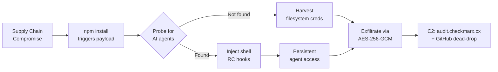
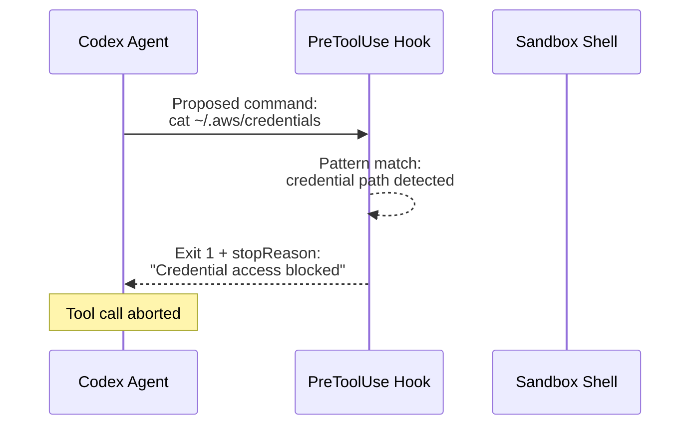
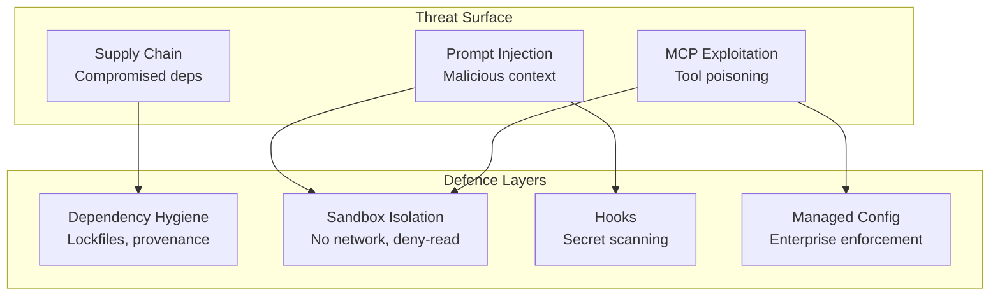

# Malware Now Hunts AI Coding Tools: The Bitwarden Supply Chain Attack and Defending Your Codex CLI Installation


---

On 22 April 2026, a poisoned release of the Bitwarden CLI hit npm for ninety-three minutes. Inside its 10 MB obfuscated payload sat a module called *Butlerian Jihad* whose sole purpose was to detect, fingerprint, and harvest credentials from AI coding agents — Codex CLI, Claude Code, Gemini CLI, Kiro, Aider, and OpenCode[^1][^2]. The attack represents a new threat category: malware that treats your coding agent not merely as another application to loot, but as an *authenticated oracle* worth interrogating directly.

This article dissects the attack, explains why coding agents are uniquely valuable targets, and walks through the concrete Codex CLI defences — deny-read policies, sandbox hardening, hooks, and operational hygiene — that limit blast radius even when a supply-chain compromise lands on your machine.

## Why Attackers Now Target Coding Agents

Traditional credential-harvesting malware sweeps well-known paths: `~/.ssh/id_rsa`, `~/.aws/credentials`, `~/.npmrc`. That still happened in the Bitwarden payload — seven parallel collector modules enumerated filesystem hotspots, environment variables, cloud vaults, shell history, and CI/CD runner secrets[^2]. What made this attack distinctive was the eighth module.

*Butlerian Jihad* probed for six coding agents by invoking each with a trivial prompt: *"Hey! Just making sure you're here. If you are can you respond with Hello and nothing else?"*[^1]. A successful response confirmed an authenticated session, after which the malware injected persistence hooks into `~/.bashrc` and `~/.zshrc` to maintain access across reboots[^2].

The logic is straightforward: a running Codex CLI session holds an active OpenAI API credential, has filesystem access to the project (and potentially secrets within it), and can execute shell commands. From an attacker's perspective, a coding agent is a *privilege amplifier* — one that can be asked, in natural language, to do things the malware itself cannot.



## Anatomy of the Bitwarden Attack

### Timeline

The malicious `@bitwarden/cli@2026.4.0` was published at 17:57 ET on 22 April 2026 and pulled at 19:30 ET — a ninety-three-minute window[^1][^3]. The root cause was a compromised GitHub Action in Bitwarden's CI/CD pipeline, part of the broader *Shai-Hulud: The Third Coming* campaign attributed to TeamPCP[^2].

### Payload structure

The package's `package.json` redirected execution through a `preinstall` hook to `bwsetup.js`, which downloaded the Bun 1.3.13 runtime and launched `bw1.js` — a 43,436-entry string table obfuscated with `javascript-obfuscator` and a secondary scrambled-alphabet cipher[^2].

### Anti-analysis controls

The payload self-terminated on Russian-locale systems, non-CI/CD environments, failed daemonisation attempts, and when a lock file at `$TMPDIR/tmp.987654321.lock` already existed[^2]. Signal handlers were replaced with no-ops to resist termination.

### Exfiltration

Stolen data was JSON-serialised, gzip-compressed, encrypted with AES-256-GCM (random IV), and the symmetric key was RSA-OAEP-wrapped with the attacker's embedded public key. Two exfiltration channels operated in parallel: HTTPS POST to `audit.checkmarx[.]cx` (94.154.172.43) and a GitHub dead-drop that created repositories on the victim's own account with Dune-themed names like `sardaukar-sandworm-001`[^2].

### Supply-chain worm

Upon discovering npm tokens with `package:write` permissions, the malware enumerated the victim's publishable packages, injected its stager, bumped the patch version, and republished — turning one compromised developer into a propagation vector[^2].

## What This Means for Codex CLI Users

The Bitwarden attack was not a Codex CLI vulnerability — it was a *host-level compromise* that happened to target coding agents as high-value assets. The distinction matters because the defence is layered: you protect against supply-chain attacks with dependency hygiene, and you limit blast radius with agent-level hardening.

### Indicators of compromise

If your machine installed `@bitwarden/cli@2026.4.0` between 17:57 and 19:30 ET on 22 April:

1. Check for the poisoned version: `npm ls @bitwarden/cli`[^2]
2. Search for unexpected GitHub repositories with description *"Shai-Hulud: The Third Coming"*[^2]
3. Inspect `~/.bashrc` and `~/.zshrc` for unfamiliar `heredoc` blocks[^1]
4. Look for the lock file `$TMPDIR/tmp.987654321.lock`[^2]
5. Verify file hashes — `bw1.js` SHA-256: `18f784b3...bef6e4cb`[^2]

## Hardening Codex CLI Against Credential Theft

Even if malware never reaches your machine, defence-in-depth demands that you configure Codex CLI to minimise what an attacker — or a prompt-injection attack — could extract from an active session.

### 1. Deny-read policies for sensitive files

Codex CLI's permission profiles support glob-based deny-read rules that prevent the agent from reading specified paths entirely[^4][^5]:

```toml
# ~/.codex/config.toml
[permissions.workspace.filesystem]
":project_roots" = {
  "." = "write",
  "**/*.env" = "none",
  "**/*.pem" = "none",
  "**/*.key" = "none",
  "**/credentials.json" = "none",
  "**/.npmrc" = "none",
  "**/auth-config.*" = "none",
  "**/.aws/**" = "none",
  "**/.ssh/**" = "none",
  "**/.kube/config" = "none"
}
```

The `"none"` value blocks both read and write access. This means that even if a prompt-injection attack instructs Codex to `cat ~/.ssh/id_rsa`, the sandbox will deny the operation before the shell executes[^5].

### 2. Disable network access by default

Codex CLI's sandbox blocks network access by default on macOS (via Seatbelt) and Linux (via `bwrap` + `seccomp`)[^6]. Keep it that way for normal development. If you need network access for specific tasks, grant it per-session rather than globally:

```bash
codex --sandbox-network-access "Fetch the OpenAPI spec from staging"
```

### 3. Reject login shells

Login shells source `~/.bashrc` and `~/.zshrc` — precisely where the Bitwarden malware planted its persistence hooks. Codex CLI can be hardened to disallow login shells[^5]:

```toml
# ~/.codex/config.toml
allow_login_shell = false
```

### 4. Use hooks for secret-pattern detection

Codex hooks run at defined points in the agent loop. A `PreToolUse` hook can inspect outbound shell commands for credential patterns and block them before execution[^7]:

```toml
# ~/.codex/config.toml
[[hooks]]
event = "PreToolUse"
tool = "bash"
command = ["python3", "/path/to/secret-scanner.py"]
```

A minimal scanner checks whether the proposed command attempts to read known secret paths or pipes credentials to external endpoints. If the script exits non-zero, Codex aborts the tool call[^7].



### 5. Managed configuration for teams

Enterprise deployments should enforce credential-protection policies centrally via `requirements.toml`, which takes precedence over user and project configuration[^8]:

```toml
# /etc/codex/requirements.toml (or MDM-delivered)
[permissions.workspace.filesystem]
":project_roots" = {
  "**/*.env" = "none",
  "**/*.pem" = "none",
  "**/.ssh/**" = "none",
  "**/.aws/**" = "none"
}

[[hooks]]
event = "PreToolUse"
tool = "bash"
command = ["python3", "/opt/codex-hooks/secret-scanner.py"]
```

This ensures that no individual developer can accidentally weaken credential protections[^8].

## Dependency Hygiene: The First Line of Defence

Agent-level hardening limits blast radius, but preventing the compromise from landing is better still. The Bitwarden attack exploited a `preinstall` hook — a well-known attack vector that npm has been fighting for years.

| Defence | Implementation |
|---------|---------------|
| Pin exact versions | Use lockfiles (`package-lock.json`) and review diffs on every update |
| Disable install scripts | `npm install --ignore-scripts` for non-essential CLIs |
| Require provenance | Verify npm provenance attestations where available[^2] |
| Monitor for anomalies | Tools like Socket, Snyk, and `npm audit` catch known-malicious packages |
| Isolate CLI tools | Install global CLIs in containers or separate user accounts |
| Audit shell RC files | Periodically diff `~/.bashrc` and `~/.zshrc` against known-good baselines |

## The Broader Pattern: Agents as Attack Surface

The Bitwarden incident is not isolated. In April 2026, OX Security disclosed a systemic MCP protocol vulnerability affecting 150 million downloads across 7,000 servers, enabling arbitrary command execution on any system running a vulnerable MCP implementation[^9]. Concurrently, research demonstrated that Cursor, VS Code, Windsurf, Claude Code, and Gemini CLI are all vulnerable to MCP-based prompt-injection attacks[^10]. A Stack Overflow survey from the same month found that 86% of CISOs do not enforce access policies for AI agents, and only 5% believe they could contain a compromised agent[^11].

The attack surface is expanding faster than defensive tooling. The combination of supply-chain compromises, MCP vulnerabilities, and prompt injection creates a threat model where the coding agent is simultaneously:

- A **credential store** (API keys, session tokens)
- A **tool executor** (shell, filesystem, network)
- An **injection target** (untrusted context in AGENTS.md, MCP tools, project files)



## Operational Checklist

For teams running Codex CLI in production or CI/CD, the following checklist addresses the specific threat patterns demonstrated by the Bitwarden attack:

1. **Audit shell RC files weekly** — diff against a checked-in baseline
2. **Rotate credentials immediately** if any supply-chain indicator of compromise is found
3. **Enforce deny-read policies** for all credential paths in `config.toml` or `requirements.toml`
4. **Keep `allow_login_shell = false`** to prevent RC-file-based persistence
5. **Deploy a PreToolUse hook** that blocks commands targeting credential paths
6. **Disable sandbox network access** except when explicitly required
7. **Pin CLI tool versions** and review lockfile diffs before merging
8. **Use `npm audit` or Socket** to catch known-malicious packages in CI
9. **Isolate `codex exec` in CI** to ephemeral containers with minimal credential exposure
10. **Review Codex CLI's memory store** — memories are scanned for secrets before being written to disc, but verify this regularly[^6]

## Looking Ahead

The Bitwarden attack confirms that AI coding tools have crossed a threshold: they are now valuable enough to warrant dedicated malware modules. The *Butlerian Jihad* module's approach — probing for agents by name and injecting shell-level persistence — is trivially replicable and will likely appear in future supply-chain campaigns. ⚠️

Codex CLI's layered security model — OS-level sandboxing, deny-read policies, hooks, and managed configuration — provides genuine defence-in-depth. But these defences only work if they are configured. The default sandbox blocks network access and restricts writes; extending that baseline with deny-read credential policies and PreToolUse hooks transforms Codex CLI from a potential credential oracle into a hardened development tool that resists exploitation even when the host is compromised.

## Citations

[^1]: State of Surveillance, "A Password Manager Got Hacked for 90 Minutes. The Malware Was Hunting for Your AI Coding Tools," April 2026. [https://stateofsurveillance.org/news/bitwarden-cli-supply-chain-attack-ai-coding-tools-checkmarx-2026/](https://stateofsurveillance.org/news/bitwarden-cli-supply-chain-attack-ai-coding-tools-checkmarx-2026/)

[^2]: Endor Labs, "Shai-Hulud: The Third Coming — Inside the Bitwarden CLI 2026.4.0 Supply Chain Attack," April 2026. [https://www.endorlabs.com/learn/shai-hulud-the-third-coming----inside-the-bitwarden-cli-2026-4-0-supply-chain-attack](https://www.endorlabs.com/learn/shai-hulud-the-third-coming----inside-the-bitwarden-cli-2026-4-0-supply-chain-attack)

[^3]: The Hacker News, "Bitwarden CLI Compromised in Ongoing Checkmarx Supply Chain Campaign," April 2026. [https://thehackernews.com/2026/04/bitwarden-cli-compromised-in-ongoing.html](https://thehackernews.com/2026/04/bitwarden-cli-compromised-in-ongoing.html)

[^4]: OpenAI, "Configuration Reference — Codex," April 2026. [https://developers.openai.com/codex/config-reference](https://developers.openai.com/codex/config-reference)

[^5]: OpenAI, "Agent Approvals & Security — Codex," April 2026. [https://developers.openai.com/codex/agent-approvals-security](https://developers.openai.com/codex/agent-approvals-security)

[^6]: OpenAI, "Security — Codex," April 2026. [https://developers.openai.com/codex/security](https://developers.openai.com/codex/security)

[^7]: OpenAI, "Hooks — Codex," April 2026. [https://developers.openai.com/codex/hooks](https://developers.openai.com/codex/hooks)

[^8]: OpenAI, "Managed Configuration — Codex," April 2026. [https://developers.openai.com/codex/enterprise/managed-configuration](https://developers.openai.com/codex/enterprise/managed-configuration)

[^9]: OX Security, "The Mother of All AI Supply Chains: Critical, Systemic Vulnerability at the Core of Anthropic's MCP," April 2026. [https://www.ox.security/blog/the-mother-of-all-ai-supply-chains-critical-systemic-vulnerability-at-the-core-of-the-mcp/](https://www.ox.security/blog/the-mother-of-all-ai-supply-chains-critical-systemic-vulnerability-at-the-core-of-the-mcp/)

[^10]: Botmonster, "AI Coding Agents Are Insider Threats: Prompt Injection, MCP Exploits, and Supply Chain Attacks," April 2026. [https://botmonster.com/posts/ai-coding-agent-insider-threat-prompt-injection-mcp-exploits/](https://botmonster.com/posts/ai-coding-agent-insider-threat-prompt-injection-mcp-exploits/)

[^11]: Kiteworks, "MCP 'By Design' Flaw: The AI Supply Chain Risk CISOs Can't Ignore," April 2026. [https://www.kiteworks.com/cybersecurity-risk-management/mcp-by-design-flaw-ai-supply-chain/](https://www.kiteworks.com/cybersecurity-risk-management/mcp-by-design-flaw-ai-supply-chain/)
