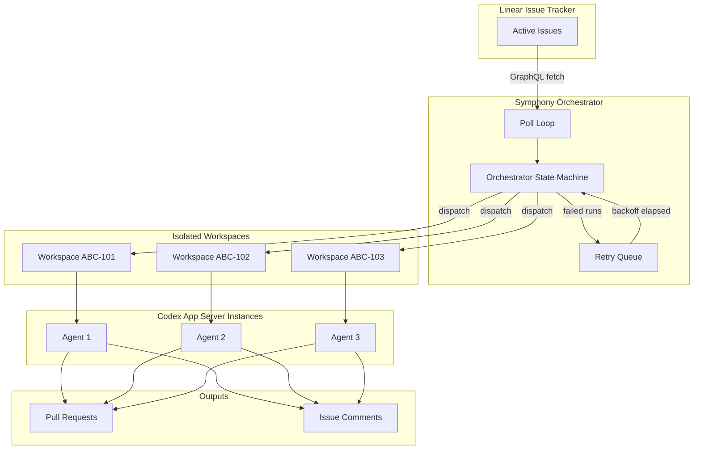
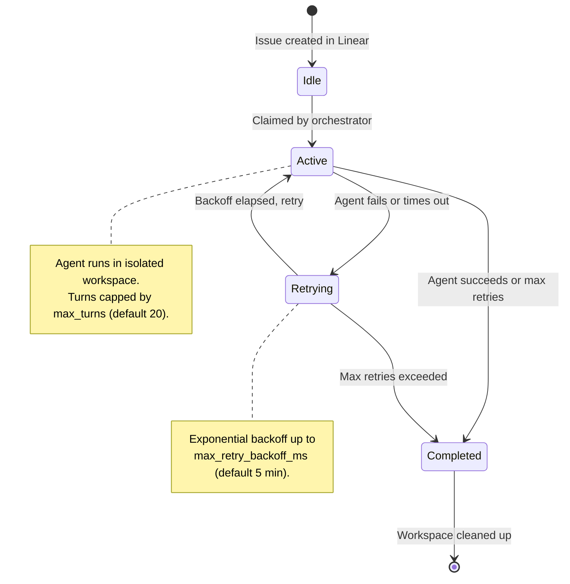

# OpenAI Symphony: Turning Linear Into a Control Plane for Autonomous Codex Agents


---

OpenAI today open-sourced **Symphony**, an orchestration specification that transforms a project-management board — currently Linear — into a fully autonomous control plane for Codex agents[^1]. Each open issue spawns a dedicated agent workspace; agents code, test, open pull requests, and retire — all without a human sitting in the loop. Some internal OpenAI teams reported a **500% increase in landed pull requests** during the first three weeks of use[^2].

This article unpacks Symphony's architecture, walks through its configuration surface, maps its lifecycle to the Codex primitives you already know, and offers practical guidance on adopting it for your own teams.

---

## Why Symphony Exists

Until now, Codex CLI workflows have been session-centric. Whether you run an interactive TUI session or script a one-shot `codex exec`, a human decides *when* work starts, *what* the agent works on, and *when* to stop. That model works brilliantly for pair programming and CI gates, but it does not scale when your backlog has fifty issues and you want agents working on all of them simultaneously.

Symphony decouples work from sessions[^1]. Instead of a developer launching Codex per task, an orchestrator daemon polls Linear, claims eligible issues, provisions isolated workspaces, and launches Codex App Server subprocesses. The developer's job shifts from *supervising agents* to *managing work* — triaging issues, reviewing pull requests, and refining the team's WORKFLOW.md policy[^3].

As Sanchit Vir Gogia of Greyhound Research put it: "It schedules, tracks, retries, reconciles, persists state, and governs flow… it resembles a lightweight operating system for software delivery."[^4]

---

## Architecture Overview

Symphony decomposes into six layers, each with a single responsibility[^5]:

| Layer | Component | Responsibility |
|-------|-----------|----------------|
| **Policy** | `WORKFLOW.md` | Prompt template, team rules, tracker config |
| **Configuration** | YAML parser | Typed getters, env-var expansion, validation |
| **Coordination** | Orchestrator | Poll loop, concurrency control, retry logic |
| **Execution** | Workspace Manager + Agent Runner | Per-issue isolation, subprocess lifecycle |
| **Integration** | Issue Tracker Client | Linear GraphQL adapter, normalisation |
| **Observability** | Status Surface + Logging | Structured logs, optional HTTP dashboard |



---

## The Issue Lifecycle

Every issue in Linear passes through a state machine managed by the orchestrator[^1]:



Crucially, Symphony **never writes to Linear directly**[^1]. The Codex agent uses a `linear_graphql` tool exposed by the orchestrator to update issue states, post comments, and create branches — keeping the tracker API token out of the agent's sandbox[^5].

---

## WORKFLOW.md — Policy as Code

The entire behaviour of a Symphony deployment is governed by a single `WORKFLOW.md` file committed to your repository[^1]. It combines YAML front matter for configuration with a Markdown body serving as the prompt template.

### Minimal Example


```yaml
---
tracker:
  kind: "linear"
  api_key: "$LINEAR_API_KEY"
  project_slug: "backend"
  active_states: ["Todo", "In Progress"]
  terminal_states: ["Done", "Cancelled"]

polling:
  interval_ms: 30000

workspace:
  root: "~/symphony-workspaces"
  hooks:
    after_create: |
      git clone --depth 1 "$REPO_URL" .
      npm ci

agent:
  max_concurrent_agents: 8
  max_turns: 25
  max_retry_backoff_ms: 300000
---

You are a senior engineer working on the {{issue.identifier}} issue.

**Title:** {{issue.title}}
**Description:** {{issue.description}}

Follow the project's AGENTS.md. Write tests before implementation.
Open a pull request when done. If tests fail, diagnose and fix.
```


### Key Configuration Parameters

| Key | Default | Purpose |
|-----|---------|---------|
| `polling.interval_ms` | 30,000 | How often to poll Linear for new work |
| `agent.max_concurrent_agents` | 10 | Global concurrency cap |
| `agent.max_turns` | 20 | Maximum coding-agent turns per session |
| `agent.max_retry_backoff_ms` | 300,000 | Ceiling for exponential retry backoff |
| `workspace.root` | System temp | Base directory for per-issue workspaces |
| `hooks.timeout_ms` | 60,000 | Timeout for workspace hook scripts |

Environment variables are resolved at runtime via `$VAR_NAME` syntax, keeping secrets out of version control[^1].

---

## How Symphony Connects to Codex

Symphony is built on top of the **Codex App Server** — the same JSON-RPC/Unix-socket backend that powers the Codex desktop app and IDE extensions[^6]. Each agent subprocess launches in app-server mode, receiving the rendered prompt and operating within its isolated workspace directory.

This means every Codex primitive you already use — AGENTS.md, skills, MCP servers, hooks, sandbox policies, permission profiles — works inside a Symphony-managed agent without modification[^1]. If your repository already has a robust AGENTS.md and `config.toml`, Symphony inherits that context automatically.

### What the Agent Runner Does

1. Creates or reuses a per-issue workspace directory
2. Runs `after_create` hook (typically: clone repo, install dependencies)
3. Runs `before_run` hook (e.g., `git pull --rebase`)
4. Renders the prompt template with issue data
5. Launches `codex` as an app-server subprocess with `cwd = workspace_path`
6. Streams turn events back to the orchestrator for metrics and status
7. On exit, runs `after_run` hook and classifies the result[^1]

---

## Candidate Selection and Concurrency

Not every open issue gets an agent immediately. The orchestrator applies a selection pipeline each poll tick[^1]:

1. **Fetch** all issues in `active_states` from Linear
2. **Filter out** issues already claimed, blocked by open dependencies, or in the completed set
3. **Sort** by priority (lower number = higher priority), then creation date
4. **Dispatch** up to the global concurrency limit
5. **Reconcile** running sessions — if an issue moves to a terminal state in Linear, the agent is stopped

Per-state concurrency limits allow fine-grained control:

```yaml
agent:
  max_concurrent_agents: 10
  max_concurrent_agents_by_state:
    "Todo": 3
    "In Progress": 7
```

This prevents the orchestrator from claiming more "Todo" issues than the team can review, whilst allowing "In Progress" work to saturate available capacity[^1].

---

## Failure Handling and Retry

Symphony classifies failures into three categories[^1]:

| Class | Examples | Recovery |
|-------|----------|----------|
| **Transient** | Network glitch, temporary rate limit | Automatic retry with exponential backoff |
| **Recoverable** | Agent timeout, workspace permission error | Cleanup + retry with backoff |
| **Terminal** | Authentication failure, malformed WORKFLOW.md | Halt service; operator intervention required |

On retry, the prompt is augmented with context from the previous failure: "Previous attempt failed with: …"[^1]. This gives the agent a chance to adjust its approach — a pattern familiar to anyone who has used scored improvement loops with `codex exec`.

### Idempotency Guarantees

- Workspace creation is idempotent — re-dispatching the same issue reuses the existing directory[^1]
- Run attempts include an `attempt` counter for replay safety
- On restart, the retry queue is rebuilt from workspace state and tracker queries; no persistent scheduler database is required[^1]

---

## Observability

Symphony emits structured logs (JSON or key-value) with timestamp, component, operation, `issue_id`, `session_id`, and message[^1]. The optional HTTP server (default port 9090) exposes:

| Endpoint | Purpose |
|----------|---------|
| `GET /` | Human-readable HTML dashboard |
| `GET /api/v1/status` | JSON snapshot of orchestrator state |
| `GET /api/v1/runs` | List of run attempts with token metrics |
| `GET /api/v1/issues` | Current candidates and eligibility |
| `POST /api/v1/dispatch` | Manual dispatch of a specific issue |

Token accounting — `input_tokens`, `output_tokens`, `total_tokens` — is tracked per session and aggregated across the service, integrating naturally with the cost-monitoring patterns described in earlier articles on cross-agent usage analytics[^1].

---

## Reference Implementations

OpenAI's reference implementation is written in **Elixir**, chosen for its concurrency primitives (OTP supervisors map cleanly to the orchestrator's retry and lifecycle needs)[^2]. However, to validate the specification's language-agnosticism, Codex itself generated conforming implementations in **TypeScript, Go, Rust, Java, and Python** from the same SPEC.md[^2].

The repository is at [github.com/openai/symphony](https://github.com/openai/symphony), licensed under Apache 2.0[^7]. OpenAI has stated that Symphony is a **reference implementation**, not a maintained product — teams are expected to fork, study, or rebuild it to suit their own toolchains[^2].

---

## Prerequisites: Harness Engineering First

Symphony is explicitly **not** a tool for greenfield projects without automated testing. The specification states that it assumes repositories with established "harness engineering practices" — agent-friendly structures, automated tests, and operational guardrails[^2].

In practical terms, before deploying Symphony you should have:

- **AGENTS.md** encoding your project conventions, test commands, and review policies
- **Automated test suites** that the agent can run after every change
- **CI/CD pipelines** that validate pull requests before merge
- **Permission profiles** configured in `config.toml` to constrain agent behaviour
- **PostToolUse hooks** for linting, type-checking, or security scanning

If your team has already invested in the context engineering patterns covered in this knowledge base — AGENTS.md, skills, hooks, sandbox policies — Symphony is the natural next step. If not, start there first.

---

## Security Considerations

Symphony introduces a broader trust surface than interactive Codex sessions. Key mitigations built into the specification[^1]:

- **Workspace isolation**: Each agent's subprocess launches with `cwd == workspace_path`, and paths are sanitised to `[A-Za-z0-9._-]` characters only
- **Token indirection**: The Linear API key never reaches agent subprocesses; agents use the `linear_graphql` tool, which executes queries on their behalf[^5]
- **Hook timeouts**: All workspace hooks enforce `timeout_ms` (default 60 seconds)
- **No direct tracker writes**: Symphony reads from Linear; agents write through the provided tool, maintaining an audit trail

⚠️ However, hook scripts run with the same privilege as the orchestrator process and are **not sandboxed**[^1]. Treat `WORKFLOW.md` with the same care as any CI/CD pipeline definition — it is executable policy.

---

## Practical Adoption Path

For teams considering Symphony, a phased rollout is advisable:

### Phase 1 — Single-Issue Pilot

Set `max_concurrent_agents: 1` and restrict `active_states` to a single label (e.g., `"Symphony Pilot"`). Observe agent behaviour, token spend, and PR quality on one issue at a time.

### Phase 2 — Limited Concurrency

Increase to 3–5 concurrent agents. Introduce per-state limits. Establish a review cadence for agent-generated PRs.

### Phase 3 — Team-Scale Deployment

Open the floodgates to your full backlog. Monitor the `/api/v1/status` dashboard for stalls, retry storms, and token budget consumption. Iterate on `WORKFLOW.md` prompts based on PR review feedback.

### Phase 4 — Multi-Repository

Use workspace hooks to clone different repositories based on issue labels or project slugs. Consider running separate Symphony instances per repository for isolation.

---

## What Symphony Is Not

It is worth being explicit about boundaries:

- **Not a replacement for Codex CLI interactive sessions** — pair programming, exploratory debugging, and design work still benefit from human-in-the-loop TUI sessions
- **Not a maintained product** — OpenAI treats it as a reference implementation[^2]
- **Not a guarantee of quality** — as Forrester's Biswajeet Mahapatra cautioned, organisations should measure "quality, delivery speed, developer experience, and business impact" rather than raw code volume[^4]
- **Not Linear-exclusive by design** — the spec abstracts the tracker interface, though only a Linear adapter ships today[^1]

---

## Conclusion

Symphony represents a significant shift in how teams interact with coding agents. Rather than supervising individual sessions, engineering leads manage a backlog; the orchestrator handles the rest. Built on the same Codex App Server and configuration primitives that power the CLI and desktop app, it rewards teams that have already invested in harness engineering — AGENTS.md, hooks, skills, sandbox policies — by letting those investments compound across dozens of concurrent agent runs.

The specification is open, the reference implementation is Apache-licensed, and the design explicitly invites teams to rebuild it for their own stacks. If your team has a mature Codex CLI setup and a growing issue backlog, Symphony is worth a serious look.

---

## Citations

[^1]: OpenAI, "Symphony Service Specification (SPEC.md)," GitHub, 28 April 2026. [https://github.com/openai/symphony/blob/main/SPEC.md](https://github.com/openai/symphony/blob/main/SPEC.md)

[^2]: OpenAI, "An open-source spec for Codex orchestration: Symphony," OpenAI Blog, 28 April 2026. [https://openai.com/index/open-source-codex-orchestration-symphony/](https://openai.com/index/open-source-codex-orchestration-symphony/)

[^3]: Help Net Security, "OpenAI releases Symphony to automate Codex work through Linear," 28 April 2026. [https://www.helpnetsecurity.com/2026/04/28/openai-symphony-codex-orchestration-linear/](https://www.helpnetsecurity.com/2026/04/28/openai-symphony-codex-orchestration-linear/)

[^4]: InfoWorld, "OpenAI's Symphony spec pushes coding agents from prompts to orchestration," 28 April 2026. [https://www.infoworld.com/article/4164173/openais-symphony-spec-pushes-coding-agents-from-prompts-to-orchestration.html](https://www.infoworld.com/article/4164173/openais-symphony-spec-pushes-coding-agents-from-prompts-to-orchestration.html)

[^5]: AllThings.How, "Symphony: OpenAI's open-source orchestrator that turns Linear into a Codex command center," 28 April 2026. [https://allthings.how/symphony-openais-open-source-orchestrator-that-turns-linear-into-a-codex-command-center/](https://allthings.how/symphony-openais-open-source-orchestrator-that-turns-linear-into-a-codex-command-center/)

[^6]: OpenAI, "Codex Changelog," OpenAI Developers, April 2026. [https://developers.openai.com/codex/changelog](https://developers.openai.com/codex/changelog)

[^7]: OpenAI, "openai/symphony," GitHub repository. [https://github.com/openai/symphony](https://github.com/openai/symphony)
