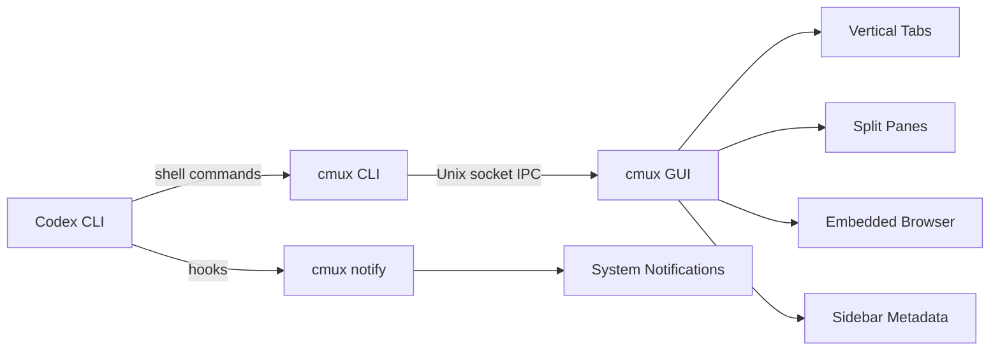
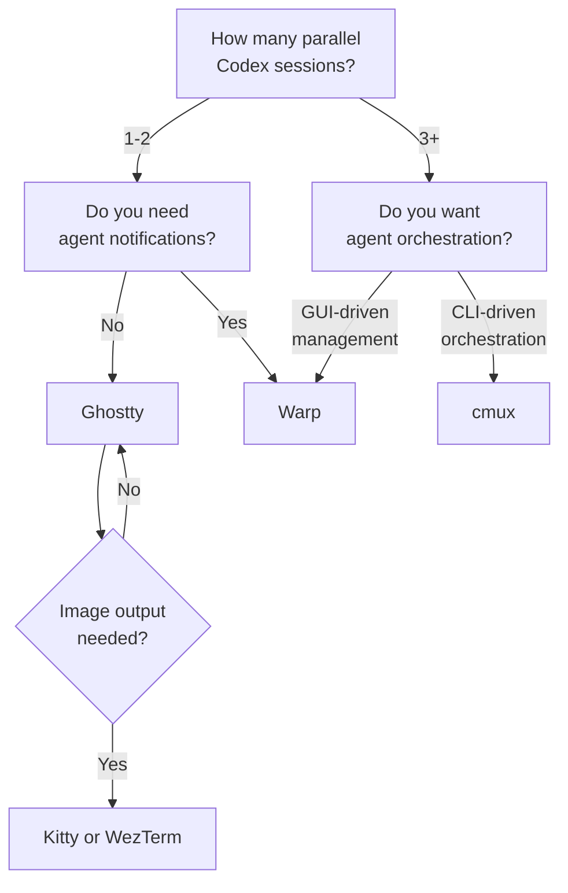

# Agent-Aware Terminals for Codex CLI: Choosing the Right Terminal Emulator in the AI Coding Era


Codex CLI runs in a terminal. That much is obvious. What is less obvious — and increasingly consequential — is that your choice of terminal emulator now materially affects your agent workflow. In 2026, the terminal landscape has bifurcated: traditional emulators optimise for rendering speed and standards compliance, while a new generation of **agent-aware terminals** adds first-class support for notifications, parallel agent orchestration, and session metadata[^1][^2]. This article maps the landscape, compares the options, and offers a decision framework for Codex CLI practitioners.

## Why Terminal Choice Matters for Agent Workflows

When you run a single Codex CLI session interactively, most terminals work fine. The pain surfaces when you scale:

- **Parallel agents** across git worktrees require separate panes with independent state
- **Long-running `codex exec` tasks** need notifications when they complete or stall
- **TUI reasoning controls** (`Alt+,` / `Alt+.`) require the terminal to pass Alt-key combinations correctly[^3]
- **Streaming output** from GPT-5.5 at high token rates demands efficient rendering to avoid visual stutter
- **Image inputs** (`codex -i screenshot.png`) and image generation output may require graphics protocol support

The terminal is no longer a passive viewport — it is an integration layer between you and your agents.

## The Five Contenders

### Ghostty: The Speed Baseline

Ghostty 1.3 renders text faster than any competitor on macOS — benchmarked at roughly four times the throughput of iTerm2 and Kitty during sustained output[^1]. For Codex CLI, this translates to stutter-free streaming when GPT-5.5 generates large refactors or when `codex exec --json` emits dense JSONL event streams.

**Strengths for Codex CLI:**

- Native platform integration on macOS and Linux
- Correct handling of Alt-key sequences, so `Alt+,` and `Alt+.` reasoning controls work out of the box
- Split panes and tabs without tmux
- GPU-accelerated rendering keeps up with Codex Spark's 1,000+ tokens per second[^4]

**Limitations:**

- No built-in agent awareness — no notification hooks, no session metadata sidebar
- No Windows support
- No built-in multiplexer orchestration API

```toml
# ~/.config/ghostty/config — recommended for Codex CLI
font-size = 14
window-padding-x = 8
window-padding-y = 8
macos-option-as-alt = true  # critical for Alt+,/Alt+. reasoning controls
```

### Warp: The Agentic Development Environment

Warp 2.0 rebranded from "terminal" to "Agentic Development Environment" and provides the most comprehensive first-party Codex CLI integration of any terminal[^5][^6]. Warp treats each agent session as a first-class entity with metadata, notifications, and lifecycle management.

**Key Codex CLI features:**

- **Vertical tabs** with per-tab git branch, worktree path, and PR status[^6]
- **Tab Configs** — reusable `.toml` templates that define directory, startup commands, and layout. Create one per project and launch a fully configured Codex session with a single click[^7]
- **Unified notifications** — accent-coloured dots on panes with unread agent activity, plus system notifications when agents need input[^5]
- **Code review integration** — send inline comments from Warp's review tool directly to active Codex sessions[^5]
- **Rich context attachment** — attach files and code snippets from Warp to a running Codex session[^5]
- **Worktree-based Tab Configs** — create a new config from the `+` menu, select a repo, and Warp generates the worktree and saves the config for reuse[^7]

**Limitations:**

- macOS and Linux only (Windows in beta)
- Proprietary — the rendering engine is not open source
- Reported IME compatibility issues with CJK input methods[^1]
- Warp's own AI features (the Oz agent system) can overlap with Codex CLI, creating confusion about which agent is acting

```toml
# Example Warp Tab Config: codex-backend.toml
[tab]
title = "Backend Agent"
directory = "~/projects/backend"

[[tab.panes]]
command = "codex --model gpt-5.5"

[[tab.panes]]
command = "git log --oneline -10"
direction = "down"
```

### cmux: The Agent-First Terminal

cmux is purpose-built for running multiple AI coding agents in parallel[^2][^8]. Built on Ghostty's `libghostty` rendering engine, it combines GPU-accelerated terminal emulation with a Unix socket API that agents can call to control the UI programmatically.

**Architecture:**



**What sets it apart:**

- **CLI-driven orchestration** — agents can spawn new panes (`cmux new-split right`), send keystrokes to other panes (`cmux send --surface surface:7 "codex exec ..."`), and read screen output (`cmux read-screen`)[^8]
- **Sidebar metadata** — each tab displays git branch, linked PR status, working directory, listening ports, and the latest notification text[^2]
- **Visual attention signals** — when an agent is waiting for input, its pane gets a blue ring and the tab lights up in the sidebar[^2]
- **Embedded WebKit browser** — agents can open browser panes, take DOM snapshots, and interact with web pages without leaving the terminal[^8]
- **Claude-teams integration** — `cmux claude-teams` spawns Claude Code teammate mode with native splits and notifications[^2]

**For Codex CLI specifically**, you can wire Codex hooks into cmux's notification system:

```bash
# In config.toml — notify via cmux when a codex exec task completes
[hooks.post_tool_use]
command = "cmux notify --title 'Codex Complete' --body 'Task finished in ${CODEX_SESSION_ID}'"
```

**Limitations:**

- macOS only (a Windows port exists as a community fork)[^9]
- Open source but young — 15.5k GitHub stars but active development means breaking changes[^2]
- Sandbox conflict: Codex CLI's sandbox may block access to the cmux Unix socket at `/tmp/cmux.sock` unless `network_access` is enabled or the socket path is explicitly allowed[^8]

### Kitty: The Power User's Choice

Kitty has long been the go-to terminal for developers who want speed, configurability, and graphics protocol support. Its Kitty graphics protocol enables inline image display, which matters for Codex CLI's image generation output[^10].

**Strengths:**

- Kitty graphics protocol for inline image rendering
- Extensive keyboard shortcut customisation — remap Alt-key sequences freely
- Built-in multiplexer with layouts and sessions
- Cross-platform (macOS, Linux)

**Limitations:**

- No agent-specific features — no notification hooks, no session metadata
- Configuration is via `kitty.conf`, not TOML — a minor friction point for those already deep in Codex's TOML ecosystem
- Slower than Ghostty on sustained output benchmarks[^1]

### WezTerm: The Protocol Polyglot

WezTerm supports the broadest range of graphics protocols — Kitty, Sixel, and iTerm2 — making it the safest choice if your workflow produces visual output from multiple tools[^1]. It is written in Rust and configured via Lua, which appeals to developers who want programmatic terminal control.

**Strengths:**

- Supports every major graphics protocol
- Lua-based configuration enables scripting complex layouts
- Built-in multiplexer with domains and workspaces
- Cross-platform including Windows

**Limitations:**

- No agent-aware features
- Lua configuration has a steeper learning curve than TOML
- Rendering speed trails Ghostty and Alacritty

## Decision Framework



| Criterion | Ghostty | Warp | cmux | Kitty | WezTerm |
|-----------|---------|------|------|-------|---------|
| Rendering speed | ★★★★★ | ★★★★☆ | ★★★★★ | ★★★★☆ | ★★★☆☆ |
| Agent notifications | ✗ | ★★★★★ | ★★★★★ | ✗ | ✗ |
| Multi-agent orchestration | ✗ | ★★★★☆ | ★★★★★ | ✗ | ✗ |
| Alt-key passthrough | ★★★★★ | ★★★★☆ | ★★★★★ | ★★★★★ | ★★★★☆ |
| Graphics protocols | ✗ | ✗ | ✗ | ★★★★★ | ★★★★★ |
| Windows support | ✗ | Beta | ✗ | ✗ | ★★★★★ |
| Open source | ★★★★★ | ✗ | ★★★★★ | ★★★★★ | ★★★★★ |
| Codex CLI integration | Generic | First-class | Hook-based | Generic | Generic |

## Practical Recommendations

**Solo developer, single project:** Ghostty. Fast, correct, zero overhead. Set `macos-option-as-alt = true` and forget about it.

**Multi-project parallel agents:** Warp. The Tab Config system means you launch a fully configured Codex workspace — directory, model, worktree — with one click. The notification system prevents context-switching to check on idle agents.

**Agent-to-agent orchestration:** cmux. If your workflow involves a primary Codex agent spawning subagents, monitoring their output, and coordinating results, cmux's Unix socket API is the only terminal that supports this natively.

**Cross-platform teams with Windows developers:** WezTerm. It is the only option that works consistently across macOS, Linux, and Windows with graphics protocol support.

**Vim/Neovim users already on tmux:** Stay on tmux + Ghostty (or Kitty). The existing terminal-native stack article[^11] covers this integration thoroughly. Switching to an agent-aware terminal adds features but also adds a layer you may not need.

## The Alt-Key Trap

One configuration pitfall deserves special mention. Codex CLI v0.124 introduced `Alt+,` and `Alt+.` as TUI reasoning controls[^3]. On macOS, the Option key does not emit Alt by default — it produces special characters (e.g., `≤` and `≥`). If your reasoning controls produce Unicode characters instead of adjusting reasoning effort, check your terminal's Option-as-Alt setting:

| Terminal | Setting |
|----------|---------|
| Ghostty | `macos-option-as-alt = true` |
| Kitty | `macos_option_as_alt = yes` |
| iTerm2 | Profiles → Keys → Left/Right Option → Esc+ |
| Warp | Settings → Keyboard → Left Option key → Meta |
| WezTerm | `keys = { { key = "," , mods = "ALT", action = wezterm.action.SendKey { key = ",", mods = "ALT" } } }` |

## What Comes Next

The terminal emulator market is consolidating around agent awareness. Warp's "Agentic Development Environment" branding signals where the industry is headed. cmux demonstrates that even a young project can accumulate 15.5k GitHub stars by solving the multi-agent pain point[^2]. Traditional terminals like Ghostty and Kitty will likely add notification hooks and session metadata within the next two release cycles — or risk losing their developer audience to purpose-built alternatives.

For Codex CLI users, the practical advice is straightforward: if you run one agent, pick the fastest terminal. If you run many, pick one that knows they exist.

## Citations

[^1]: Termdock. "Ghostty vs Warp 2.0 vs WezTerm: Best Terminal for AI CLI in 2026." [https://www.termdock.com/en/blog/best-terminal-emulator-ai-cli-2026](https://www.termdock.com/en/blog/best-terminal-emulator-ai-cli-2026)

[^2]: cmux. "The terminal built for multitasking." [https://cmux.com/](https://cmux.com/)

[^3]: OpenAI. "Codex Changelog — v0.124.0." [https://developers.openai.com/codex/changelog](https://developers.openai.com/codex/changelog)

[^4]: OpenAI. "Introducing GPT-5.3-Codex-Spark." [https://openai.com/index/introducing-gpt-5-3-codex-spark/](https://openai.com/index/introducing-gpt-5-3-codex-spark/)

[^5]: Warp. "The best terminal for Codex." [https://www.warp.dev/agents/codex](https://www.warp.dev/agents/codex)

[^6]: Warp. "Universal Agent Support: level up any coding agent with Warp." [https://www.warp.dev/blog/universal-agent-support-level-up-coding-agent-warp](https://www.warp.dev/blog/universal-agent-support-level-up-coding-agent-warp)

[^7]: Warp. "Tab Configs." [https://docs.warp.dev/terminal/windows/tab-configs](https://docs.warp.dev/terminal/windows/tab-configs)

[^8]: Better Stack Community. "cmux: Native macOS Terminal for AI Coding Agents." [https://betterstack.com/community/guides/ai/cmux-terminal/](https://betterstack.com/community/guides/ai/cmux-terminal/)

[^9]: GitHub. "bse-ai/cmux-windows." [https://github.com/bse-ai/cmux-windows](https://github.com/bse-ai/cmux-windows)

[^10]: Kitty. "The Kitty Graphics Protocol." [https://sw.kovidgoyal.net/kitty/graphics-protocol/](https://sw.kovidgoyal.net/kitty/graphics-protocol/)

[^11]: Vaughan, D. "Terminal-Native Codex CLI Workflows: Neovim, tmux, and the Multiplexer-Driven Development Stack." Codex Blog, 27 April 2026.
