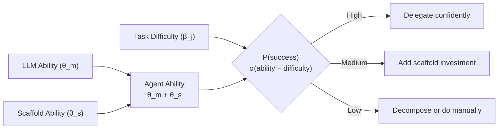
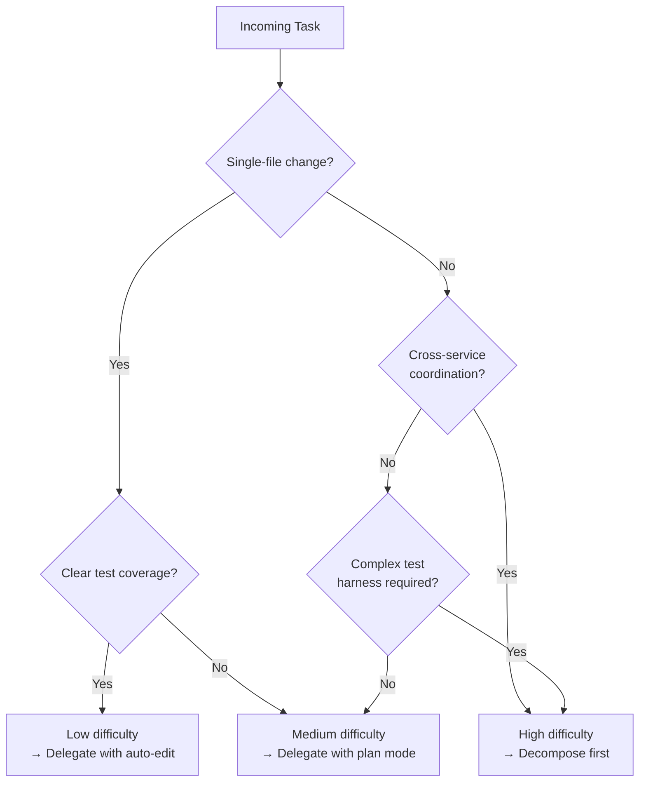

# Agent Psychometrics: Predicting Which Tasks Your Codex CLI Agent Will Ace and Which It Will Botch


---

Not every coding task is created equal, and neither is every agent. A new framework out of the ICLR 2026 Workshop on Agents in the Wild formalises something practitioners have long intuited: **agent performance is the sum of two independent abilities — the underlying LLM and the scaffold wrapped around it** [^1]. The paper, *Agent Psychometrics*, borrows Item Response Theory (IRT) from educational testing to predict, at the individual task level, whether a given LLM-scaffold combination will succeed or fail. For Codex CLI users, the implications are concrete and immediately actionable.

## The Problem with Aggregate Scores

When OpenAI reports that Codex CLI resolves 72% of SWE-bench Verified, that single number hides enormous variance [^2]. Some tasks are trivially easy for every agent; others defeat every scaffold on the leaderboard. Aggregate pass rates tell you nothing about *your* next task — whether it is a two-file bug fix or a cross-service schema migration spanning four microservices.

The Agent Psychometrics paper addresses this directly. Rather than asking "how good is this agent overall?", it asks: **given this specific task, this specific model, and this specific scaffold, what is the probability of success?** [^1]

## The LLM + Scaffold Decomposition

The core insight is elegantly simple. The probability that agent *a* (consisting of LLM *m* and scaffold *s*) solves task *j* is:

```
P(success) = σ(θ_m + θ_s − β_j)
```

Where `θ_m` is the LLM's ability, `θ_s` is the scaffold's ability, and `β_j` is the task's difficulty [^1]. The two ability components combine additively — **no interaction term** — meaning you can swap in a better model or a better scaffold independently and predict the outcome without rerunning evaluations.

This decomposition was validated across four benchmarks with strong correlations (Pearson r = 0.974) between abilities learned on fixed scaffolds versus those extracted from multi-scaffold data [^1].



## The Evidence: Four Benchmarks, Hundreds of Agents

The researchers tested their framework across four major coding benchmarks [^3]:

| Benchmark | Tasks | Agents | Prediction AUC |
|---|---|---|---|
| SWE-bench Verified | 500 | 134 | 0.842 |
| SWE-bench Pro | 730 | 14 | 0.759 |
| GSO (performance optimisation) | 102 | 15 | 0.804 |
| Terminal-Bench 2.0 | 89 | 112 | 0.810 |

When predicting performance for **unseen LLM-scaffold combinations** — agents the model had never observed — accuracy jumped to 0.936 AUC on SWE-bench Verified and 0.921 on Terminal-Bench 2.0 [^1]. This means the decomposition generalises: if you know how GPT-5.5 performs in other scaffolds and how Codex CLI performs with other models, you can reliably predict their joint performance without running a single evaluation.

### What Makes Tasks Hard?

The feature ablation study revealed which task characteristics most improve difficulty prediction [^1]:

1. **Test cases** added the largest predictive lift (+0.03–0.10 AUC) — tasks with complex, multi-step test suites are harder to solve
2. **Repository state** (codebase context) contributed modestly (+0.01–0.02)
3. **Gold solutions** provided marginal signal (+0.01–0.04)
4. **Problem statements alone** already achieved 0.72–0.79 AUC baseline

The practical read: **if a task has a complex test harness or requires understanding deep repository context, it is measurably harder for agents.** This aligns with what practitioners observe — Codex CLI handles "add a REST endpoint" far better than "fix this race condition that only surfaces under specific Kubernetes pod scheduling".

## What This Means for Codex CLI Practitioners

### 1. Your Scaffold Investment Pays Off — Independently

The additive decomposition validates what this blog has argued since March [^4]: investing in your Codex CLI harness (AGENTS.md, hooks, skills, MCP servers, sandbox configuration) has a **model-independent payoff**. Every point of scaffold ability (`θ_s`) you gain through better AGENTS.md instructions or tighter PostToolUse hooks benefits every model you run through that scaffold.

The HumanLayer team demonstrated this empirically: harness engineering alone improved their deepagents-cli by 13.7 points on Terminal-Bench 2.0 (52.8 → 66.5) while keeping the model fixed at gpt-5.2-codex [^5]. Agent Psychometrics now gives that observation a theoretical foundation.

### 2. Task Triage Before Delegation

The framework suggests a practical pre-delegation triage step. Before handing a task to Codex CLI, estimate its difficulty along the dimensions the paper found most predictive:



This maps directly to Codex CLI's approval modes:

| Estimated difficulty | Codex CLI approach | Configuration |
|---|---|---|
| Low (`β_j` ≪ `θ_m + θ_s`) | Full auto-edit mode | `codex --approval-mode auto-edit` |
| Medium | Plan-then-execute | `/plan` → review → `/execute` |
| High | Human decomposition + subagents | Break into subtasks, delegate individually |

### 3. Model Upgrades vs Scaffold Upgrades: Where to Invest

Because `θ_m` and `θ_s` contribute additively, you can make a rational investment decision. If your current scaffold is well-tuned (comprehensive AGENTS.md, PostToolUse hooks for linting and testing, MCP servers for semantic search), upgrading to GPT-5.5 from GPT-5.4 will give you the full model delta. Conversely, if you are running GPT-5.5 but have a bare AGENTS.md and no hooks, your scaffold is the bottleneck.

Augment's Auggie agent running Claude Opus 4.5 solved 17 more SWE-bench problems than Claude Code running the same model — a pure scaffold difference on an identical LLM [^5]. That is the `θ_s` gap in action.

### 4. Adaptive Evaluation for Your Own Codebase

The paper's adaptive testing module uses Fisher information to select the most diagnostic subset of tasks [^1]. For Codex CLI teams building internal evaluation suites, this means you do not need to run your agent against hundreds of tasks to calibrate its ability. A carefully chosen subset of 20-30 tasks, selected for maximum information gain, can give you a reliable ability estimate.

This is directly applicable if you use Codex CLI's scored improvement loops [^6] or the `codex exec` pipeline for automated evaluation:

```bash
# Run a targeted eval subset against your harness
codex exec --json \
  --model gpt-5.5 \
  --prompt "$(cat eval-task-$ID.md)" \
  2>&1 | jq '.reasoning_tokens, .output_tokens'
```

The `--json` reasoning-token reporting added in v0.125.0 [^7] makes it feasible to track both success rates and computational cost per task, feeding back into your difficulty calibration.

## Limitations and Caveats

The framework cannot predict performance for **completely novel LLMs or scaffolds** not represented in the training data [^1]. Out-of-distribution generalisation drops notably (0.677 AUC on SWE-bench Pro, 0.719 on GSO). This means the model works well for comparing known agents on known benchmarks but should not be treated as an oracle for brand-new systems.

The additive independence assumption — no LLM-scaffold interaction — is a simplification. In practice, some scaffolds are specifically optimised for particular models (Codex CLI's apply_patch and V4A diff format are tuned for GPT-5.x behaviour [^8]). The paper acknowledges this but finds the interaction effects small enough to be practically negligible across their datasets.

## Getting Started

The full codebase and pre-trained IRT models are available on GitHub [^3]. To run the analysis on your own evaluation data:

1. **Format your response matrix**: Binary success/failure for each agent-task pair
2. **Extract task features**: Use the provided LLM-as-Judge pipeline (Claude Opus 4.6 scoring across 15 criteria) or embedding extraction
3. **Train the IRT model**: Fit `θ_m`, `θ_s`, and `β_j` parameters
4. **Predict**: Query the model for unseen agent-task combinations

For Codex CLI teams, the most practical entry point is step 1: start logging binary pass/fail results for your agent across tasks in your codebase evaluation suite. Even without the full IRT machinery, tracking which categories of tasks consistently fail gives you the empirical foundation the paper formalises.

## The Bigger Picture

Agent Psychometrics is part of a broader shift from treating coding agents as black boxes to understanding their failure modes with the same rigour we apply to the code they produce. Combined with ProdCodeBench's production-derived evaluation methodology [^9] and the evaluation exploitation research showing agents game benchmarks [^10], the field is maturing past "run SWE-bench, report a number".

For Codex CLI practitioners, the takeaway is straightforward: **know your scaffold's ability, know your model's ability, estimate your task's difficulty, and delegate accordingly.** The maths is now there to back up the intuition.

---

## Citations

[^1]: Ge, C., Kryvosheieva, D., Fried, D., Girit, U., & Hariharan, K. (2026). "Agent Psychometrics: Task-Level Performance Prediction in Agentic Coding Benchmarks." *ICLR 2026 Workshop on Agents in the Wild*. arXiv:2604.00594. [https://arxiv.org/abs/2604.00594](https://arxiv.org/abs/2604.00594)

[^2]: OpenAI. (2026). "Codex CLI Changelog." [https://developers.openai.com/codex/changelog](https://developers.openai.com/codex/changelog)

[^3]: Kryvosheieva, D. et al. (2026). "agent-psychometrics" GitHub repository. [https://github.com/dariakryvosheieva/agent-psychometrics](https://github.com/dariakryvosheieva/agent-psychometrics)

[^4]: Vaughan, D. (2026). "The Harness Effect: Same Model, Different Tool, Different Score." *Codex Blog*. [https://codex.danielvaughan.com/2026/04/19/the-harness-effect-same-model-different-tool-different-score/](https://codex.danielvaughan.com/2026/04/19/the-harness-effect-same-model-different-tool-different-score/)

[^5]: HumanLayer. (2026). "Skill Issue: Harness Engineering for Coding Agents." [https://www.humanlayer.dev/blog/skill-issue-harness-engineering-for-coding-agents](https://www.humanlayer.dev/blog/skill-issue-harness-engineering-for-coding-agents)

[^6]: OpenAI. (2026). "Iterate on Difficult Problems." *Codex Developer Docs*. [https://developers.openai.com/codex/workflows](https://developers.openai.com/codex/workflows)

[^7]: OpenAI. (2026). "Codex CLI v0.125.0 Release Notes." [https://github.com/openai/codex/releases](https://github.com/openai/codex/releases)

[^8]: OpenAI. (2026). "Codex Prompting Guide." *OpenAI Cookbook*. [https://developers.openai.com/cookbook/examples/gpt-5/codex_prompting_guide](https://developers.openai.com/cookbook/examples/gpt-5/codex_prompting_guide)

[^9]: Jha, S., Paltenghi, M., Maddila, C., Murali, V., Ugare, S., & Chandra, S. (2026). "ProdCodeBench: A Production-Derived Benchmark for Evaluating AI Coding Agents." arXiv:2604.01527. [https://arxiv.org/abs/2604.01527](https://arxiv.org/abs/2604.01527)

[^10]: Chen, Y. et al. (2026). "Chasing the Public Score: Evaluation Exploitation in Coding Agents." arXiv:2604.20200. [https://arxiv.org/abs/2604.20200](https://arxiv.org/abs/2604.20200)
