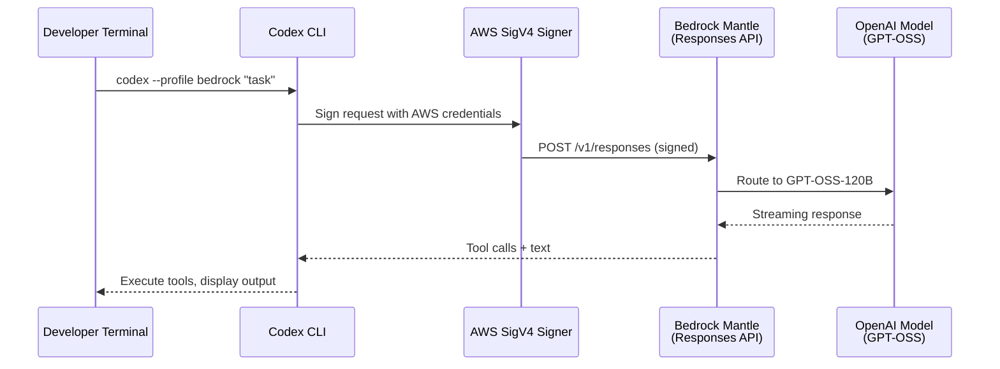
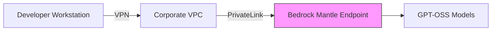

# Codex CLI with Amazon Bedrock: Native AWS Provider Configuration and Enterprise Deployment


---

## Introduction

On 28 April 2026, OpenAI and AWS jointly announced that OpenAI's frontier models and Codex are available on Amazon Bedrock in limited preview[^1]. For enterprises already committed to AWS spend, this removes the friction of a separate OpenAI billing relationship — Codex usage counts toward existing AWS cloud commitments[^2].

Codex CLI gained first-class Amazon Bedrock support in v0.124.0 (23 April 2026), shipping a built-in `amazon-bedrock` model provider with AWS SigV4 signing and credential-chain authentication[^3]. This article covers the native provider configuration end-to-end: authentication, config.toml profiles, available models, current limitations, and enterprise deployment patterns.

---

## Architecture Overview



The Bedrock integration uses a service called **Bedrock Mantle**, which exposes the OpenAI Responses API (`/v1/responses`) under AWS SigV4 authentication[^4]. This is distinct from the standard `bedrock-runtime` service — the SigV4 service name is `bedrock-mantle`[^4].

---

## Prerequisites

- **Codex CLI v0.124.0 or later** — run `codex --version` to confirm
- **AWS credentials** configured via environment variables, `~/.aws/credentials`, or IAM role
- **Bedrock model access** enabled for OpenAI models in your AWS account (limited preview — registration required)[^1]
- **Region**: `us-east-1` confirmed available; check the AWS console for additional region availability

---

## Basic Configuration

### Minimal config.toml

Create or edit `~/.codex/config.toml`:

```toml
model = "openai.gpt-oss-120b"
model_provider = "amazon-bedrock"
web_search = "disabled"

[model_providers.amazon-bedrock]

[model_providers.amazon-bedrock.aws]
region = "us-east-1"
```

Three settings are critical:

1. **`model_provider = "amazon-bedrock"`** — activates the built-in Bedrock provider with SigV4 signing[^3]
2. **`web_search = "disabled"`** — Bedrock Mantle only supports `function` and `mcp` tool types; the default `web_search` tool triggers an error[^4]
3. **`region`** — determines the Bedrock Mantle endpoint

### Authentication

Codex CLI uses the standard AWS credential chain. The most reliable approach for local development:

```bash
# Export credentials to environment (recommended)
eval "$(aws configure export-credentials --format env)"

# Verify credentials are available
aws sts get-caller-identity
```

Without explicitly exporting credentials, you may encounter: `failed to load AWS credentials: the credentials provider was not properly configured`[^4].

For named profiles:

```bash
export AWS_PROFILE=codex-bedrock
eval "$(aws configure export-credentials --format env --profile codex-bedrock)"
```

---

## Profile-Based Configuration

For teams using multiple providers, define a Bedrock profile alongside your default:

```toml
# Default: direct OpenAI API
model = "gpt-5.4"
model_provider = "openai"

[profiles.bedrock]
model = "openai.gpt-oss-120b"
model_provider = "amazon-bedrock"
web_search = "disabled"
model_reasoning_effort = "medium"
sandbox_mode = "read-only"

[profiles.bedrock-fast]
model = "openai.gpt-oss-20b"
model_provider = "amazon-bedrock"
web_search = "disabled"
model_reasoning_effort = "low"

[model_providers.amazon-bedrock]

[model_providers.amazon-bedrock.aws]
region = "us-east-1"
```

Switch at invocation time:

```bash
codex --profile bedrock "Refactor the auth module to use middleware pattern"
codex --profile bedrock-fast "Add JSDoc to all exported functions"
```

---

## Available Models

As of April 2026, two OpenAI models support the Responses API on Bedrock Mantle[^4]:

| Model ID | Parameters | Strengths | Typical Latency |
|----------|-----------|-----------|-----------------|
| `openai.gpt-oss-120b` | 120B | Complex refactoring, architecture, multi-file changes | 2–4s |
| `openai.gpt-oss-20b` | 20B | Quick edits, documentation, simple generation | 1–2s |

GPT-5.5 is announced for Bedrock but was not yet available for CLI API-key authentication at time of writing[^5]. Other Bedrock models (Claude, Nova, Llama) do not support the `/v1/responses` endpoint required by Codex CLI v0.124+[^4].

---

## Enterprise Deployment Patterns

### IAM Policy for Codex Users

Grant least-privilege access to Bedrock Mantle:

```json
{
  "Version": "2012-10-17",
  "Statement": [
    {
      "Effect": "Allow",
      "Action": [
        "bedrock:InvokeModel",
        "bedrock:InvokeModelWithResponseStream"
      ],
      "Resource": [
        "arn:aws:bedrock:us-east-1::foundation-model/openai.gpt-oss-120b",
        "arn:aws:bedrock:us-east-1::foundation-model/openai.gpt-oss-20b"
      ]
    }
  ]
}
```

### CI/CD with GitHub Actions

```yaml
name: Codex PR Review
on:
  pull_request:
    types: [opened, synchronize]

jobs:
  review:
    runs-on: ubuntu-latest
    permissions:
      id-token: write
      contents: read
    steps:
      - uses: aws-actions/configure-aws-credentials@v4
        with:
          role-to-arn: arn:aws:iam::123456789012:role/codex-ci
          aws-region: us-east-1

      - uses: actions/checkout@v4

      - run: npm i -g @openai/codex

      - run: |
          codex exec \
            --model openai.gpt-oss-120b \
            --model-provider amazon-bedrock \
            --approval-mode full-auto \
            "Review the diff for bugs and security issues. Output a markdown summary." \
            > review.md
```

### AWS PrivateLink

For regulated environments, Bedrock supports VPC endpoints via AWS PrivateLink[^1]. This keeps all traffic between your VPC and Bedrock off the public internet:



Configure the VPC endpoint for the `com.amazonaws.us-east-1.bedrock-runtime` service, then set a custom base URL if needed in your managed configuration.

### Managed Configuration for Teams

Distribute Bedrock settings via `requirements.toml` (pushed through MDM or filesystem):

```toml
[model_providers.amazon-bedrock.aws]
region = "us-east-1"

[requirements]
model_provider = "amazon-bedrock"
web_search = "disabled"
```

This ensures all developers in your organisation route through Bedrock without individual configuration[^6].

---

## Alternative: Bedrock Access Gateway

Before v0.124.0's native support, the community used the **Bedrock Access Gateway** — a Lambda function URL that translates OpenAI-compatible requests to Bedrock API calls[^7]. This pattern remains useful if you need:

- Access to non-OpenAI models (Claude, Nova, Llama) via Codex CLI
- Custom request transformation or logging
- Regions where Bedrock Mantle is not yet available

```toml
[profiles.gateway]
model = "us.amazon.nova-premier-v1:0"
model_provider = "bedrock-gw"
web_search = "disabled"

[model_providers.bedrock-gw]
name = "Bedrock Gateway"
base_url = "https://YOUR_LAMBDA.lambda-url.eu-west-1.on.aws/api/v1"
env_key = "BEDROCK_GW_API_KEY"
wire_api = "responses"
```

Note: this gateway approach requires maintaining the Lambda infrastructure yourself.

---

## Known Limitations

| Limitation | Impact | Workaround |
|-----------|--------|-----------|
| Only GPT-OSS models support Responses API | Cannot use Claude/Nova/Llama natively | Use Bedrock Access Gateway |
| `web_search` must be disabled | No built-in web search capability | Use an MCP-based web search server |
| GPT-5.5 not yet available via API auth | Cannot access latest frontier model | Use direct OpenAI API for GPT-5.5 |
| Limited preview regions | May not be available in your preferred region | Check AWS console for current availability |
| Chat Completions API deprecated | Older Codex versions may break | Upgrade to v0.124.0+ |

---

## Cost Considerations

Routing through Bedrock offers several financial advantages for AWS-committed organisations:

- **Committed spend drawdown** — Codex usage counts toward existing AWS commitments[^2]
- **Consolidated billing** — single invoice through AWS, no separate OpenAI account
- **AWS Savings Plans** — potential applicability depending on your agreement structure

However, compare unit pricing carefully. The Bedrock markup over direct OpenAI API pricing varies by model and commitment level. For cost-sensitive workloads, profile switching lets you route expensive tasks through whichever provider offers better economics:

```bash
# Heavy architecture work via cheaper provider
codex --profile bedrock "Design the event sourcing system"

# Quick iterations via direct API (if cheaper for your plan)
codex --profile default "Fix the typo in the error message"
```

---

## Troubleshooting

**"The model does not support the '/v1/responses' API"**
You specified a non-OpenAI model. Only `openai.gpt-oss-120b` and `openai.gpt-oss-20b` work with the native provider[^4].

**"failed to load AWS credentials"**
Run `eval "$(aws configure export-credentials --format env)"` to export credentials to environment variables[^4].

**"web_search tool type not supported"**
Add `web_search = "disabled"` to your profile or top-level config[^4].

**Slow cold starts**
First request after idle may take 5–10 seconds as Bedrock provisions capacity. Subsequent requests typically complete in 2–4 seconds[^4].

---

## Conclusion

The native Amazon Bedrock provider in Codex CLI v0.124+ is a pragmatic choice for AWS-invested organisations wanting consolidated billing and infrastructure controls without sacrificing Codex CLI's agentic capabilities. The configuration is minimal — three lines in `config.toml` plus AWS credentials — but the current model selection is limited to GPT-OSS variants. As Bedrock Mantle adds GPT-5.5 support and expands regionally, this will likely become the default path for enterprise Codex CLI deployments on AWS.

---

## Citations

[^1]: AWS. "Amazon Bedrock now offers OpenAI models, Codex, and Managed Agents (Limited Preview)." 28 April 2026. [https://aws.amazon.com/about-aws/whats-new/2026/04/bedrock-openai-models-codex-managed-agents/](https://aws.amazon.com/about-aws/whats-new/2026/04/bedrock-openai-models-codex-managed-agents/)

[^2]: OpenAI. "OpenAI models, Codex, and Managed Agents come to AWS." 28 April 2026. [https://openai.com/index/openai-on-aws/](https://openai.com/index/openai-on-aws/)

[^3]: OpenAI. "Changelog — Codex CLI v0.124.0." 23 April 2026. [https://developers.openai.com/codex/changelog](https://developers.openai.com/codex/changelog)

[^4]: DevelopersIO. "I tried Amazon Bedrock support for Codex CLI v0.124.0." April 2026. [https://dev.classmethod.jp/en/articles/codex-cli-amazon-bedrock-mantle-responses-api/](https://dev.classmethod.jp/en/articles/codex-cli-amazon-bedrock-mantle-responses-api/)

[^5]: OpenAI. "Models — Codex." April 2026. [https://developers.openai.com/codex/models](https://developers.openai.com/codex/models)

[^6]: OpenAI. "Managed Configuration — Codex." [https://developers.openai.com/codex/config-advanced](https://developers.openai.com/codex/config-advanced)

[^7]: DEV Community. "Use OpenAI Codex CLI with Amazon Bedrock Models — Pay As You Go." April 2026. [https://dev.to/aws-builders/use-openai-codex-cli-with-amazon-bedrock-models-pay-as-you-go-48eb](https://dev.to/aws-builders/use-openai-codex-cli-with-amazon-bedrock-models-pay-as-you-go-48eb)
