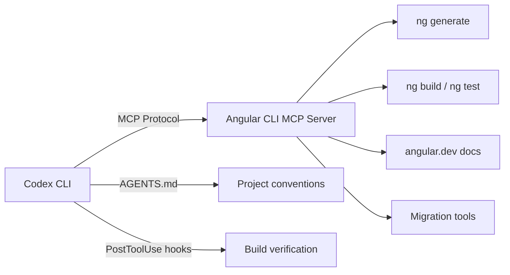
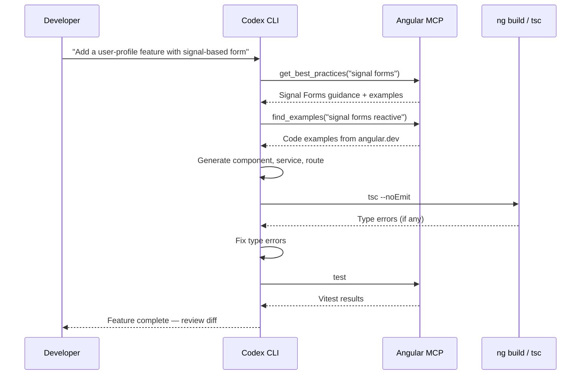

# Codex CLI for Angular Teams: MCP Server, Signal-Based Patterns, and Agent-Driven Enterprise Frontend Workflows


---

Angular's evolution from Zone.js-driven change detection to signal-based reactivity has been the framework's most significant architectural shift since the AngularJS-to-Angular rewrite. With Angular 21 shipping zoneless by default, Signal Forms in experimental preview, and an official MCP server baked into the CLI, the framework is now exceptionally well-suited to agentic development workflows[^angular-21][^angular-mcp].

This guide covers how to configure Codex CLI for Angular 21 projects — from MCP server integration and AGENTS.md templates to signal-aware code generation, testing with Vitest, and headless CI pipelines.

---

## Why Angular Is Uniquely Agent-Friendly

Angular's opinionated structure gives coding agents an advantage that loosely-structured frameworks cannot match. Three properties stand out:

1. **Deterministic compiler feedback.** The Angular compiler (`ngc`) catches template binding errors, missing imports, and type mismatches at build time. Agents receive clear, actionable error messages rather than runtime surprises[^angular-compiler].

2. **Convention-heavy scaffolding.** `ng generate` produces files in predictable locations with predictable naming. An agent that understands `ng generate component shared/data-table` knows exactly which files will appear and where.

3. **First-party MCP server.** Angular CLI 20.2 introduced a built-in MCP server, giving agents access to documentation search, best-practice retrieval, code generation, build execution, and migration tooling — without relying on third-party bridges[^angular-mcp].



---

## Setting Up the Angular CLI MCP Server

The Angular CLI MCP server runs as a stdio process and requires `@angular/cli` to be installed. Add it to your Codex CLI configuration:

### config.toml

```toml
[mcp]

[mcp.angular-cli]
command = "npx"
args = ["-y", "@angular/cli", "mcp", "-E", "build", "-E", "test", "-E", "modernize"]
```

The `-E` flags enable experimental tools that are disabled by default[^angular-mcp]. The available tool groups are:

| Tool | Default | Description |
|------|---------|-------------|
| `ai_tutor` | ✅ | Interactive Angular learning assistant |
| `find_examples` | ✅ | Locates official code examples for modern patterns |
| `get_best_practices` | ✅ | Retrieves guidance on standalone components, typed forms |
| `list_projects` | ✅ | Enumerates apps and libraries from `angular.json` |
| `search_documentation` | ✅ | Queries angular.dev (requires network) |
| `onpush_zoneless_migration` | ✅ | Migration strategies for zoneless change detection |
| `build` | ❌ | Executes `ng build` |
| `test` | ❌ | Runs unit tests |
| `modernize` | ❌ | Performs code migrations and schematics |
| `e2e` | ❌ | Runs end-to-end tests |
| `devserver.start` | ❌ | Starts `ng serve` |

For read-only exploration, pass `--read-only` to disable all mutating tools. For air-gapped environments, pass `--local-only` to disable `search_documentation`[^angular-mcp].

### Sandbox Considerations

Angular projects require network access during `npm install` and when fetching documentation via the MCP server. Configure your permission profile accordingly:

```toml
[sandbox]
mode = "managed-proxy"

[sandbox.network]
allowed_domains = [
  "registry.npmjs.org",
  "angular.dev",
  "api.angular.dev",
]
```

---

## AGENTS.md Template for Angular 21

The official Angular developer skill provides an excellent baseline, but Codex CLI teams benefit from project-specific AGENTS.md tailored to their codebase[^angular-skill]. Place this at your repository root:

```markdown
# AGENTS.md

## Project Overview
Angular 21 enterprise application using signal-based reactivity, zoneless change detection, and standalone components.

## Architecture Rules
- ALL components are standalone (standalone: true is the default — never add NgModules)
- Use `signal()`, `computed()`, and `effect()` for state — never `BehaviorSubject` for component state
- Use `input()` and `output()` signal APIs — never `@Input()` or `@Output()` decorators
- Use `inject()` function — never constructor injection
- Use `linkedSignal()` for derived state that needs local writability
- Use functional guards and resolvers — never class-based

## File Conventions
- Components: `src/app/<feature>/<component-name>/<component-name>.component.ts`
- Services: `src/app/core/services/<service-name>.service.ts`
- Models: `src/app/shared/models/<model-name>.model.ts`
- Route configs: `src/app/<feature>/<feature>.routes.ts`

## Testing
- Test runner: Vitest (NOT Karma — fully removed in Angular 21)
- Run tests: `npx ng test` or `npx vitest`
- Every component must have a corresponding `.spec.ts` file
- Use `TestBed` with `provideExperimentalZonelessChangeDetection()`
- Prefer `ComponentFixture` with signal-aware assertions

## Build & Lint
- Build: `npx ng build`
- Lint: `npx ng lint` (ESLint with @angular-eslint)
- Type check: `npx tsc --noEmit`
- ALWAYS run `npx tsc --noEmit` after modifying TypeScript files

## Signal Patterns
- Prefer `signal()` over `BehaviorSubject` for local component state
- Use `toSignal()` to bridge RxJS Observables into signal-based templates
- Use `toObservable()` only when integrating with RxJS-dependent libraries
- Signal Forms (experimental): use for new forms, but keep Reactive Forms for existing ones
```

### Installing the Official Angular Developer Skill

The Angular team maintains an official agent skill in the Angular repository itself. Install it for Codex CLI:

```bash
npx skills install angular/angular-developer
```

This installs a router-style skill with a lean `SKILL.md` entry point linking to over 30 reference files covering signals, forms, routing, testing, and more[^angular-skill]. The skill's autonomous verification loop ensures generated code compiles against your workspace TypeScript configuration.

---

## Agent-Driven Feature Development Workflow

A typical feature build with Codex CLI and Angular follows a generate-implement-verify pattern:



### Prompt Pattern

Effective Angular prompts give Codex the feature scope and let the MCP server handle Angular-specific knowledge:

```
Add a user-profile feature module at src/app/features/user-profile/.
Include:
- A UserProfileComponent with signal-based form for editing name, email, bio
- A UserProfileService using HttpClient with signal-based state
- Route configuration at /profile with auth guard
- Vitest specs for component and service
Use the Angular MCP server to check best practices before generating code.
```

---

## PostToolUse Hooks for Angular Verification

Configure hooks in `config.toml` to automatically verify Angular builds after code changes:

```toml
[[hooks]]
event = "post_tool_use"
tool_names = ["write", "edit", "apply_patch"]
command = "npx tsc --noEmit 2>&1 | head -30"
on_failure = "report"
timeout_ms = 30000
```

For stricter enforcement, add a lint hook:

```toml
[[hooks]]
event = "post_tool_use"
tool_names = ["write", "edit", "apply_patch"]
command = "npx ng lint --quiet 2>&1 | tail -20"
on_failure = "report"
timeout_ms = 20000
```

These hooks catch common agent errors — incorrect imports, missing standalone component dependencies, and template binding type mismatches — before they accumulate into larger problems[^codex-hooks].

---

## Zoneless Migration with Codex CLI

Angular 21 defaults to zoneless for new projects, but existing Angular 18–20 applications still use Zone.js. The Angular MCP server includes a dedicated `onpush_zoneless_migration` tool that analyses your codebase and produces a migration plan[^angular-21].

Run the migration interactively:

```
Use the Angular MCP server's onpush_zoneless_migration tool to analyse this project.
Then migrate components to OnPush change detection one directory at a time,
running tests after each batch. Start with shared/ components.
```

For large codebases, use subagents to parallelise the migration across feature directories:

```toml
# .codex/agents/zoneless-migrator.toml
model = "gpt-5.4-mini"
instructions = """
Migrate Angular components in the assigned directory to OnPush change detection.
Replace Zone.js-dependent patterns with signal-based reactivity.
Run `npx ng test` after each file change.
"""
```

The key patterns to watch for during migration[^angular-zoneless]:

| Zone.js Pattern | Signal Replacement |
|----------------|-------------------|
| `setTimeout(() => this.value = x)` | `signal()` with direct `.set()` |
| `this.cdr.detectChanges()` | Remove — signals trigger updates automatically |
| `async` pipe in templates | `toSignal()` + direct signal binding |
| `@Input() set` with side effects | `input()` + `effect()` |
| `ngOnChanges` lifecycle hook | `effect()` watching input signals |

---

## Signal Forms: The Experimental Frontier

Angular 21 introduced Signal Forms as an experimental alternative to Reactive Forms[^angular-21-forms]. They are built entirely on the signals primitive and offer dynamic form structures that react to value changes without the `FormGroup`/`FormControl` ceremony.

When using Codex CLI with Signal Forms, add this to your AGENTS.md:

```markdown
## Signal Forms (Experimental)
- Signal Forms API may change — use for NEW forms only
- Keep existing Reactive Forms until Signal Forms reach stable
- Import from `@angular/forms/signal` (experimental entry point)
- DO NOT mix Signal Forms and Reactive Forms in the same component
```

⚠️ Signal Forms are still experimental as of Angular 21.1. The API surface may change before reaching stable status.

---

## Vitest Configuration and Testing Patterns

Angular 21 replaced Karma with Vitest as the default test runner[^angular-21]. Configure Codex CLI to use Vitest for test verification:

```toml
# config.toml test profile
[profiles.test]
model = "gpt-5.4-mini"
approval_mode = "auto-edit"

[[profiles.test.hooks]]
event = "post_tool_use"
tool_names = ["write", "edit"]
command = "npx vitest run --reporter=verbose 2>&1 | tail -40"
on_failure = "report"
timeout_ms = 60000
```

### Signal-Aware Test Patterns

Testing signal-based components requires the zoneless testing provider:

```typescript
import { TestBed } from '@angular/core/testing';
import { provideExperimentalZonelessChangeDetection } from '@angular/core';

beforeEach(() => {
  TestBed.configureTestingModule({
    providers: [provideExperimentalZonelessChangeDetection()],
    imports: [UserProfileComponent],
  });
});

it('should update display name when signal changes', async () => {
  const fixture = TestBed.createComponent(UserProfileComponent);
  fixture.componentInstance.name.set('Alice');
  await fixture.whenStable();
  expect(fixture.nativeElement.textContent).toContain('Alice');
});
```

Add this pattern to your AGENTS.md so Codex generates tests with the correct provider configuration.

---

## Headless CI Pipeline

Use `codex exec` with the Angular MCP server for CI validation:

```bash
codex exec \
  --model gpt-5.4-mini \
  --approval-mode full-auto \
  --sandbox managed-proxy \
  "Review the changes in this PR for Angular best practices.
   Use the Angular MCP get_best_practices and search_documentation tools.
   Check that all components use signal-based inputs,
   standalone architecture, and have Vitest specs.
   Report findings as a structured summary." \
  --output-schema ./review-schema.json
```

### GitHub Actions Integration

```yaml
name: Codex Angular Review
on: [pull_request]
jobs:
  review:
    runs-on: ubuntu-latest
    steps:
      - uses: actions/checkout@v4
      - uses: actions/setup-node@v4
        with:
          node-version: 22
      - run: npm ci
      - uses: openai/codex-action@v1
        with:
          codex-args: >
            --model gpt-5.4-mini
            --approval-mode full-auto
          prompt: |
            Review the PR diff for Angular 21 best practices:
            signal-based state, standalone components, Vitest tests.
            Flag any Zone.js patterns or NgModule usage.
```

---

## Model Selection for Angular Tasks

| Task | Recommended Model | Reasoning Effort | Rationale |
|------|-------------------|-----------------|-----------|
| Component scaffolding | GPT-5.4-mini | Low | Formulaic generation following conventions |
| Signal migration | GPT-5.5 | Medium | Requires understanding reactivity semantics |
| Complex form logic | GPT-5.5 | High | Signal Forms API is new with limited training data |
| Test generation | GPT-5.4-mini | Low | Pattern-driven, benefits from speed |
| Architecture decisions | GPT-5.5 | High | Cross-cutting concerns need deep reasoning |
| Code review | GPT-5.4 | Medium | Balance between thoroughness and cost |

Use reasoning effort shortcuts in the TUI: `Alt+,` to lower and `Alt+.` to raise[^codex-v0124].

---

## Common Pitfalls

| Pitfall | Symptom | Fix |
|---------|---------|-----|
| Generates `@Input()` decorators | Compiler warning about deprecated API | Add signal input rule to AGENTS.md |
| Creates NgModules | Unnecessary `@NgModule` files | AGENTS.md: "standalone: true is the default — never create NgModules" |
| Uses `BehaviorSubject` for component state | Excessive boilerplate, Zone.js dependency | AGENTS.md: prefer `signal()` for component state |
| Constructor injection | Inconsistent with modern Angular patterns | AGENTS.md: "use `inject()` function" |
| Karma test configuration | Test runner not found | Ensure Vitest is configured, add to AGENTS.md |
| Missing `provideExperimentalZonelessChangeDetection()` | Tests fail with change detection errors | Add provider to AGENTS.md testing section |
| MCP schema bloat | Slow first-turn latency | Use `--read-only` or `--local-only` to reduce tool count |

---

## Conclusion

Angular's compiler-driven feedback loop, convention-heavy structure, and first-party MCP server make it one of the most agent-friendly frontend frameworks available. The combination of AGENTS.md encoding Angular 21 conventions, the Angular CLI MCP server providing real-time documentation and tooling access, and PostToolUse hooks enforcing build verification creates a development workflow where the agent operates within the same guardrails as a senior Angular developer.

The critical investment is in the AGENTS.md file. Get the signal patterns, standalone conventions, and testing requirements right there, and Codex CLI will generate Angular code that passes `tsc --noEmit` on the first attempt far more often than not.

---

## Citations

[^angular-21]: Angular 21 release — Signal Forms, zoneless default, Vitest, MCP server. [Angular.love](https://angular.love/angular-21-whats-new/), [InfoQ coverage](https://www.infoq.com/news/2025/11/angular-21-released/), November 2025.

[^angular-mcp]: Angular CLI MCP Server official documentation. [angular.dev/ai/mcp](https://angular.dev/ai/mcp), 2026.

[^angular-skill]: Official Angular developer skill — router-style skill with 30+ reference files. [angular/angular GitHub repo](https://github.com/angular/angular/blob/main/skills/dev-skills/angular-developer/references/mcp.md), [Angular.love implementation guide](https://angular.love/implementing-the-official-angular-claude-skills/), 2026.

[^angular-compiler]: Angular compiler deterministic feedback for AI agents. [VoidZero — How we made the Angular Compiler faster using AI](https://voidzero.dev/posts/oxc-angular-compiler), 2026.

[^angular-zoneless]: Angular 21 zoneless migration guide. [PkgPulse](https://www.pkgpulse.com/guides/angular-21-zoneless-zone-js-performance-2026), [Angular Architects](https://www.angulararchitects.io/blog/whats-new-in-angular-21-signal-forms-zone-less-vitest-angular-aria-cli-with-mcp-server/), 2026.

[^angular-21-forms]: Angular 21 Signal Forms experimental API. [grandlinux.com](https://www.grandlinux.com/en/blogs/angular-signal-forms.html), [Angular.love](https://angular.love/angular-21-whats-new/), 2026.

[^codex-hooks]: Codex CLI hooks — stable in v0.124, inline config.toml configuration. [OpenAI Codex changelog](https://developers.openai.com/codex/changelog), April 2026.

[^codex-v0124]: Codex CLI v0.124.0 — quick reasoning controls (Alt+,/Alt+.), hooks graduation. [OpenAI Codex changelog](https://developers.openai.com/codex/changelog), April 23, 2026.
