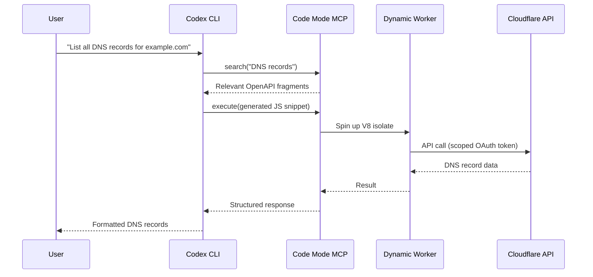

# Codex CLI and Cloudflare: Code Mode MCP, Dynamic Workers, and Edge Development Workflows


---

Cloudflare's Agents Week (14–20 April 2026) shipped more than twenty product launches aimed squarely at AI agent infrastructure[^1]. The centrepiece for Codex CLI users is **Code Mode MCP** — a technique that collapses 2,500+ Cloudflare API endpoints into roughly 1,000 tokens of context, a 99.9% reduction over traditional tool-per-endpoint approaches[^2]. Paired with Dynamic Workers, Sandboxes, and the Cloudflare Skills plugin, Codex CLI now has first-class support for building, deploying, and operating Workers from the terminal.

This article walks through the integration architecture, practical setup, and workflow patterns that make Codex CLI a natural fit for Cloudflare edge development.

## Why Code Mode Matters for Coding Agents

Traditional MCP server design exposes each API endpoint as a separate tool definition. For a large API surface like Cloudflare's, that means over 1.17 million tokens of tool descriptions — more than the entire context window of most frontier models[^2]. Every token spent on tool definitions is a token unavailable for reasoning about your actual problem.

Code Mode replaces the entire tool catalogue with just two tools:

| Tool | Purpose |
|------|---------|
| `search()` | Queries OpenAPI specifications by product area, path, or metadata without loading the full spec into context |
| `execute()` | Runs generated JavaScript against a typed SDK inside a secure V8 isolate |

The model writes code rather than selecting from a vast menu of pre-defined functions. When Cloudflare adds new products, the same `search()` and `execute()` code paths discover and call them automatically — no new tool definitions required[^2].



The Dynamic Worker isolate that executes agent-generated code runs with no filesystem, no exposed environment variables, and outbound fetch disabled by default[^2]. This sandboxing model aligns with Codex CLI's own defence-in-depth approach to agent security.

## Setting Up the Cloudflare Plugin

Cloudflare provides an official plugin that bundles Skills, MCP servers, and Wrangler integration into a single installable package[^3].

### Quick Start

Start Codex from your project root (where `wrangler.jsonc` lives):

```bash
codex
```

Inside the TUI, install the plugin:

```
/plugins
# Search for and install "Cloudflare"
```

The plugin automatically registers:

- The Code Mode API server (`https://mcp.cloudflare.com/mcp`)
- Domain-specific servers for documentation, observability, DNS analytics, and more
- Skills covering Workers, KV, D1, R2, AI services, and Wrangler CLI patterns[^3]

Verify the setup:

```bash
codex mcp list
```

The first API call triggers an OAuth 2.1 authorisation flow that downscopes your token to the permissions you approve[^2].

### Manual config.toml Setup

If you prefer explicit configuration — useful for CI/CD or enterprise-managed deployments — add the MCP server directly:

```toml
[mcp_servers.cloudflare-api]
transport = "sse"
url = "https://mcp.cloudflare.com/mcp"

[mcp_servers.cloudflare-docs]
transport = "sse"
url = "https://docs.mcp.cloudflare.com/mcp"

[mcp_servers.cloudflare-observability]
transport = "sse"
url = "https://observability.mcp.cloudflare.com/mcp"
```

For headless CI runs where OAuth is impractical, pass an API token via the `Authorization` header[^4]:

```bash
export CLOUDFLARE_API_TOKEN="your-scoped-token"
codex exec "Deploy the staging Worker to production" \
  --model gpt-5.5
```

## The Sixteen MCP Servers

Beyond the main Code Mode server, Cloudflare offers sixteen domain-specific MCP servers[^4]. Each is a focused surface for a particular product area:

| Server | Endpoint | Use Case |
|--------|----------|----------|
| API (Code Mode) | `mcp.cloudflare.com/mcp` | Full API access (2,500+ endpoints) |
| Documentation | `docs.mcp.cloudflare.com/mcp` | Reference and guides |
| Workers Bindings | `bindings.mcp.cloudflare.com/mcp` | Storage, AI, and service bindings |
| Workers Builds | `builds.mcp.cloudflare.com/mcp` | Build management and insights |
| Observability | `observability.mcp.cloudflare.com/mcp` | Logs and analytics debugging |
| Radar | `radar.mcp.cloudflare.com/mcp` | Internet traffic patterns |
| Container | `containers.mcp.cloudflare.com/mcp` | Sandbox environments |
| Browser Run | `browser.mcp.cloudflare.com/mcp` | Scraping and screenshots |
| Logpush | `logs.mcp.cloudflare.com/mcp` | Job health summaries |
| AI Gateway | `ai-gateway.mcp.cloudflare.com/mcp` | Log search and prompt analysis |
| AI Search | `autorag.mcp.cloudflare.com/mcp` | Document search (AutoRAG) |
| Audit Logs | `auditlogs.mcp.cloudflare.com/mcp` | Query and compliance reporting |
| DNS Analytics | `dns-analytics.mcp.cloudflare.com/mcp` | DNS performance optimisation |
| DEM | `dex.mcp.cloudflare.com/mcp` | Digital experience monitoring |
| CASB | `casb.mcp.cloudflare.com/mcp` | SaaS security scanning |
| GraphQL | `graphql.mcp.cloudflare.com/mcp` | Analytics data access |

For most Codex CLI workflows, the Code Mode server alone suffices — it covers the same endpoints as the domain-specific servers combined. Add individual servers only when you want their specialised context (e.g., the Documentation server for reference lookups that don't consume API tokens)[^4].

## Practical Workflow Patterns

### Pattern 1: Scaffold and Deploy a Worker

```
Create a Cloudflare Worker that receives webhooks from Stripe,
validates the signature, stores the event in D1, and returns 200.
Use wrangler.jsonc for config. Deploy to staging.
```

The Cloudflare Skills teach Codex when to use Wrangler CLI commands versus direct API calls[^3]. The agent will:

1. Scaffold the Worker with `wrangler init`
2. Generate the handler code with D1 bindings
3. Create the D1 database via the MCP server
4. Deploy with `wrangler deploy --env staging`

### Pattern 2: Debug Production Issues with Observability MCP

```
My Worker "api-gateway" is returning 502s on /v2/users.
Check the last hour of logs, identify the error pattern,
and suggest a fix.
```

Adding the Observability MCP server lets Codex query logs directly rather than asking you to paste them. The agent can correlate error patterns, check exception traces, and propose code changes in a single turn.

### Pattern 3: DNS and Zero Trust Automation

```
Audit all DNS records for staging.example.com.
Remove any A records pointing to decommissioned IPs in 10.0.0.0/8.
Add a CNAME for api.staging.example.com pointing to the new Worker.
```

Code Mode's `search()` + `execute()` pattern handles multi-step API orchestration — pagination, conditional logic, and chained calls — in a single execution cycle[^2]. No tool-call ping-pong.

### Pattern 4: CI/CD with codex exec

For automated pipelines, combine `codex exec` with Cloudflare's API token authentication:

```bash
codex exec \
  --model gpt-5.5 \
  --approval-mode full-auto \
  --output-schema ./schemas/deploy-result.json \
  "Run wrangler deploy for all changed Workers in this PR. \
   Report which Workers were deployed and their new versions."
```

## AGENTS.md Template for Cloudflare Projects

Add a project-level AGENTS.md to give Codex persistent context about your Cloudflare setup:

```markdown
# AGENTS.md

## Project Type
Cloudflare Workers monorepo using wrangler.jsonc

## Stack
- Runtime: Cloudflare Workers (V8 isolates)
- Database: D1 (SQLite at the edge)
- Storage: R2 (S3-compatible object store)
- KV: Cloudflare KV for session data
- Queue: Cloudflare Queues for async processing

## Conventions
- All Workers use TypeScript with strict mode
- Bindings defined in wrangler.jsonc, never hardcoded
- Environment-specific config via `[env.staging]` and `[env.production]` sections
- Database migrations in `migrations/` using D1 migration format
- Tests use Vitest with `@cloudflare/vitest-pool-workers`

## Commands
- `wrangler dev` — local development with Miniflare
- `wrangler deploy --env staging` — deploy to staging
- `wrangler d1 migrations apply DB --env staging` — run migrations
- `wrangler tail api-gateway --env production` — live logs

## Boundaries
- NEVER deploy to production without explicit approval
- NEVER modify DNS records for the apex domain
- Always validate Wrangler config with `wrangler check` before deploying
```

## How Cloudflare Uses This Internally

Cloudflare's own engineering team provides a useful reference point. Their internal AI platform serves 3,683 employees (93% of R&D), processing 47.95 million AI requests monthly[^5]. Key patterns relevant to Codex CLI users:

- **AGENTS.md at scale**: Cloudflare generated AGENTS.md files across 3,900 repositories, each encoding test commands, conventions, and boundaries[^5]
- **AI Code Reviewer**: Every merge request receives automated review against their internal Engineering Codex standards — processing 5.47 million requests and 24.77 billion tokens in 30 days[^5]
- **Merge request acceleration**: Weekly merge requests increased from roughly 5,600 to 10,952 at peak after agent adoption[^5]

These numbers validate the AGENTS.md-first approach and demonstrate that Code Mode's token efficiency enables real organisational scale.

## Security Considerations

The Code Mode execution model introduces a specific trust boundary: agent-generated JavaScript runs inside Cloudflare's Dynamic Worker isolates, not in your local sandbox[^2]. This means:

1. **Your Cloudflare credentials** are scoped via OAuth 2.1 — the agent only gets the permissions you explicitly grant[^2]
2. **Generated code** executes remotely, not locally — Codex CLI's Seatbelt sandbox is not the enforcement layer for API calls
3. **Network policy** in your `config.toml` controls whether Codex can reach `mcp.cloudflare.com` at all

For enterprise deployments, combine Cloudflare's OAuth scoping with Codex CLI's managed configuration:

```toml
# requirements.toml (admin-enforced)
[mcp_servers.cloudflare-api]
transport = "sse"
url = "https://mcp.cloudflare.com/mcp"
# Prevent developers adding unapproved MCP servers
```

## Limitations and Gotchas

- **Code Mode + output-schema conflict**: The known issue where `--output-schema` can be silently ignored when MCP tools are active applies here[^6]. Verify structured output in CI pipelines with a post-processing validation step.
- **OAuth in headless mode**: The OAuth flow requires a browser redirect. For `codex exec` in CI, use API tokens instead[^4].
- **Token accounting**: Code Mode's ~1,000 token footprint is per-server. If you register all sixteen domain-specific servers alongside the main Code Mode server, you pay the context cost for each. Stick to the Code Mode server unless you have a specific reason to add others.
- **Rate limits**: Cloudflare API rate limits apply to agent-generated calls just as they do to manual ones. High-throughput automation (e.g., bulk DNS changes) should implement backoff or batch operations in the generated code.

## Citations

[^1]: Cloudflare, "Building the agentic cloud: everything we launched during Agents Week 2026," Cloudflare Blog, April 2026. [https://blog.cloudflare.com/agents-week-in-review/](https://blog.cloudflare.com/agents-week-in-review/)

[^2]: Cloudflare, "Code Mode: give agents an entire API in 1,000 tokens," Cloudflare Blog, April 2026. [https://blog.cloudflare.com/code-mode-mcp/](https://blog.cloudflare.com/code-mode-mcp/)

[^3]: Cloudflare, "Codex + Cloudflare — Agent setup docs," Cloudflare Developers, April 2026. [https://developers.cloudflare.com/agent-setup/codex/](https://developers.cloudflare.com/agent-setup/codex/)

[^4]: Cloudflare, "Cloudflare's own MCP servers," Cloudflare Agents Docs, April 2026. [https://developers.cloudflare.com/agents/model-context-protocol/mcp-servers-for-cloudflare/](https://developers.cloudflare.com/agents/model-context-protocol/mcp-servers-for-cloudflare/)

[^5]: Cloudflare, "The AI engineering stack we built internally — on the platform we ship," Cloudflare Blog, April 2026. [https://blog.cloudflare.com/internal-ai-engineering-stack/](https://blog.cloudflare.com/internal-ai-engineering-stack/)

[^6]: OpenAI, "Bug: --json and --output-schema are silently ignored when tools/MCP servers are active," GitHub Issue #15451, April 2026. [https://github.com/openai/codex/issues/15451](https://github.com/openai/codex/issues/15451)
