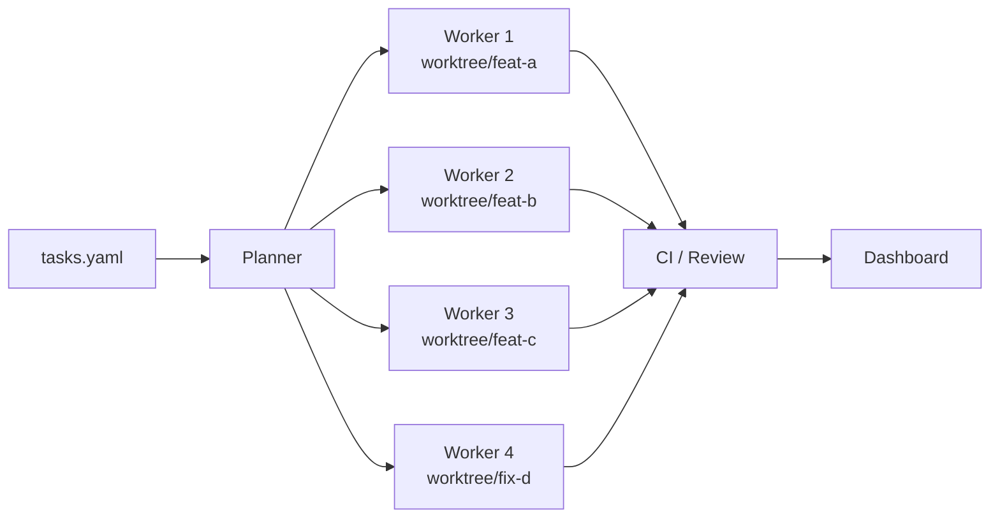
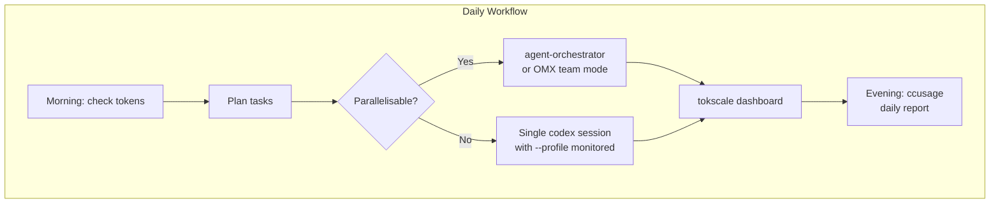

# The Codex CLI Companion Tools Ecosystem: Token Monitors, Orchestrators, and Community Collections


---

Codex CLI has crossed 75,000 GitHub stars, 14.5 million monthly npm downloads, and three million weekly active users [^1]. That kind of gravity pulls in an orbit of companion tools — token monitors, parallel orchestrators, curated skill packs, and subagent libraries — that solve the problems OpenAI has not (yet) built into the core binary. This article maps the ecosystem as it stands in late April 2026, highlights the tools worth adopting, and shows how to wire them into your daily workflow.

## Why Companion Tools Matter

Codex CLI ships as a deliberately thin agent loop: prompt in, tool calls out, sandbox enforced [^2]. The design philosophy keeps the core small, but it leaves operational gaps that matter at professional scale:

- **Token visibility** — you cannot optimise what you cannot measure, and the built-in `/status` command shows only the current session.
- **Parallelism** — native subagents handle read-heavy fan-out [^3], but coordinating multiple write-heavy agents across branches still requires external scaffolding.
- **Reusable knowledge** — skills and AGENTS.md carry instructions, but discovering and sharing them across teams needs curation.

The companion ecosystem fills each gap.

## Token Monitoring

### ccusage

ccusage (13.5k stars) is the most mature token tracker in the space [^4]. Originally built for Claude Code, it added a dedicated `@ccusage/codex` package that reads local JSONL session files from `~/.codex/sessions/` and produces daily, monthly, and per-session reports.

```bash
# Install and run for Codex sessions
npx @ccusage/codex@latest

# Filter to a specific date range
npx @ccusage/codex@latest --from 2026-04-01 --to 2026-04-29
```

Key capabilities:

- **5-hour billing window tracking** aligned with OpenAI's rate-limit reset cycle [^5].
- **Per-model cost breakdown** — useful when routing between `gpt-5-codex`, `gpt-5.2-codex`, and `gpt-5.5` [^6].
- **Cache token separation** — distinguishes cache creation from cache read tokens, letting you verify that your prompt-caching strategy actually works [^7].
- **JSON export** for feeding into dashboards or CI cost gates.

The tool runs entirely offline against local data — no API keys, no network calls.

### tokscale

tokscale (2.4k stars) takes a broader, multi-agent view [^8]. Written in Rust with a TypeScript TUI layer, it tracks token usage across Codex CLI, Claude Code, Gemini CLI, Cursor, OpenCode, and fifteen other agents simultaneously.

```bash
# Install globally
npm i -g tokscale

# Show only Codex usage
tokscale --client codex

# Launch interactive TUI
tokscale --tui
```

Notable differentiators:

- **Six interactive views** — Overview, Models, Daily, Hourly, Stats, and Agents — all navigable from the terminal.
- **Real-time pricing** via LiteLLM with an OpenRouter fallback and a one-hour disk cache.
- **2D/3D contribution graphs** and a global leaderboard for teams that enjoy friendly competition.
- **Reasoning token tracking** — pairs well with the `codex exec --json` reasoning-token reporting added in v0.125.0 [^9].

If you run a single agent, ccusage is simpler. If your team uses multiple coding agents, tokscale gives the unified picture.

## Parallel Orchestration

### agent-orchestrator

agent-orchestrator (6.6k stars) from ComposioHQ manages fleets of coding agents working in parallel [^10]. Each agent gets its own git worktree, its own branch, and its own pull request. The tool is agent-agnostic — it supports Codex CLI, Claude Code, Aider, Cursor, and OpenCode.

```bash
# Install
npm i -g @composio/agent-orchestrator

# Plan and spawn parallel agents
agent-orchestrator plan --repo . --tasks tasks.yaml
agent-orchestrator run --agent codex --workers 4
```

The architecture uses seven pluggable slots — runtime, agent, tracker, notifier, reviewer, merger, and reporter — so you can swap Codex for Claude Code on specific tasks without changing the orchestration layer.



Agents autonomously handle CI failures and review comments, reopening failed PRs without human intervention.

### oh-my-codex (OMX)

oh-my-codex (18.8k stars) is an orchestration layer that wraps the official Codex CLI the way oh-my-zsh wraps your shell [^11]. It adds multi-worker coordination, 33 specialised agent prompts, persistent workflow state, and tmux-based parallel sessions.

```bash
# Install
npm i -g oh-my-codex
omx setup

# Launch a 3-worker team
omx team --workers 3 --plan plan.md
```

OMX ships with reusable "skills" (`$deep-interview`, `$ralplan`, `$team`) that compose into multi-step workflows. It does not replace the Codex execution engine — Codex handles reasoning and code generation whilst OMX handles task routing, team coordination, and developer experience [^12].

### parallel-code

parallel-code is a lighter alternative for developers who want worktree isolation without full orchestration [^13]. It gives every AI coding agent its own git branch and worktree automatically, with a desktop GUI for monitoring progress.

## Curated Community Collections

### Awesome Codex CLI (150+ tools)

The canonical ecosystem directory lives as a pinned GitHub Discussion on the openai/codex repository [^14]. It catalogues over 150 tools across twenty categories:

| Category | Count | Examples |
|---|---|---|
| Subagents | 136+ | VoltAgent collection, security-auditor, k8s-specialist |
| Skills | 50+ | ComposioHQ packs, Hugging Face upskill |
| MCP servers | 30+ | Bidirectional configs (Codex as client and server) |
| IDE integrations | 12+ | VS Code, Neovim, Emacs, JetBrains |
| Model providers | 10+ | LiteLLM, Ollama, LM Studio, OpenRouter |
| CI/CD recipes | 15+ | `codex exec` automation patterns |

### awesome-codex-subagents (VoltAgent)

The VoltAgent collection (4.3k stars) provides 136 pre-built subagent definitions across ten categories [^15]:

- **Core Development** (12) — backend-developer, frontend-developer, fullstack-architect
- **Language Specialists** (28) — react-specialist, rust-expert, python-guru
- **Quality & Security** (16) — security-auditor, performance-profiler, accessibility-checker
- **Infrastructure** (16) — kubernetes-specialist, terraform-operator, docker-composer

Each subagent ships as a TOML file ready to drop into `~/.codex/agents/`. They use smart model routing — read-only mode for reviewers, workspace-write for developers — and an `agent-installer` subagent that can browse and install agents from the collection directly.

### awesome-codex-skills (ComposioHQ)

The ComposioHQ skills collection (4.4k stars) provides 50+ SKILL.md packages across five categories [^16]:

- **Development & Code Tools** — codebase migration, PR review, CI/CD automation
- **Productivity & Collaboration** — meeting notes, issue triage, Notion integration
- **Data & Analysis** — spreadsheet formulas, competitive analysis, LangSmith integration

Installation uses a Python script that copies skills into `$CODEX_HOME/skills/` (defaulting to `~/.codex/skills/`).

## Wiring It All Together

A practical daily setup combines monitoring, orchestration, and curated knowledge. Here is a `config.toml` profile that references the ecosystem:

```toml
# ~/.codex/config.toml

[profiles.monitored]
model = "gpt-5-codex"
model_reasoning_effort = "medium"

[profiles.parallel]
model = "gpt-5-codex"
model_reasoning_effort = "low"
sandbox_mode = "workspace-write"

[profiles.review]
model = "gpt-5.2-codex"
model_reasoning_effort = "high"
sandbox_mode = "read-only"
```

Then a shell alias set ties the pieces together:

```bash
# ~/.bashrc or ~/.zshrc

# Token monitoring after every session
alias cx='codex && npx @ccusage/codex@latest --from today'

# Parallel work via agent-orchestrator
alias cxpar='agent-orchestrator run --agent codex --profile parallel --workers 3'

# Cross-agent dashboard
alias tokens='tokscale --tui'
```



## Choosing the Right Tools

| Need | Tool | Why |
|---|---|---|
| Track Codex-only spend | ccusage | Mature, offline, Codex-native package |
| Track multi-agent spend | tokscale | Unified view across 15+ agents |
| Parallel feature work | agent-orchestrator | Agent-agnostic, CI-aware, pluggable |
| Team workflows with OMX skills | oh-my-codex | Opinionated orchestration with built-in roles |
| Pre-built subagent library | awesome-codex-subagents | 136 agents, drop-in TOML files |
| Pre-built skill library | awesome-codex-skills | 50+ SKILL.md packages, one-line install |

## Caveats

- **Token monitors read local JSONL files.** If you run Codex via the desktop app or cloud, session files may not land in `~/.codex/sessions/` and ccusage/tokscale will show incomplete data. ⚠️
- **Orchestrator tools spawn multiple agent processes.** Each consumes its own token budget. Four parallel workers running `gpt-5-codex` at medium reasoning can burn through a Pro plan's 5-hour window rapidly [^5].
- **Community subagents and skills are not audited by OpenAI.** Review TOML and SKILL.md files before installation — they can set approval policies, sandbox modes, and model overrides that weaken your security posture. ⚠️
- **oh-my-codex requires tmux on macOS/Linux or psmux on Windows.** The dependency is non-trivial on hardened CI runners.

## What to Watch

The ecosystem is consolidating. OpenAI's own skills catalogue at `github.com/openai/skills` is growing [^17], and the v0.124.0 inline hooks-in-config.toml feature [^9] reduces the need for external hook managers. Expect official marketplace integration to absorb some companion-tool functionality by mid-2026 — but for now, the open-source ecosystem moves faster than the platform.

## Citations

[^1]: [OpenAI Codex CLI GitHub repository](https://github.com/openai/codex) — stars, downloads, and user count as of April 2026.
[^2]: [Codex CLI official documentation](https://developers.openai.com/codex/cli) — architecture and design philosophy.
[^3]: [Codex subagents documentation](https://developers.openai.com/codex/subagents) — native subagent support for parallel read-heavy tasks.
[^4]: [ccusage GitHub repository](https://github.com/ryoppippi/ccusage) — 13.5k stars, v18.0.11, TypeScript, @ccusage/codex companion package.
[^5]: [Codex rate limits reset for all paid plans, April 28 2026](https://community.openai.com/t/codex-rate-limits-reset-for-all-paid-plans-april-28-2026/1379921) — OpenAI Developer Community discussion on 5-hour billing windows and promotional limits.
[^6]: [Codex models documentation](https://developers.openai.com/codex/models) — current model lineup including gpt-5-codex, gpt-5.2-codex, and gpt-5.5.
[^7]: [OpenAI Prompt Caching guide](https://developers.openai.com/api/docs/guides/prompt-caching) — cache token mechanics and prefix-matching requirements.
[^8]: [tokscale GitHub repository](https://github.com/junhoyeo/tokscale) — 2.4k stars, Rust core, multi-agent tracking across 15+ tools.
[^9]: [Codex CLI changelog — v0.124.0 and v0.125.0](https://developers.openai.com/codex/changelog) — inline hooks in config.toml, reasoning-token reporting in exec JSON.
[^10]: [agent-orchestrator GitHub repository](https://github.com/ComposioHQ/agent-orchestrator) — 6.6k stars, agent-agnostic parallel orchestration with pluggable architecture.
[^11]: [oh-my-codex (OMX) guide](https://a2a-mcp.org/blog/what-is-oh-my-codex) — 18.8k stars, multi-worker orchestration layer, 33 specialised agent prompts.
[^12]: [oh-my-codex review — Vibe Coding Hub](https://vibecodinghub.org/tools/oh-my-codex) — architecture: Codex handles reasoning, OMX handles routing and coordination.
[^13]: [parallel-code GitHub repository](https://github.com/johannesjo/parallel-code) — lightweight desktop app for worktree-isolated multi-agent sessions.
[^14]: [Awesome Codex CLI — curated list of 150+ ecosystem tools](https://github.com/openai/codex/discussions/16329) — pinned GitHub Discussion on openai/codex.
[^15]: [awesome-codex-subagents (VoltAgent)](https://github.com/VoltAgent/awesome-codex-subagents) — 4.3k stars, 136 subagent definitions across 10 categories.
[^16]: [awesome-codex-skills (ComposioHQ)](https://github.com/ComposioHQ/awesome-codex-skills) — 4.4k stars, 50+ SKILL.md packages across 5 categories.
[^17]: [OpenAI official skills catalogue](https://github.com/openai/skills) — growing collection of first-party skills.
