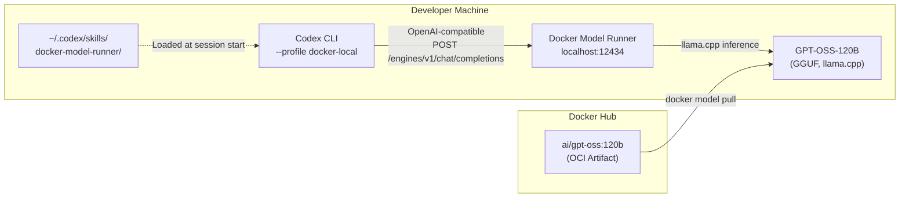
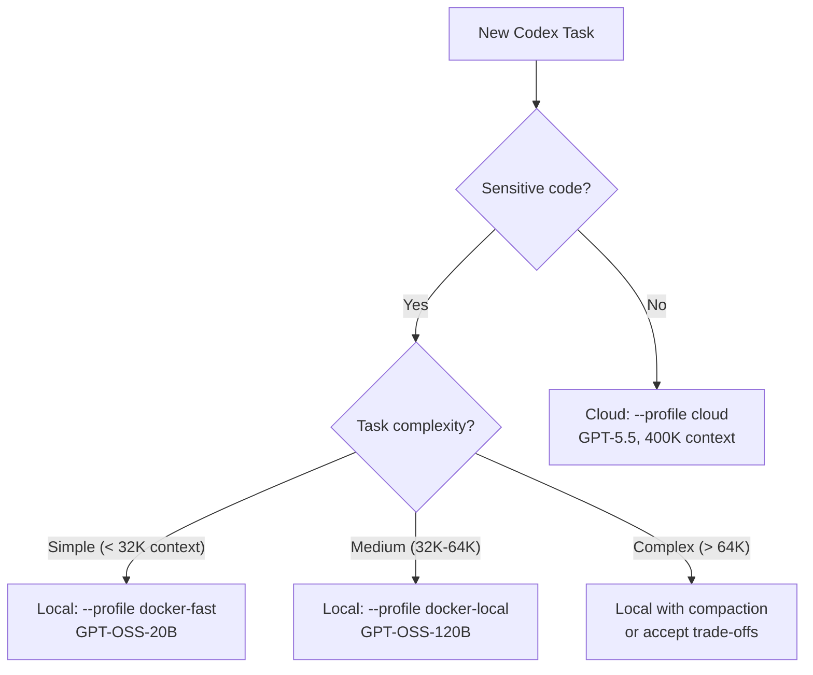

# Codex CLI and Docker Model Runner: Containerised Local Inference for Private, Cost-Free Coding Agents


---

## Introduction

Running Codex CLI against the OpenAI API is the default path — and for good reason. GPT-5.5's 400K context window, server-side compaction, and prompt caching make it formidable[^1]. But not every task warrants an API call. Internal refactors on proprietary code, air-gapped enterprise environments, personal projects where you would rather not burn credits — these all benefit from local inference.

Docker Model Runner (DMR) provides a Docker-native route to local model serving that many developers overlook. Unlike Ollama, which runs as a standalone daemon, DMR is embedded in Docker Desktop and Docker Engine, manages models as OCI artifacts pulled from Docker Hub or Hugging Face, and exposes an OpenAI-compatible API that Codex CLI can target with a few lines of TOML[^2]. It even ships first-party Codex CLI skills via `docker model skills --codex`[^3].

This article covers the end-to-end workflow: enabling DMR, pulling a coding model, configuring Codex CLI as a provider, installing Docker-aware skills, and building profiles for a hybrid local-plus-cloud workflow.

---

## Why Docker Model Runner?

Developers already have Docker installed. DMR leverages that existing investment rather than introducing another daemon. Key differentiators:

| Feature | Docker Model Runner | Ollama |
|---|---|---|
| Installation | Built into Docker Desktop / `docker-model-plugin` for Engine[^2] | Separate binary |
| Model format | OCI artifacts (GGUF, Safetensors)[^2] | Modelfile + GGUF |
| Registry | Docker Hub, any OCI registry, Hugging Face[^2] | ollama.com library |
| API endpoint | `http://localhost:12434/engines/v1` (host) / `http://model-runner.docker.internal/engines/v1` (container)[^4] | `http://localhost:11434/v1` |
| Inference engines | llama.cpp (all platforms), vLLM (NVIDIA Linux/WSL2), Diffusers (image gen)[^2] | llama.cpp only |
| GPU support | CUDA, ROCm, Vulkan, Apple Silicon[^2] | CUDA, ROCm, Apple Silicon |
| Coding agent skills | `docker model skills --codex`[^3] | None shipped |
| Resource management | Models loaded on-demand, unloaded when idle[^2] | Models loaded on-demand |

The Vulkan backend is particularly notable — it means DMR runs on virtually any modern GPU, including integrated Intel and AMD graphics[^2].

---

## Architecture



The flow is straightforward. DMR serves the model behind an OpenAI-compatible API on port 12434. Codex CLI connects to it via a custom model provider in `config.toml`. The DMR skills teach Codex how to manage models, troubleshoot inference, and optimise context windows for local hardware constraints.

---

## Setup

### 1. Enable Docker Model Runner

**Docker Desktop** (macOS / Windows / Linux):

Navigate to **Settings > AI** and toggle **Docker Model Runner** on. For NVIDIA GPU users on Windows, also enable **GPU-backed inference**[^5].

**Docker Engine** (Linux headless):

```bash
# Ubuntu / Debian
sudo apt-get install docker-model-plugin

# RHEL / Fedora
sudo dnf install docker-model-plugin
```

Verify the installation:

```bash
docker model version
```

### 2. Pull a Coding Model

GPT-OSS models are optimised for Codex CLI's tool-calling protocol. The 120B parameter variant is the recommended choice for local coding work; the 20B variant works on machines with 16 GB RAM[^6].

```bash
# Full-size model (requires ~80 GB RAM or GPU VRAM for Q4 quantisation)
docker model pull ai/gpt-oss:120b

# Smaller variant for constrained hardware
docker model pull ai/gpt-oss:20b
```

You can also pull third-party coding models from Hugging Face:

```bash
docker model pull hf.co/bartowski/Qwen3-Coder-Next-30B-GGUF
```

List downloaded models:

```bash
docker model ls
```

### 3. Test the Model

```bash
docker model run ai/gpt-oss:120b
```

This opens an interactive chat. Type a coding question to confirm inference works, then exit with `Ctrl+C`.

### 4. Install Codex CLI Skills

DMR ships skills that teach Codex how to interact with the Docker model ecosystem:

```bash
docker model skills --codex
```

This installs skill files to `~/.codex/skills/`. You can install for multiple agents simultaneously:

```bash
docker model skills --codex --claude
```

Use `--force` to overwrite existing skills during upgrades[^3].

---

## Codex CLI Configuration

### Provider Definition

Add the DMR provider to `~/.codex/config.toml`:

```toml
[model_providers.docker-runner]
name = "Docker Model Runner"
base_url = "http://localhost:12434/engines/v1"
```

No `env_key` is needed — DMR runs locally without authentication[^4].

### Profiles

Create profiles for different local models and a hybrid workflow:

```toml
# Local full-size model for deep coding work
[profiles.docker-local]
model_provider = "docker-runner"
model = "ai/gpt-oss:120b"
reasoning_effort = "medium"

# Local small model for quick iterations
[profiles.docker-fast]
model_provider = "docker-runner"
model = "ai/gpt-oss:20b"
reasoning_effort = "low"

# Cloud model for complex, long-horizon tasks
[profiles.cloud]
model = "gpt-5.5"
reasoning_effort = "high"
```

Switch profiles from the command line:

```bash
# Private local inference
codex --profile docker-local "Refactor the auth module to use RBAC"

# Quick local iteration
codex --profile docker-fast "Add a unit test for the parseConfig function"

# Cloud power when needed
codex --profile cloud "Migrate the codebase from Express to Fastify"
```

### The `--oss` Shortcut

If you only need Ollama or LM Studio, Codex CLI supports `--oss` as a convenience flag. For DMR, however, use the explicit profile approach above — the built-in `--oss` flag targets the reserved `ollama` and `lmstudio` provider IDs, not custom providers[^7].

---

## Hybrid Workflow: Local for Privacy, Cloud for Power

The most practical pattern is not "local or cloud" but "both, depending on the task." Context window size is the key decision variable.



Local models top out at 64K tokens of effective context for most hardware configurations[^8]. Beyond that, you either accept degraded quality or switch to the cloud. The GPT-5.5 cloud path offers 400K tokens in Codex CLI and up to 1M via the API[^1].

### Practical Decision Framework

| Scenario | Recommended Profile | Rationale |
|---|---|---|
| Proprietary algorithm refactoring | `docker-local` | Code never leaves the machine |
| Quick test generation | `docker-fast` | Low latency, no cost |
| Multi-file migration (> 20 files) | `cloud` | Needs large context window |
| Air-gapped environment | `docker-local` | No network required |
| Security audit with GPT-5.2-Codex | `cloud` (GPT-5.2-Codex) | Purpose-built for cybersecurity[^9] |
| Weekend personal project | `docker-fast` | Zero API spend |

---

## Performance Tuning

### Context Window Configuration

DMR defaults to conservative context sizes. For coding work, increase the context window in your Docker Compose configuration or via the DMR API:

```bash
# Check current context configuration
docker model inspect ai/gpt-oss:120b
```

Codex CLI recommends at least 64K tokens for effective agent operation[^8]. On Apple Silicon Macs with 64 GB+ unified memory, the 120B model comfortably serves 64K context. On 32 GB machines, the 20B model is a better fit.

### GPU Backend Selection

DMR automatically selects the best available backend, but you can influence the choice:

- **Apple Silicon**: Metal is used automatically — no configuration needed
- **NVIDIA**: Ensure CUDA drivers are installed; enable GPU inference in Docker Desktop settings
- **AMD**: ROCm support on Linux; requires compatible drivers
- **Other GPUs**: Vulkan backend provides broad compatibility[^2]

### Model Unloading

DMR unloads models from memory when idle, freeing resources for other work[^2]. This is particularly useful when switching between local and cloud profiles — the model is not consuming VRAM while you are using the cloud path.

---

## Security Considerations

### CVE-2026-33990

In April 2026, Docker patched CVE-2026-33990, an SSRF vulnerability in DMR's OCI Registry Client[^10]. **Update Docker Desktop to the latest version** to ensure you have the fix. Run `docker model version` and verify you are on a patched release.

### Network Isolation

DMR serves on localhost by default. The TCP endpoint (port 12434) is not exposed to external networks unless explicitly configured[^4]. For additional hardening in enterprise environments:

```toml
# In Codex CLI config.toml — restrict to loopback
[model_providers.docker-runner]
name = "Docker Model Runner (local only)"
base_url = "http://127.0.0.1:12434/engines/v1"
```

### Code Privacy

The primary motivation for local inference is keeping proprietary code off third-party servers. With DMR, inference happens entirely on your hardware. No telemetry is sent to Docker or model publishers during inference[^2].

---

## Comparison with Ollama

Both Ollama and DMR serve as local model providers for Codex CLI. The choice depends on your existing toolchain:

**Choose DMR when:**

- Docker Desktop is already part of your workflow
- You want OCI-native model management (push/pull/tag like container images)
- You need vLLM for higher-throughput production-like inference
- You want first-party Codex CLI skills via `docker model skills`[^3]
- You need Vulkan GPU support for non-NVIDIA hardware

**Choose Ollama when:**

- You prefer a standalone, minimal installation
- You use `ollama launch codex` for zero-config startup[^8]
- Your team has standardised on Ollama's model library
- You want the built-in `--oss` flag without custom provider configuration

Both can coexist. You can define providers for both and switch via profiles:

```toml
[model_providers.docker-runner]
name = "Docker Model Runner"
base_url = "http://localhost:12434/engines/v1"

[model_providers.local_ollama]
name = "Ollama"
base_url = "http://localhost:11434/v1"

[profiles.dmr]
model_provider = "docker-runner"
model = "ai/gpt-oss:120b"

[profiles.ollama]
model_provider = "local_ollama"
model = "gpt-oss:120b"
```

---

## Limitations

- **Context window ceiling**: Local models are constrained by available RAM/VRAM. The practical ceiling is 64K tokens for most developer hardware, versus 400K for GPT-5.5 in the cloud[^1][^8].
- **No server-side compaction**: Codex CLI's compaction endpoint is an OpenAI Responses API feature. Local providers cannot use it, so long sessions degrade faster[^1].
- **No prompt caching**: OpenAI's prompt caching is server-side. Local inference pays full compute cost on every request.
- **Tool-calling fidelity**: GPT-OSS models support Codex's tool protocol, but community models (Qwen, Gemma, DeepSeek) may have lower tool-calling reliability, particularly with `apply_patch`[^6].
- **`wire_api` compatibility**: DMR serves the Chat Completions API. Codex CLI's built-in OpenAI provider uses the Responses API (`wire_api = "responses"`). Custom providers default to `"openai"` (Chat Completions), which works with DMR but lacks some Responses API features[^7].

---

## Putting It All Together

A complete `~/.codex/config.toml` for a hybrid local-cloud workflow:

```toml
# Default: cloud model
model = "gpt-5.5"

# Docker Model Runner provider
[model_providers.docker-runner]
name = "Docker Model Runner"
base_url = "http://localhost:12434/engines/v1"

# Profiles
[profiles.private]
model_provider = "docker-runner"
model = "ai/gpt-oss:120b"
reasoning_effort = "medium"

[profiles.quick]
model_provider = "docker-runner"
model = "ai/gpt-oss:20b"
reasoning_effort = "low"

[profiles.deep]
model = "gpt-5.5"
reasoning_effort = "high"
```

Daily workflow:

```bash
# Morning: quick local test generation on private code
codex --profile quick "Generate edge-case tests for src/billing/"

# Afternoon: private refactoring session
codex --profile private "Extract the payment gateway into a separate module"

# Complex migration: switch to cloud
codex --profile deep "Migrate the REST API from v2 to v3 spec"
```

---

## Citations

[^1]: OpenAI, "Models — Codex," April 2026. [https://developers.openai.com/codex/models](https://developers.openai.com/codex/models)

[^2]: Docker, "Docker Model Runner," April 2026. [https://docs.docker.com/ai/model-runner/](https://docs.docker.com/ai/model-runner/)

[^3]: Docker, "docker model skills — Install Docker Model Runner skills for AI coding assistants," April 2026. [https://docs.docker.com/reference/cli/docker/model/skills/](https://docs.docker.com/reference/cli/docker/model/skills/)

[^4]: Docker, "DMR REST API," April 2026. [https://docs.docker.com/ai/model-runner/api-reference/](https://docs.docker.com/ai/model-runner/api-reference/)

[^5]: Docker, "Get started with DMR," April 2026. [https://docs.docker.com/ai/model-runner/get-started/](https://docs.docker.com/ai/model-runner/get-started/)

[^6]: OpenAI, "Open-Weight Models for Codex CLI," April 2026. [https://developers.openai.com/codex/models](https://developers.openai.com/codex/models)

[^7]: OpenAI, "Advanced Configuration — Codex," April 2026. [https://developers.openai.com/codex/config-advanced](https://developers.openai.com/codex/config-advanced)

[^8]: Ollama, "Codex — Ollama Integration," April 2026. [https://docs.ollama.com/integrations/codex](https://docs.ollama.com/integrations/codex)

[^9]: OpenAI, "Introducing GPT-5.2-Codex," 28 April 2026. [https://openai.com/index/introducing-gpt-5-2-codex/](https://openai.com/index/introducing-gpt-5-2-codex/)

[^10]: Docker, "Docker Desktop Release Notes — April 2026," April 2026. [https://releasebot.io/updates/docker/docker-desktop](https://releasebot.io/updates/docker/docker-desktop)
