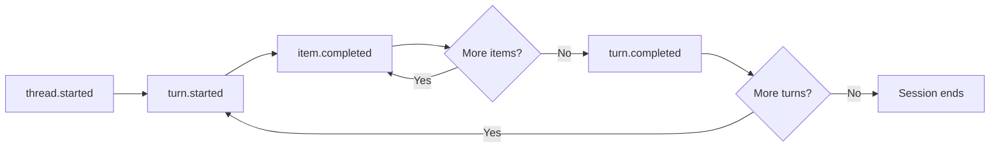
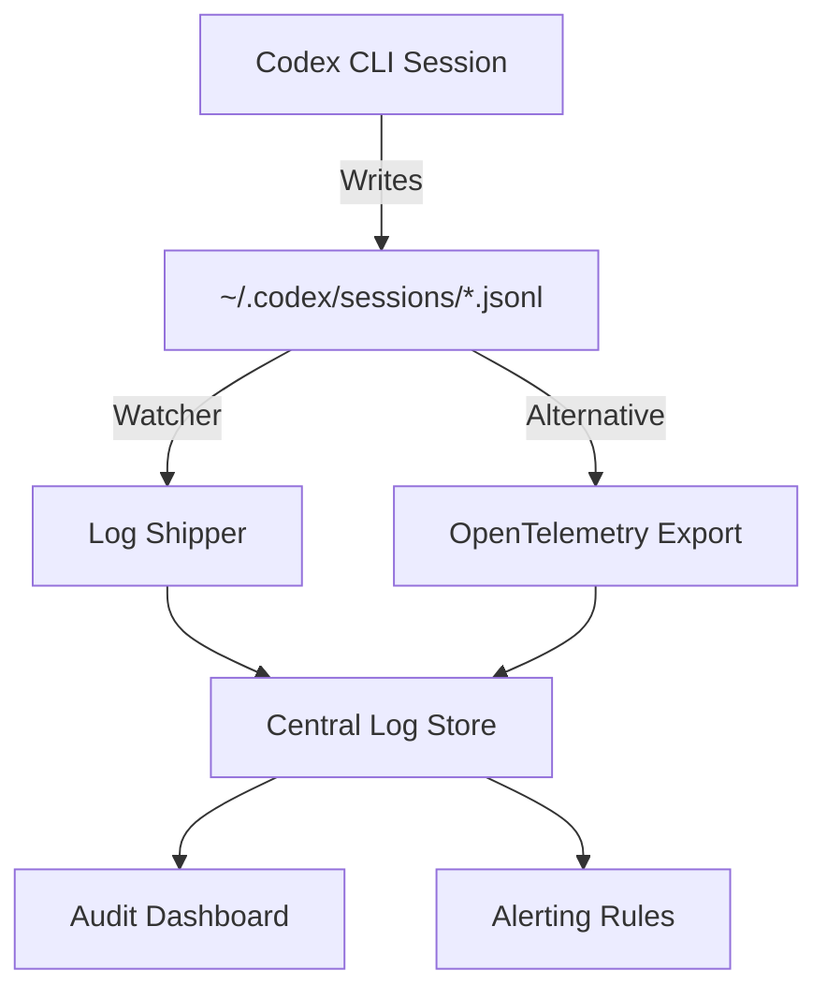

# Codex CLI Rollout Files: Session Recording, Replay, and Building Audit Trails


Every `codex` invocation silently writes a JSONL rollout file — a complete, append-only transcript of everything the agent saw, thought, executed, and produced. Most practitioners ignore these files until they need to understand why an agent deleted a migration or to satisfy an auditor asking "what did the AI actually do?" This article unpacks the rollout file format, shows how to inspect and replay sessions, and demonstrates how to build lightweight audit pipelines around them.

## Where Rollout Files Live

Codex persists sessions under `~/.codex/sessions/` using a date-partitioned directory structure [^1]:

```
~/.codex/sessions/
└── 2026/
    └── 04/
        └── 29/
            ├── rollout-2026-04-29T08-14-22-a1b2c3d4.jsonl
            └── rollout-2026-04-29T11-45-07-e5f6g7h8.jsonl
```

Each file covers one session thread. The filename encodes the UTC start time and a truncated session identifier — the same UUID you see when you run `/status` inside the TUI or pass to `codex resume <SESSION_ID>` [^2]. The session ID itself is generated server-side by the OpenAI backend; you cannot override it via CLI flags [^3].

### Controlling Persistence

Two configuration knobs matter:

| Flag / Config | Effect |
|---|---|
| `--ephemeral` | Prevents rollout files from being written to disk entirely [^4] |
| `codex exec` (default) | Writes rollout files unless `--ephemeral` is set |

Use `--ephemeral` in throw-away experiments or when processing sensitive data that must not persist locally. For everything else, leave rollout recording on — it costs negligible disk space and pays dividends during debugging.

## Anatomy of a Rollout File

Each line in the JSONL file is a self-contained JSON object representing a single event in the agent loop. The event types mirror those emitted by `codex exec --json` [^5]:



### Core Event Types

**`thread.started`** — Emitted once at session creation. Contains the `thread_id` UUID.

```json
{"type":"thread.started","thread_id":"0199a213-81c0-7800-8aa1-bbab2a035a53"}
```

**`turn.started`** / **`turn.completed`** — Bracket each model invocation. The `turn.completed` event carries token usage, including the new reasoning-token breakdown introduced in v0.125 [^6]:

```json
{
  "type": "turn.completed",
  "usage": {
    "input_tokens": 24763,
    "cached_input_tokens": 24448,
    "output_tokens": 122,
    "reasoning_tokens": 512
  }
}
```

**`item.completed`** — The workhorse event. Each item corresponds to one discrete agent action:

| Item Type | What It Records |
|---|---|
| `agent_message` | The model's textual response |
| `reasoning` | Internal chain-of-thought (when visible) |
| `command_execution` | Shell commands run, exit codes, stdout/stderr |
| `file_change` | Diffs applied via `apply_patch` |
| `mcp_tool_call` | MCP tool invocations with arguments and results |
| `web_search` | Web search queries and result summaries |
| `plan_update` | Plan creation and step transitions |
| `approval_decision` | User approval or rejection of proposed actions |

**`turn.failed`** / **`error`** — Capture failures, including rate limits, sandbox violations, and model errors [^5].

## Inspecting Rollout Files

### Quick Inspection with jq

Since rollout files are plain JSONL, standard Unix tools work immediately:

```bash
# Count events by type
cat ~/.codex/sessions/2026/04/29/rollout-*.jsonl \
  | jq -r '.type' | sort | uniq -c | sort -rn

# Extract all shell commands the agent ran
cat rollout-*.jsonl \
  | jq -r 'select(.item.type == "command_execution") | .item.command'

# Sum token usage across all turns
cat rollout-*.jsonl \
  | jq -r 'select(.type == "turn.completed") | .usage.input_tokens' \
  | paste -sd+ | bc
```

### Session-Level Analysis with ccusage

The community tool **ccusage** provides a polished session report view [^7]. Install it and run:

```bash
ccusage codex session --since 2026-04-29 --json | jq '.sessions[] | {
  session: .session,
  lastActivity: .lastActivity,
  inputTokens: .totals.input_tokens,
  cost: .totals.cost
}'
```

ccusage groups sessions by directory and date, shows per-model breakdowns, cached token counts, and total cost — ideal for weekly spend reviews.

### Debug Trace Reduction

Codex v0.125 introduced a debug reducer command that condenses rollout traces into a summary of tool, code-mode, session, and multi-agent relationship boundaries [^6]. This is particularly valuable when debugging subagent orchestration, as it shows which child agents were spawned and how data flowed between them:

```bash
codex debug trace-reduce ~/.codex/sessions/2026/04/29/rollout-*.jsonl
```

The reducer output highlights:

- Tool execution boundaries and durations
- Code-mode transitions (read-only → full-auto escalations)
- Subagent spawn and completion events
- Approval decision points

## Replaying Sessions

Session replay is the primary mechanism for resuming interrupted work. When you run `codex resume`, the ContextManager reads the rollout JSONL and reconstructs the model's conversational state — prior messages, approved plans, command outputs, and file changes [^2].

```bash
# Resume the most recent session
codex resume --last

# Resume a specific session by ID
codex resume 0199a213-81c0-7800-8aa1-bbab2a035a53

# Resume non-interactively and extend with a new task
codex exec resume --last "Now add unit tests for the changes you made"
```

Resumed sessions retain the full approval history. If the original session used `suggest` mode and you approved three file edits, those approvals remain in the replayed context — the model will not re-ask for permission on already-approved changes [^2].

### Cross-Directory Resume

By default, `codex resume` filters to sessions started in the current working directory. Pass `--all` to see sessions from any directory, or use `--cd` to override the working directory during resume [^4]:

```bash
codex resume --all
codex resume --cd /path/to/other/project --last
```

## Building Audit Trails

For regulated environments — HIPAA, SOC 2, PCI-DSS — the question is not whether the AI did something useful, but whether you can prove exactly what it did. Rollout files provide the raw evidence; the challenge is structuring that evidence into auditable records.

### Pipeline Architecture



### Approach 1: Ship Rollout Files Directly

A straightforward cron job or filesystem watcher can ship rollout files to centralised storage:

```bash
#!/usr/bin/env bash
# Ship today's rollout files to S3
SESSIONS_DIR="$HOME/.codex/sessions/$(date +%Y/%m/%d)"
if [ -d "$SESSIONS_DIR" ]; then
  aws s3 sync "$SESSIONS_DIR" \
    "s3://codex-audit-logs/$(hostname)/$(date +%Y/%m/%d)/" \
    --exclude "*.tmp"
fi
```

### Approach 2: OpenTelemetry Integration

Codex supports opt-in observability via OpenTelemetry [^8]. Enable it in `~/.codex/config.toml`:

```toml
[otel]
log_user_prompt = true
exporter = { otlp-grpc = {
  endpoint = "https://ingest.eu.signoz.cloud:443",
  headers = { "signoz-ingestion-key" = "your-key-here" }
}}
```

When enabled, Codex emits structured traces covering [^8]:

- Conversation lifecycle events
- API request spans
- Tool approval decisions
- Tool execution results
- User prompts (redactable via `log_user_prompt = false`)

This integrates directly with any OTel-compatible backend — SigNoz, Jaeger, Grafana Tempo, Datadog — giving your security team the same dashboards they already use for application observability.

### Approach 3: Extract Compliance Artefacts

For formal audit evidence, extract specific event types into structured reports:

```bash
#!/usr/bin/env bash
# Generate a compliance report for a specific session
SESSION_FILE="$1"

echo "=== Codex Session Audit Report ==="
echo "Session: $(jq -r 'select(.type=="thread.started") | .thread_id' "$SESSION_FILE")"
echo ""
echo "--- Commands Executed ---"
jq -r 'select(.item.type=="command_execution") |
  "[\(.timestamp)] \(.item.command) → exit \(.item.exit_code)"' "$SESSION_FILE"
echo ""
echo "--- Files Modified ---"
jq -r 'select(.item.type=="file_change") |
  "[\(.timestamp)] \(.item.path)"' "$SESSION_FILE"
echo ""
echo "--- Approval Decisions ---"
jq -r 'select(.item.type=="approval_decision") |
  "[\(.timestamp)] \(.item.action): \(.item.decision)"' "$SESSION_FILE"
```

## Disk Management

Rollout files accumulate. At the time of writing, Codex does not auto-archive old sessions, though there is an open feature request for `codex sessions archive --older-than 30d --compress zstd` [^9]. In the meantime, manage disk usage manually:

```bash
# Check total rollout storage
du -sh ~/.codex/sessions/

# Archive sessions older than 30 days
find ~/.codex/sessions/ -name "rollout-*.jsonl" -mtime +30 \
  -exec zstd --rm {} \;

# Or remove sessions older than 90 days
find ~/.codex/sessions/ -name "rollout-*.jsonl" -mtime +90 -delete
```

⚠️ Compressing or moving rollout files will break `codex resume` for those sessions. Archive only sessions you are confident you will not need to resume.

## Practical Patterns

**Cost attribution by project.** Parse `turn.completed` events, group by the working directory embedded in the session path, and aggregate token costs per repository per week.

**Incident forensics.** When an agent makes an undesirable change, the rollout file contains the exact sequence of tool calls, model reasoning, and approval decisions that led to the change — far more useful than a git diff alone.

**Onboarding validation.** Have new team members run their first Codex sessions in `suggest` mode, then review the rollout files to check whether their AGENTS.md and config.toml produce sensible agent behaviour before granting `auto-edit` or `full-auto` approval policies.

**Subagent debugging.** The v0.125 rollout tracing records parent–child agent relationships [^6]. When a subagent produces unexpected output, the trace reduction shows exactly which turn in which agent diverged from the plan.

## Citations

[^1]: [Codex CLI Features — Session storage](https://developers.openai.com/codex/cli/features), OpenAI Developers, 2026.
[^2]: [Codex CLI Reference — Resume commands](https://developers.openai.com/codex/cli/reference), OpenAI Developers, 2026.
[^3]: [Session/Rollout Files — Discussion #3827](https://github.com/openai/codex/discussions/3827), openai/codex, GitHub, 2026.
[^4]: [Non-interactive mode — codex exec reference](https://developers.openai.com/codex/noninteractive), OpenAI Developers, 2026.
[^5]: [Non-interactive mode — JSON Lines event types](https://developers.openai.com/codex/noninteractive), OpenAI Developers, 2026.
[^6]: [Codex Changelog — v0.125.0](https://developers.openai.com/codex/changelog), OpenAI Developers, April 2026.
[^7]: [ccusage — Codex Session Report (Beta)](https://ccusage.com/guide/codex/session), ccusage, 2026.
[^8]: [OpenAI Codex Observability with OpenTelemetry](https://signoz.io/docs/codex-monitoring/), SigNoz Documentation, 2026.
[^9]: [Auto-archive and zstd-compress inactive local rollout files — Issue #17000](https://github.com/openai/codex/issues/17000), openai/codex, GitHub, 2026.
