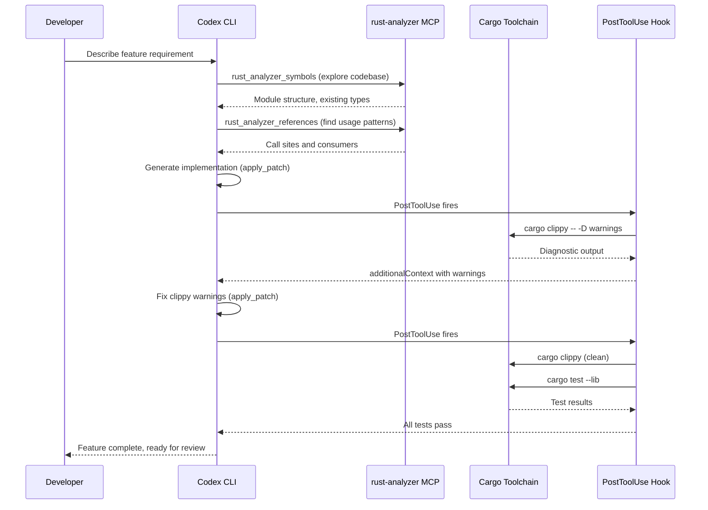

# Codex CLI for Rust Development Teams: rust-analyzer MCP, Cargo Hooks, and Agent-Driven Workflows


---

Codex CLI is itself built in Rust — roughly 95% of the codebase lives in the `codex-rs` crate[^1]. That shared lineage makes it unusually well-suited for Rust projects: the agent already understands Cargo conventions, and the Rust toolchain's deterministic compiler feedback gives the agent the tight signal loop it needs to self-correct. This article covers the full stack for Rust teams adopting Codex CLI in 2026: AGENTS.md conventions, the rust-analyzer MCP server, PostToolUse hooks for cargo verification, config profiles, and a practical feature development workflow.

## Why Rust Is Agent-Friendly

Three properties make Rust an excellent target for agentic development:

1. **Deterministic compiler feedback.** `rustc` and `cargo clippy` produce structured, actionable diagnostics. Unlike dynamically typed languages where errors surface at runtime, the agent gets immediate, precise error messages it can parse and act on[^2].

2. **Convention-heavy toolchain.** `cargo fmt`, `cargo clippy`, `cargo test`, and `cargo doc` form a uniform verification pipeline that every Rust project shares. The agent does not need project-specific build incantations.

3. **Strong type system.** Ownership, borrowing, and lifetime rules mean the compiler catches entire categories of bugs that agents in other languages would silently introduce. The agent's output is either correct or rejected — there is little ambiguity.

## AGENTS.md for Rust Projects

The AGENTS.md file tells Codex CLI what it cannot infer from the codebase alone[^3]. For Rust projects, the key is encoding conventions the compiler does not enforce:

```markdown
# AGENTS.md

## Build & Verify
- `cargo fmt --check` — formatting gate, must pass before any commit
- `cargo clippy -- -D warnings` — treat all warnings as errors
- `cargo test` — full test suite, run after every change
- `cargo build --release` — verify release builds compile

## Coding Conventions
- Rust 2024 edition (edition = "2024" in Cargo.toml)
- Never use `.unwrap()` in library code; use `thiserror` for typed errors
  and `anyhow` for application-level error handling
- Prefer `impl Trait` over `dyn Trait` unless dynamic dispatch is required
- All public items require doc comments (`///`)
- 100-character line limit

## Architecture Decisions
- Async runtime: tokio (multi-threaded scheduler)
- Serialisation: serde + serde_json
- HTTP: axum with tower middleware
- No unsafe code without an accompanying `// SAFETY:` comment

## Security
- Never hardcode secrets; use environment variables via `dotenvy`
- Dependencies must pass `cargo audit` with no advisories
```

For polyglot monorepos, place this in the Rust workspace root directory. Codex CLI discovers AGENTS.md files hierarchically, so a top-level file governs the whole workspace while subdirectory files can override for individual crates[^4].

The `agentsmd` crate on crates.io can auto-generate per-project AGENTS.md files using conditional matchers like `exists("**/*.rs")`, which is useful for teams managing multiple repositories[^5].

## rust-analyzer MCP Server

The `rust-analyzer-mcp` server bridges rust-analyzer's Language Server Protocol capabilities into Codex CLI via MCP, giving the agent semantic code intelligence rather than relying solely on text pattern matching[^6].

### Installation

```bash
cargo install rust-analyzer-mcp
```

Requires rust-analyzer installed and a valid workspace with `Cargo.toml`. Minimum Rust version: 1.70[^6].

### config.toml Setup

```toml
[mcp_servers.rust-analyzer]
command = "rust-analyzer-mcp"
args = []
```

The server communicates via stdio, so no additional transport configuration is needed[^6].

### Available Tools

The server exposes ten tools[^6]:

| Tool | Purpose |
|------|---------|
| `rust_analyzer_symbols` | List all symbols (functions, structs, enums) in a file |
| `rust_analyzer_definition` | Jump to a symbol's definition |
| `rust_analyzer_references` | Find all references to a symbol |
| `rust_analyzer_hover` | Display documentation and type information |
| `rust_analyzer_completion` | Code completions at a position |
| `rust_analyzer_format` | Format code via rustfmt |
| `rust_analyzer_code_actions` | Available refactorings and quick fixes |
| `rust_analyzer_diagnostics` | Errors, warnings, and hints for a file |
| `rust_analyzer_workspace_diagnostics` | Diagnostics across the entire workspace |
| `rust_analyzer_set_workspace` | Change the workspace root |

For large workspaces, `rust_analyzer_workspace_diagnostics` can be expensive. Consider using `rust_analyzer_diagnostics` on individual files during iterative development and reserving the workspace-wide scan for final verification.

## PostToolUse Hooks for Cargo Verification

Hooks are now stable as of v0.124 and can be configured inline in `config.toml`[^7]. For Rust projects, the most valuable pattern is running `cargo clippy` and `cargo test` after every Bash command that modifies source files:

```toml
[features]
codex_hooks = true

[[hooks.PostToolUse]]
matcher = "^Bash$"

[[hooks.PostToolUse.hooks]]
type = "command"
command = "cargo clippy -- -D warnings 2>&1 | head -50"
timeout = 120
statusMessage = "Running cargo clippy..."

[[hooks.PostToolUse]]
matcher = "^apply_patch$"

[[hooks.PostToolUse.hooks]]
type = "command"
command = "cargo clippy -- -D warnings 2>&1 | head -50"
timeout = 120
statusMessage = "Verifying patch with clippy..."
```

The hook output is fed back to the agent as `additionalContext`, so when clippy reports a warning, the agent sees it immediately and can self-correct in the same turn[^7].

**Important:** keep the `timeout` generous for large workspaces. Incremental clippy builds are fast, but the first invocation after a cold start can take minutes. Pipe through `head -50` to avoid flooding the agent's context window with verbose output.

For a tighter loop, add a second hook that runs the test suite:

```toml
[[hooks.PostToolUse]]
matcher = "^Bash$|^apply_patch$"

[[hooks.PostToolUse.hooks]]
type = "command"
command = "cargo test --lib --quiet 2>&1 | tail -20"
timeout = 180
statusMessage = "Running cargo test..."
```

## Config Profiles for Rust Development

```toml
# ~/.codex/config.toml

[profiles.rust-deep]
model = "gpt-5.5"
approval_mode = "suggest"
reasoning_effort = "high"

[profiles.rust-flow]
model = "o4-mini"
approval_mode = "auto-edit"
reasoning_effort = "medium"

[profiles.rust-ci]
model = "codex-spark"
approval_mode = "full-auto"
reasoning_effort = "low"

# Sandbox settings for Rust projects
[sandbox]
allow_commands = [
  "cargo",
  "rustc",
  "rustup",
  "rust-analyzer-mcp",
]
```

Use `rust-deep` for complex refactoring, unsafe code review, and architectural decisions where GPT-5.5's stronger reasoning pays off[^8]. Use `rust-flow` for everyday feature development. Reserve `rust-ci` with Codex-Spark for fast, cheap CI gates via `codex exec`[^9].

## Agent-Driven Feature Development Workflow

The following sequence illustrates the typical loop when developing a new feature in a Rust project with Codex CLI:



This closed-loop pattern means the agent rarely produces code that fails the project's own quality gates. The rust-analyzer MCP server provides semantic awareness (definitions, references, diagnostics) while the PostToolUse hooks enforce the cargo verification pipeline after every edit.

## Agent-Ready API Documentation

A proposed Cargo feature (`cargo doc --output-format=markdown`) would generate Markdown API documentation from your exact `Cargo.lock` versions, giving the agent version-accurate reference material rather than stale training data[^10]. Until this lands in stable Cargo, a practical workaround is to generate JSON docs and reference them in your AGENTS.md:

```bash
RUSTDOCFLAGS="-Z unstable-options --output-format json" cargo doc --no-deps
```

Then point your AGENTS.md at the generated JSON:

```markdown
## API Reference
- Generated docs: `target/doc/*.json` (run `cargo doc` to refresh)
- Always check the generated docs before assuming an API shape
```

## Model Selection Table

| Task | Recommended Model | Reasoning Effort | Rationale |
|------|-------------------|------------------|-----------|
| Feature implementation | o4-mini | Medium | Good balance of speed and capability |
| Unsafe code review | GPT-5.5 | High | Needs deep reasoning about soundness[^8] |
| Refactoring (large) | GPT-5.5 | High | Cross-module awareness matters |
| Bug fix from stack trace | o4-mini | Medium | Focused, localised changes |
| CI gate (`codex exec`) | Codex-Spark | Low | Fast, cheap, sufficient for lint-and-test[^9] |
| Dependency audit | GPT-5.5 | Medium | Evaluating security advisories |

## Common Pitfalls

| Pitfall | Symptom | Fix |
|---------|---------|-----|
| Agent uses `.unwrap()` everywhere | Runtime panics in production | Add explicit ban in AGENTS.md; clippy `unwrap_used` lint |
| Stale rust-analyzer index | MCP returns outdated symbols | Restart the MCP server or call `rust_analyzer_set_workspace` |
| Hook timeout on cold build | PostToolUse hook fails with timeout | Increase `timeout` to 300s; pre-warm with `cargo check` before starting |
| Agent generates `unsafe` without justification | Unsound code | AGENTS.md rule: require `// SAFETY:` comments; consider PreToolUse hook to flag `unsafe` blocks |
| Clippy flood fills context window | Agent loses focus from verbose output | Pipe hook output through `head -50` or `\| grep "^error"` |
| Agent ignores workspace structure | Edits wrong crate in multi-crate workspace | Use hierarchical AGENTS.md with per-crate overrides[^4] |
| MCP schema bloat | Slow tool discovery with many MCP servers | Only enable rust-analyzer MCP; disable unused servers for Rust sessions |

## Headless CI Pipeline

For CI integration, use `codex exec` with the Rust-specific profile:

```bash
codex exec \
  --model codex-spark \
  --approval-mode full-auto \
  --sandbox network-off \
  --ignore-user-config \
  "Review the changes in this PR for Rust best practices. \
   Run cargo clippy -- -D warnings and cargo test. \
   Report any issues as a JSON object with fields: \
   pass (boolean), issues (array of strings)." \
  --output-schema ./pr-review-schema.json
```

Combine with `codex-action@v1` in GitHub Actions for automated PR review[^11]:


```yaml
- uses: openai/codex-action@v1
  with:
    codex-args: >
      exec
      --model codex-spark
      --approval-mode full-auto
      --sandbox network-off
      "Run cargo clippy -- -D warnings and cargo test.
       Summarise results."
  env:
    OPENAI_API_KEY: ${{ secrets.OPENAI_API_KEY }}
```


## Conclusion

Rust's deterministic compiler feedback, convention-heavy toolchain, and strong type system make it one of the best-suited languages for agentic development. The combination of an AGENTS.md that encodes project conventions, a rust-analyzer MCP server for semantic code intelligence, and PostToolUse hooks for continuous cargo verification creates a tight feedback loop where the agent self-corrects against the same quality gates your team already enforces. The irony is not lost: the tool built in Rust is also one of the best tools for building *with* Rust.

---

## Citations

[^1]: InfoQ, "Another Rust Rewrite: OpenAI's Codex CLI Goes Native", [https://www.infoq.com/news/2025/06/codex-cli-rust-native-rewrite/](https://www.infoq.com/news/2025/06/codex-cli-rust-native-rewrite/)
[^2]: Rust Blog, "Announcing Rust 1.85.0 and Rust 2024", [https://blog.rust-lang.org/2025/02/20/Rust-1.85.0/](https://blog.rust-lang.org/2025/02/20/Rust-1.85.0/)
[^3]: OpenAI, "Custom instructions with AGENTS.md", [https://developers.openai.com/codex/guides/agents-md](https://developers.openai.com/codex/guides/agents-md)
[^4]: OpenAI, "Config basics — Codex", [https://developers.openai.com/codex/config-basic](https://developers.openai.com/codex/config-basic)
[^5]: crates.io, "agentsmd — generate per-project AGENTS.md files", [https://crates.io/crates/agentsmd](https://crates.io/crates/agentsmd)
[^6]: GitHub, "zeenix/rust-analyzer-mcp — MCP server for rust-analyzer", [https://github.com/zeenix/rust-analyzer-mcp](https://github.com/zeenix/rust-analyzer-mcp)
[^7]: OpenAI, "Hooks — Codex", [https://developers.openai.com/codex/hooks](https://developers.openai.com/codex/hooks)
[^8]: OpenAI, "Models — Codex", [https://developers.openai.com/codex/models](https://developers.openai.com/codex/models)
[^9]: OpenAI, "Codex CLI Speed Stack — fast mode, reasoning effort, Spark", [https://developers.openai.com/codex/cli/features](https://developers.openai.com/codex/cli/features)
[^10]: GitHub, "cargo doc --output-format=markdown: generate agent-ready API docs", [https://github.com/rust-lang/cargo/issues/16720](https://github.com/rust-lang/cargo/issues/16720)
[^11]: OpenAI, "codex-action@v1 — GitHub Action", [https://developers.openai.com/codex/guides/github-action](https://developers.openai.com/codex/guides/github-action)
