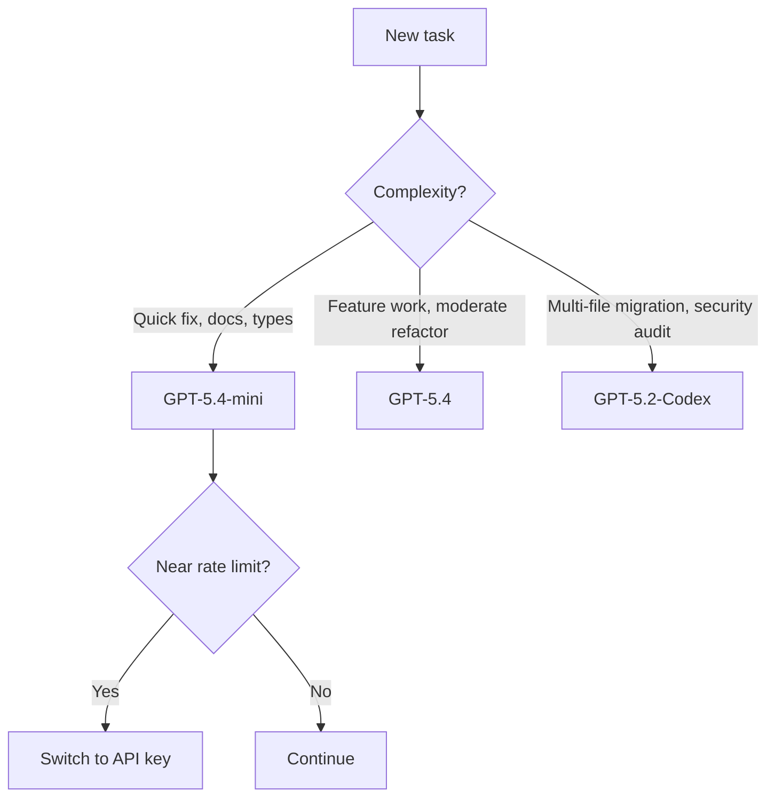

# Codex CLI for Solo Developers: Maximum Impact from a One-Person Agentic Setup


---

Most Codex CLI guidance assumes you are part of a team with shared configuration, dedicated budgets, and someone else worrying about rate limits. If you are a solo developer or running a two-person outfit, the calculus is different. Every token matters, every minute of setup must pay for itself, and there is no ops team to maintain your MCP servers. This article covers how to extract maximum value from Codex CLI when you are the entire engineering department.

## Choosing the Right Subscription Tier

The first decision is which ChatGPT plan to pair with Codex CLI. Three tiers make practical sense for solo work [^1]:

| Plan | Monthly Cost | Codex Rate Multiplier | Best For |
|------|:-----------:|:---------------------:|----------|
| Plus | \$20 | 1× | Casual use, side projects |
| Pro | \$200 | 5× | Full-time solo development |
| API (pay-as-you-go) | Usage-based | No rate windows | CI pipelines, batch work |

The Plus tier gives you 20–100 local messages per five-hour window on GPT-5.4, rising to 60–350 on GPT-5.4-mini [^1]. For a solo developer shipping one feature per day, Plus is often sufficient — provided you manage your model selection (more on that below). Pro's 5× multiplier removes most rate-limit anxiety but costs ten times as much, so it only makes sense if Codex is your primary development tool for several hours daily.

For headless `codex exec` in CI pipelines, an API key with pay-as-you-go billing avoids rate windows entirely and lets you pin costs to actual usage [^2].

## A Minimal, Effective config.toml

Enterprise guides recommend elaborate multi-profile configurations. A solo developer needs three things: a sensible default model, a safe approval mode, and schema validation for the config file itself [^3] [^4]:

```toml
# ~/.codex/config.toml
# yaml-language-server: $schema=https://codex-schema.openai.com/config.json

model = "gpt-5.4-mini"
model_reasoning_effort = "medium"
approval_mode = "suggest"

[features]
shell_snapshot = true
```

Why `gpt-5.4-mini` as the default? It consumes roughly 30% of the rate-limit budget that GPT-5.4 uses per message [^1]. For the bulk of daily tasks — generating tests, writing documentation, fixing lint errors, adding type annotations — it is fast, cheap, and perfectly capable. Reserve heavier models for when you genuinely need them, using a profile override:

```toml
[profiles.heavy]
model = "gpt-5.2-codex"
model_reasoning_effort = "high"
```

```bash
# Switch to the heavy profile for a complex refactor
codex --profile heavy "Migrate the data layer from Sequelize to Drizzle ORM"
```

The `shell_snapshot = true` feature flag caches shell environment state between commands, shaving seconds off repeated tool calls — a small gain per invocation that compounds across a full working day [^4].

## AGENTS.md: Your Project's Institutional Memory

When you work alone, there is no colleague to remind you of project conventions. AGENTS.md fills that role. The `/init` command scaffolds a starter file, but the real value comes from customising it to encode decisions you would otherwise forget [^5]:

```markdown
# AGENTS.md

## Project
Express API with PostgreSQL, deployed on Railway. Monorepo with `api/` and `web/` directories.

## Conventions
- All database queries go through `src/db/queries/` — never inline SQL.
- Error responses follow RFC 9457 Problem Details format.
- Tests use Vitest. Run `pnpm test` before suggesting a task is complete.

## Do Not
- Do not modify `src/db/migrations/` without explicit instruction.
- Do not install new dependencies without asking first.
```

This is not documentation for humans — it is a system prompt for your agent. Every line should change Codex's behaviour in a way that saves you from correcting it later. Review and update it weekly; stale instructions are worse than none.

## Model Selection Strategy



The goal is to use the cheapest model that produces acceptable output. GPT-5.4-mini handles 70–80% of daily tasks [^1]. When you hit something that requires deeper reasoning — an architectural decision, a cross-module refactor, a security review — escalate to GPT-5.2-Codex via the `--profile heavy` flag. This two-tier approach lets a Plus subscriber stretch their rate limits across a full working day rather than exhausting them by mid-morning.

For solo developers on the Pro plan, GPT-5.4 becomes a comfortable default, with GPT-5.2-Codex reserved for long-horizon sessions where its context compaction and 400K token window justify the switch [^6].

## Skills: Automating Your Recurring Workflows

Every solo developer has tasks they repeat weekly — updating changelogs, generating release notes, running security scans, scaffolding new components. Skills package these into reusable instructions that Codex executes consistently [^7]:

```markdown
<!-- ~/.codex/skills/release-notes.md -->
---
name: release-notes
description: "Generate release notes from recent commits"
---

1. Run `git log --oneline $(git describe --tags --abbrev=0)..HEAD`.
2. Group commits by type (feat, fix, chore, docs).
3. Write RELEASE_NOTES.md in Keep a Changelog format.
4. Include the next semantic version number based on commit types.
```

Once saved, invoke it by name:

```bash
codex "Use the release-notes skill"
```

The economics here are compelling. A skill that saves five minutes per week and costs a few thousand tokens to execute pays for itself within a single iteration. Build skills for your top five repetitive tasks first, then expand.

## Practical Daily Workflow

A productive solo workflow with Codex CLI follows a rhythm:

1. **Morning**: open Codex in the project directory with `gpt-5.4-mini`. Run `/init` if AGENTS.md is stale. Triage issues and plan the day using Codex's plan mode (`Shift+Tab` to toggle) [^5].
2. **Implementation**: work through features with `suggest` approval mode. Let Codex propose changes, review the diffs, approve what looks right. For complex tasks, switch to the `heavy` profile.
3. **Testing**: ask Codex to write and run tests. The `shell_snapshot` feature makes repeated test runs faster.
4. **End of day**: use a release-notes skill or ask Codex to summarise the day's changes for your commit messages.

The key discipline is resisting the urge to use the most powerful model for everything. A solo developer's rate limits and budget are finite — spend them where they matter.

## Cost Comparison: Solo Developer Monthly Spend

| Approach | Estimated Monthly Cost | Notes |
|----------|:---------------------:|-------|
| Plus + GPT-5.4-mini default | \$20 (subscription only) | Sufficient for 4–6 hours daily |
| Pro + GPT-5.4 default | \$200 (subscription only) | Comfortable for 8+ hours daily |
| API key + GPT-5.2-Codex | ~\$5–15 (usage-based) | Best for CI/CD pipelines |
| API key + GPT-5.5 | ~\$50–200 (usage-based) | Only if you need computer use |

For most solo developers shipping web applications, the Plus tier with disciplined model selection costs less per month than a single SaaS tool subscription — and replaces several of them [^2].

## What Solo Developers Should Skip

Not every Codex feature is worth configuring when you are a team of one:

- **Multi-agent orchestration via MCP Server** — the Agents SDK pattern shines for large-scale parallel work, but the setup overhead is disproportionate for solo use. Stick with subagents if you need parallelism [^8].
- **Complex hook pipelines** — pre- and post-tool hooks are powerful for enterprise policy enforcement, but a solo developer's AGENTS.md instructions achieve the same guardrails with less maintenance.
- **Multiple MCP servers** — connect one or two that genuinely extend Codex's capabilities (a database MCP server, perhaps, or a deployment tool). Each additional server is a dependency you maintain alone.

## Summary

The optimal solo developer setup in late April 2026 is deliberately simple: GPT-5.4-mini as the default model, a focused AGENTS.md, two or three skills for recurring tasks, and a `heavy` profile for the occasions that demand deeper reasoning. The discipline is in the model selection, not the configuration complexity. Start small, measure what works, and expand only when a new capability demonstrably saves more time than it costs to maintain.

---

## Citations

[^1]: OpenAI, "Codex Rate Card," [https://help.openai.com/en/articles/20001106-codex-rate-card](https://help.openai.com/en/articles/20001106-codex-rate-card), April 2026.

[^2]: OpenAI Developers, "Pricing — Codex," [https://developers.openai.com/codex/pricing](https://developers.openai.com/codex/pricing), April 2026.

[^3]: OpenAI Developers, "Config Basics — Codex," [https://developers.openai.com/codex/config-basic](https://developers.openai.com/codex/config-basic), April 2026.

[^4]: OpenAI Developers, "Configuration Reference — Codex," [https://developers.openai.com/codex/config-reference](https://developers.openai.com/codex/config-reference), April 2026.

[^5]: OpenAI Developers, "Best Practices — Codex," [https://developers.openai.com/codex/learn/best-practices](https://developers.openai.com/codex/learn/best-practices), April 2026.

[^6]: OpenAI, "Introducing GPT-5.2-Codex," [https://openai.com/index/introducing-gpt-5-2-codex/](https://openai.com/index/introducing-gpt-5-2-codex/), April 2026.

[^7]: OpenAI Developers, "Skills — Codex," [https://developers.openai.com/codex/skills](https://developers.openai.com/codex/skills), April 2026.

[^8]: OpenAI Developers, "Subagents — Codex," [https://developers.openai.com/codex/subagents](https://developers.openai.com/codex/subagents), April 2026.
