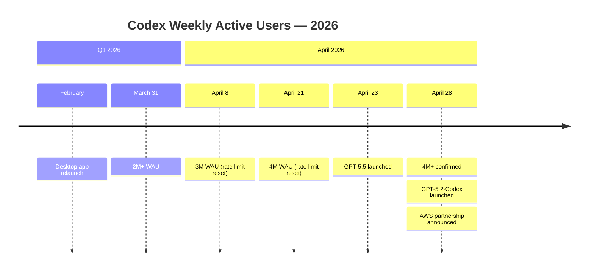
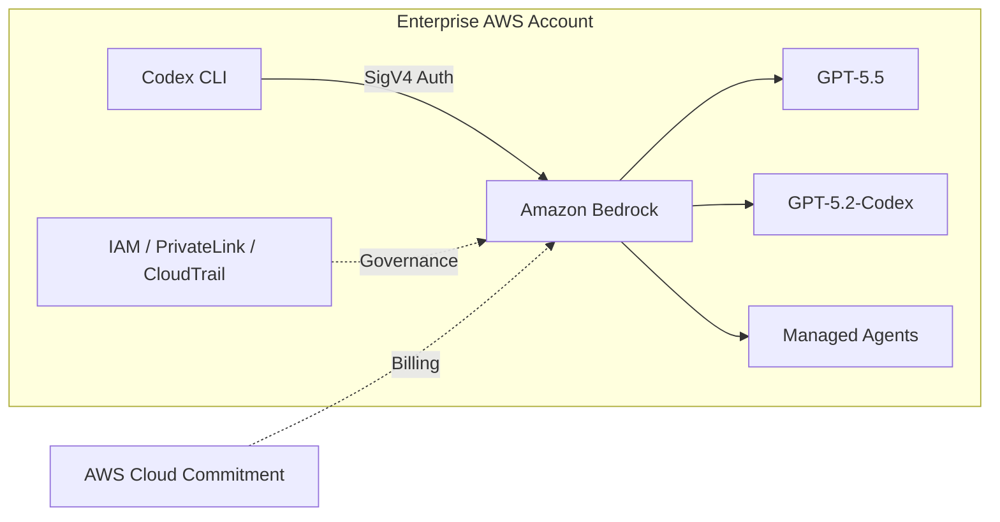
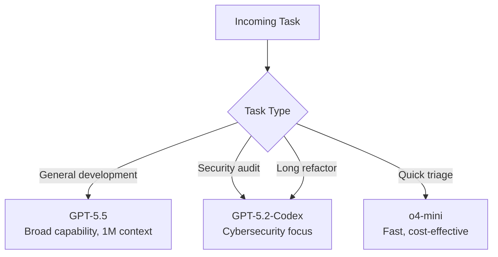

# Codex at Four Million: What Three Weeks of Hypergrowth Reveals About the Agentic Coding Market


---

On 28 April 2026, the OpenAI-AWS partnership announcement casually confirmed that "more than 4 million people now use Codex every week" [^1]. Three weeks earlier, Sam Altman had celebrated 3 million [^2]. Six weeks before that, the figure was 2 million [^3]. Codex doubled its weekly active user base in under two months — while simultaneously launching a new frontier model, restructuring its pricing, signing the largest cloud partnership in its history, and shipping a purpose-built cybersecurity coding model.

This article dissects the growth mechanics, the strategic moves that enabled them, and what the trajectory signals for engineering teams evaluating Codex CLI for production workflows.

## The Growth Curve



The 2M → 3M leg took roughly a week [^2]. The 3M → 4M leg took two weeks [^4]. Within ChatGPT Business and Enterprise plans specifically, Codex usage grew 6x since January 2026 [^5]. Overall usage is up 10x since August 2025 [^5].

For context, GitHub Copilot — the incumbent — reported 20 million-plus developers in mid-2025 [^6]. Codex is not yet in the same league by volume, but its growth rate is substantially faster, and its enterprise penetration is accelerating along a steeper curve.

## What Drove the Surge

Three factors converged in April to create a compounding growth loop.

### 1. GPT-5.5 as the Default Model

On 23 April 2026, OpenAI made GPT-5.5 available across all Codex surfaces [^7]. The model leads agentic coding benchmarks — 82.7% on Terminal-Bench 2.0, 73.1% on Expert-SWE (long-horizon), and 84.9% on GDPval [^7] — while matching GPT-5.4's per-token latency and consuming fewer tokens per task.

For Codex CLI users, the upgrade was immediate. GPT-5.5 became the recommended model in v0.125.0 [^8]:

```bash
# Explicitly select GPT-5.5 for a new session
codex --model gpt-5.5

# Or set it as default in config.toml
```

```toml
[model]
default = "gpt-5.5"
```

The million-token context window is the headline feature for CLI workflows. Sessions that previously hit compaction limits after 30–40 minutes can now run for hours without context drift [^9]. For teams running `codex exec` in CI pipelines, this means fewer mid-task hallucinations and more reliable structured output.

### 2. The Pay-As-You-Go Pricing Restructure

On 2 April 2026, OpenAI shifted Codex pricing from per-message to per-token billing, aligned with the API rate card [^10]. The practical effects:

| Change | Before | After |
|--------|--------|-------|
| **Billing unit** | Per message | Per token (input, cached, output) |
| **Business seat** | \$25/month | \$20/month |
| **Codex-only seats** | Not available | Pay-as-you-go, no fixed fee, no rate limits |
| **Enterprise** | Seat-based only | Choice of seat-based or pay-as-you-go |
| **Promotional credits** | None | Up to \$500 per team for new Codex-only seats [^10] |

The Codex-only seat is the critical innovation. Enterprise teams that previously had to provision full ChatGPT seats at \$25/month for developers who only needed the coding agent can now add seats with zero fixed cost and pure usage billing [^10]. For a 200-person engineering org where 60% of developers use Codex intermittently, the savings are material.

### 3. The Claude Code Performance Crisis

Anthropic's competitor Claude Code suffered a well-documented performance decline through March and April 2026 [^11]. On 24 April, Anthropic published a post-mortem identifying three engineering missteps: a March 4 reduction from "high" to "medium" reasoning effort, a March 26 bug that silently discarded reasoning history mid-session, and an April 16 system prompt change that capped responses at 25 words between tool calls [^12].

TrustedSec CEO Dave Kennedy measured a 47% drop in Claude Code quality [^11]. Several high-profile users, including a senior AMD AI executive who called the tool "unusable for complex engineering tasks," cancelled subscriptions [^11]. Anthropic resolved the issues by April 20 and reset usage limits on April 23 as an acknowledgement [^12].

The timing was fortuitous for Codex. GPT-5.5 launched in Codex on the same day Anthropic published its post-mortem (23 April). Developers who had grown frustrated with Claude Code's degraded output had a polished alternative waiting. ⚠️ It is impossible to directly attribute Codex user growth to Claude Code's stumble — OpenAI has not published churn-source data — but the temporal correlation is striking.

## The April 28 Triple Announcement

Three significant events landed on a single day.

### GPT-5.2-Codex

OpenAI released GPT-5.2-Codex, a coding-optimised fine-tune of GPT-5.2 targeting four areas: native context compaction, large code changes, Windows environment support, and cybersecurity capabilities [^13]. Benchmark scores:

| Benchmark | GPT-5.2-Codex | GPT-5.2 | GPT-5.5 |
|-----------|:---:|:---:|:---:|
| SWE-Bench Pro | **56.4%** | 55.6% | 58.6% |
| Terminal-Bench 2.0 | **64.0%** | 62.2% | **82.7%** |

GPT-5.5 outperforms GPT-5.2-Codex on headline benchmarks, but GPT-5.2-Codex excels at session durability — coherent work over 400K tokens without context drift [^13] — and ships the strongest cybersecurity capabilities of any OpenAI model [^14]. For security teams running vulnerability audits and fuzzing harnesses, it is the preferred model. The practical guidance for Codex CLI users:

```toml
# Security audit profile
[agents.security-auditor]
model = "gpt-5.2-codex"
instructions = "Focus on vulnerability discovery, attack surface analysis, and fuzzing harness generation."

# General development (default)
[model]
default = "gpt-5.5"
```

### The OpenAI-AWS Partnership

OpenAI and AWS announced three offerings in limited preview on Amazon Bedrock [^1]:

1. **OpenAI models on Bedrock** — GPT-5.5 and other frontier models accessible through standard Bedrock APIs, inheriting IAM, PrivateLink, guardrails, encryption, and CloudTrail logging.
2. **Codex on Bedrock** — the full Codex agent (CLI, desktop app, and VS Code extension) running against Bedrock-hosted models, with usage counting toward existing AWS cloud commitments.
3. **Managed Agents powered by OpenAI** — production-ready OpenAI-powered agents deployed on AWS infrastructure, using the OpenAI agent harness.



For enterprise Codex CLI teams, this eliminates the dual-billing friction of maintaining both AWS and OpenAI commercial relationships. Codex usage on Bedrock counts toward existing AWS committed spend [^1], which matters enormously to procurement teams managing cloud budgets.

Codex CLI gained native Bedrock support in v0.124.0 with AWS SigV4 signing [^8]. The partnership announcement extends this from model access to full platform integration.

### Rate Limit Reset

OpenAI reset usage limits for all paid plans on 28 April [^15]. Under the policy Altman announced at the 3M milestone, resets occur at each million-user mark up to 10 million [^2]. Pro users additionally retain promotional limits at 25x Plus rates through 31 May 2026 [^16].

Community reception was mixed. Several users on the OpenAI Developer Forum noted that the resets are not communicated proactively — many only discover them after hitting unexpectedly generous limits [^15]. Others flagged that the Codex CLI does not surface current quota status in the TUI, making it difficult to gauge remaining capacity without checking the web dashboard [^15].

## What 4 Million WAU Means for Engineering Teams

### Signal: Codex Is Becoming Infrastructure

The 6x growth among Business and Enterprise users [^5] is more significant than the headline WAU number. When enterprises adopt a tool at this rate, it begins to appear in procurement contracts, security reviews, and compliance frameworks. Teams evaluating Codex CLI should expect:

- **Formalised AGENTS.md standards** — as more teams adopt Codex, internal standardisation of agent configuration becomes a governance requirement.
- **Budget line items** — the pay-as-you-go pricing restructure means Codex spend is now trackable per-token, making it visible to finance teams who previously saw it bundled into ChatGPT seats.
- **Multi-provider strategies** — with Bedrock integration, enterprises can run Codex against AWS-hosted models without data leaving their VPC. Expect compliance teams to mandate this path for regulated workloads.

### Signal: Model Specialisation Is Accelerating

The simultaneous availability of GPT-5.5 (broad capability) and GPT-5.2-Codex (specialised cybersecurity, long-horizon durability) reflects a trend toward purpose-built models for different workflow stages. Codex CLI's custom agent definitions [^17] let teams route different task types to different models:



### Signal: The Competitor Landscape Is Volatile

Codex's growth coincides with Claude Code's performance crisis and Gemini CLI's subagent launch [^18]. The market is not settled. Teams building agentic workflows should design for portability — AGENTS.md files, MCP server configurations, and skill definitions that work across tools — rather than deep lock-in to any single harness.

## The Numbers in Context

| Metric | Value | Source |
|--------|-------|--------|
| Codex WAU (28 Apr 2026) | 4M+ | OpenAI-AWS announcement [^1] |
| Growth (Jan–Apr 2026, Business/Enterprise) | 6x | Panto statistics [^5] |
| Growth (Aug 2025 – Apr 2026, overall) | 10x | OpenAI business update [^5] |
| GitHub Copilot developers (mid-2025) | 20M+ | GitHub [^6] |
| OpenAI enterprise revenue share (2026) | 40%+ | OpenAI [^19] |
| ChatGPT Business seat price | \$20/month | OpenAI pricing [^10] |
| Codex-only seat price | Pay-as-you-go (no fixed fee) | OpenAI pricing [^10] |
| Pro promotional limit | 25x Plus (through 31 May 2026) | OpenAI [^16] |

## Practical Takeaways for Codex CLI Users

1. **Default to GPT-5.5** for general development. Set it in your `config.toml` and use `Alt+.` / `Alt+,` in the TUI to adjust reasoning effort mid-session [^8].
2. **Use GPT-5.2-Codex for security work.** Configure a custom agent definition in TOML for vulnerability audits and long-running refactors [^13].
3. **Evaluate Bedrock integration** if your organisation has AWS committed spend. The native provider in v0.124.0+ handles SigV4 signing and credential-chain auth [^8].
4. **Track token spend per task.** The `codex exec --json` flag now reports reasoning-token usage alongside completion tokens [^8], enabling precise cost attribution in CI pipelines.
5. **Design for portability.** Use AGENTS.md, MCP server configurations, and skill definitions that do not hard-code model names or provider endpoints. The competitive landscape will continue shifting.

## Citations

[^1]: OpenAI. "OpenAI models, Codex, and Managed Agents come to AWS." [https://openai.com/index/openai-on-aws/](https://openai.com/index/openai-on-aws/)
[^2]: OpenAI / Sam Altman. "Codex crosses 3 million weekly active users." April 8, 2026. Reported in [Codex CLI 3 Million Users](https://codex.danielvaughan.com/2026/04/09/codex-3-million-users-growth-usage-limits/).
[^3]: OpenAI / Thibault Sottiaux. Confirmation of 2M WAU "a little under a month ago" relative to 3M milestone. April 8, 2026.
[^4]: Neowin. "OpenAI's Codex hits 4 million weekly active users, adding 1 million in just two weeks." [https://www.neowin.net/news/openais-codex-hits-4-million-weekly-active-users-adding-1-million-in-just-two-weeks/](https://www.neowin.net/news/openais-codex-hits-4-million-weekly-active-users-adding-1-million-in-just-two-weeks/)
[^5]: Panto. "Codex AI Statistics 2026: Users, Revenue & Growth." [https://www.getpanto.ai/blog/codex-ai-statistics](https://www.getpanto.ai/blog/codex-ai-statistics)
[^6]: GitHub. "GitHub Copilot surpasses 20 million developers." Reported mid-2025.
[^7]: OpenAI. "Introducing GPT-5.5." April 23, 2026. [https://openai.com/index/introducing-gpt-5-5/](https://openai.com/index/introducing-gpt-5-5/)
[^8]: OpenAI. "Codex Changelog." [https://developers.openai.com/codex/changelog](https://developers.openai.com/codex/changelog)
[^9]: OpenAI. "GPT-5.5's million-token context window." Covered in Codex CLI documentation and GPT-5.5 launch materials.
[^10]: OpenAI. "Codex now offers pay-as-you-go pricing for teams." [https://openai.com/index/codex-flexible-pricing-for-teams/](https://openai.com/index/codex-flexible-pricing-for-teams/)
[^11]: Fortune. "Anthropic explains Claude Code's recent performance decline after weeks of user backlash." April 24, 2026. [https://fortune.com/2026/04/24/anthropic-engineering-missteps-claude-code-performance-decline-user-backlash/](https://fortune.com/2026/04/24/anthropic-engineering-missteps-claude-code-performance-decline-user-backlash/)
[^12]: Anthropic. "An update on recent Claude Code quality reports." April 23, 2026. [https://www.anthropic.com/engineering/april-23-postmortem](https://www.anthropic.com/engineering/april-23-postmortem)
[^13]: OpenAI. "Introducing GPT-5.2-Codex." April 28, 2026. [https://openai.com/index/introducing-gpt-5-2-codex/](https://openai.com/index/introducing-gpt-5-2-codex/)
[^14]: OpenAI GPT-5.2-Codex announcement. Cybersecurity capability rated "Medium" on internal scale; trusted access pilot available for vetted researchers.
[^15]: OpenAI Developer Community. "Codex Rate limits reset for all paid plans April 28, 2026." [https://community.openai.com/t/codex-rate-limits-reset-for-all-paid-plans-april-28-2026/1379921](https://community.openai.com/t/codex-rate-limits-reset-for-all-paid-plans-april-28-2026/1379921)
[^16]: OpenAI. Codex rate card. Pro promotional limits at 25x Plus through 31 May 2026. [https://help.openai.com/en/articles/20001106-codex-rate-card](https://help.openai.com/en/articles/20001106-codex-rate-card)
[^17]: OpenAI. "Custom Agent Definitions." Codex CLI documentation. [https://developers.openai.com/codex/config-advanced](https://developers.openai.com/codex/config-advanced)
[^18]: Google Developers Blog. "Subagents have arrived in Gemini CLI." April 15, 2026. [https://developers.googleblog.com/en/subagents-have-arrived-in-gemini-cli/](https://developers.googleblog.com/en/subagents-have-arrived-in-gemini-cli/)
[^19]: OpenAI. Enterprise revenue share exceeding 40% in 2026. Reported via Sacra and OpenAI business updates.
