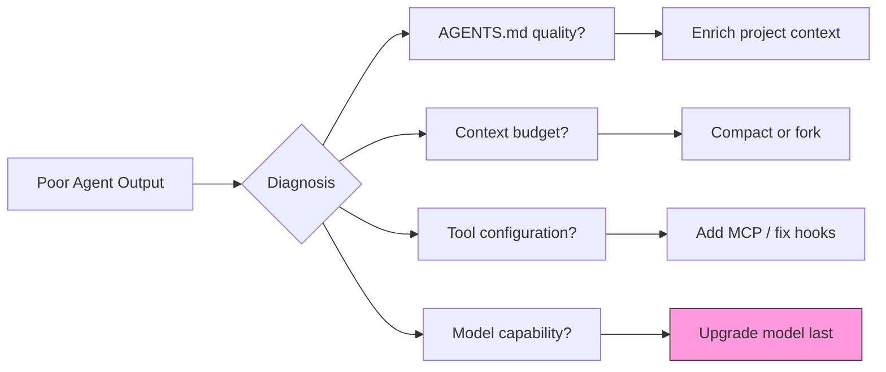
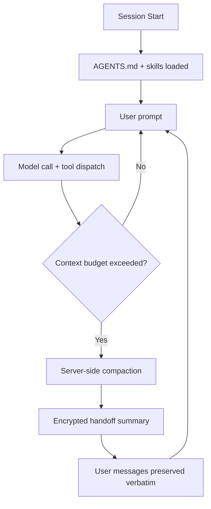

# The Design Space of Coding Agent Harnesses: Seven Architectural Lessons from the Claude Code Analysis That Apply to Codex CLI


---

A systematic academic analysis of a competitor's source code is rare in the AI tooling world. In April 2026, researchers from VILA-Lab published *Dive into Claude Code: The Design Space of Today's and Future AI Agent Systems* (arXiv:2604.14228), a paper that reverse-engineers Claude Code's TypeScript codebase and maps it onto a rigorous design-space framework [^1]. Their headline finding is striking: approximately 1.6% of the codebase handles AI decision logic, whilst 98.4% is operational infrastructure [^2]. The paper identifies five human values, thirteen design principles, seven system components, and a five-layer subsystem architecture that together form the scaffolding around the model.

This article translates those findings into actionable architectural awareness for Codex CLI practitioners. If you understand *why* agent harnesses are built the way they are, you can configure, extend, and reason about Codex CLI far more effectively.

## Why Harness Architecture Matters More Than Model Choice

The paper's central thesis reinforces what the Codex CLI community has observed since the harness-effect benchmarks of early 2026: the same model inside a different harness can score 16 percentage points higher or lower on identical benchmarks [^3]. OpenAI's own engineering blog *Unrolling the Codex agent loop* demonstrates that much of the intelligence of a coding agent lies not in the model but in how the harness assembles context, gates permissions, and manages tool dispatch [^4].

The practical implication is clear: tuning your `config.toml`, writing effective `AGENTS.md`, and configuring hooks properly is not peripheral housekeeping — it is *harness engineering*, and it has a measurable impact on output quality.

## The Design-Space Framework

The paper maps the entire agent harness problem onto a structured taxonomy. Here is the framework, with Codex CLI's answers alongside Claude Code's.

### Five Human Values Driving Architecture

Both Claude Code and Codex CLI derive their architecture from the same five human priorities, but weight them differently [^1]:

1. **Human decision authority** — the user must retain meaningful control
2. **Safety and security** — the agent must not damage the environment
3. **Reliable execution** — tasks must complete predictably
4. **Capability amplification** — the agent should enable qualitatively new workflows
5. **Contextual adaptability** — behaviour should adapt to project-specific norms

Codex CLI leans more heavily on *safety and security* through its kernel-level Seatbelt sandbox (macOS) and bubblewrap (Linux) [^5], whilst Claude Code opts for a layered software-only approach with an ML-based permission classifier [^2].

### Thirteen Principles, Seven Components

The paper traces the five values through thirteen design principles into seven functional components [^1]. The table below maps these to Codex CLI equivalents:

| Component | Claude Code | Codex CLI |
|-----------|------------|-----------|
| **User interface** | CLI + IDE extensions (VS Code) | TUI + app-server protocol (WebSocket/Unix socket) [^6] |
| **Agent loop** | `queryLoop` async generator | Rust `AgentLoop` with append-only prompt architecture [^4] |
| **Permission system** | 7 modes + ML classifier | 3 approval modes (suggest/auto-edit/full-auto) + deny-first rule evaluation + PreToolUse hooks [^5] |
| **Tools & extensibility** | MCP, plugins, skills, hooks (27 event types) | MCP, plugins, skills, hooks (PreToolUse/PostToolUse), custom agents [^6] |
| **State & persistence** | CLAUDE.md hierarchy, transcripts | AGENTS.md hierarchy, session transcripts, memories [^7] |
| **Execution environment** | Software sandbox + shell restrictions | OS-level Seatbelt/bubblewrap sandbox + managed network proxy [^5] |
| **Safety/action layer** | Permission gates + classifier | Approval policy + guardian + enterprise requirements.toml [^8] |

## Seven Architectural Lessons for Codex CLI Practitioners

### 1. Invest in Harness Tuning, Not Just Model Upgrades

The paper quantifies what many practitioners sense intuitively: 98.4% of the agent system is infrastructure [^2]. When a Codex CLI session underperforms, the diagnosis should start with harness configuration — AGENTS.md quality, MCP server setup, hook coverage — before reaching for a more expensive model.



### 2. Treat Permissions as Architecture, Not Configuration

Claude Code implements seven independent safety layers with an ML-based auto-classifier [^2]. Codex CLI takes a different but equally deliberate approach: three user-facing approval modes underpinned by deny-first rule evaluation at the OS sandbox level [^5].

The lesson is not to copy Claude Code's approach but to recognise that your permission configuration is an *architectural decision* with cascading effects on workflow speed, safety, and agent capability.

```toml
# config.toml — layered permission architecture
[profiles.daily]
model = "gpt-5.5"
approval_mode = "auto-edit"

[profiles.ci]
model = "gpt-5.2-codex"
approval_mode = "full-auto"

[profiles.audit]
model = "gpt-5.5"
approval_mode = "suggest"
model_reasoning_effort = "high"
```

### 3. Context Management Is Infrastructure

The paper describes Claude Code's five-stage compaction pipeline: compaction, priority ranking, window calculation, safety filtering, and assembly [^2]. Codex CLI uses a different strategy — server-side compaction via a proprietary `POST /v1/responses/compact` endpoint that returns an encrypted handoff summary preserving the model's latent state [^9]. User messages are preserved verbatim whilst assistant replies and tool outputs are replaced with a structured summary [^9].

The practical takeaway: context is not a formatting detail. It is infrastructure that determines whether your agent succeeds or fails on long-horizon tasks. Budget it explicitly.



### 4. Extensibility Needs Graduated Risk Budgets

Claude Code partitions its extension surface into four mechanisms with different cost-risk profiles: hooks (zero context cost), skills (low), plugins (variable), and MCP servers (high) [^2]. Codex CLI follows a similar graduated model [^6]:

| Mechanism | Context cost | Risk profile | When to use |
|-----------|-------------|-------------|-------------|
| **Hooks** (PreToolUse/PostToolUse) | Zero — runs outside model context | Low — deterministic scripts | Validation gates, audit logging |
| **Skills** (markdown instructions) | Low — injected into system prompt | Low — declarative guidance | Project conventions, workflow patterns |
| **Plugins** (bundled skills + MCP + apps) | Variable — depends on contents | Medium — third-party code | Reusable team toolkits |
| **MCP servers** (external tool processes) | High — full tool schemas in context | Higher — network access, external state | Live data, external service integration |

The design lesson: start with hooks and skills. Add MCP servers only when you genuinely need external data. Every MCP tool schema consumes context tokens that could otherwise be used for reasoning [^10].

### 5. Session Persistence Shapes Workflow Patterns

The paper notes Claude Code's append-oriented session storage and CLAUDE.md hierarchy [^1]. Codex CLI mirrors this with AGENTS.md (hierarchical project context), session transcripts (local persistence), and the memories system (cross-session learning) [^7].

What both systems lack — and what the paper identifies as an open research direction — is true *longitudinal colleague relationships* where the agent develops deep understanding of a developer's patterns over months [^1]. Codex CLI's memories system is the closest existing approximation, but it operates at the preference level rather than the deep-workflow level.

### 6. The Sandbox Strategy Reveals Trust Assumptions

The starkest architectural difference between Codex CLI and Claude Code lies in sandboxing. Claude Code uses software-level restrictions with a seven-mode permission classifier [^2]. Codex CLI drops to the kernel: macOS Seatbelt profiles, Linux bubblewrap with user namespaces, and a managed network proxy with domain allowlists [^5].

This is not merely a technical difference — it encodes a fundamentally different trust assumption. Codex CLI assumes the agent *will* attempt actions outside its mandate and relies on the OS to enforce boundaries. Claude Code assumes the agent can be guided through software-level classification.

For enterprise teams, this distinction matters when mapping agent deployments to compliance frameworks. OS-level sandboxing provides a stronger audit trail for SOC 2 and HIPAA assessments [^8].

### 7. The Rust Rewrite Tells the Same Story

OpenAI's decision to rewrite Codex CLI from TypeScript to Rust [^11] parallels the paper's finding that agent harness complexity eventually outgrows the initial implementation language. The Rust rewrite targeted three goals: zero-dependency installation, native security bindings for OS-level sandboxing, and a wire protocol (app-server) that lets TypeScript, Python, and other languages extend the agent without duplicating core logic [^11].

This is the harness-first philosophy in action: the infrastructure around the model loop became complex enough to justify a systems-language rewrite.

## Applying the Framework: A Configuration Audit Checklist

Use the paper's seven-component framework to audit your Codex CLI setup:

| Component | Question to ask | Config to check |
|-----------|----------------|-----------------|
| User interface | Am I using the right surface (TUI vs exec vs app-server)? | Launch command |
| Agent loop | Is reasoning effort matched to task complexity? | `model_reasoning_effort` in config.toml |
| Permission system | Do my approval modes match my risk tolerance? | `approval_mode`, `sandbox_mode` |
| Tools & extensibility | Are my MCP servers worth their context cost? | `/mcp verbose` output |
| State & persistence | Is my AGENTS.md giving the agent enough project context? | AGENTS.md file content |
| Execution environment | Is my sandbox enforcing the boundaries I need? | `sandbox_mode`, `deny_read_paths`, `shell_environment_policy` |
| Safety/action layer | Do I have hooks validating critical operations? | `[hooks]` section in config.toml |

## The Six Open Directions

The paper identifies six unsolved design problems that will shape the next generation of coding agents [^1]:

1. **Observability-evaluation gap** — agents fail silently without adequate telemetry
2. **Longitudinal relationships** — agents that learn your patterns over months
3. **Harness boundary evolution** — where the agent's autonomy starts and stops
4. **Horizon scaling** — weeks-long autonomous operation
5. **Governance at scale** — managing hundreds of agent instances
6. **Human capability preservation** — ensuring developers don't lose skills to delegation

Codex CLI is actively addressing several of these: OTEL-based observability [^12], the memories system for longitudinal context [^7], and enterprise managed configuration for governance at scale [^8]. The others remain open research problems for the entire field.

## Conclusion

The *Dive into Claude Code* paper provides the most systematic published analysis of coding agent architecture to date. Its core insight — that harness engineering dominates model capability — is not new to experienced Codex CLI practitioners, but having it quantified (1.6% AI logic, 98.4% infrastructure) gives the intuition empirical weight.

The practical message is this: every hour you spend improving your `AGENTS.md`, tuning your approval modes, writing PostToolUse hooks, and managing your context budget is an hour spent on the 98.4% of the system that actually determines your outcomes.

---

## Citations

[^1]: Liu, J., Zhao, X., Shang, X. & Shen, Z. (2026). *Dive into Claude Code: The Design Space of Today's and Future AI Agent Systems.* arXiv:2604.14228. [https://arxiv.org/abs/2604.14228](https://arxiv.org/abs/2604.14228)

[^2]: Praison, M. (2026). *Dive into Claude Code: In-Depth Research Analysis of Agent Harness Architecture.* [https://mer.vin/2026/04/dive-into-claude-code-in-depth-research-analysis-of-agent-harness-architecture/](https://mer.vin/2026/04/dive-into-claude-code-in-depth-research-analysis-of-agent-harness-architecture/)

[^3]: Jozefiak, P. (2026). *AI Coding Harness Agents 2026.* [https://thoughts.jock.pl/p/ai-coding-harness-agents-2026](https://thoughts.jock.pl/p/ai-coding-harness-agents-2026)

[^4]: OpenAI. (2026). *Unrolling the Codex agent loop.* [https://openai.com/index/unrolling-the-codex-agent-loop/](https://openai.com/index/unrolling-the-codex-agent-loop/)

[^5]: OpenAI. (2026). *Agent Approvals and Security — Codex CLI.* [https://developers.openai.com/codex/agent-approvals-security](https://developers.openai.com/codex/agent-approvals-security)

[^6]: OpenAI. (2026). *Codex CLI Changelog.* [https://developers.openai.com/codex/changelog](https://developers.openai.com/codex/changelog)

[^7]: OpenAI. (2026). *Memories — Codex.* [https://developers.openai.com/codex/memories](https://developers.openai.com/codex/memories)

[^8]: OpenAI. (2026). *Managed Configuration — Codex.* [https://developers.openai.com/codex/managed-configuration](https://developers.openai.com/codex/managed-configuration)

[^9]: Justin3go. (2026). *Shedding Heavy Memories: Context Compaction in Codex, Claude Code, and OpenCode.* [https://justin3go.com/en/posts/2026/04/09-context-compaction-in-codex-claude-code-and-opencode](https://justin3go.com/en/posts/2026/04/09-context-compaction-in-codex-claude-code-and-opencode)

[^10]: OpenAI. (2026). *Features — Codex CLI.* [https://developers.openai.com/codex/cli/features](https://developers.openai.com/codex/cli/features)

[^11]: ZenML. (2026). *Building Production-Ready AI Agents: OpenAI Codex CLI Architecture and Agent Loop Design.* [https://www.zenml.io/llmops-database/building-production-ready-ai-agents-openai-codex-cli-architecture-and-agent-loop-design](https://www.zenml.io/llmops-database/building-production-ready-ai-agents-openai-codex-cli-architecture-and-agent-loop-design)

[^12]: OpenAI. (2026). *Advanced Configuration — Codex.* [https://developers.openai.com/codex/config-advanced](https://developers.openai.com/codex/config-advanced)
