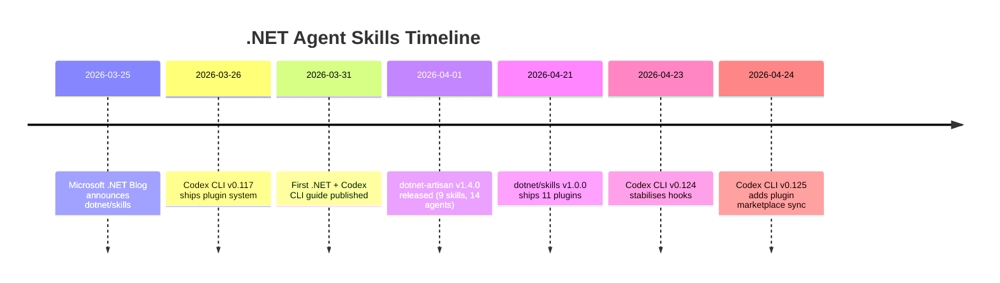
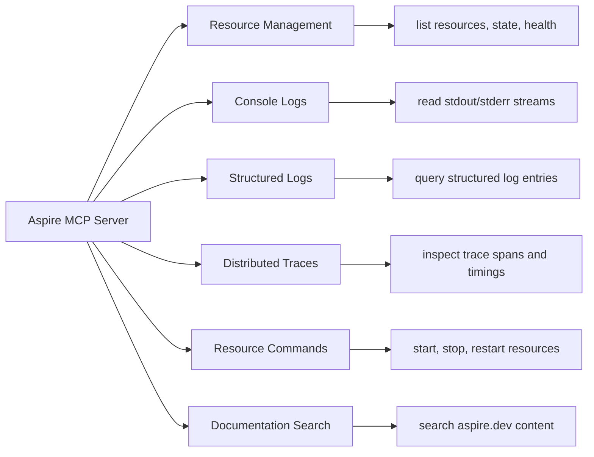
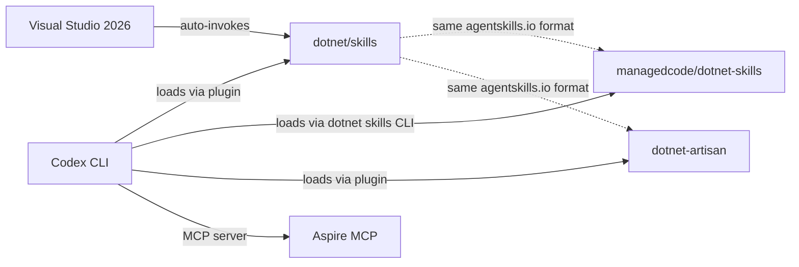

# The .NET Agent Skills Ecosystem Matures: Aspire MCP, dotnet-artisan, and the Three-Catalogue Strategy for Codex CLI


---

## Introduction

When this blog last covered .NET and Codex CLI in late March, the story was straightforward: install the official `dotnet/skills` plugins, set up an AGENTS.md, and configure NuGet sandboxing[^1]. A month later the picture has changed materially. The official catalogue has reached v1.0.0 with an eleventh plugin[^2], the community `managedcode/dotnet-skills` has nearly doubled to 157 skills[^3], a third catalogue — `dotnet-artisan` — has emerged with 14 specialist agents[^4], and .NET Aspire now ships an MCP server that gives Codex CLI live runtime observability into distributed applications[^5].

This article covers what changed, why it matters, and how to configure the three-catalogue stack alongside the Aspire MCP server for Codex CLI v0.125.

---

## What Changed Since March



Three developments warrant revisiting .NET configuration.

**First**, Microsoft shipped `dotnet/skills` v1.0.0 on 21 April 2026, adding `dotnet-aspnet` for ASP.NET Core middleware and endpoint patterns and marking the catalogue as production-ready[^2]. Each plugin now includes evaluation metrics — the team runs a lightweight validator to score agent performance against a baseline without the skill[^6].

**Second**, `managedcode/dotnet-skills` grew from 83 to 157 skills, introduced bundle installation (quality, mcaf, orleans groupings), and added automatic project scanning with `dotnet skills install --auto`[^3]. Catalog versioning now uses a calendar-plus-daily-index format (e.g. `2026.4.29.0`), ensuring reproducible skill sets across team members.

**Third**, `dotnet-artisan` v1.4.0 introduced a two-layer routing architecture: two gateway skills (`using-dotnet` and `dotnet-advisor`) direct the agent to seven domain skills backed by 159 reference files (~62K lines), loaded progressively on demand[^4].

---

## The Three-Catalogue Strategy

Each catalogue serves a different purpose. Running all three simultaneously is not only possible but recommended — they occupy complementary niches.

| Catalogue | Maintainer | Skills | Strength | Install Surface |
|---|---|---|---|---|
| `dotnet/skills` | Microsoft .NET team | 11 plugins | Battle-tested patterns from shipping .NET itself | `skills/*` + plugin manifest |
| `managedcode/dotnet-skills` | Community (ManagedCode) | 157 skills | Breadth — Orleans, Stryker, Minimal APIs, SignalR | `dotnet skills` CLI with `--agent codex` |
| `dotnet-artisan` | Community (novotnyllc) | 9 skills + 14 agents | Depth — progressive disclosure, specialist routing | `.codex-plugin/plugin.json` |

### Installation

**Official catalogue** — install via the plugin marketplace or direct skill reference:

```bash
# Via Codex plugin marketplace (if configured)
codex plugin marketplace add dotnet/skills
codex plugin install dotnet@dotnet-agent-skills

# Direct skill installation
skill-installer install \
  https://github.com/dotnet/skills/tree/main/plugins/dotnet-aspnet/skills/aspnet-web-development
```

**Community catalogue** — uses a dedicated .NET global tool:

```bash
dotnet tool install --global dotnet-agents
dotnet skills install --agent codex --auto
```

The `--auto` flag scans your `.csproj` and `Directory.Build.props` files, identifies NuGet dependencies, and installs matching skills[^3]. When `--agent` is omitted, the installer detects existing `.codex/`, `.claude/`, `.github/`, `.gemini/`, and `.junie/` directories and installs into every platform it finds.

**Artisan catalogue** — clone or reference as a Codex plugin:

```bash
# Plugin-aware installation
codex plugin install https://github.com/novotnyllc/dotnet-artisan
```

Codex routes through the `skills/*` surface; the 14 specialist agents (e.g. `dotnet-blazor-specialist`, `dotnet-security-reviewer`) are currently consumed by Claude Code and Copilot flows but provide useful reference documentation that Codex can access as skill reference files[^4].

---

## Aspire MCP Server Integration

.NET Aspire 13.1 shipped an MCP server that bridges the gap between your running distributed application and AI coding agents[^5]. For Codex CLI, this means the agent can query live resource status, read structured and console logs, inspect distributed traces, and execute resource commands — all without you copy-pasting terminal output.

### Setup

```bash
# Prerequisites
dotnet tool install --global aspire
aspire start           # Start your AppHost
aspire agent init      # Auto-detect and configure MCP
```

The `aspire agent init` command generates configuration for your detected AI environment. For Codex CLI, add the server manually to `config.toml`:

```toml
[mcp_servers.aspire]
command = "aspire"
args = ["agent", "mcp"]
```

### Available Tools

The Aspire MCP server exposes six tool categories:



This is particularly powerful for debugging distributed systems. Instead of manually navigating the Aspire dashboard, tracing a failed request across services, and then describing the issue to Codex, the agent can query the trace data directly and correlate it with the source code[^7].

> **Note:** The `aspire mcp` commands are being renamed to `aspire agent` in upcoming releases. Both forms work in Aspire 13.1+[^5].

---

## Updated AGENTS.md Template for .NET 10

With .NET 10 GA (November 2025, LTS until 2028) and C# 14 now the current language version[^8], your AGENTS.md should reflect the latest conventions:

```markdown
# AGENTS.md

## Project Stack
- .NET 10 LTS, C# 14, ASP.NET Core 10
- Entity Framework Core 10 with migrations
- xUnit 3 + FluentAssertions for testing

## Build & Test
- `dotnet build --no-restore` — incremental build
- `dotnet test --no-build --verbosity quiet` — run all tests
- `dotnet format --verify-no-changes` — check formatting

## C# 14 Conventions
- Use field-backed properties (`field` keyword) instead of separate backing fields
- Use `nameof` with unbound generic types where applicable
- Prefer `Span<T>` implicit conversions over manual slicing
- Use extension blocks for static extension methods

## Architecture Rules
- Minimal APIs for new endpoints; Controllers only for existing legacy surfaces
- Vertical slice architecture: one folder per feature
- No `async void` — always return `Task` or `ValueTask`
- All public API methods must have XML doc comments

## Security
- Never hardcode connection strings; use `IConfiguration` binding
- All user input must pass through FluentValidation validators
- Use `[Authorize]` on all controller/endpoint groups by default

## Dependencies
- NuGet restore via `dotnet restore` (sandbox must allow network for restore)
- Lock file: `packages.lock.json` — commit changes if dependencies update
```

---

## PostToolUse Hooks for .NET

Codex CLI v0.124 stabilised the hooks system with inline `config.toml` configuration[^9]. For .NET projects, two hooks provide immediate value:

```toml
[hooks.post_tool_use.dotnet_build_check]
match_tools = ["shell", "apply_patch"]
command = "dotnet build --no-restore --verbosity quiet 2>&1 | tail -5"

[hooks.post_tool_use.dotnet_format_check]
match_tools = ["apply_patch"]
command = "dotnet format --verify-no-changes --verbosity quiet 2>&1 | head -10"
```

The build hook catches compilation errors immediately after every file edit or shell command. The format hook ensures the agent doesn't introduce style inconsistencies that would fail CI. Both run quietly — only their output reaches the agent's context, keeping the feedback loop tight.

For projects using Stryker.NET for mutation testing, the `managedcode/dotnet-skills` catalogue includes a dedicated `mcaf-dotnet-stryker` skill that teaches the agent to interpret mutation scores and improve test coverage[^3].

---

## Config.toml Profiles

```toml
[profiles.dotnet-dev]
model = "gpt-5.5"
approval_mode = "auto-edit"
reasoning_effort = "medium"

[profiles.dotnet-review]
model = "gpt-5.2-codex"
approval_mode = "manual"
reasoning_effort = "high"

[profiles.dotnet-ci]
model = "gpt-5.3-codex-mini"
approval_mode = "full-auto"
reasoning_effort = "low"
```

Use `codex --profile dotnet-dev` for daily interactive work. The review profile pairs well with GPT-5.2-Codex's stronger cybersecurity capabilities for security-sensitive code review[^10]. The CI profile minimises cost for headless `codex exec` runs in pipelines.

---

## Model Selection for .NET Tasks

| Task | Recommended Model | Reasoning Effort | Why |
|---|---|---|---|
| Feature implementation | GPT-5.5 | Medium | Best overall coding quality and C# 14 awareness |
| Security review | GPT-5.2-Codex | High | Enhanced cybersecurity capabilities[^10] |
| Blazor component generation | GPT-5.5 | Medium | Strong Razor syntax and component model understanding |
| NuGet dependency updates | GPT-5.3-Codex-Spark | Low | Fast, simple tasks; minimises cost |
| EF Core migration generation | GPT-5.5 | Medium | Schema reasoning benefits from frontier model |
| CI pipeline checks | GPT-5.3-Codex-Mini | Low | Cost-effective for pass/fail validation |

---

## The Visual Studio 2026 Bridge

Visual Studio 2026 introduced native agent skill auto-invocation[^6]. Skills from `dotnet/skills` and compatible catalogues are auto-invoked if identified as helpful for the current prompt. This creates an interesting workflow for teams using both VS 2026 and Codex CLI:



The agentskills.io open standard ensures skills are portable across all these surfaces[^11]. A team can author skills once and use them in VS 2026, Codex CLI, and any other compatible agent.

---

## Practical Workflow: Adding an API Endpoint

Here is how the full stack comes together for a common task — adding a new API endpoint to an ASP.NET Core Minimal API project:

1. **Codex reads AGENTS.md** — picks up vertical slice architecture rule, .NET 10 conventions, and testing requirements
2. **dotnet-artisan's `dotnet-advisor` routes** — identifies this as an API task and loads `dotnet-api` skill with ASP.NET Core reference material
3. **Official `dotnet-aspnet` skill activates** — provides endpoint registration patterns, middleware ordering, and response type conventions
4. **Agent writes endpoint, validation, and handler** — follows Minimal API patterns from skills
5. **PostToolUse hook runs `dotnet build`** — catches any compilation errors immediately
6. **Agent writes xUnit test** — uses patterns from `dotnet-test` skill
7. **PostToolUse hook runs `dotnet format`** — ensures style compliance
8. **Aspire MCP queries** (if running) — agent can verify the endpoint responds correctly by checking distributed traces

---

## Common Pitfalls

| Pitfall | Cause | Fix |
|---|---|---|
| NuGet restore fails in sandbox | Network blocked by default in `auto-edit` mode | Add `sandbox_allow_network = true` to profile or restore before starting Codex |
| Skill conflicts between catalogues | Overlapping advice on patterns | Use `dotnet-artisan`'s routing layer; it dispatches to the most specific skill |
| Agent uses outdated C# patterns | Skills reference older .NET versions | Pin `dotnet/skills` to v1.0.0+; update `managedcode` catalogue with `dotnet skills update` |
| Aspire MCP times out | AppHost not running | Start with `aspire start` before launching Codex |
| Agent generates `async void` | Insufficient AGENTS.md constraints | Add explicit prohibition in AGENTS.md architecture rules |

---

## Conclusion

The .NET agent skills ecosystem moved from early-adopter territory to production-ready in April 2026. The three-catalogue strategy — official Microsoft skills for battle-tested patterns, `managedcode/dotnet-skills` for breadth, and `dotnet-artisan` for deep specialist routing — combined with the Aspire MCP server for live runtime observability, gives .NET teams one of the richest Codex CLI integration stories of any language ecosystem.

The key takeaway: install all three catalogues, configure PostToolUse hooks for `dotnet build` and `dotnet format`, and add the Aspire MCP server if you are building distributed applications. The investment is fifteen minutes of configuration for a meaningfully better agent experience.

---

## Citations

[^1]: Vaughan, D. "Codex CLI for .NET and C# Teams: Skills, AGENTS.md, NuGet Sandboxing and Azure OpenAI." *Codex Blog*, 31 March 2026. [https://codex.danielvaughan.com/2026/03/31/codex-cli-dotnet-csharp-teams/](https://codex.danielvaughan.com/2026/03/31/codex-cli-dotnet-csharp-teams/)

[^2]: Microsoft. "dotnet/skills: Repository for skills to assist AI coding agents with .NET and C#." *GitHub*, v1.0.0, 21 April 2026. [https://github.com/dotnet/skills](https://github.com/dotnet/skills)

[^3]: ManagedCode. "dotnet-skills: Installable .NET skill catalog and CLI for Codex, Claude Code, GitHub Copilot, and Gemini." *GitHub*, April 2026. [https://github.com/managedcode/dotnet-skills](https://github.com/managedcode/dotnet-skills)

[^4]: Novotny, C. "dotnet-artisan: Comprehensive .NET development skills for modern C# and .NET." *GitHub*, v1.4.0, 1 April 2026. [https://github.com/novotnyllc/dotnet-artisan](https://github.com/novotnyllc/dotnet-artisan)

[^5]: .NET Aspire Team. "Aspire MCP server." *aspire.dev*, 2026. [https://aspire.dev/get-started/aspire-mcp-server/](https://aspire.dev/get-started/aspire-mcp-server/)

[^6]: Microsoft .NET Blog. "Extend your coding agent with .NET Skills." *devblogs.microsoft.com*, 25 March 2026. [https://devblogs.microsoft.com/dotnet/extend-your-coding-agent-with-dotnet-skills/](https://devblogs.microsoft.com/dotnet/extend-your-coding-agent-with-dotnet-skills/)

[^7]: Ayers, C. "Aspire CLI Part 3 — MCP for AI Coding Agents." *DEV Community*, 2026. [https://dev.to/chris_ayers/aspire-cli-part-3-mcp-for-ai-coding-agents-5d8j](https://dev.to/chris_ayers/aspire-cli-part-3-mcp-for-ai-coding-agents-5d8j)

[^8]: Microsoft. "What's new in C# 14." *Microsoft Learn*, 2026. [https://learn.microsoft.com/en-us/dotnet/csharp/whats-new/csharp-14](https://learn.microsoft.com/en-us/dotnet/csharp/whats-new/csharp-14)

[^9]: OpenAI. "Codex CLI Changelog — v0.124.0." *developers.openai.com*, 23 April 2026. [https://developers.openai.com/codex/changelog](https://developers.openai.com/codex/changelog)

[^10]: OpenAI. "Introducing GPT-5.2-Codex." *openai.com*, 28 April 2026. [https://openai.com/index/introducing-gpt-5-2-codex/](https://openai.com/index/introducing-gpt-5-2-codex/)

[^11]: Agent Skills Specification. "agentskills.io." 2026. [https://agentskills.io](https://agentskills.io)
