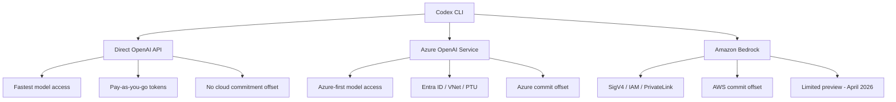
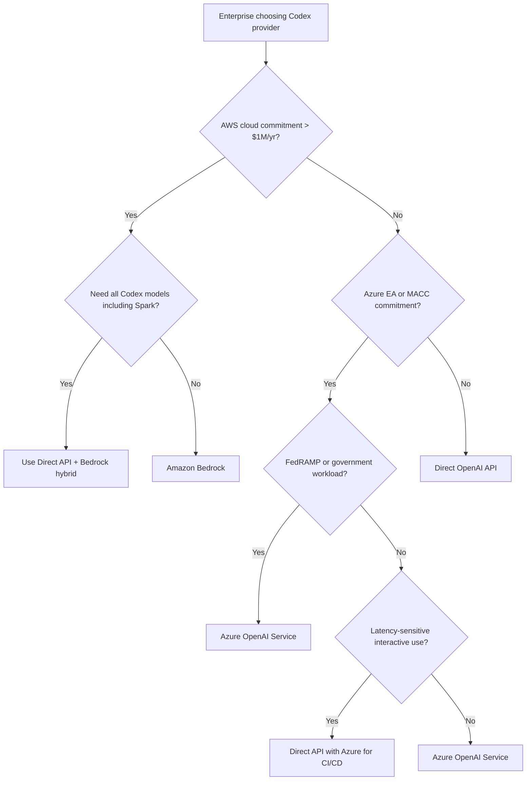

# The End of Azure Exclusivity: How OpenAI's Multi-Cloud Pivot Changes the Codex CLI Enterprise Deployment Playbook


---

## Introduction

On 27 April 2026, Microsoft and OpenAI announced an amended partnership agreement that ended Azure's exclusive right to distribute OpenAI products[^1]. Twenty-four hours later, OpenAI launched its models, Codex, and Managed Agents on Amazon Bedrock in limited preview[^2]. The timing was not coincidental — OpenAI had the AWS deal ready to ship the moment the exclusivity clause lifted[^3].

For enterprise teams running Codex CLI, this is the most consequential infrastructure shift since the tool launched. Until last week, "which cloud runs Codex?" had exactly one answer for managed deployments: Azure. Now there are three viable paths — direct API, Azure OpenAI Service, and Amazon Bedrock — each with distinct trade-offs in pricing, latency, governance, and operational overhead.

This article maps the new multi-cloud landscape, walks through the practical configuration differences for Codex CLI across each provider, and offers a decision framework for platform engineering teams who suddenly have a choice they did not have seven days ago.

---

## What Actually Changed

The restructured Microsoft-OpenAI agreement introduced three material changes for enterprise Codex consumers[^1][^4]:

1. **Non-exclusive distribution.** OpenAI can now serve all its products to customers across any cloud provider. Microsoft retains a non-exclusive licence to OpenAI IP through 2032, but no longer holds veto power over third-party distribution.

2. **Azure-first, not Azure-only.** Microsoft remains the "primary cloud partner" — OpenAI products ship on Azure first unless Microsoft cannot support the required capability. In practice, GPT-5.5 launched on Azure and Bedrock simultaneously[^2][^5].

3. **Reversed revenue share.** Microsoft no longer pays OpenAI a revenue-share cut; instead, OpenAI pays Microsoft through 2030, capped at an undisclosed total[^1]. This removes the financial incentive for Microsoft to push Azure OpenAI Service volume, potentially changing Azure's pricing calculus.

---

## The Three Provider Paths



### Path 1: Direct OpenAI API

The default for most individual developers and small teams. Codex CLI connects to `api.openai.com` using an OpenAI API key. No cloud intermediary, no additional latency from a proxy layer, and immediate access to every model the moment OpenAI releases it.

```toml
# ~/.codex/config.toml — Direct API (default)
model = "gpt-5.5"
```

No `model_provider` configuration is needed — this is the zero-configuration path[^6].

**Trade-offs:** No VPC isolation, no IAM integration, no cloud-commit offset. Token costs are transparent — \$5.00 input / \$30.00 output per million tokens for GPT-5.5[^7]. Fine for developer workstations; unsuitable for enterprises that require data residency guarantees or centralised billing.

### Path 2: Azure OpenAI Service

The established enterprise path. Azure OpenAI Service provides Entra ID authentication, VNet integration, Private Link, and Provisioned Throughput Units (PTU) for predictable capacity[^8]. Codex CLI connects through the `azure-openai` model provider.

```toml
# ~/.codex/config.toml — Azure OpenAI Service
model = "gpt-5.5"
model_provider = "azure-openai"

[model_providers.azure-openai]
base_url = "https://my-deployment.openai.azure.com"
env_key = "AZURE_OPENAI_API_KEY"
```

**Trade-offs:** Azure imposes a 15–40% overhead above direct API pricing once support plans, data egress, fine-tuned hosting, and Private Link costs are included[^9]. Reports also indicate higher latency — responses through Azure OpenAI can take roughly twice as long as the direct API in some configurations[^10]. However, for organisations already committed to Azure spend, the compliance and governance integration is unmatched.

**Current limitation:** Codex CLI does not yet support Entra ID (Azure AD) token-based authentication natively — you must use an API key[^8]. ⚠️ This is expected to change, but as of v0.125 the limitation remains.

### Path 3: Amazon Bedrock

The newest path, launched on 28 April 2026 in limited preview[^2]. Codex CLI gained a first-class `amazon-bedrock` provider in v0.124.0, using AWS SigV4 signing and the standard AWS credential chain[^11].

```toml
# ~/.codex/config.toml — Amazon Bedrock
model = "gpt-5.5"
model_provider = "bedrock"

[model_providers.bedrock]
base_url = "https://bedrock-runtime.us-east-1.amazonaws.com"
```

Authentication uses the standard AWS credential chain — `~/.aws/credentials`, IAM roles, or environment variables[^11]. No separate API key is needed.

**Trade-offs:** Bedrock pricing for OpenAI models has not been publicly disclosed during the limited preview[^2]. The available model catalogue is narrower than the direct API — GPT-5.5, GPT-5.4, gpt-oss-20b, and gpt-oss-120b are confirmed, but GPT-5.2-Codex and GPT-5.3-Codex-Spark are not yet listed[^12]. ⚠️ Model availability may expand as the preview progresses. The critical advantage: Codex usage counts toward existing AWS cloud commitments[^2], which can be decisive for organisations with substantial AWS Enterprise Discount Programmes.

---

## Decision Framework

The decision is rarely about technology alone. It is about where your organisation's money already sits.

| Factor | Direct API | Azure OpenAI | Amazon Bedrock |
|--------|-----------|-------------|----------------|
| **Cloud commit offset** | None | Azure EA/MACC | AWS EDP/commit |
| **Authentication** | API key | API key (Entra ID pending) | IAM / SigV4 |
| **VPC isolation** | No | VNet + Private Link | PrivateLink |
| **Model availability** | All models, day-one | Azure-first, near day-one | Limited preview subset |
| **Latency overhead** | Baseline | ~2x reported[^10] | Unknown (preview) |
| **Compliance frameworks** | SOC 2, GDPR | SOC 2, GDPR, FedRAMP, HIPAA BAA | SOC 2, GDPR, HIPAA BAA |
| **Codex CLI support** | Stable (default) | Stable (v0.118+) | Stable (v0.124+) |
| **Managed Agents** | No | No | Yes (preview)[^2] |

### The Practical Decision Tree



---

## Multi-Provider Configuration with Profiles

The most pragmatic enterprise approach is not choosing one provider but configuring profiles for each context. Codex CLI's profile system makes this straightforward[^6]:

```toml
# ~/.codex/config.toml — Multi-provider enterprise setup

# Default: direct API for interactive development
model = "gpt-5.5"
reasoning_effort = "medium"

[profiles.azure-ci]
model = "gpt-5.4"
model_provider = "azure-openai"
reasoning_effort = "high"
sandbox_mode = "read-only"

[model_providers.azure-openai]
base_url = "https://codex-prod.openai.azure.com"
env_key = "AZURE_OPENAI_API_KEY"

[profiles.bedrock-batch]
model = "gpt-oss-120b"
model_provider = "bedrock"
reasoning_effort = "low"

[model_providers.bedrock]
base_url = "https://bedrock-runtime.us-east-1.amazonaws.com"
```

Switch between providers on the command line:

```bash
# Interactive development — direct API
codex

# CI/CD pipeline — Azure, high reasoning for thorough review
codex exec --profile azure-ci "Review this PR for security issues"

# Batch processing — Bedrock, using AWS commits
codex exec --profile bedrock-batch "Generate test stubs for untested functions"
```

This pattern lets organisations offset cloud commitments for automated workloads whilst keeping the lowest-latency path for developer interaction.

---

## Bedrock Managed Agents: The New Capability

The most strategically interesting component of the AWS announcement is not model hosting — it is Bedrock Managed Agents powered by OpenAI[^2][^13]. This is a new product category that has no equivalent in the Azure OpenAI Service or the direct API.

Managed Agents combine OpenAI frontier models with the OpenAI agent harness — the same orchestration engine that powers Codex — running entirely within AWS infrastructure[^13]. Each agent gets its own identity, logs every action via CloudTrail, and operates within IAM boundaries.

For Codex CLI practitioners, this opens a hybrid pattern:

1. **Codex CLI** for interactive development and code review on developer workstations.
2. **Bedrock Managed Agents** for production-adjacent automation — deployment pipelines, incident response bots, compliance scanners — that must run inside the enterprise's AWS account with full audit trails.

The two share the same underlying agent harness, so AGENTS.md policies, skills, and prompt patterns transfer directly[^2]. This is not a competitor to Codex CLI; it is the server-side complement.

---

## What This Means for Platform Engineering Teams

### 1. Procurement leverage increases immediately

With two hyperscalers competing for OpenAI workloads, enterprise procurement teams can negotiate cloud commitments against Codex usage for the first time. "The conversation moves from 'which cloud has the model I need' to 'which cloud has the best price, latency and governance for the model I want'"[^14].

### 2. Configuration-as-code becomes essential

Multi-provider setups mean provider configuration must be versioned, tested, and distributed. Treat `config.toml` profiles and `requirements.toml` managed policies as infrastructure code. Use the managed configuration system to enforce provider choices across teams[^15].

### 3. Model availability gaps are temporary

Bedrock's initial model catalogue is smaller than the direct API. GPT-5.2-Codex and GPT-5.3-Codex-Spark are absent at launch[^12]. Plan for this by using profiles — route specialised workloads to the direct API today, then switch profiles when Bedrock availability expands.

### 4. Test latency before committing

Both Azure OpenAI Service and Bedrock add a proxy layer between Codex CLI and inference. Measure time-to-first-token and total turn latency for your specific workloads before making a fleet-wide commitment. The `codex exec --json` reasoning-token reporting in v0.125 makes this measurable[^16].

---

## Current Limitations

- **Bedrock is in limited preview.** General availability is expected "within weeks" of the 28 April announcement[^2], but production commitments should wait for GA pricing and SLA publication.
- **No Entra ID in Codex CLI.** Azure OpenAI Service users must use API keys rather than Azure AD tokens[^8]. This is a known gap.
- **No GPT-5.5 on Bedrock Mantle's Responses API yet.** Early testers report that Bedrock Mantle exposes GPT-OSS models but not the full GPT-5.5 catalogue through the Responses API path that Codex CLI uses[^12]. ⚠️ This may change during the preview period.
- **Managed Agents are AWS-only.** There is no equivalent product for Azure or the direct API at the time of writing.

---

## Conclusion

The end of Azure exclusivity does not change what Codex CLI does — it changes where and how enterprises deploy it. For the first time, platform engineering teams can match their Codex infrastructure to their existing cloud commitments, compliance requirements, and latency budgets without workarounds.

The practical advice is simple: configure profiles for multiple providers now, measure latency and cost across each path, and let your organisation's commercial agreements — not technical lock-in — drive the choice. The era of single-cloud Codex is over.

---

## Citations

[^1]: Microsoft Official Blog, "The next phase of the Microsoft-OpenAI partnership," 27 April 2026. [https://blogs.microsoft.com/blog/2026/04/27/the-next-phase-of-the-microsoft-openai-partnership/](https://blogs.microsoft.com/blog/2026/04/27/the-next-phase-of-the-microsoft-openai-partnership/)

[^2]: OpenAI, "OpenAI models, Codex, and Managed Agents come to AWS," 28 April 2026. [https://openai.com/index/openai-on-aws/](https://openai.com/index/openai-on-aws/)

[^3]: GeekWire, "OpenAI's models land on Amazon Bedrock, one day after Microsoft exclusivity ends," 28 April 2026. [https://www.geekwire.com/2026/openais-models-land-on-amazon-bedrock-one-day-after-microsoft-exclusivity-ends/](https://www.geekwire.com/2026/openais-models-land-on-amazon-bedrock-one-day-after-microsoft-exclusivity-ends/)

[^4]: CNBC, "OpenAI brings its models to Amazon's cloud after ending exclusivity with Microsoft," 28 April 2026. [https://www.cnbc.com/2026/04/28/openai-brings-models-to-aws-after-ending-exclusivity-with-microsoft.html](https://www.cnbc.com/2026/04/28/openai-brings-models-to-aws-after-ending-exclusivity-with-microsoft.html)

[^5]: AWS, "Amazon Bedrock now offers OpenAI models, Codex, and Managed Agents (Limited Preview)," 28 April 2026. [https://aws.amazon.com/about-aws/whats-new/2026/04/bedrock-openai-models-codex-managed-agents/](https://aws.amazon.com/about-aws/whats-new/2026/04/bedrock-openai-models-codex-managed-agents/)

[^6]: OpenAI Developers, "Config basics — Codex." [https://developers.openai.com/codex/config-basic](https://developers.openai.com/codex/config-basic)

[^7]: OpenAI Developers, "Pricing — Codex." [https://developers.openai.com/codex/pricing](https://developers.openai.com/codex/pricing)

[^8]: OpenAI Developers, "Advanced Configuration — Codex." [https://developers.openai.com/codex/config-advanced](https://developers.openai.com/codex/config-advanced)

[^9]: TokenMix Blog, "Azure OpenAI Alternative: Stop Paying 15-40% Overhead for the Same Models," 2026. [https://tokenmix.ai/blog/azure-openai-alternative](https://tokenmix.ai/blog/azure-openai-alternative)

[^10]: Microsoft Q&A, "Azure Open AI vs Open AI API performance." [https://learn.microsoft.com/en-us/answers/questions/1689196/azure-open-ai-vs-open-ai-api-performance](https://learn.microsoft.com/en-us/answers/questions/1689196/azure-open-ai-vs-open-ai-api-performance)

[^11]: OpenAI Developers, "Codex CLI Changelog — v0.124.0," 23 April 2026. [https://developers.openai.com/codex/changelog](https://developers.openai.com/codex/changelog)

[^12]: DevelopersIO, "I tried Amazon Bedrock support for Codex CLI v0.124.0," April 2026. [https://dev.classmethod.jp/en/articles/codex-cli-amazon-bedrock-mantle-responses-api/](https://dev.classmethod.jp/en/articles/codex-cli-amazon-bedrock-mantle-responses-api/)

[^13]: About Amazon / AWS Blog, "AWS and OpenAI announce expanded partnership," 28 April 2026. [https://www.aboutamazon.com/news/aws/bedrock-openai-models](https://www.aboutamazon.com/news/aws/bedrock-openai-models)

[^14]: tech-insider.org, "OpenAI on AWS Bedrock: \$38B Deal Ends Azure Lock-In," 2026. [https://tech-insider.org/openai-amazon-bedrock-38-billion-azure-exclusivity-end-2026/](https://tech-insider.org/openai-amazon-bedrock-38-billion-azure-exclusivity-end-2026/)

[^15]: OpenAI Developers, "Managed Configuration — Codex." [https://developers.openai.com/codex/config-advanced](https://developers.openai.com/codex/config-advanced)

[^16]: OpenAI Developers, "Codex CLI Changelog — v0.125.0," 24 April 2026. [https://developers.openai.com/codex/changelog](https://developers.openai.com/codex/changelog)
