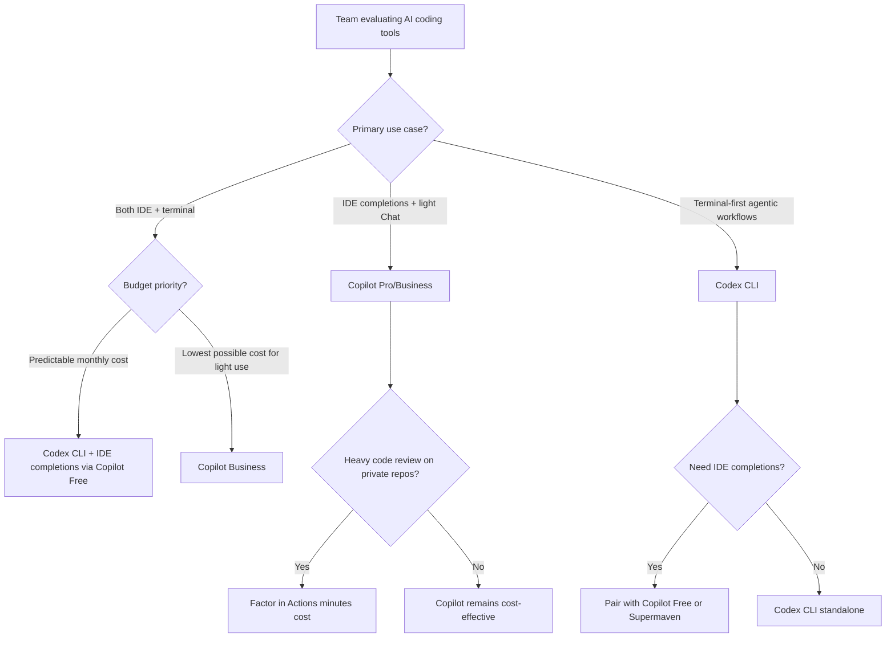

# GitHub Copilot's Usage-Based Billing Shift: What It Means for Codex CLI Teams


On 27 April 2026, GitHub announced that every Copilot plan will move from premium request units to usage-based billing with GitHub AI Credits on 1 June 2026 [^1]. Two days earlier, Copilot code review was confirmed to start consuming GitHub Actions minutes on the same date [^2]. For teams already running Codex CLI — or evaluating it — these changes reshape the cost calculus. This article unpacks what changed, compares the two billing models head-to-head, and provides a decision framework for teams weighing their options.

## What Changed with Copilot Billing

### The Core Shift

Until June 2026, Copilot charged a flat per-seat fee that bundled a monthly allotment of premium request units (PRUs). Under the new model, each plan includes a fixed dollar amount of **GitHub AI Credits** instead [^1]:

| Plan | Monthly Price | Included AI Credits |
|------|--------------|-------------------|
| Copilot Pro | \$10/user | \$10 |
| Copilot Pro+ | \$39/user | \$39 |
| Copilot Business | \$19/user | \$19 |
| Copilot Enterprise | \$39/user | \$39 |

One AI Credit equals \$0.01 USD. Credits are consumed based on token usage — input, output, and cached tokens — at published API rates for each model [^1]. Code completions and Next Edit suggestions remain free and do not consume credits [^1].

### Promotional Buffer

Business plans receive \$30/month and Enterprise plans \$70/month in credits during the June–August 2026 promotional period [^1], giving teams a runway to instrument usage before the standard allocations apply.

### Code Review Hits Actions Minutes

Starting 1 June, every Copilot code review on a private repository will also draw from your GitHub Actions minutes entitlement, billed at standard runner rates [^2]. Public repositories remain unaffected. This is an entirely new cost vector that did not exist under the PRU model.

### New Sign-Ups Paused

Since 20 April 2026, new individual sign-ups for Copilot Pro, Pro+, and student plans have been temporarily paused, and annual plans are being retired [^3]. Existing annual subscribers stay on PRUs until their current billing cycle ends.

## Why This Matters for Developer Teams

The shift from predictable flat-rate billing to token-metered billing introduces two concerns that developers have been vocal about [^4] [^5]:

1. **Cost unpredictability.** A quick inline completion and a multi-hour agentic coding session can now produce wildly different bills. GitHub acknowledged this directly: "A quick chat question and a multi-hour autonomous coding session can cost the user the same amount, which is unsustainable" [^1].

2. **Behavioural changes.** When credits are finite, developers self-censor. Heavy Chat users, agentic coding session users, and teams relying on automated code review are most likely to feel the squeeze [^5].

## Codex CLI Pricing in Comparison

Codex CLI's billing model differs in structure. Here is how the two compare for a team evaluating costs:

### Individual Plans

| Feature | Copilot Pro (\$10/mo) | Codex CLI via Plus (\$20/mo) |
|---------|---------------------|-----------------------------|
| Billing model | Token-metered AI Credits | Message-based rolling window |
| Code completions | Included (free) | N/A (terminal agent, not IDE) |
| Agentic sessions | Credits consumed per token | 15–80 GPT-5.5 messages per 5h window [^6] |
| Code review | Credits + Actions minutes | Via `codex exec` or GitHub Action [^7] |
| Predictability | Variable | Capped per window |

### Business and Enterprise

| Feature | Copilot Business (\$19/user) | Codex Business (\$25/user) [^6] |
|---------|----------------------------|-------------------------------|
| Included credits | \$19 AI Credits/mo | Token-based credit pool |
| Credit rates (GPT-5.5, per 1M tokens) | ~\$2.50 input / \$15 output [^8] | 125 input / 12.50 cached / 750 output credits [^6] |
| SSO/SCIM | Yes | Yes (SAML, MFA) |
| Admin controls | Org-level spending limits | Managed configuration, requirements.toml [^9] |
| Audit logging | Limited | Compliance API, OTEL integration [^6] |

### The Hidden Cost: Actions Minutes

For teams running Copilot code review on private repositories, the new Actions minutes consumption is an additive cost that Codex CLI does not impose. Codex CLI's `codex exec` and `codex-action@v1` run on your own CI infrastructure without a separate minutes tax [^7].

## A Side-by-Side Cost Scenario

Consider a five-person team running 20 code reviews per day on a private monorepo:

```
Copilot Business (post-June):
  Seats: 5 × $19 = $95/mo
  AI Credits for reviews: variable (token-dependent)
  Actions minutes: ~600 min/mo at $0.008/min = ~$4.80/mo
  Chat/agentic usage: variable
  Total: $95 + variable

Codex CLI Business:
  Seats: 5 × $25 = $125/mo
  Code review via codex-action: runs on your GHA runners
  Agentic usage: included in token credit pool
  Total: $125 (predictable within credit pool)
```

The break-even point depends on how aggressively the team uses Chat, agentic sessions, and code review. Light users save with Copilot; heavy agentic users may find Codex CLI's rolling-window model more predictable.

## Decision Framework



### When to Stay on Copilot

- Your team primarily uses inline completions and light Chat — these remain free under the new model [^1].
- You are on an annual plan that has not yet expired — PRU billing continues until renewal.
- Your organisation already has GitHub Enterprise with bundled Actions minutes to absorb the code review cost.

### When to Evaluate Codex CLI

- Your team runs heavy agentic coding sessions that would consume credits rapidly under token-metered billing.
- You need terminal-first workflows: `codex exec` for CI pipelines, non-interactive automation, structured output via `--output-schema` [^7].
- You want automated code review without an Actions minutes surcharge.
- You are already on ChatGPT Plus or Pro and Codex CLI is included at no additional cost [^6].

### The Hybrid Approach

Many teams are converging on a split stack [^10]:

- **Copilot Free** for IDE completions (zero cost, remains available).
- **Codex CLI** for agentic terminal workflows, CI automation, and code review.
- This avoids the usage-based billing entirely for completions whilst retaining full agentic capability through Codex.

## Migration Checklist: Copilot to Codex CLI

For teams deciding to shift agentic work from Copilot to Codex CLI, here is a practical checklist:

### 1. Install and Authenticate

```bash
# Install via npm
npm install -g @openai/codex

# Authenticate with ChatGPT account (draws from plan limits)
codex auth login

# Or use API key (pay-per-token)
export OPENAI_API_KEY="sk-..."
```

### 2. Set Up Project Configuration

```toml
# .codex/config.toml
model = "gpt-5.5"
approval_mode = "auto-edit"

[sandbox]
mode = "full"

[profiles.review]
model = "gpt-5.4"
approval_mode = "suggest"
```

### 3. Replace Copilot Code Review

```yaml
# .github/workflows/codex-review.yml
name: Codex PR Review
on:
  pull_request:
    types: [opened, synchronize]

jobs:
  review:
    runs-on: ubuntu-latest
    steps:
      - uses: actions/checkout@v4
      - uses: openai/codex-action@v1
        with:
          task: |
            Review this PR for correctness, security,
            and maintainability. Flag only actionable issues.
          model: gpt-5.5
```

This runs on your own Actions runners without any separate minutes tax [^7].

### 4. Create an AGENTS.md

```markdown
# AGENTS.md

## Code Review Standards
- Flag security issues, performance regressions, and API misuse
- Ignore formatting (handled by CI linters)
- Reference team style guide at docs/STYLE.md

## Testing Requirements
- All new functions require unit tests
- Integration tests for API endpoints
- 80% coverage minimum
```

### 5. Monitor Token Usage

```bash
# Install ccusage for cross-agent token monitoring
pip install ccusage

# Track session costs
ccusage report --last 7d
```

## What to Watch

- **June 1 2026**: Copilot billing transition takes effect. Monitor actual credit consumption against the promotional allotments [^1].
- **Copilot Free tier expansion**: GitHub may expand the free tier to retain developers migrating away from paid plans.
- **Codex CLI rate limit resets**: OpenAI reset Codex rate limits for all paid plans on 28 April 2026 [^11], and the 25x Pro multiplier is honoured through 31 May 2026 [^6].
- **GPT-5.2-Codex API access**: Currently available in Codex surfaces for paid ChatGPT users, with API access coming in the following weeks [^12]. This may further shift the cost equation for teams using API-key billing.

## Key Takeaway

GitHub's shift to usage-based billing is an acknowledgement that flat-rate pricing cannot sustain heavy agentic workloads. For teams whose workflow centres on terminal-based AI agents, CI automation, and non-interactive code review, Codex CLI's rolling-window model offers more predictable costs. For teams that primarily value IDE completions and light Chat, Copilot remains the simpler choice. The emerging pattern is a hybrid stack: free completions from Copilot, heavy agentic lifting from Codex CLI.

## Citations

[^1]: GitHub Blog, "GitHub Copilot is moving to usage-based billing," 27 April 2026. [https://github.blog/news-insights/company-news/github-copilot-is-moving-to-usage-based-billing/](https://github.blog/news-insights/company-news/github-copilot-is-moving-to-usage-based-billing/)

[^2]: GitHub Changelog, "GitHub Copilot code review will start consuming GitHub Actions minutes on June 1, 2026," 27 April 2026. [https://github.blog/changelog/2026-04-27-github-copilot-code-review-will-start-consuming-github-actions-minutes-on-june-1-2026/](https://github.blog/changelog/2026-04-27-github-copilot-code-review-will-start-consuming-github-actions-minutes-on-june-1-2026/)

[^3]: GitHub Community, "Announcement & FAQ: Changes to GitHub Copilot Individual Plans," April 2026. [https://github.com/orgs/community/discussions/192963](https://github.com/orgs/community/discussions/192963)

[^4]: Visual Studio Magazine, "Devs Sound Off on Usage-Based Copilot Pricing Change," April 2026. [https://visualstudiomagazine.com/articles/2026/04/27/devs-sound-off-on-usage-based-copilot-pricing-change-you-will-get-less-but-pay-the-same-price.aspx](https://visualstudiomagazine.com/articles/2026/04/27/devs-sound-off-on-usage-based-copilot-pricing-change-you-will-get-less-but-pay-the-same-price.aspx)

[^5]: The New Stack, "GitHub moves Copilot to usage-based billing as AI coding costs climb," April 2026. [https://thenewstack.io/github-copilot-usage-billing/](https://thenewstack.io/github-copilot-usage-billing/)

[^6]: OpenAI, "Codex Pricing," April 2026. [https://developers.openai.com/codex/pricing](https://developers.openai.com/codex/pricing)

[^7]: OpenAI, "GitHub Action – Codex," 2026. [https://developers.openai.com/codex/github-action](https://developers.openai.com/codex/github-action)

[^8]: GitHub Docs, "Models and pricing for GitHub Copilot," April 2026. [https://docs.github.com/en/copilot/reference/copilot-billing/models-and-pricing](https://docs.github.com/en/copilot/reference/copilot-billing/models-and-pricing)

[^9]: OpenAI, "Managed configuration – Codex," 2026. [https://developers.openai.com/codex/enterprise/managed-configuration](https://developers.openai.com/codex/enterprise/managed-configuration)

[^10]: Slashdot, "GitHub Copilot Is Moving To Usage-Based Billing," April 2026. [https://developers.slashdot.org/story/26/04/27/1717232/github-copilot-is-moving-to-usage-based-billing](https://developers.slashdot.org/story/26/04/27/1717232/github-copilot-is-moving-to-usage-based-billing)

[^11]: OpenAI Developer Community, "Codex Rate limits reset for all paid plans April 28, 2026," April 2026. [https://community.openai.com/t/codex-rate-limits-reset-for-all-paid-plans-april-28-2026/1379921](https://community.openai.com/t/codex-rate-limits-reset-for-all-paid-plans-april-28-2026/1379921)

[^12]: OpenAI, "Introducing GPT-5.2-Codex," April 2026. [https://openai.com/index/introducing-gpt-5-2-codex/](https://openai.com/index/introducing-gpt-5-2-codex/)
