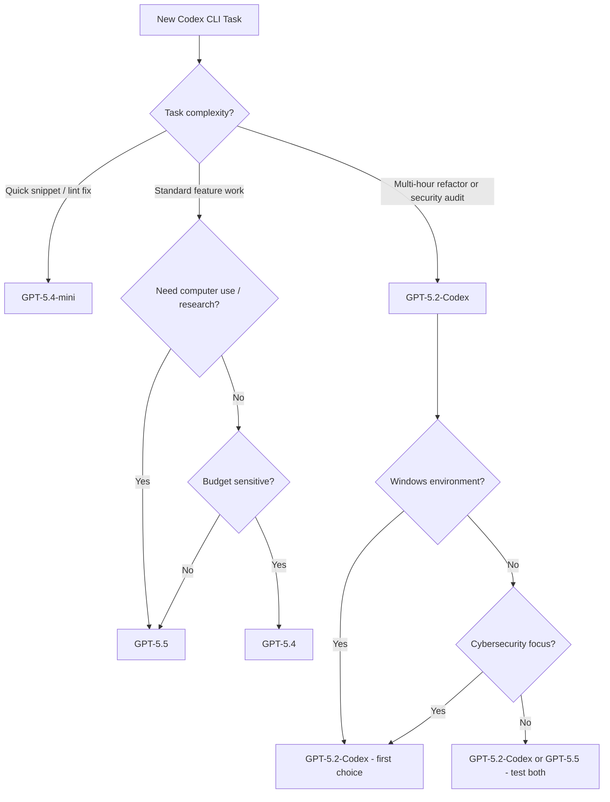

# GPT-5.2-Codex: What the New Agentic Coding Model Means for Your Codex CLI Workflows


---

On 28 April 2026, OpenAI released GPT-5.2-Codex — a variant of GPT-5.2 purpose-built for agentic coding workflows [^1]. Unlike GPT-5.5, which targets breadth across coding, research, and computer use, GPT-5.2-Codex is narrowly optimised for the things that matter most inside a terminal agent: long-horizon session stability, large-scale code transformations, and — notably — cybersecurity capabilities that OpenAI describes as the strongest it has shipped to date [^1].

This article unpacks what changed, how the benchmarks compare, when to reach for GPT-5.2-Codex over GPT-5.5 or GPT-5.4, and how to configure it in Codex CLI today.

## What GPT-5.2-Codex Actually Is

GPT-5.2-Codex is not a new base model. It is a coding-optimised fine-tune of GPT-5.2, following the pattern established by earlier Codex-suffixed models (GPT-5-Codex, GPT-5.1-Codex-Max, GPT-5.3-Codex) [^1]. The optimisation targets four areas:

1. **Native context compaction** — as sessions grow, the model automatically compresses older context into token-efficient summaries, enabling multi-hour and multi-day interactions without losing coherence [^2].
2. **Large code changes** — improved handling of repository-scale refactors, cross-module migrations, and multi-file transformations [^1].
3. **Windows environments** — first-class PowerShell understanding, correct path handling, and Windows tooling compatibility [^2].
4. **Cybersecurity** — substantial gains in vulnerability detection, fuzzing harness setup, attack surface analysis, and professional-grade Capture-the-Flag challenges [^3].

## Benchmark Scores

GPT-5.2-Codex achieves state-of-the-art results on the two benchmarks OpenAI uses to evaluate agentic coding performance [^1]:

| Benchmark | GPT-5.2-Codex | GPT-5.2 | GPT-5.1-Codex-Max | GPT-5.1 |
|-----------|:-------------:|:-------:|:-----------------:|:-------:|
| SWE-Bench Pro | **56.4%** | 55.6% | 50.8% | — |
| Terminal-Bench 2.0 | **64.0%** | 62.2% | 58.1% | — |
| SWE-Bench Verified | ~80% | — | — | — |

The SWE-Bench Pro margin over base GPT-5.2 is modest (0.8 percentage points), but Terminal-Bench 2.0 — which tests realistic multi-step terminal tasks — shows a clearer 1.8-point improvement [^1]. The real gains are less about headline accuracy and more about session durability: the model can work coherently over 400K tokens without the context drift that plagued earlier models on long-horizon tasks [^2].

## The Cybersecurity Story

This is where GPT-5.2-Codex breaks new ground. OpenAI's internal cybersecurity evaluations show three distinct capability jumps in the Codex model lineage: GPT-5-Codex, GPT-5.1-Codex-Max, and now GPT-5.2-Codex [^3].

Concrete capabilities include:

- **Professional CTF challenges** — strong performance on multi-step security tasks requiring environment setup, exploitation, and evidence gathering [^3].
- **Fuzzing harness generation** — the model can scaffold fuzzing infrastructure, configure test environments, and reason about attack surfaces [^1].
- **Vulnerability discovery** — a security researcher using the preceding model (GPT-5.1-Codex-Max) discovered three critical React vulnerabilities (CVE-2025-55182 at CVSS 10.0, CVE-2025-55183, CVE-2025-55184) [^4]. GPT-5.2-Codex extends these capabilities further.

OpenAI rates the model's cybersecurity capability as **Medium** — it has not crossed the **High** threshold that would trigger additional deployment restrictions [^3]. For security professionals, an invite-only **trusted access pilot** provides more permissive model configurations for vetted researchers with established disclosure histories [^4].

> **Dual-use note:** The same capabilities that enable defensive security research also create offensive risk. OpenAI's staged rollout and the trusted access programme reflect this tension. If you work in security, consider applying for the pilot rather than working around restrictions.

## Technical Specifications

| Specification | Value |
|---------------|-------|
| Context window | 400,000 tokens [^5] |
| Max output tokens | 128,000 [^5] |
| Input pricing | \$1.75 / 1M tokens [^5] |
| Cached input pricing | \$0.175 / 1M tokens [^5] |
| Output pricing | \$14.00 / 1M tokens [^5] |
| Reasoning effort levels | low, medium, high, xhigh [^5] |
| Knowledge cutoff | 31 August 2025 [^5] |
| Image input | Supported [^5] |
| Streaming | Supported [^5] |
| Function calling | Supported [^5] |
| Structured outputs | Supported [^5] |

## How It Fits the Model Lineup

The Codex model ecosystem is now dense enough that choosing the right model for a task genuinely matters. Here is the current decision framework:



### When to Use GPT-5.2-Codex

- **Long-horizon sessions** (7+ hours of continuous work) where context compaction stability matters more than raw breadth [^2].
- **Repository-scale refactors** — framework migrations, cross-module restructuring, large rename operations [^1].
- **Security workflows** — vulnerability scanning, fuzzing, CTF-style analysis, attack surface mapping [^3].
- **Windows-heavy codebases** — PowerShell scripts, Windows-specific tooling, mixed-OS projects [^2].

### When to Prefer GPT-5.5

- **Computer use** tasks (browser interaction, GUI testing, simulator flows) — GPT-5.5 is the only model with this capability [^6].
- **Research workflows** requiring web search and knowledge synthesis [^6].
- **Breadth-first tasks** that span coding, writing, and analysis in a single session [^6].

### When GPT-5.2-Codex Is Overkill

- Quick one-off fixes — use GPT-5.4-mini or GPT-5.3-Codex-Spark for sub-second iteration [^6].
- High-volume batch processing where cost matters — at \$1.75/\$14.00 per million tokens, GPT-5.2-Codex is roughly 3.5x the cost of Gemini 3 Flash for input tokens [^2].

## Configuration

### Setting GPT-5.2-Codex as Default

Edit `~/.codex/config.toml`:

```toml
model = "gpt-5.2-codex"
model_reasoning_effort = "high"
model_reasoning_summary = "concise"
```

Or override per-session:

```bash
codex --model gpt-5.2-codex "Refactor the auth module to use the new middleware pattern"
```

### Reasoning Effort Profiles

GPT-5.2-Codex supports four reasoning effort levels. The model uses up to 93.7% fewer reasoning tokens on straightforward tasks, so the default `high` is sensible for most work [^7]. Reserve `xhigh` for complex analysis:

```toml
# ~/.codex/config.toml — Security audit profile
model = "gpt-5.2-codex"
model_reasoning_effort = "xhigh"
model_reasoning_summary = "detailed"
```

```toml
# ~/.codex/config.toml — Standard development profile
model = "gpt-5.2-codex"
model_reasoning_effort = "high"
model_reasoning_summary = "concise"
```

Use the TUI keyboard shortcuts `Alt+,` (lower) and `Alt+.` (raise) to adjust reasoning effort mid-session without restarting [^8].

### Headless CI Pipeline

For `codex exec` in CI, pin the model explicitly to avoid drift when OpenAI updates the default:

```bash
codex exec \
  --model gpt-5.2-codex \
  -c model_reasoning_effort=high \
  --ignore-user-config \
  --sandbox read-only \
  "Analyse the codebase for SQL injection vulnerabilities and output a JSON report" \
  --output-schema '{"type":"object","properties":{"vulnerabilities":{"type":"array","items":{"type":"object","properties":{"file":{"type":"string"},"line":{"type":"integer"},"severity":{"type":"string"},"description":{"type":"string"}}}},"summary":{"type":"string"}}}'
```

### Multi-Model Routing

For teams running mixed workloads, define custom agents that route to different models:

```toml
# .codex/agents/security-auditor.toml
description = "Security-focused code auditor using GPT-5.2-Codex at maximum reasoning"
model = "gpt-5.2-codex"
model_reasoning_effort = "xhigh"

instructions = """
You are a security auditor. Focus on:
- Input validation and sanitisation
- Authentication and authorisation flaws
- Injection vulnerabilities (SQL, XSS, command)
- Cryptographic misuse
- Sensitive data exposure
"""
```

```toml
# .codex/agents/quick-fix.toml
description = "Fast iteration agent for small fixes"
model = "gpt-5.4-mini"
model_reasoning_effort = "medium"

instructions = "Fix the described issue with minimal changes. Run tests after."
```

## Cost Comparison

| Model | Input ($/1M) | Cached Input ($/1M) | Output ($/1M) | Best For |
|-------|:------------:|:-------------------:|:--------------:|----------|
| GPT-5.5 | \$125.00 | \$12.50 | \$750.00 | Computer use, research, breadth |
| GPT-5.4 | \$62.50 | \$6.25 | \$375.00 | Standard feature development |
| GPT-5.2-Codex | \$1.75 | \$0.175 | \$14.00 | Long-horizon, security, refactors |
| GPT-5.3-Codex | \$43.75 | \$4.375 | \$350.00 | Previous-gen coding |
| GPT-5.4-mini | — | — | — | Quick fixes, subagents |

The pricing delta is dramatic. GPT-5.2-Codex costs roughly **71x less** on input tokens and **54x less** on output tokens compared to GPT-5.5 [^5] [^9]. For long-running security audits or batch refactoring pipelines, this difference compounds rapidly. The tradeoff is that GPT-5.5 offers broader capabilities (computer use, research workflows) that GPT-5.2-Codex lacks.

## Availability and Access

GPT-5.2-Codex is available immediately across all Codex surfaces for paid ChatGPT users (Plus, Pro, Business, Education, Enterprise) [^1]. API access via the Responses and Chat Completions endpoints is rolling out and may not yet be universally available — check the [models page](https://developers.openai.com/api/docs/models/gpt-5.2-codex) for current status [^5].

For the cybersecurity trusted access pilot, vetted security researchers with established disclosure histories can apply through OpenAI's security research programme [^4].

## Migration Checklist

If you are currently using GPT-5.5 or GPT-5.4 and want to evaluate GPT-5.2-Codex:

1. **Update Codex CLI** — ensure you are on v0.125+ to access the latest model routing.
2. **Test on a representative task** — run the same refactor or review task against both models and compare quality, token usage, and wall-clock time.
3. **Check prompt cache behaviour** — GPT-5.2-Codex's cached input pricing (\$0.175/1M) makes repeated similar prompts extremely cost-effective [^5].
4. **Adjust reasoning effort** — start at `high` and only escalate to `xhigh` for security analysis or complex architectural decisions.
5. **Verify API availability** — if you use `codex exec` with API key authentication, confirm GPT-5.2-Codex is accessible in your account tier [^5].

## Known Limitations

- **Knowledge cutoff of 31 August 2025** — the model does not know about libraries, frameworks, or CVEs disclosed after this date [^5]. Pair it with MCP servers or web search for current information.
- **No computer use** — unlike GPT-5.5, GPT-5.2-Codex cannot interact with GUIs, browsers, or simulators [^6].
- **No GPT-5.5-level research** — web search and knowledge synthesis are weaker compared to the frontier model [^6].
- **API access still rolling out** — not all authentication methods may work immediately [^5].

## Practical Recommendation

For most Codex CLI practitioners, the optimal setup in late April 2026 is a **two-model configuration**: GPT-5.5 as the default for interactive TUI sessions where breadth and computer use matter, and GPT-5.2-Codex pinned for headless `codex exec` pipelines, security audits, and long-running refactors where cost efficiency and session stability are paramount.

```toml
# ~/.codex/config.toml
model = "gpt-5.5"
model_reasoning_effort = "high"

# Override for CI and batch work
# codex exec --model gpt-5.2-codex ...
```

The pricing gap alone justifies the split: a four-hour refactoring session that costs tens of dollars on GPT-5.5 drops to pennies on GPT-5.2-Codex, with comparable code quality for purely terminal-based work.

---

## Citations

[^1]: OpenAI, "Introducing GPT-5.2-Codex," [https://openai.com/index/introducing-gpt-5-2-codex/](https://openai.com/index/introducing-gpt-5-2-codex/), April 2026.

[^2]: Digital Applied, "GPT-5.2-Codex: OpenAI's Agentic Coding Model for Enterprise," [https://www.digitalapplied.com/blog/gpt-5-2-codex-openai-agentic-coding](https://www.digitalapplied.com/blog/gpt-5-2-codex-openai-agentic-coding), April 2026.

[^3]: eSecurity Planet, "OpenAI Launches GPT-5.2-Codex for Secure Coding," [https://www.esecurityplanet.com/threats/openai-launches-gpt-5-2-codex-for-secure-coding/](https://www.esecurityplanet.com/threats/openai-launches-gpt-5-2-codex-for-secure-coding/), April 2026.

[^4]: Cybersecurity News, "OpenAI GPT-5.2-Codex Supercharges Agentic Coding and Vulnerability Detection," [https://cybersecuritynews.com/gpt-5-2-codex/](https://cybersecuritynews.com/gpt-5-2-codex/), April 2026.

[^5]: OpenAI Developers, "GPT-5.2-Codex Model," [https://developers.openai.com/api/docs/models/gpt-5.2-codex](https://developers.openai.com/api/docs/models/gpt-5.2-codex), April 2026.

[^6]: OpenAI Developers, "Models — Codex," [https://developers.openai.com/codex/models](https://developers.openai.com/codex/models), April 2026.

[^7]: NxCode, "GPT-5.2-Codex Complete Guide: xHigh Reasoning, Cybersecurity, and Agentic Coding," [https://www.nxcode.io/resources/news/gpt-5-2-codex-complete-guide-xhigh-reasoning-2026](https://www.nxcode.io/resources/news/gpt-5-2-codex-complete-guide-xhigh-reasoning-2026), April 2026.

[^8]: OpenAI Developers, "Features — Codex CLI," [https://developers.openai.com/codex/cli/features](https://developers.openai.com/codex/cli/features), April 2026.

[^9]: OpenAI Developers, "Pricing — Codex," [https://developers.openai.com/codex/pricing](https://developers.openai.com/codex/pricing), April 2026.
