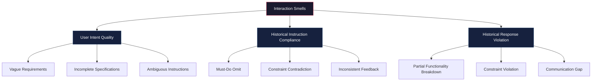

# Interaction Smells in Codex CLI Sessions: Recognising and Fixing Multi-Turn Prompt Anti-Patterns


---

Every senior developer knows about code smells — structural patterns that hint at deeper problems. A March 2026 empirical study from Zhang et al. introduces an analogous concept for AI-assisted coding: **interaction smells**, the recurring anti-patterns in multi-turn human-LLM conversations that silently degrade output quality over the course of a session[^1]. For Codex CLI users running long agentic sessions — sometimes spanning hours of iterative development — recognising and mitigating these smells is the difference between productive collaboration and context-poisoned drift.

This article maps the research taxonomy onto practical Codex CLI workflows and shows how to use the CLI's built-in features to defend against each smell category.

## The Interaction Smell Taxonomy

The study analysed real-world multi-turn coding conversations across six LLMs (GPT-4o, DeepSeek-Chat, Gemini 2.5, Qwen2.5-32B, Qwen2.5-72B, and Qwen3-235B-a22b) and identified three primary categories of interaction smell, comprising nine subcategories[^1]:



The study found that **Must-Do Omit** and **Partial Functionality Breakdown** were the most pervasive smells across all models tested, whilst **Ambiguous Instruction** appeared less frequently in coding-specific tasks[^1]. The critical insight: these smells compound over turns. A vague requirement in turn 3 interacts with constraint contradiction in turn 7 to produce functionally broken code by turn 12.

## Category 1: User Intent Quality Smells

These originate from how the developer frames requests. In Codex CLI sessions, they manifest as prompts that lack the four components OpenAI's own best-practices guide recommends: objective, context, constraints, and verification criteria[^2].

### Vague Requirements

**The smell:** "Fix the authentication" instead of "The JWT refresh flow in `src/auth/refresh.ts` silently swallows 401 responses when the refresh token has expired — make it redirect to `/login` and clear the stored token."

**Codex CLI defence:** Use the `@` mention syntax to attach specific files before prompting. The official prompting guide states that "Codex produces higher-quality outputs when it can verify its work"[^3] — vague prompts make verification impossible.

```bash
# Bad: leaves Codex guessing which auth system
codex "fix the auth bug"

# Good: anchors the request with files and verification
codex "The JWT refresh in @src/auth/refresh.ts swallows 401s. \
  Make it redirect to /login and clear localStorage. \
  Run the existing tests in @src/auth/__tests__ to verify."
```

### Incomplete Specifications

**The smell:** Asking Codex to "add pagination" without specifying cursor vs offset, page size defaults, or whether the API already has pagination headers.

**Codex CLI defence:** Use `/plan` mode first. OpenAI recommends toggling Plan mode with `/plan` or `Shift+Tab` for complex or ambiguous work[^2]. Plan mode forces Codex to gather information and propose a step-by-step approach before writing code, surfacing the specification gaps early.

### Ambiguous Instructions

**The smell:** "Make the tests better" — better could mean faster, more comprehensive, or more readable.

**Codex CLI defence:** Use AGENTS.md to encode your team's definition of quality. As the best-practices guide notes, "a short, accurate AGENTS.md is more useful than a long file full of vague rules"[^2]. Scaffold one with `/init` and include explicit verification criteria:

```markdown
<!-- .codex/AGENTS.md -->
## Test quality standards
- Every new function gets at least one happy-path and one error-path test
- Use `vitest` with `--coverage` — minimum 80% branch coverage
- Prefer `describe`/`it` blocks; avoid `test()` for consistency
```

## Category 2: Historical Instruction Compliance Smells

These are the most insidious category for long Codex CLI sessions. They arise when the LLM *forgets or contradicts* instructions given earlier in the conversation.

### Must-Do Omit

**The smell:** You told Codex to "always run `npm test` after every change" in turn 2, but by turn 15 it silently stops running tests.

**Codex CLI defence:** Move durable instructions out of prompts and into AGENTS.md or PostToolUse hooks. The best-practices guide explicitly warns against "embedding durable rules in prompts instead of AGENTS.md"[^2]. Hooks enforce compliance mechanically:

```toml
# .codex/config.toml
[[hooks]]
event = "PostToolUse"
tool = "shell"
command = "npm test --silent 2>&1 | tail -5"
timeout_ms = 30000
```

This hook runs the test suite after every shell command Codex executes — the agent cannot omit it regardless of how long the session runs[^4].

### Constraint Contradiction

**The smell:** In turn 4 you say "use functional patterns, no classes." In turn 9, reviewing a module, you say "wrap this in a service class." The model now holds contradictory constraints and picks whichever it deems more recent.

**Codex CLI defence:** Use `/compact` when you catch yourself contradicting earlier instructions. Compaction summarises the conversation history, and you can follow up with a clarifying prompt that resolves the contradiction. For persistent constraints, codify them in AGENTS.md where they cannot drift between turns[^2].

### Inconsistent Feedback

**The smell:** Approving a code pattern in turn 6, then rejecting the identical pattern in turn 11. This trains the agent towards confusion rather than quality.

**Codex CLI defence:** Use `/fork` to explore alternative approaches without polluting the main conversation thread. The fork creates a separate context where you can evaluate a different style without sending mixed signals in the primary session[^5].

## Category 3: Historical Response Violation Smells

These occur when the *model itself* violates patterns it established earlier, independent of user contradictions.

### Partial Functionality Breakdown

**The smell:** Codex refactors a module and silently drops error handling that was present in the original code.

**Codex CLI defence:** The SlopCodeBench research (March 2026) found that agent-generated code exhibits an 80% increase in erosion markers and 89.8% increase in verbosity during long-horizon tasks[^6]. The defence is structural: use PostToolUse hooks to run linters and type checkers after every file edit, and configure `/review` presets that check for behaviour changes:

```bash
/review  # Uses the built-in review preset to check working tree changes
```

### Constraint Violation

**The smell:** AGENTS.md says "never modify files in `src/generated/`" but Codex edits them anyway during a large refactor.

**Codex CLI defence:** Use `deny-read` glob policies in config.toml to make protected directories literally invisible to the agent:

```toml
# .codex/config.toml
[sandbox]
deny_read = ["src/generated/**", "vendor/**"]
```

This is a runtime-enforced boundary, not a prompt-level suggestion[^4].

### Communication Gap

**The smell:** Codex produces code that works but deviates from your architectural intent without explaining why.

**Codex CLI defence:** Set the `/personality` to `pragmatic` for maximum information density, and configure reasoning effort to `medium` or `high` for architectural tasks. The prompting guide recommends adjusting reasoning effort to match task complexity — low for quick fixes, high for complex changes[^3]. Higher reasoning effort produces more explicit decision rationale, though the "Reasoning Trap" research cautions that `xhigh` effort can paradoxically increase tool hallucination[^7].

## The InCE Defence Pattern for Codex CLI

The interaction smells paper proposes **Invariant-aware Constraint Evolution (InCE)**, a multi-agent framework that extracts global invariants from the conversation and runs pre-generation quality audits[^1]. You can approximate this pattern in Codex CLI using three built-in mechanisms:

```mermaid
flowchart LR
    A[AGENTS.md<br/>Global Invariants] --> B[PostToolUse Hooks<br/>Pre-generation Audit]
    B --> C[/compact + /review<br/>Periodic Reconciliation]
    C --> D[Clean Context<br/>Smell-Free Output]

    style A fill:#0f3460,stroke:#e94560,color:#fff
    style B fill:#0f3460,stroke:#e94560,color:#fff
    style C fill:#0f3460,stroke:#e94560,color:#fff
    style D fill:#1a1a2e,stroke:#53d769,color:#fff
```

1. **AGENTS.md as invariant store** — Encode non-negotiable constraints once; they persist across all turns without drift[^2].
2. **Hooks as automated auditors** — PostToolUse hooks enforce invariants at the tool level, catching violations before they compound[^4].
3. **Periodic compaction and review** — Run `/compact` every 20-30 turns to prune accumulated context noise, then `/review` to verify the working tree matches intent[^5].

## Session Hygiene Checklist

| Smell Category | Signal | Codex CLI Mitigation |
|---|---|---|
| Vague Requirements | Agent asks many clarifying questions | Use `@` file mentions; write explicit objectives |
| Incomplete Specifications | Output misses edge cases | Use `/plan` mode first |
| Must-Do Omit | Agent stops following earlier rules | Move rules to AGENTS.md or hooks |
| Constraint Contradiction | Output quality fluctuates wildly | Use `/compact`; resolve contradictions explicitly |
| Partial Functionality Breakdown | Regressions after refactoring | PostToolUse hooks running tests/linters |
| Constraint Violation | Protected files modified | `deny_read` policies in config.toml |
| Communication Gap | Code works but deviates from intent | Raise reasoning effort; use `/review` |

## When to Start a New Session

The compounding nature of interaction smells means there is a point of diminishing returns for any conversation thread. OpenAI's best-practices guide recommends keeping "one thread per coherent unit of work" and warns against "using one thread per project" which causes bloated context[^2]. The research supports this: smell density increases non-linearly with turn count[^1].

Practical threshold: if you have run `/compact` more than twice and are still seeing constraint violations or must-do omissions, start a fresh session with `/new`. Transfer the relevant context through AGENTS.md and file mentions rather than carrying forward a polluted conversation history.

## Citations

[^1]: Zhang, B., Zhang, L., Shi, L., Wang, S., Qian, Y., Zhao, L., Liu, F., Fu, A., & Ye, Y. (2026). "An Empirical Study of Interaction Smells in Multi-Turn Human-LLM Collaborative Code Generation." *arXiv:2603.09701v2*, March 2026. [https://arxiv.org/abs/2603.09701](https://arxiv.org/abs/2603.09701)

[^2]: OpenAI. "Best practices — Codex." *OpenAI Developers*, April 2026. [https://developers.openai.com/codex/learn/best-practices](https://developers.openai.com/codex/learn/best-practices)

[^3]: OpenAI. "Codex Prompting Guide." *OpenAI Cookbook*, April 2026. [https://developers.openai.com/cookbook/examples/gpt-5/codex_prompting_guide](https://developers.openai.com/cookbook/examples/gpt-5/codex_prompting_guide)

[^4]: OpenAI. "Advanced Configuration — Codex." *OpenAI Developers*, April 2026. [https://developers.openai.com/codex/config-advanced](https://developers.openai.com/codex/config-advanced)

[^5]: OpenAI. "Features — Codex CLI." *OpenAI Developers*, April 2026. [https://developers.openai.com/codex/cli/features](https://developers.openai.com/codex/cli/features)

[^6]: Orlanski, G., et al. (2026). "SlopCodeBench: Benchmarking How Coding Agents Degrade Over Long-Horizon Iterative Tasks." *arXiv:2603.24755*, March 2026. [https://arxiv.org/abs/2603.24755](https://arxiv.org/abs/2603.24755)

[^7]: Zhuang, Y., et al. (2026). "The Reasoning Trap: Why Higher Reasoning Effort Increases Tool Hallucination." *arXiv:2510.22977*, ICLR 2026. [https://arxiv.org/abs/2510.22977](https://arxiv.org/abs/2510.22977)
