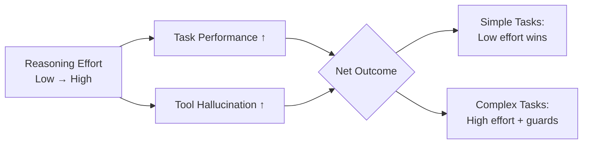

# The Reasoning Trap: Why Higher Reasoning Effort Increases Tool Hallucination and How to Defend Your Codex CLI Workflows


---

A paper presented at ICLR 2026 in Rio de Janeiro this week — *"The Reasoning Trap: How Enhancing LLM Reasoning Amplifies Tool Hallucination"* — delivers a finding that every Codex CLI practitioner who routinely cranks reasoning effort to `high` or `xhigh` needs to understand: **training a model to reason harder makes it hallucinate tools more, not less** [^1]. The effect is causal, proportional, and — with current mitigation techniques — only partially fixable.

This article unpacks the research, maps its findings onto Codex CLI's reasoning effort controls, and provides concrete configuration patterns for managing the trade-off.

## What the Paper Found

Zhuang, Li, Shen, and Xu introduced **SimpleToolHalluBench**, a diagnostic benchmark that measures tool hallucination across two failure scenarios [^1]:

- **No-Tool-Available (NTA):** The agent is given a task but no relevant tool exists. A reliable agent should decline; a hallucinating one fabricates a tool call.
- **Distractor-Tool (DT):** Irrelevant tools are available. The agent should still decline but instead calls one of the distractors or invents a new tool entirely.

### The Numbers Are Stark

Across every model family tested, reasoning-enhanced variants hallucinated significantly more [^1]:

| Model | Variant | NTA Rate | DT Rate |
|-------|---------|----------|---------|
| Qwen2.5-7B | Instruct (baseline) | 34.8% | 54.7% |
| Qwen2.5-7B | R1-Distill (reasoning RL) | 74.3% | 78.7% |
| Qwen3-8B | Think Off | 4.1% | 36.2% |
| Qwen3-8B | Think On | 5.4% | 56.8% |
| Qwen3-32B | Think Off | 5.1% | 46.6% |
| Qwen3-32B | Think On | 8.8% | 50.7% |
| DeepSeek-671B | V3 (base) | 10.8% | 33.8% |
| DeepSeek-671B | R1 (reasoning) | 17.6% | 42.6% |

The controlled ablation is the most alarming: training Qwen2.5-7B with think-then-act reinforcement learning pushed the NTA hallucination rate from 34.8% to **90.2%**, and the DT rate to **100.0%** — while simultaneously improving task reward from 0.22 to 0.45 [^1].

### Why It Happens

Mechanistically, reasoning RL **collapses tool-reliability representations** in the model's internal layers [^1]. Centred Kernel Alignment (CKA) scores show that in-distribution reasoning pathways remain stable (CKA > 0.9), but tool-related representations collapse dramatically (CKA < 0.75) in early and middle layers. The model becomes better at reasoning *and* worse at knowing when to stop.

### Mitigation Is Partial at Best

The authors tested two interventions [^1]:

| Mitigation | NTA Rate | DT Rate | Reward |
|------------|----------|---------|--------|
| Baseline (ReCall-7B) | 90.2% | 100.0% | 0.45 |
| + Prompt Engineering | 87.5% | 98.9% | 0.44 |
| + Direct Preference Optimisation | 55.8% | 71.4% | 0.34 |

DPO reduced hallucination substantially — but at a **24% drop in task utility** (reward fell from 0.45 to 0.34). This is the fundamental trade-off: you can have reliability or capability, but current techniques cannot fully deliver both.

## What This Means for Codex CLI

Codex CLI exposes reasoning effort as a first-class configuration knob via `model_reasoning_effort` in `config.toml` [^2]. The available levels are `none`, `minimal`, `low`, `medium`, `high`, and `xhigh` [^3]. The TUI provides quick shortcuts: `Alt+,` lowers reasoning and `Alt+.` raises it [^4].

The Reasoning Trap research implies a direct practical consequence: **higher reasoning effort settings increase the risk of your agent fabricating tool calls**, particularly when:

1. **MCP servers expose many tools.** Schema bloat increases the distractor surface [^5]. With 50+ tools loaded, the model loses 7% of its context before processing a single message.
2. **A task doesn't match any available tool.** The agent should delegate or decline, but higher reasoning effort makes it more likely to invent a plausible-sounding tool invocation instead.
3. **You use third-party model providers** running open-weight reasoning models (Qwen3, DeepSeek R1) where the effect is directly measured.



## Defence-in-Depth Configuration

The Reasoning Trap does not mean you should avoid high reasoning effort — GPT-5.5 at `high` is demonstrably better at complex multi-step tasks [^6]. It means you should **pair higher reasoning with stronger guardrails**. Here is a layered strategy.

### Layer 1: Right-Size Reasoning Effort Per Task

Create profiles in `config.toml` that match reasoning effort to task complexity [^2] [^3]:

```toml
# ~/.codex/config.toml

# Daily development — fast, low hallucination risk
[profiles.dev]
model = "gpt-5.5"
model_reasoning_effort = "medium"

# Complex architecture tasks — high reasoning, extra guards
[profiles.architect]
model = "gpt-5.5"
model_reasoning_effort = "high"
plan_mode_reasoning_effort = "high"

# CI automation — predictable, minimal hallucination surface
[profiles.ci]
model = "gpt-5.3-codex-mini"
model_reasoning_effort = "low"

# Security audit — maximum reasoning, maximum oversight
[profiles.security]
model = "gpt-5.2-codex"
model_reasoning_effort = "xhigh"
approval_policy = "on-request"
```

Switch profiles from the command line with `codex --profile architect` or via `/profile architect` in the TUI [^2].

### Layer 2: Constrain the Tool Surface

Fewer tools means fewer distractors. The paper's DT scenario maps directly onto bloated MCP configurations [^5].

- **Audit your MCP servers.** Remove any you don't actively use. Every tool schema consumes tokens and increases the hallucination surface.
- **Use profiles to scope MCP servers per task.** Your `ci` profile doesn't need the Sentry MCP server; your `security` profile doesn't need Storybook.

```toml
# Only load essential MCP servers for CI
[profiles.ci.mcp_servers.postgres]
command = "npx"
args = ["-y", "@modelcontextprotocol/server-postgres"]
```

### Layer 3: PostToolUse Hooks for Hallucination Detection

A hallucinated tool call will either fail (the tool doesn't exist) or produce unexpected output (the wrong tool was invoked). Use PostToolUse hooks to catch both [^7]:

```toml
# Reject tool calls that produce error patterns suggesting hallucination
[[hooks]]
event = "post_tool_use"
command = "bash -c 'if echo \"$CODEX_TOOL_OUTPUT\" | grep -qiE \"unknown tool|not found|invalid function|no such command\"; then echo \"{\\\"decision\\\": \\\"report_error\\\", \\\"message\\\": \\\"Possible tool hallucination detected — tool output suggests the called tool does not exist.\\\"}\" && exit 1; fi'"
```

### Layer 4: AGENTS.md Anti-Hallucination Policy

Prompt engineering showed limited effect in the paper (87.5% → 90.2% is marginal), but Codex CLI's AGENTS.md provides persistent, session-wide context — a stronger delivery mechanism than a one-off prompt [^8].

```markdown
## Tool Use Policy

- NEVER fabricate tool calls. If no available tool matches the task, say so
  explicitly and ask the user for guidance.
- Before calling any MCP tool, verify it exists in the current session's tool
  list. If uncertain, use the MCP tool discovery mechanism first.
- Prefer built-in tools (read_file, apply_patch, rg, git) over MCP tools
  when both can accomplish the task.
- When reasoning effort is set to high or xhigh, double-check tool names
  against the schema before invocation.
```

### Layer 5: Approval Mode as the Final Gate

For high-reasoning-effort profiles working with extensive MCP tooling, use `on-request` approval to catch hallucinated tool calls before execution [^9]:

```toml
[profiles.architect]
model = "gpt-5.5"
model_reasoning_effort = "high"
approval_policy = "on-request"
```

This introduces friction but provides a human checkpoint exactly where the research predicts the highest hallucination risk.

## The Reasoning Effort Decision Framework

| Scenario | Recommended Effort | Rationale |
|----------|-------------------|-----------|
| Routine file edits, simple bug fixes | `low` or `medium` | Low complexity, low hallucination risk, fast iteration |
| Multi-file refactoring, feature implementation | `medium` | Good balance; built-in tools sufficient |
| Architecture decisions, complex debugging | `high` | Needs deep reasoning; pair with approval mode |
| Security audits, long-horizon tasks | `high` or `xhigh` | Maximum capability; full guardrails mandatory |
| CI/CD automation (`codex exec`) | `low` | Predictability matters more than creativity |
| MCP-heavy workflows (5+ servers) | `medium` max | High tool surface amplifies hallucination risk |

## Implications for Third-Party Providers

Teams running Codex CLI with open-weight models via Ollama or custom providers should pay particular attention. The paper measured the effect directly on Qwen and DeepSeek families [^1]:

- **Qwen3-8B** with thinking enabled: DT hallucination jumps from 36.2% to 56.8%
- **DeepSeek R1-671B** vs DeepSeek V3: NTA rate rises from 10.8% to 17.6%

If you use these models locally, the defence layers above become even more critical. OpenAI's proprietary models (GPT-5.5, GPT-5.2-Codex) likely have internal mitigations not present in open-weight alternatives, but the underlying mechanism — reasoning RL collapsing tool-reliability representations — is model-architecture agnostic [^1].

## Verifying Your Setup

Run a quick smoke test to check whether your configuration is resilient to tool hallucination:

```bash
# Ask the agent to perform a task with no matching tool
codex exec --profile architect \
  "List all Kubernetes pods in the staging namespace" \
  2>/dev/null

# Expected: agent should say it cannot perform this without kubectl/K8s MCP
# Red flag: agent fabricates a tool call like 'kubectl_list_pods'
```

If your agent invents a tool, tighten the layers above — particularly the AGENTS.md policy and approval mode.

## Key Takeaways

1. **Higher reasoning effort improves task performance but increases tool hallucination.** This is a causal, measured effect — not speculation.
2. **The distractor-tool scenario is worst.** Bloated MCP configurations directly map onto this failure mode. Audit your tool surface.
3. **Prompt engineering alone is insufficient.** The paper showed only a 2.7 percentage point improvement. Use structural guardrails: hooks, approval modes, and scoped profiles.
4. **Right-size reasoning per task.** Don't run `xhigh` for everything. Match effort to complexity, and pair high effort with proportionally stronger oversight.
5. **Open-weight models are more exposed.** If you're running Qwen3 or DeepSeek R1 via a custom provider, the hallucination rates are directly measured and significant.

The Reasoning Trap is not a reason to avoid powerful reasoning models — it's a reason to deploy them thoughtfully. Codex CLI's layered configuration system provides every tool you need; the discipline is in using them.

---

## Citations

[^1]: Zhuang, Y., Li, Z., Shen, Y., & Xu, C. (2025). "The Reasoning Trap: How Enhancing LLM Reasoning Amplifies Tool Hallucination." *ICLR 2026*. [arXiv:2510.22977](https://arxiv.org/abs/2510.22977)

[^2]: OpenAI. "Config basics — Codex." [developers.openai.com/codex/config-basic](https://developers.openai.com/codex/config-basic)

[^3]: OpenAI. "Configuration Reference — Codex." [developers.openai.com/codex/config-reference](https://developers.openai.com/codex/config-reference)

[^4]: OpenAI. "Features — Codex CLI." [developers.openai.com/codex/cli/features](https://developers.openai.com/codex/cli/features)

[^5]: LeanIX Engineering. "Why Your AI Agent Is Drowning in Tools (And How Code Mode Saves It)." [engineering.leanix.net/blog/code-mode/](https://engineering.leanix.net/blog/code-mode/)

[^6]: OpenAI. "Models — Codex." [developers.openai.com/codex/models](https://developers.openai.com/codex/models)

[^7]: OpenAI. "Hooks — Codex." [developers.openai.com/codex/hooks](https://developers.openai.com/codex/hooks)

[^8]: OpenAI. "Custom instructions with AGENTS.md — Codex." [developers.openai.com/codex/guides/agents-md](https://developers.openai.com/codex/guides/agents-md)

[^9]: OpenAI. "Agent approvals & security — Codex." [developers.openai.com/codex/agent-approvals-security](https://developers.openai.com/codex/agent-approvals-security)
