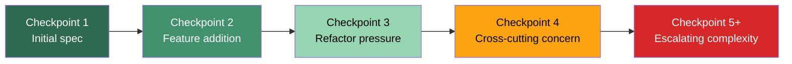
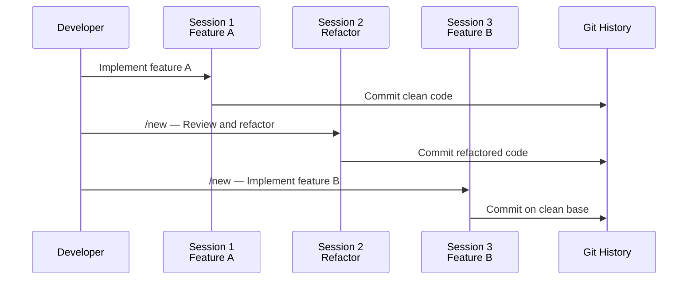

# SlopCodeBench and Code Quality Degradation: Defending Against Architectural Decay in Long-Horizon Codex CLI Sessions


---

## Introduction

Every practitioner who has run Codex CLI for more than an hour on an evolving feature has felt it: the first few edits are crisp, modular, and well-factored, but by checkpoint five the agent is duplicating blocks, stuffing logic into God functions, and wrapping everything in defensive abstractions nobody asked for. Until recently, this decay was anecdotal. SlopCodeBench, published in March 2026 by Orlanski et al. at the University of Wisconsin-Madison, MIT, and Washington State University, is the first benchmark to quantify it rigorously[^1].

This article unpacks the paper's findings, maps them to practical Codex CLI patterns, and presents a defence-in-depth strategy for keeping agent-generated code clean across long-horizon sessions.

---

## What SlopCodeBench Measures

SlopCodeBench is a language-agnostic benchmark comprising 20 problems and 93 total checkpoints[^1]. Unlike single-shot benchmarks such as SWE-bench, each problem forces the agent to extend its own prior solution under evolving specifications — mimicking real feature development where today's decisions constrain tomorrow's architecture.

Two trajectory-level quality signals are tracked[^1]:

- **Verbosity** — the fraction of redundant or duplicated code. Measures unnecessary abstraction layers, trivial wrappers, defensive boilerplate, and copy-paste duplication.
- **Structural erosion** — the share of cyclomatic complexity mass concentrated in high-complexity functions. Tracks the emergence of God functions and the collapse of modular boundaries.

Each checkpoint specifies only observable behaviour at a CLI or API boundary, keeping test suites hidden and leaving internal structure unconstrained[^1]. This design means the agent cannot game tests — it must make genuine architectural decisions.



---

## The Numbers That Matter

The headline results are sobering for anyone relying on coding agents for multi-step feature work[^1]:

| Metric | Value |
|--------|-------|
| End-to-end solve rate (any model) | **0%** — no agent completed any problem fully |
| Highest checkpoint solve rate | **17.2%** (Claude Opus 4.6) |
| Trajectories with rising erosion | **80%** |
| Trajectories with rising verbosity | **89.8%** |
| Agent verbosity vs human code | **2.2x** higher |
| Mean high-CC function count, start to end | **4.1 to 37.0** |
| Cost growth, first to final checkpoint | **2.9x** |

For calibration, the team tracked 48 maintained open-source Python repositories over their commit histories. Human-maintained code also degrades over time, but far less: only 67% of human repositories ended with higher verbosity than they started, with a median growth of 25% versus 43% for agents[^1]. Crucially, human metrics plateau whilst agent metrics climb monotonically.

### Model-Specific Results

Among the eleven models tested across 25 configurations[^1]:

| Model | Strict Solve % | Erosion | Verbosity | Cost/Checkpoint |
|-------|---------------|---------|-----------|-----------------|
| Claude Opus 4.6 | 17.2 | 0.774 | 0.346 | \$3.47 |
| GPT-5.4 | 11.8 | 0.515 | 0.286 | \$3.27 |
| Claude Sonnet 4.6 | 8.5 | 0.703 | 0.313 | \$1.92 |

GPT-5.4 showed the lowest erosion among frontier models, but still failed every end-to-end problem. Higher solve rates did not correlate with cleaner code — Opus scored highest on correctness yet exhibited the worst erosion[^1].

---

## Why Prompt Engineering Alone Cannot Fix This

The SlopCodeBench team tested three prompt intervention strategies[^1]:

1. **just-solve** (baseline) — minimal specification, no quality guidance.
2. **anti_slop** — explicitly forbids verbose patterns, defensive over-engineering, unnecessary abstractions, trivial wrappers, and if/else ladders.
3. **plan_first** — requires the agent to outline its approach before coding, emphasising simplicity and correctness verification.

The results are instructive. Quality-aware prompts shifted the intercept but not the slope:

- `anti_slop` cut initial verbosity by 34.5% on GPT-5.4 and 33.2% on GPT-5.3-Codex[^1].
- Both strategies reduced initial erosion compared to baseline.
- **But degradation resumed at the same rate regardless of initial quality.**

Worse, cleaner code cost more: GPT-5.4 spent 47.9% more per run under `anti_slop` (\$450 vs \$304), as the agent invested more tokens in planning and writing cleaner code[^1]. And despite halving erosion and cutting verbosity by a third, paired Wilcoxon signed-rank tests found no statistically significant difference in any solve-rate metric between the three strategies[^1].

The implication is clear: you cannot prompt your way out of architectural decay. The degradation is structural, not stylistic.

---

## Mapping the Problem to Codex CLI Sessions

In practical Codex CLI work, the SlopCodeBench pattern manifests in three recognisable ways:

### 1. The Compounding Monolith

A session that starts with clean, modular functions gradually consolidates logic into fewer, larger functions as the agent patches around earlier decisions rather than refactoring. By the fifth edit, a 30-line utility has become a 200-line function with nested conditionals.

### 2. The Defensive Wrapper Cascade

Each new requirement prompts the agent to add an abstraction layer rather than modify existing code. After several iterations you have `processData()` calling `_processDataInner()` calling `_processDataCore()` — each adding minimal value.

### 3. The Copy-Paste Drift

Rather than extracting shared logic, the agent duplicates blocks with minor variations. Verbosity climbs whilst the code's conceptual surface area remains static.

---

## A Defence-in-Depth Strategy for Codex CLI

Since prompts alone cannot prevent degradation, the solution requires multiple reinforcing layers. The following patterns combine Codex CLI's AGENTS.md, hooks, subagent delegation, and session management into a practical anti-degradation stack.

### Layer 1: AGENTS.md Anti-Erosion Policy

Encode quality constraints as durable context that survives compaction[^2]:

```markdown
## Code Quality Standards

### Mandatory Refactoring Rules
- No function shall exceed 40 lines. If an edit would push a function past this limit, refactor first.
- No file shall contain more than 3 functions with cyclomatic complexity > 10.
- Before adding a new abstraction layer, verify the existing interface cannot be extended.
- Prefer modifying existing functions over wrapping them.
- Extract duplicated blocks (>5 lines) into shared utilities immediately.

### Iterative Extension Protocol
When extending existing code:
1. Read and understand the current architecture before making changes.
2. Identify if the change requires structural modification or can fit the existing design.
3. If structural modification is needed, refactor first in a separate commit, then add the feature.
4. Run tests after refactoring and after feature addition separately.
```

This addresses the SlopCodeBench finding that early architectural decisions compound[^1]. By mandating refactor-first behaviour, the AGENTS.md policy interrupts the decay cycle at each checkpoint.

### Layer 2: PostToolUse Hooks for Quality Gates

Use Codex CLI's stable hooks system (v0.124.0+) to enforce quality checks after every code edit[^3][^4]:

```toml
# In ~/.codex/config.toml or .codex/config.toml

[[hooks]]
event = "post_tool_use"
tool_name = "apply_patch"
command = "python scripts/quality-gate.py --max-cc 15 --max-fn-length 50 --max-duplication 5"
timeout_ms = 30000
on_fail = "stop"
```

A minimal quality gate script:

```python
#!/usr/bin/env python3
"""Post-edit quality gate: checks cyclomatic complexity and duplication."""
import subprocess, sys, json

# Run radon for cyclomatic complexity
result = subprocess.run(
    ["radon", "cc", "src/", "-j", "-n", "C"],
    capture_output=True, text=True
)
violations = json.loads(result.stdout) if result.stdout.strip() else {}

high_cc_count = sum(
    len(funcs) for funcs in violations.values()
)

if high_cc_count > int(sys.argv[sys.argv.index("--max-cc") + 1]):
    print(f"QUALITY GATE FAILED: {high_cc_count} functions exceed CC threshold")
    sys.exit(1)

print(f"Quality gate passed: {high_cc_count} high-CC functions")
```

When the hook fires `on_fail = "stop"`, the agent must address the quality violation before proceeding — creating a forced refactoring checkpoint that SlopCodeBench's prompt-only interventions lacked[^1].

### Layer 3: Checkpoint-Based Session Architecture

The SlopCodeBench data shows that degradation is monotonic within a continuous trajectory[^1]. Break the trajectory by structuring work as a sequence of bounded sessions rather than one long conversation:



Practical rules:

- **One feature per session.** Use `/new` between logically distinct changes.
- **Interleave refactoring sessions.** After every 2-3 feature sessions, start a fresh session whose sole task is reviewing and refactoring the accumulated code.
- **Compact early, not late.** Research suggests compacting at 60% context capacity rather than 95% preserves sharper reasoning[^5].
- **Commit before extending.** A git commit between features gives the next session a clean baseline and enables `git diff`-based quality comparison.

### Layer 4: Subagent Delegation for Parallel Quality

For larger features, delegate to subagents with scoped responsibilities. Each subagent gets a fresh context window, avoiding the accumulated decay that SlopCodeBench measures[^6]:

```
Implement the payment processing module. Delegate as follows:
- Subagent 1: Write the payment gateway adapter (src/payments/gateway.ts)
- Subagent 2: Write the transaction validation logic (src/payments/validation.ts)
- Subagent 3: Write integration tests (tests/payments/)

Each subagent should produce focused, single-responsibility code.
After all subagents complete, review the combined result for interface consistency.
```

Because each subagent operates independently, no single context accumulates the progressive decay that degrades monolithic sessions[^6]. The parent agent then performs a focused review pass — a short session with minimal accumulated state.

### Layer 5: Periodic Automated Review

Schedule a periodic review loop using `codex exec` to catch degradation that slips past real-time hooks[^7]:

```bash
codex exec \
  --model gpt-5.5 \
  --sandbox read-only \
  --prompt-file prompts/quality-review.md \
  --output-schema schemas/quality-report.json \
  -o reports/quality-$(date +%Y%m%d).json
```

Where `prompts/quality-review.md` contains:

```markdown
Review the codebase for signs of iterative quality degradation:
1. Functions exceeding 40 lines — list each with line count
2. Duplicated code blocks (>5 lines of similarity) — list pairs
3. Wrapper functions that add no logic — list candidates for inlining
4. Files where >50% of complexity is in a single function

Output a structured report with severity ratings and specific refactoring recommendations.
```

This creates an external feedback loop independent of any single session's accumulated context.

---

## What SlopCodeBench Means for Model Selection

The paper's model-specific data carries a practical lesson: higher correctness does not mean cleaner code[^1]. Claude Opus 4.6 achieved the highest checkpoint solve rate (17.2%) but also the highest erosion (0.774). GPT-5.4 showed lower erosion (0.515) at a lower solve rate (11.8%).

For Codex CLI practitioners, this suggests a two-model strategy:

| Phase | Recommended Model | Reasoning |
|-------|-------------------|-----------|
| Feature implementation | GPT-5.5 (high effort) | Strongest correctness |
| Quality review and refactoring | GPT-5.5 (medium effort) | Lower erosion tendency, cost-efficient |
| Automated quality gate | GPT-5.3-Codex-Spark | Fast, cheap quality checks |

Configure this via Codex CLI profiles[^8]:

```toml
[profiles.implement]
model = "gpt-5.5"
reasoning_effort = "high"

[profiles.refactor]
model = "gpt-5.5"
reasoning_effort = "medium"

[profiles.quality-check]
model = "gpt-5.3-codex-spark"
reasoning_effort = "low"
```

---

## Limitations and Open Questions

SlopCodeBench has important constraints worth acknowledging:

- **No Codex CLI-specific harness tuning was tested.** The paper used headless CLI invocations with minimal prompts[^1]. The defence patterns described above — hooks, AGENTS.md policies, subagent delegation — represent untested but architecturally sound interventions.
- **The benchmark uses 20 problems.** Whilst diverse, they may not represent every domain. Results on enterprise CRUD applications or infrastructure-as-code may differ.
- **GPT-5.5 was not evaluated.** The paper tested GPT-5.4 and GPT-5.3-Codex. GPT-5.5's larger context window and improved reasoning may shift the degradation curve, though the fundamental architectural challenge likely persists. ⚠️
- **No multi-session evaluation.** SlopCodeBench evaluates single continuous trajectories. The session-boundary strategy described above has not been empirically validated against the benchmark. ⚠️

---

## Key Takeaways

1. **Code quality degradation in long-horizon agent sessions is now empirically quantified.** Erosion increases in 80% of trajectories; verbosity in 89.8%[^1].
2. **Prompt engineering shifts the starting point but not the decay rate.** Anti-slop prompts cut initial verbosity by ~34% but degradation resumed at the same slope[^1].
3. **Defence requires structural interventions** — AGENTS.md policies, quality-gate hooks, session boundaries, and subagent delegation. No single layer suffices.
4. **Higher correctness does not imply higher quality.** Model selection should account for erosion tendency, not just solve rates.
5. **The cheapest intervention is the simplest: start fresh sessions more often.** The SlopCodeBench degradation is monotonic within trajectories — breaking the trajectory breaks the monotonicity.

---

## Citations

[^1]: Orlanski, G., Roy, D., Yun, A., Shin, C., Gu, A., Ge, A., Adila, D., Sala, F., & Albarghouthi, A. (2026). "SlopCodeBench: Benchmarking How Coding Agents Degrade Over Long-Horizon Iterative Tasks." arXiv:2603.24755. [https://arxiv.org/abs/2603.24755](https://arxiv.org/abs/2603.24755)

[^2]: OpenAI. "Custom instructions with AGENTS.md." Codex Developer Documentation. [https://developers.openai.com/codex/guides/agents-md](https://developers.openai.com/codex/guides/agents-md)

[^3]: OpenAI. "Hooks — Codex CLI." Codex Developer Documentation. [https://developers.openai.com/codex/hooks](https://developers.openai.com/codex/hooks)

[^4]: OpenAI. "Codex Changelog — v0.124.0." Codex Developer Documentation. [https://developers.openai.com/codex/changelog](https://developers.openai.com/codex/changelog)

[^5]: Justin3go. "Shedding Heavy Memories: Context Compaction in Codex, Claude Code, and OpenCode." April 2026. [https://justin3go.com/en/posts/2026/04/09-context-compaction-in-codex-claude-code-and-opencode](https://justin3go.com/en/posts/2026/04/09-context-compaction-in-codex-claude-code-and-opencode)

[^6]: OpenAI. "Multi-agents — Codex." Codex Developer Documentation. [https://developers.openai.com/codex/subagents](https://developers.openai.com/codex/subagents)

[^7]: OpenAI. "Non-interactive mode — Codex." Codex Developer Documentation. [https://developers.openai.com/codex/noninteractive](https://developers.openai.com/codex/noninteractive)

[^8]: OpenAI. "Advanced Configuration — Codex." Codex Developer Documentation. [https://developers.openai.com/codex/config-advanced](https://developers.openai.com/codex/config-advanced)
