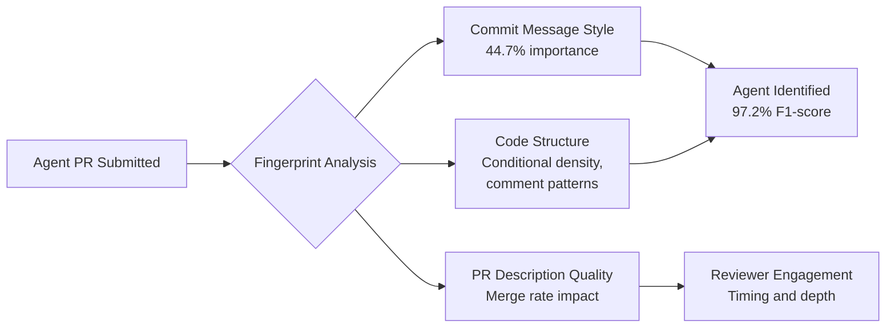

# Agent Fingerprints in Pull Requests: What MSR 2026 Research Reveals and How to Configure Codex CLI for Professional Git Hygiene


---

Three papers presented at the 23rd International Conference on Mining Software Repositories (MSR '26, Rio de Janeiro, April 13-14 2026) reached the same conclusion from different angles: AI coding agents leave distinctive, classifiable fingerprints in their pull requests[^1][^2][^3]. For Codex CLI practitioners, the practical question is straightforward — what do those fingerprints look like, and how do you configure your agent to produce commits and PRs that meet your team's standards?

## What the Research Found

### Agents Are Identifiable at 97% Accuracy

Ghaleb's fingerprinting study analysed 33,580 PRs from five agents — OpenAI Codex, GitHub Copilot, Devin, Cursor, and Claude Code — using 41 features spanning commit messages, PR structure, and code characteristics[^1]. The classifier achieved a **97.2% F1-score** in multi-class identification, meaning each agent produces a near-unique behavioural signature.

The dominant discriminator was not code quality or diff size but **commit message style**. The multiline commit ratio alone accounted for 44.7% of global feature importance[^1]. Codex's fingerprint is particularly distinctive: 67.5% of its classification weight comes from its tendency to produce extensive multiline commit messages.

### Agent PRs Differ Structurally from Human PRs

Ogenrwot and Businge's companion study compared 24,014 merged agent PRs (440,295 commits) against 5,081 human PRs[^2]. Agent PRs showed:

- **Substantially different commit counts** (Cliff's delta 0.5429 — a large effect size)
- **Higher description-to-diff similarity** — agent PR descriptions more closely mirror the actual code changes
- **Moderate differences in files touched and lines deleted**

In short, agent PRs are structurally recognisable even without looking at commit trailers.

### Communication Style Affects Merge Rates

Watanabe et al. examined how PR description quality influences reviewer engagement[^3]. Each agent demonstrated distinct communication patterns, and those patterns correlated with:

- Variation in **merge rates** across agents
- Differences in **reviewer response timing**
- Different levels of **review engagement** (comments, requests for changes)

The task-stratified analysis by Ogenrwot et al. confirmed this: Codex achieves acceptance rates of 59.6-88.6% depending on task type, but Claude Code leads on documentation PRs (92.3%) and feature PRs (72.6%)[^4]. No single agent dominates across all categories.



## The Codex CLI Fingerprint

Across the MSR 2026 papers, Codex's distinctive patterns include:

1. **Verbose multiline commit messages** — the single strongest identifier[^1]
2. **Higher commit counts per PR** compared to human developers[^2]
3. **Consistent description-to-diff alignment** — Codex describes what it changed accurately[^2]
4. **Co-authored-by trailer** — since February 2026, Codex injects `Co-authored-by: Codex <noreply@openai.com>` by default[^5]

Whether these fingerprints are a problem depends on context. For open-source transparency, they are a feature. For enterprise teams with strict commit conventions, they require configuration.

## Configuring Professional Git Output

### Commit Attribution

Codex ships with prompt-based commit attribution enabled by default (PR #11617, merged February 17, 2026)[^5]. Configure it in `~/.codex/config.toml`:

```toml
# Default — shows OpenAI avatar on GitHub
commit_attribution = "Co-authored-by: Codex <noreply@openai.com>"

# Custom trailer for your organisation
commit_attribution = "Co-authored-by: Codex Agent <codex-agent@yourcompany.com>"

# Disable attribution entirely (not recommended for audit trail)
commit_attribution = ""
```

The trailer is injected via prompt context rather than a Git hook, so the model includes it in the commit message it writes[^5].

### AGENTS.md Git Conventions

The most effective way to control Codex's commit style is through explicit conventions in `AGENTS.md`. The fingerprinting research shows that commit message format is the dominant classifier[^1] — so specifying your format is the single highest-impact configuration change.

```markdown
<!-- AGENTS.md -->
## Git Conventions

### Commit Messages
- Use Conventional Commits format: `type(scope): description`
- Types: feat, fix, docs, style, refactor, test, chore, ci
- Keep the subject line under 72 characters
- Do NOT write multiline commit messages unless the change is complex
- For simple changes, use a single-line message
- Include the ticket number when available: `fix(auth): resolve token refresh race [PROJ-1234]`

### Pull Requests
- PR title follows the same Conventional Commits format
- PR description must include:
  - **What** changed (one paragraph)
  - **Why** (link to issue or brief rationale)
  - **Testing** (how you verified the change)
- Do NOT include implementation details that are obvious from the diff
- Keep descriptions concise — aim for 3-8 lines, not 30
```

### PostToolUse Hooks for Commit Quality Gates

For teams that want to enforce commit conventions programmatically, Codex v0.124+ stable hooks provide a `PostToolUse` intercept point. This fires after every tool call, including `shell` commands that run `git commit`[^6]:

```toml
# ~/.codex/config.toml
[hooks.post_tool_use.git_commit_lint]
event = "PostToolUse"
command = """
if echo "$CODEX_TOOL_NAME" | grep -q "shell" && echo "$CODEX_TOOL_INPUT" | grep -q "git commit"; then
  LAST_MSG=$(git log -1 --pretty=%B)
  if ! echo "$LAST_MSG" | grep -qE '^(feat|fix|docs|style|refactor|test|chore|ci)\('; then
    echo '{"decision": "report_warning", "message": "Commit message does not follow Conventional Commits format"}'
  else
    echo '{"decision": "approve"}'
  fi
else
  echo '{"decision": "approve"}'
fi
"""
```

### Controlling Commit Granularity

The research found that agent PRs contain substantially more commits than human PRs[^2]. Codex tends to commit after each logical change, which produces clean atomic commits but can result in noisy histories. Control this through AGENTS.md:

```markdown
## Commit Strategy
- Batch related changes into a single commit where logical
- Do NOT commit after every file edit
- Aim for one commit per logical unit of work
- Use `git add -p` for partial staging when appropriate
- Squash fixup commits before requesting review
```

## Enterprise Considerations

### Audit Trail vs Stealth

The MSR 2026 research demonstrated that agent PRs are classifiable even without explicit attribution markers[^1]. Organisations face a choice:

| Strategy | Configuration | Trade-off |
|----------|--------------|-----------|
| **Full transparency** | Default `commit_attribution` + agent-specific branch prefix | Best for compliance; enables audit queries |
| **Team attribution** | Custom `commit_attribution` with team email | Agents credited as team members; middle ground |
| **Minimal markers** | `commit_attribution = ""` + strict AGENTS.md conventions | Reduces visible fingerprints; harder to audit |

For regulated industries, full transparency is generally required. SOC 2 auditors increasingly ask for agent activity trails, and the Co-authored-by trailer provides a queryable signal[^5]:

```bash
# Count agent-assisted commits in the last quarter
git log --since="2026-01-01" --until="2026-03-31" \
  --grep="Co-authored-by: Codex" --oneline | wc -l
```

### Detection Tools

Even without explicit markers, tools like Coderbuds' open-source YAML rule engine can detect agent-generated code through behavioural analysis — commit patterns, code style shifts, and temporal patterns[^7]. With explicit attribution enabled, detection accuracy approaches 100%; without it, behavioural detection sits around 60%[^7].

## Practical PR Description Templates

The communication research found that PR description quality directly affects merge rates[^3]. Configure a PR template in your repository:

```markdown
<!-- .github/PULL_REQUEST_TEMPLATE.md -->
## What

<!-- One-paragraph summary of the change -->

## Why

<!-- Link to issue or brief rationale -->
Closes #

## How

<!-- Key implementation decisions, if non-obvious -->

## Testing

<!-- How this was verified -->
- [ ] Unit tests pass
- [ ] Integration tests pass
- [ ] Manual verification completed
```

Then reference it in AGENTS.md:

```markdown
## Pull Request Workflow
- Always use the PR template at .github/PULL_REQUEST_TEMPLATE.md
- Fill in every section — do not leave placeholders
- Link the relevant issue in the "Why" section
- List specific test commands you ran in the "Testing" section
```

## What This Means for Your Workflow

The MSR 2026 research establishes three practical takeaways for Codex CLI users:

1. **Your agent's commits are identifiable** regardless of attribution settings. If transparency matters, lean into it with explicit `commit_attribution` rather than fighting it.

2. **Commit message format is the dominant fingerprint.** Specifying Conventional Commits or your team's format in AGENTS.md is the single most impactful configuration change for professional output.

3. **PR description quality affects merge rates.** Invest in a PR template and reference it in AGENTS.md — this is not cosmetic; it measurably improves reviewer engagement and acceptance rates.

The broader implication is that **harness configuration shapes how your agent's work is perceived**, not just how it performs. The same model producing the same code will get different acceptance rates depending on how its commits and PRs are structured. This is harness engineering applied to the social layer of software development.

## Citations

[^1]: Ghaleb, T.A. "Fingerprinting AI Coding Agents on GitHub." Proceedings of the 23rd International Conference on Mining Software Repositories (MSR '26), April 2026. [arXiv:2601.17406](https://arxiv.org/abs/2601.17406)

[^2]: Ogenrwot, D. and Businge, J. "How AI Coding Agents Modify Code: A Large-Scale Study of GitHub Pull Requests." MSR '26 Mining Challenge Track, April 2026. [arXiv:2601.17581](https://arxiv.org/abs/2601.17581)

[^3]: Watanabe, K. et al. "How AI Coding Agents Communicate: A Study of Pull Request Description Characteristics and Human Review Responses." arXiv:2602.17084, February 2026. [arXiv:2602.17084](https://arxiv.org/abs/2602.17084)

[^4]: Ogenrwot, D. et al. "Comparing AI Coding Agents: A Task-Stratified Analysis of Pull Request Acceptance." MSR '26, April 2026. [arXiv:2602.08915](https://arxiv.org/abs/2602.08915)

[^5]: OpenAI. "Codex CLI Commit Attribution." Codex Changelog, February 2026. [GitHub PR #11617](https://github.com/openai/codex/pull/11617)

[^6]: OpenAI. "Hooks — Codex CLI." OpenAI Developers, April 2026. [developers.openai.com/codex/hooks](https://developers.openai.com/codex/hooks)

[^7]: Coderbuds. "Open-Sourcing AI Code Detection: How We Built Rules to Detect Claude Code, GitHub Copilot, and Cursor." Coderbuds Blog, 2026. [coderbuds.com/blog/open-source-ai-code-detection-yaml-rules](https://coderbuds.com/blog/open-source-ai-code-detection-yaml-rules)
