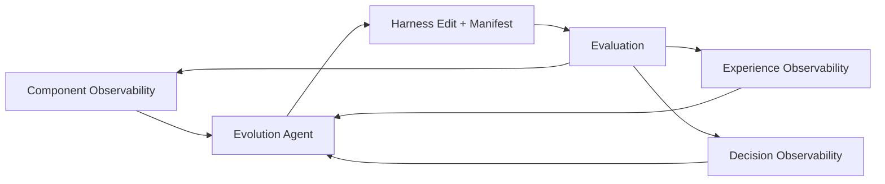
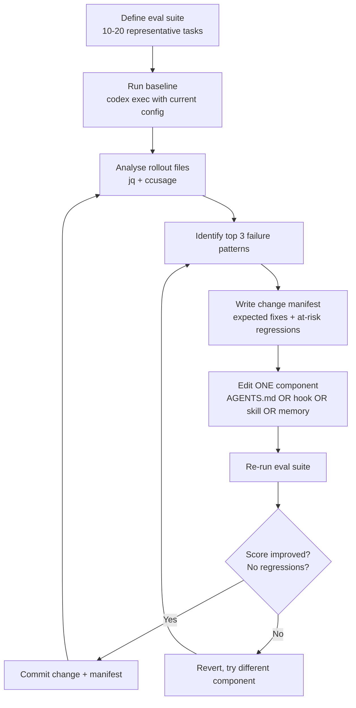

# Agentic Harness Engineering: What Observability-Driven Evolution Means for Your Codex CLI Configuration


---

A paper published on 29 April 2026 by Lin et al. introduces **Agentic Harness Engineering (AHE)**, a closed-loop framework that automatically evolves coding-agent harnesses using structured observability rather than intuition or trial-and-error[^1]. Ten iterations of AHE lifted pass@1 on Terminal-Bench 2.0 from 69.7% to 77.0%, surpassing both the human-designed Codex CLI harness (71.9%) and two self-evolving baselines[^1]. The results carry direct implications for anyone configuring Codex CLI in production.

This article unpacks the framework, examines what the ablation data reveals about where configuration effort actually pays off, and maps the findings onto actionable Codex CLI patterns.

## Why Harness Engineering Matters More Than Model Selection

OpenAI's own harness engineering guide makes the point explicit: "the harness—AGENTS.md, hooks, skills, approval policies, sandbox configuration—is the primary tuning surface for coding agent performance"[^2]. The AHE paper validates this with hard numbers. On Terminal-Bench 2.0, the evolved harness running on GPT-5.4 (77.0%) outperformed the stock Codex CLI harness on the same model (71.9%)[^1]—a 5.1 percentage-point lift from configuration alone, with zero model changes.

Cross-family transfer results reinforce the point. The AHE-evolved harness improved DeepSeek-v4-flash by 10.1 pp, Qwen-3.6-plus by 6.3 pp, and Gemini-3.1-flash-lite by 5.1 pp without re-evolution[^1]. Weaker models benefited most, suggesting the evolved components encode coordination patterns that less capable models lean on more heavily.

## The Three Observability Pillars

AHE structures the evolution loop around three pillars that map cleanly onto Codex CLI's existing configuration surface.



### 1. Component Observability

AHE exposes seven editable harness types as explicit files in a unified workspace[^1]:

| AHE Component | Codex CLI Equivalent |
|---|---|
| System prompt | AGENTS.md |
| Tool descriptions | MCP server schemas |
| Tool implementations | MCP server code, shell scripts |
| Middleware | Hooks (PreToolUse, PostToolUse) |
| Skills | Skills directory (~/.codex/skills/) |
| Sub-agent configurations | Custom agent TOML files |
| Long-term memory | Memories, PLANS.md |

The critical design choice: each component is independently editable and version-controlled. The paper's seed harness starts deliberately minimal—a bash tool only, no middleware or skills—forcing every added component to "earn its place against measured rollouts"[^1]. This maps directly to a Codex CLI best practice: start with a minimal configuration and add complexity only when measurement justifies it.

### 2. Experience Observability

Raw agent trajectories can run to millions of tokens per iteration. AHE's Agent Debugger distils them into a layered, drill-down evidence corpus with per-task analysis reports and benchmark-level overviews[^1].

For Codex CLI practitioners, the equivalent toolkit already exists:

- **Rollout files** (`~/.codex/sessions/`) store full JSONL session traces[^3]
- **OpenTelemetry export** emits counters and duration histograms for API, stream, and tool activity[^4]
- **ccusage** and **tokscale** provide cross-session token analytics[^5]
- **Debug reducer** (v0.125) produces condensed trace summaries for multi-agent sessions[^3]

The paper's finding that progressive disclosure manages token consumption while preserving verification capability suggests a practical pattern: use `jq` filters on rollout JSONL to extract tool-call sequences and failure points before feeding them to a reviewer agent, rather than dumping entire traces.

### 3. Decision Observability

Each AHE edit is paired with a change manifest that declares the expected fixes and predicted regressions[^1]. The next iteration's evaluation intersects predictions with observed outcomes, producing per-edit verdicts. Fix-precision reached 33.7% and fix-recall 51.4% (roughly 5× above random), but regression-precision was only 11.8%[^1].

The practical takeaway: **agents reliably identify what they're fixing but struggle to foresee regressions**. For Codex CLI teams evolving their AGENTS.md or hooks, this means:

- Document every configuration change with its expected impact
- Run a regression suite after each change, not just the targeted tests
- Use PostToolUse hooks to enforce invariants that catch unintended side effects

## Where Configuration Effort Actually Pays Off

The ablation study reveals a counter-intuitive hierarchy of component value[^1]:

```mermaid
bar
    title Component Contribution to Pass Rate (pp)
    "Long-term memory" : 5.6
    "Tools" : 3.3
    "Middleware" : 2.2
    "System prompt" : -2.3
```

### Long-term memory: +5.6 pp

Twelve boundary-case lessons—covering performance margins, packaging layouts, and edge-case handling—delivered the largest single-component gain[^1]. The Codex CLI equivalent is the memories system, which persists corrections and conventions across sessions. The research validates investing time in curating high-quality memories rather than relying solely on AGENTS.md.

**Practical pattern:**

```toml
# config.toml — enable memories and review periodically
[memory]
enabled = true
```

After each major debugging session, explicitly tell Codex to remember the root cause and the fix pattern. These accumulated memories compound across sessions.

### Tools: +3.3 pp

The evolved tool was a 1,364-line shell script that surfaced contract hints from nearby files[^1]. In Codex CLI terms, this translates to MCP servers and custom tool definitions that provide richer context than the default bash tool alone.

### Middleware: +2.2 pp

The evolved middleware was a finish-hook enforcing evaluator-isomorphic closure checks[^1]—essentially a PostToolUse hook that validated output against expected patterns before accepting a turn as complete.

**Practical pattern:**

```toml
# config.toml — PostToolUse hook for build verification
[hooks.post_tool_use.build_check]
event = "PostToolUse"
match_tools = ["shell", "apply_patch"]
command = "bash .codex/hooks/verify-build.sh"
```

### System prompt: −2.3 pp when isolated

The system prompt (AGENTS.md) actually regressed when used alone[^1]. The paper concludes that "structural edits matter more than prose"—factual harness structure (tools, middleware, memory) transfers across tasks whilst prose-level strategy does not.

This does **not** mean AGENTS.md is worthless. It means AGENTS.md should be a concise map pointing to structural components, not a sprawling essay. OpenAI's own guidance recommends roughly 100 lines[^2].

## Component Interactions Are Non-Additive

Single-component gains summed to +11.1 pp, but the full AHE harness yielded only +7.3 pp[^1]. Components overlap in their coverage—particularly closure-style verification, which appears in both middleware and tools.

For Codex CLI teams, this means:

1. **Avoid redundant enforcement.** If a PostToolUse hook already runs `cargo test`, don't also put "always run tests" in AGENTS.md
2. **Measure the marginal value** of each configuration layer. Remove a component, run your eval suite, and check whether the score drops
3. **Budget-aware design**: the paper notes that timeout and step constraints were fitted to GPT-5.4 high[^1]. Applying an evolved configuration to a different model (e.g. GPT-5.5 or Codex-Spark) requires re-tuning execution bounds

## A Practical Observability-Driven Evolution Loop for Codex CLI

Translating AHE's automated loop into a manual practitioner workflow:



### Step-by-step

1. **Build a task suite.** Select 10–20 representative tasks from your actual workflow. Include easy wins and known hard cases
2. **Baseline.** Run `codex exec` against each task with your current configuration. Record pass/fail and token usage
3. **Analyse.** Use rollout JSONL and OTEL traces to categorise failures: navigation errors, tool misuse, context overflow, incorrect business logic
4. **Target one component.** The AHE hierarchy suggests trying memory first, then tools, then middleware, then prompt
5. **Write a manifest.** Before editing, document what you expect to fix and what might regress
6. **Measure.** Re-run the suite. Compare against the manifest predictions
7. **Iterate.** AHE converged in roughly ten iterations[^1]. Expect diminishing returns after five or six

### Cost management

Each evaluation iteration consumes tokens. Use two-tier routing: run the eval suite with `codex-spark` for fast signal on easy tasks, reserve `gpt-5.5` for hard-task evaluation[^6].

```bash
# Quick eval pass with Spark
codex exec -m codex-spark -p ci --prompt "$(cat task.md)" --output-schema schema.json

# Deep eval on hard tasks only
codex exec -m gpt-5.5 --reasoning high --prompt "$(cat hard-task.md)" --output-schema schema.json
```

## What AHE Gets Wrong (and What Practitioners Should Watch)

The paper's regression prediction is weak—11.8% precision, barely 2× above random[^1]. This mirrors a broader pattern in automated harness evolution: **systems optimise for aggregate score on the dominant task difficulty bucket** (here, 55 medium-difficulty tasks) at the expense of tail cases.

For production Codex CLI workflows, this means:

- **Don't trust aggregate pass rates alone.** Track per-category scores and watch for regression on edge cases
- **Hard tasks need dedicated attention.** AHE lifted easy tasks to 100% and medium to 88.2%, but hard tasks only reached 53.3%[^1]. If your workflow includes hard tasks, optimising for aggregate will leave them undertreated
- ⚠️ The paper evaluates on Terminal-Bench 2.0 and SWE-bench Verified. Results may not transfer directly to proprietary codebases with domain-specific constraints

## Key Takeaways

| Finding | Codex CLI Action |
|---|---|
| Structural edits > prose | Keep AGENTS.md under 100 lines; invest in hooks and skills |
| Memory delivers largest single-component gain | Curate memories actively after debugging sessions |
| Components interact non-additively | Measure marginal value; remove redundant enforcement |
| Regression prediction is unreliable | Always run full regression suite, not just targeted tests |
| Cross-family transfer works | Evolved configs benefit weaker models even more |
| Minimal seed + measured additions | Start simple; earn complexity through measurement |

The AHE paper formalises what experienced Codex CLI practitioners already intuit: the harness is the product, and observability is the feedback loop that makes it better. The difference is rigour—change manifests, ablation data, and measured iteration rather than guesswork.

## Citations

[^1]: Lin, J., Liu, S., Pan, C., Lin, L., Dou, S., Huang, X., Yan, H., Han, Z., & Gui, T. (2026). "Agentic Harness Engineering: Observability-Driven Automatic Evolution of Coding-Agent Harnesses." arXiv:2604.25850. [https://arxiv.org/abs/2604.25850](https://arxiv.org/abs/2604.25850)

[^2]: OpenAI. (2026). "Harness engineering: leveraging Codex in an agent-first world." [https://openai.com/index/harness-engineering/](https://openai.com/index/harness-engineering/)

[^3]: OpenAI. (2026). "Codex CLI Changelog v0.125.0." [https://developers.openai.com/codex/changelog](https://developers.openai.com/codex/changelog)

[^4]: SigNoz. (2026). "OpenAI Codex Observability & Monitoring with OpenTelemetry." [https://signoz.io/docs/codex-monitoring/](https://signoz.io/docs/codex-monitoring/)

[^5]: ccusage project. (2026). GitHub repository. Referenced in Codex CLI companion tools ecosystem coverage.

[^6]: OpenAI. (2026). "Codex Models." [https://developers.openai.com/codex/models](https://developers.openai.com/codex/models)
