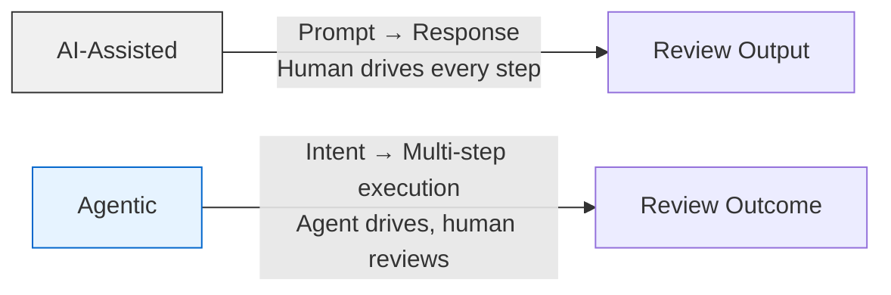
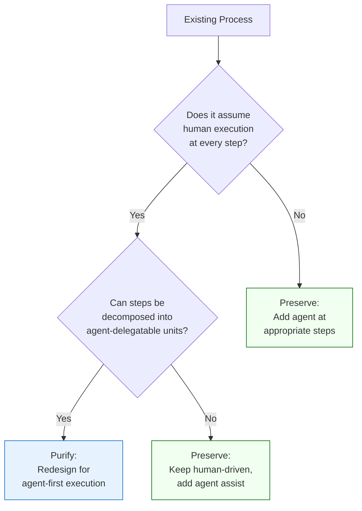

# From Code Generation to Delegated Execution: The Agentic SDLC and What It Means for Your Codex CLI Workflow


---

Three papers published between 16 and 29 April 2026 converge on the same thesis: coding agents have moved beyond generating code and into *executing work* — and the software engineering discipline must expand to match. For Codex CLI practitioners, the implications are concrete. The question is no longer "can the agent write this function?" but "can I verify what it did across twelve files, three services, and a migration script before I ship it?"

This article synthesises the research, maps it to Codex CLI primitives, and identifies the configuration decisions you should revisit today.

---

## The Three Papers

**Bhati (29 April 2026)** published "Agentic AI in the Software Development Lifecycle: Architecture, Empirical Evidence, and the Reshaping of Software Engineering," a synthesis covering systems from Codex CLI to Devin to AlphaEvolve.[^1] The paper proposes a six-layer reference architecture and contrasts the traditional SDLC with an emerging Agentic SDLC (A-SDLC), identifying five open problems that remain unsolved.

**Feldt, Lenberg, Frattini & Parthasarathy (16 April, revised 23 April 2026)** introduced "The Semi-Executable Stack," a six-ring diagnostic model for understanding how software engineering's scope is expanding beyond deterministic code into "semi-executable artifacts" — combinations of natural language, tools, workflows, and organisational routines whose enactment depends on human or probabilistic interpretation.[^2]

**CodeRabbit's Agentic SDLC Guide (April 2026)** formalises the practitioner perspective: the agentic SDLC is a delivery practice where AI agents participate meaningfully across the full lifecycle — planning, coding, reviewing, shipping, and operating — rather than sitting at a single checkpoint like autocomplete.[^3]

---

## The Core Shift: From Assistance to Delegation

The distinction matters. In an *AI-assisted* workflow, you prompt the agent, review its output, and incorporate what's useful. In an *agentic* workflow, you specify intent and the agent pursues a goal across multiple steps — reading files, running tests, creating branches, filing PRs — before you review the outcome.

Codex CLI already supports both modes. The question is which you're actually using.



Bhati's data makes the scale of this shift concrete. SWE-bench Verified performance rose from 1.96% in October 2023 to over 85% for GPT-5.3 Codex by April 2026.[^1][^4] Controlled studies report productivity gains of 13.6% to 55.8%.[^1] The agents are no longer struggling to patch single functions — they're operating at "the granularity of a repository, a feature, or an algorithm."[^1]

---

## The Semi-Executable Stack: Where Your AGENTS.md Sits

Feldt et al.'s six-ring model offers a useful lens for understanding why some Codex CLI configurations work better than others:[^2]

| Ring | Definition | Codex CLI Primitive |
|------|-----------|-------------------|
| 1. Executable artifacts | Deterministic code, tests, infrastructure | Shell commands, `apply_patch` |
| 2. Instructional artifacts | Natural-language specifications that guide agent behaviour | `AGENTS.md`, `SKILL.md`, config.toml prompts |
| 3. Orchestrated execution | Multi-step workflows combining rings 1 and 2 | Subagents, `codex exec`, Symphony orchestration |
| 4. Controls | Permission boundaries, validation gates | Sandbox modes, `requirements.toml`, hooks |
| 5. Operating logic | Team processes, review cadences, delegation frameworks | Guardian approval, `/review`, CI pipelines |
| 6. Societal & institutional fit | Compliance, audit trails, governance | Managed configuration, rollout files, OTel traces |

Most teams invest heavily in rings 1 and 2 — writing code and crafting `AGENTS.md` files — whilst neglecting rings 4 through 6. The research suggests this is precisely backwards for agentic workflows: when you delegate multi-step execution, the *controls* and *operating logic* matter more than the instructions.[^2]

---

## The Confidence Gap: The Central Problem

CodeRabbit's guide identifies the core challenge: agents generate code faster than teams can verify it.[^3] This creates four specific risks:

1. **Behavioural drift** — changes spanning multiple files that individually look correct but collectively break assumptions
2. **Inconsistent standards** — the agent applies different patterns depending on context window contents
3. **Security opacity** — introduced vulnerabilities that pass linting but violate architectural invariants
4. **Governance gaps** — no audit trail connecting the agent's reasoning to the final commit

For Codex CLI users, the confidence gap maps directly to configuration decisions:

```toml
# config.toml — Addressing the confidence gap

[hooks]
# Ring 4: Controls — validate before the agent acts
[[hooks.pre_tool_use]]
event = "PreToolUse"
match_tool = "shell"
command = ["./scripts/validate-command.sh"]

# Ring 5: Operating logic — review after the agent acts
[[hooks.post_tool_use]]
event = "PostToolUse"
match_tool = "apply_patch"
command = ["./scripts/post-patch-lint.sh"]
```

Guardian approval with an automatic review policy addresses the confidence gap at the approval layer — but only if you've configured the reviewer model to check for the *right things*.[^5] A reviewer that rubber-stamps syntax correctness whilst missing architectural violations is worse than no reviewer at all, because it creates false confidence.

---

## Five Open Problems and Their Codex CLI Implications

Bhati identifies five unresolved challenges.[^1] Each maps to a practical decision:

### 1. Evaluation Methodologies

SWE-bench measures isolated bug fixes. Real development involves feature work, refactoring, and migrations that span hours or days. SWE-EVO (April 2026) addresses this with tasks averaging 21 files, but even frontier models achieve only 25% there.[^6]

**Practical implication:** Don't judge agent capability by single-turn benchmarks. Use `codex exec --json` with JSONL trace analysis to build your own evaluation pipeline against your codebase.[^7]

### 2. Governance Frameworks

Who is accountable when an agent introduces a vulnerability? The commit attribution shows the agent, but the human approved the session.

**Practical implication:** Use rollout files for full session recording.[^8] Configure managed `requirements.toml` at the organisational level to enforce sandbox and approval policies that users cannot weaken.[^9]

### 3. Technical Debt Management

Agents optimise for the immediate task. They don't refactor adjacent code unless instructed, and they don't maintain architectural consistency across sessions.

**Practical implication:** Add architectural invariants to your `AGENTS.md`:

```markdown
## Architectural Constraints
- All new API endpoints MUST follow the existing controller → service → repository pattern
- Database queries MUST go through the repository layer; never use raw SQL in controllers
- New dependencies require explicit justification in the PR description
```

### 4. Skill Redistribution

As agents handle more mechanical work, developers need stronger skills in architecture, review, and specification — precisely the areas most teams under-invest in.

**Practical implication:** Use plan mode (`/plan`) before delegating complex work. The planning phase is where architectural thinking happens; skipping it and jumping straight to `full-auto` mode is the fastest path to technical debt.[^10]

### 5. Economics of Attention Allocation

The bottleneck shifts from writing code to reviewing agent output. If your review process can't keep pace with agent throughput, you accumulate unreviewed changes.

**Practical implication:** Structure your workflow around *right-sized* delegations. Bhati's data shows that productivity gains plateau and then reverse when task complexity exceeds the agent's reliable capability boundary.[^1] Use named profiles to match agent configuration to task scope:[^11]

```toml
# Quick, well-scoped tasks — lower reasoning, faster throughput
[profile.fast]
model = "gpt-5.3-codex"
reasoning_effort = "low"

# Complex, multi-file changes — higher reasoning, human review
[profile.deep]
model = "gpt-5.5"
reasoning_effort = "high"
```

---

## The Preserve-Versus-Purify Heuristic

Feldt et al. propose a decision framework for teams transitioning to agentic workflows: for each existing process, ask whether it should be *preserved* (adapted to include agents) or *purified* (redesigned from scratch for agentic execution).[^2]



**Code review** is a preserve candidate — add `/review` and guardian approval to the existing PR workflow. **Test generation** is a purify candidate — redesign around `codex exec` with `--output-schema` producing structured test plans rather than bolting an agent onto manual test-writing.[^12]

---

## What Changes Today

The research points to three immediate actions for Codex CLI practitioners:

1. **Audit your ring coverage.** If you have a detailed `AGENTS.md` (ring 2) but no hooks, no guardian approval, and no rollout tracing (rings 4–6), your agentic workflow is under-governed. The instructions tell the agent *what* to do; the controls ensure it *actually did it correctly*.

2. **Right-size your delegations.** The confidence gap widens with task scope. A well-scoped `codex exec` task with clear success criteria and `--output-schema` validation is more valuable than a sprawling `full-auto` session that produces thirty commits you can't meaningfully review.

3. **Measure your review throughput.** If your team merges agent-generated PRs faster than humans can review them, you're accumulating risk. Use ccusage or cross-agent analytics to track the ratio of agent-generated to human-reviewed changes.[^13]

The agentic SDLC isn't a future state — it's the current state for teams using Codex CLI at scale. The question is whether your configuration, governance, and review processes have caught up.

---

## Citations

[^1]: Bhati, H. (2026). "Agentic AI in the Software Development Lifecycle: Architecture, Empirical Evidence, and the Reshaping of Software Engineering." arXiv:2604.26275. [https://arxiv.org/abs/2604.26275](https://arxiv.org/abs/2604.26275)

[^2]: Feldt, R., Lenberg, P., Frattini, J. & Parthasarathy, D. (2026). "The Semi-Executable Stack: Agentic Software Engineering and the Expanding Scope of SE." arXiv:2604.15468. [https://arxiv.org/abs/2604.15468](https://arxiv.org/abs/2604.15468)

[^3]: CodeRabbit. (2026). "Agentic SDLC: How AI Agents Are Changing SDLC." [https://www.coderabbit.ai/guides/agentic-sdlc](https://www.coderabbit.ai/guides/agentic-sdlc)

[^4]: BenchLM.ai. (2026). "SWE-bench Verified Benchmark 2026." [https://benchlm.ai/benchmarks/sweVerified](https://benchlm.ai/benchmarks/sweVerified)

[^5]: OpenAI. (2026). "Agent Approvals & Security — Codex." [https://developers.openai.com/codex/agent-approvals-security](https://developers.openai.com/codex/agent-approvals-security)

[^6]: Zhang, Y. et al. (2025). "SWE-EVO: Benchmarking Coding Agents in Long-Horizon Software Evolution Scenarios." arXiv:2512.18470. [https://arxiv.org/abs/2512.18470](https://arxiv.org/abs/2512.18470)

[^7]: OpenAI. (2026). "Non-interactive Mode — Codex." [https://developers.openai.com/codex/noninteractive](https://developers.openai.com/codex/noninteractive)

[^8]: OpenAI. (2026). "Features — Codex CLI." [https://developers.openai.com/codex/cli/features](https://developers.openai.com/codex/cli/features)

[^9]: OpenAI. (2026). "Managed Configuration — Codex Enterprise." [https://developers.openai.com/codex/enterprise/managed-configuration](https://developers.openai.com/codex/enterprise/managed-configuration)

[^10]: OpenAI. (2026). "Slash Commands in Codex CLI." [https://developers.openai.com/codex/cli/slash-commands](https://developers.openai.com/codex/cli/slash-commands)

[^11]: OpenAI. (2026). "Advanced Configuration — Codex." [https://developers.openai.com/codex/config-advanced](https://developers.openai.com/codex/config-advanced)

[^12]: OpenAI. (2026). "Command Line Options — Codex CLI." [https://developers.openai.com/codex/cli/reference](https://developers.openai.com/codex/cli/reference)

[^13]: OpenAI. (2026). "Codex Changelog." [https://developers.openai.com/codex/changelog](https://developers.openai.com/codex/changelog)
