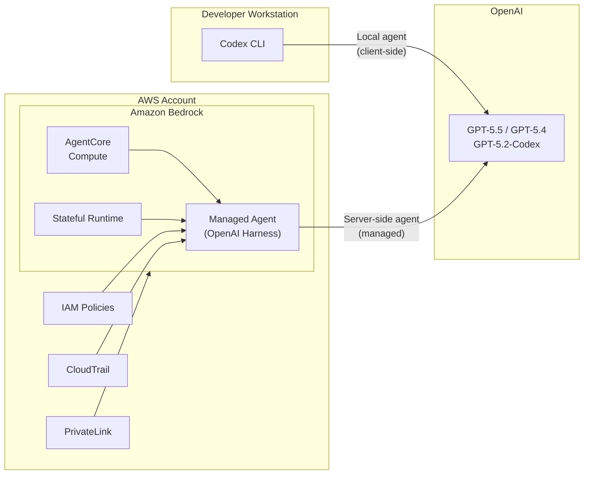
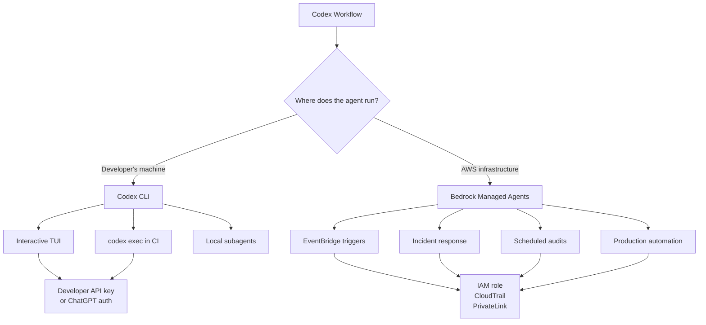

# Bedrock Managed Agents Powered by OpenAI: What Server-Side Codex Means for Enterprise Automation

---

On 28 April 2026, Amazon Web Services and OpenAI jointly announced **Bedrock Managed Agents powered by OpenAI** — a new capability that runs the OpenAI agent harness server-side within AWS infrastructure [^1] [^2]. This is not Codex CLI consuming Bedrock as a model provider (that capability shipped in v0.124 and is covered separately). Instead, Managed Agents place the entire agentic runtime — tool execution, memory, identity management — inside AWS, turning Codex-class agent capabilities into a managed service that enterprises can govern with the same IAM policies, CloudTrail logs, and PrivateLink configurations they use for everything else [^3].

This article explains the architecture, how it differs from the Codex CLI you run locally, and what it means for CI/CD pipelines, incident response, and production automation.

## Architecture: The Agent Harness on AWS

The core idea is straightforward: instead of running an agent on a developer's workstation, you run it on AWS infrastructure managed by Amazon.

Three components make the server-side agent work [^3] [^4]:

1. **OpenAI Agent Harness** — the same orchestration logic that powers Codex CLI (tool calling, code execution, file manipulation), but running as a managed process within Bedrock rather than on your laptop.
2. **AgentCore Compute** — AWS's agent compute environment that provisions and manages the infrastructure each agent instance runs on. Each agent gets its own isolated runtime with dedicated resources [^4].
3. **Stateful Runtime Environment** — persistent memory and execution state that survives across invocations. An agent can pause mid-task, resume hours later, and migrate between compute instances without losing context [^3].

Each Managed Agent receives its own identity within your AWS account, logs every action to CloudTrail, and operates within the IAM permissions you define — no broader access than you grant [^3].

## How It Differs from Codex CLI

The distinction matters because these are complementary tools, not replacements for one another.

| Dimension | Codex CLI | Bedrock Managed Agents |
|-----------|-----------|----------------------|
| **Where it runs** | Developer's terminal | AWS infrastructure |
| **Who controls it** | The developer, interactively or via `codex exec` | AWS APIs, EventBridge, Step Functions |
| **Identity** | Developer's API key or ChatGPT auth | IAM role with scoped permissions |
| **Persistence** | Session files on local disk | Stateful Runtime in AWS |
| **Audit trail** | Local logs, optional hooks | CloudTrail, full API-level logging |
| **Network** | Developer's network, sandbox restrictions | VPC, PrivateLink, security groups |
| **Scaling** | Single workstation | AgentCore auto-scaling |
| **Best for** | Interactive development, code review, TUI workflows | Production automation, CI/CD, incident response |

Codex CLI remains the right tool for a developer sitting at a terminal, iterating on code with the TUI, running `codex exec` in a CI job, or using subagents for parallel work. Managed Agents are for workflows where the agent must run unattended in production infrastructure — triggered by events, governed by IAM, and auditable through the same compliance tooling the organisation already uses [^2] [^3].

## Enterprise Security Model

The security architecture is where Managed Agents earn their keep for regulated enterprises [^3] [^5]:

- **IAM authentication** — every agent action is authorised against IAM policies. No API keys stored in environment variables; the agent assumes a role.
- **PrivateLink** — model inference traffic stays within the AWS network. No data traverses the public internet between the agent and the model endpoint.
- **CloudTrail logging** — every tool invocation, every file read, every API call the agent makes is logged with the same fidelity as any other AWS service action.
- **Guardrails** — Bedrock's existing guardrails framework applies to Managed Agents. Content filters, topic restrictions, and PII redaction work identically to how they work with other Bedrock models.
- **Encryption** — data at rest and in transit uses customer-managed KMS keys.

For organisations that cannot use `codex exec` in CI because the agent runs with a developer API key and lacks enterprise audit trails, Managed Agents close that gap.

## Practical Use Cases

### CI/CD Pipeline Agent

Instead of calling `codex exec` from a GitHub Actions runner with an API key, trigger a Managed Agent from EventBridge when a pull request opens. The agent runs in your VPC, accesses your private package registries through VPC endpoints, and its actions appear in CloudTrail alongside your other infrastructure events.

### Incident Response

An agent triggered by a CloudWatch alarm can investigate a production issue — reading logs, correlating metrics, checking recent deployments — without a human needing to be online. The Stateful Runtime means it can work through a multi-step investigation, pause while waiting for additional data, and resume when new information arrives [^3].

### Scheduled Security Audits

Combine GPT-5.2-Codex's cybersecurity capabilities [^6] with Managed Agents to run nightly vulnerability scans across your repositories. The agent clones each repo into its isolated runtime, analyses the code, and writes structured findings to S3 — all within your AWS account, with no code leaving your network boundary.

## Pricing

Managed Agents use Bedrock's standard pricing for the underlying models, with a markup over direct OpenAI API pricing [^7]:

| Model | Bedrock Input ($/1M) | Bedrock Output ($/1M) | Direct OpenAI Input ($/1M) | Direct OpenAI Output ($/1M) |
|-------|:-------------------:|:--------------------:|:-------------------------:|:--------------------------:|
| GPT-5.5 | \$5.00 | \$30.00 | \$125.00 | \$750.00 |
| GPT-5.4 | \$2.50 | \$15.00 | \$62.50 | \$375.00 |

Prompt caching is available at a 90% discount on input tokens [^7]. The dramatic price difference compared to direct OpenAI pricing reflects the cross-provider arrangement — AWS handles billing, infrastructure, and compliance, while OpenAI provides model inference.

Note that AgentCore compute costs are separate and depend on the instance type and duration of agent execution.

## Current Status and Availability

Bedrock Managed Agents powered by OpenAI launched in **limited preview** on 28 April 2026 [^1] [^2]. Access requires registration through the AWS console. The initial preview supports GPT-5.5 and GPT-5.4; GPT-5.2-Codex availability through Managed Agents has not been confirmed but is expected given its availability through the Bedrock model provider [^7].

## The Two-Surface Strategy

For Codex CLI practitioners, the practical takeaway is a clean separation of concerns:

- **Codex CLI** for development workflows — writing code, reviewing PRs, running `codex exec` in CI where a developer API key and container sandbox are sufficient.
- **Bedrock Managed Agents** for production automation — event-driven workflows, unattended long-running tasks, and anything that must satisfy enterprise compliance requirements around identity, audit, and network isolation.

The two surfaces use the same underlying models and the same agent harness. The difference is governance: who controls the agent, where it runs, and how its actions are recorded.

---

## Citations

[^1]: OpenAI, "OpenAI Models on Amazon Bedrock," [https://openai.com/index/openai-models-on-amazon-bedrock/](https://openai.com/index/openai-models-on-amazon-bedrock/), April 2026.

[^2]: Amazon, "Amazon Bedrock Managed Agents Powered by OpenAI," [https://www.aboutamazon.com/news/aws/amazon-bedrock-openai-managed-agents](https://www.aboutamazon.com/news/aws/amazon-bedrock-openai-managed-agents), April 2026.

[^3]: AWS, "Managed Agents in Amazon Bedrock," [https://aws.amazon.com/bedrock/managed-agents/](https://aws.amazon.com/bedrock/managed-agents/), April 2026.

[^4]: AWS, "Amazon Bedrock AgentCore," [https://aws.amazon.com/bedrock/agentcore/](https://aws.amazon.com/bedrock/agentcore/), April 2026.

[^5]: TechPortal, "AWS and OpenAI Partner on Managed Agents for Enterprise," [https://www.techportal.io/aws-openai-managed-agents-enterprise](https://www.techportal.io/aws-openai-managed-agents-enterprise), April 2026.

[^6]: OpenAI, "Introducing GPT-5.2-Codex," [https://openai.com/index/introducing-gpt-5-2-codex/](https://openai.com/index/introducing-gpt-5-2-codex/), April 2026.

[^7]: AWS, "Amazon Bedrock Pricing — OpenAI Models," [https://aws.amazon.com/bedrock/pricing/](https://aws.amazon.com/bedrock/pricing/), April 2026.
