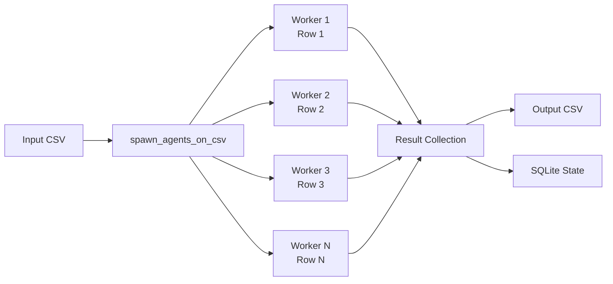
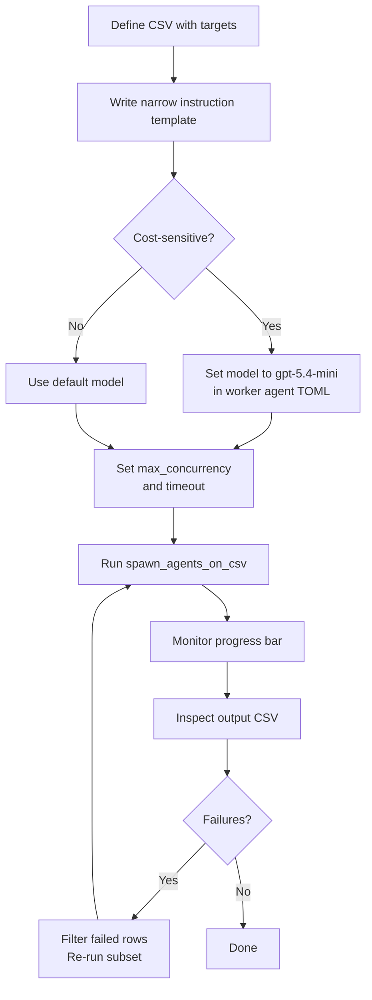

# CSV Batch Processing with spawn_agents_on_csv: Map-Reduce Workflows for Codex CLI


---

Codex CLI's subagent system handles ad-hoc parallelism well — spawn a few workers, fan out, collect results. But when the unit of work is a *row in a spreadsheet* — a file to audit, a service to review, a migration target to validate — you need structured fan-out with deterministic result collection. That is precisely what `spawn_agents_on_csv` delivers: a map-reduce primitive built directly into the agent runtime [^1].

This article covers the tool's mechanics, configuration, practical patterns, and the pitfalls that trip up teams adopting it for the first time.

## What spawn_agents_on_csv Does

The tool reads a CSV file, spawns one worker subagent per row, waits for all workers to complete (or time out), and exports the combined results to a new CSV [^1]. Each worker receives a templated instruction with column values substituted in, executes independently inside the Codex sandbox, and reports a structured JSON result back to the orchestrator.



The key distinction from ad-hoc subagent spawning: `spawn_agents_on_csv` handles concurrency throttling, timeout enforcement, progress reporting, and result merging automatically [^2]. You define the work; the runtime handles the plumbing.

## Tool Parameters

The `spawn_agents_on_csv` tool accepts the following arguments [^1]:

| Parameter | Type | Required | Purpose |
|-----------|------|----------|---------|
| `csv_path` | string | Yes | Path to the source CSV file |
| `instruction` | string | Yes | Prompt template with `{column_name}` placeholders |
| `id_column` | string | No | Column to use as the stable item identifier |
| `output_schema` | object | No | JSON structure each worker must return |
| `output_csv_path` | string | No | Destination for merged results |
| `max_concurrency` | number | No | Override for concurrent worker count |
| `max_runtime_seconds` | number | No | Per-worker timeout override |

Column placeholders in the `instruction` string use curly-brace syntax — `{path}`, `{owner}`, `{service_name}` — and are substituted from the corresponding CSV header before each worker receives its prompt [^3].

## Configuration

### Enabling Multi-Agent Features

The multi-agent collaboration tools — including `spawn_agents_on_csv` — are stable and enabled by default via `features.multi_agent` [^4]. If you are running an older configuration that explicitly disabled them, re-enable in `~/.codex/config.toml`:

```toml
[features]
multi_agent = true
```

### Global Agent Settings

The `[agents]` section in `config.toml` controls batch behaviour [^4]:

```toml
[agents]
max_threads = 16
max_depth = 1
job_max_runtime_seconds = 1800
```

- **`max_threads`** caps concurrent worker threads. The default is 6, though the original PR used 16 for batch workloads [^2]. For large CSV files (100+ rows), increasing this trades memory for throughput.
- **`max_depth`** prevents recursive delegation. Leave at 1 for batch jobs — workers should not spawn their own subagents.
- **`job_max_runtime_seconds`** sets the default per-worker timeout. When unset, `spawn_agents_on_csv` falls back to 1800 seconds (30 minutes) per worker [^1]. Override per-call with the `max_runtime_seconds` parameter for tighter or looser deadlines.

## The Worker Contract

Every worker spawned by `spawn_agents_on_csv` must call `report_agent_job_result` exactly once [^1]. This is the mechanism by which results flow back to the orchestrator. A worker that exits without calling this function is marked as failed in the output CSV, with the `status` column set to an error state and `last_error` populated [^1].

The result passed to `report_agent_job_result` should be a JSON object. If you specified an `output_schema`, the worker's output is validated against it. Define schemas tightly — loose schemas invite inconsistent results across workers.

## Output CSV Format

The exported CSV merges original row data with metadata columns [^1]:

| Column | Source | Description |
|--------|--------|-------------|
| *(original columns)* | Input CSV | Preserved verbatim |
| `job_id` | Runtime | Unique identifier for the batch run |
| `item_id` | Runtime | Row identifier (from `id_column` or auto-generated) |
| `status` | Runtime | Completion state (`completed`, `failed`, `timed_out`) |
| `last_error` | Runtime | Error message if the worker failed |
| `result_json` | Worker | The structured JSON output from `report_agent_job_result` |

Results are also persisted to SQLite for recovery and post-hoc analysis [^2]. The database location is controlled by the `sqlite_home` configuration key [^4].

## Practical Patterns

### Pattern 1: Security Audit Across Services

Given a CSV of microservices with their repository paths and owners:

```csv
service,path,owner
auth-api,/repos/auth-api,platform-team
billing,/repos/billing,payments-team
notifications,/repos/notifications,comms-team
user-service,/repos/user-service,platform-team
```

Prompt Codex to batch-audit the lot:

```
Call spawn_agents_on_csv with:
- csv_path: /tmp/services.csv
- instruction: "Review the service at {path} owned by {owner}. Check for hardcoded secrets, missing input validation, and insecure dependencies. Return JSON with keys: service, risk_level, findings, and recommendations via report_agent_job_result."
- id_column: service
- output_csv_path: /tmp/security-audit-results.csv
- output_schema: {"service": "string", "risk_level": "string", "findings": "string", "recommendations": "string"}
```

Each worker reviews one service in isolation. The output CSV gives you a single-sheet security posture view across the entire portfolio.

### Pattern 2: Migration Readiness Assessment

Before migrating from one framework version to another, assess each module:

```csv
module,path,framework_version
dashboard,src/dashboard,react-17
checkout,src/checkout,react-17
admin-panel,src/admin,react-17
analytics,src/analytics,react-17
```

```
Call spawn_agents_on_csv with:
- csv_path: /tmp/modules.csv
- instruction: "Analyse the module at {path} currently on {framework_version}. Identify breaking changes for React 19 migration. List deprecated API usage, class component count, and estimated migration effort in hours. Return JSON with keys: module, deprecated_apis, class_components, effort_hours, blocking_issues via report_agent_job_result."
- id_column: module
- output_csv_path: /tmp/migration-readiness.csv
- max_runtime_seconds: 900
```

The output CSV becomes your migration planning spreadsheet — no manual file-by-file review needed.

### Pattern 3: Automated PR Review Batch

For teams processing a backlog of pull requests:

```csv
pr_number,repo,title
1234,frontend,Add dark mode toggle
1235,backend,Fix rate limiter race condition
1236,infra,Upgrade Terraform provider
1237,frontend,Refactor auth flow
```

```
Call spawn_agents_on_csv with:
- csv_path: /tmp/pr-backlog.csv
- instruction: "Review PR #{pr_number} in the {repo} repository titled '{title}'. Check for correctness, test coverage, and security issues. Return JSON with keys: pr_number, verdict (approve/request_changes/comment), risk, summary, and suggestions via report_agent_job_result."
- id_column: pr_number
- output_csv_path: /tmp/pr-reviews.csv
- max_concurrency: 8
```

### Pattern 4: Non-Interactive CI Pipeline

For headless execution in CI, combine with `codex exec` [^5]:

```bash
codex exec \
  --full-auto \
  -c agents.max_threads=16 \
  - <<'PROMPT'
Call spawn_agents_on_csv with:
- csv_path: ./audit-targets.csv
- instruction: "Review {path} for OWASP Top 10 vulnerabilities. Return JSON with keys: path, vulnerabilities, severity, remediation via report_agent_job_result."
- output_csv_path: ./audit-results.csv
- max_runtime_seconds: 600
PROMPT
```

When run through `codex exec`, the tool displays a single-line progress update on `stderr` while the batch processes [^2]. This makes it straightforward to integrate into CI dashboards without log noise.

## Progress Monitoring and Recovery

During execution, Codex shows a stable single-line progress bar with an ETA on `stderr` [^2]. This replaced the earlier multi-step workflow of running, checking status, and manually exporting results.

Because job state persists in SQLite [^2], you get implicit recovery semantics. If a batch is interrupted, the SQLite database retains completed results — though the current implementation does not support automatic resume of partially completed batches. Export what you have and re-run the remaining rows.

## Error Handling

Three failure modes to plan for:

1. **Worker timeout**: Workers exceeding `max_runtime_seconds` are reaped by a stale-running reaper [^2]. The row is marked `timed_out` in the output CSV. Reduce instruction scope or increase the timeout.

2. **Missing result report**: Workers that exit without calling `report_agent_job_result` are marked as failed [^1]. This typically happens when the instruction is ambiguous and the worker completes the task conversationally rather than structurally. Be explicit: *"Return JSON via report_agent_job_result"*.

3. **Schema mismatch**: If the worker's JSON does not match the `output_schema`, the result may be stored but flagged. Define schemas with the minimum viable fields to reduce friction.

Failed rows do not halt the batch — remaining workers continue processing [^3]. Inspect the `status` and `last_error` columns in the output CSV to identify and re-run failures.

## Sizing and Cost Considerations

Each worker is a full subagent session with its own context window and API calls. For a 100-row CSV with `max_concurrency` set to 16, you will have 16 concurrent API sessions cycling through all 100 rows. Cost scales linearly with row count and instruction complexity.

Practical guidelines:

- **Keep instructions narrow**. A focused three-sentence instruction costs far less than a paragraph of exploratory analysis per row.
- **Use cheaper models for bulk work**. Define a worker agent in `.codex/agents/batch-worker.toml` with `model = "gpt-5.4-mini"` for cost-sensitive batch jobs [^6].
- **Set tight timeouts**. Workers that wander burn tokens. A 300-second timeout for file reviews is usually sufficient.
- **Validate CSV headers**. Column names must exactly match `{placeholder}` names in the instruction. The CSV parser validates header uniqueness and deduplicates IDs [^2].



## Custom Worker Agent Definitions

For recurring batch workflows, define a dedicated worker agent in `.codex/agents/batch-auditor.toml` [^6]:

```toml
name = "batch-auditor"
description = "Lightweight auditor for CSV batch security reviews"
model = "gpt-5.4-mini"
model_reasoning_effort = "medium"

developer_instructions = """
You are a security auditor processing one target per invocation.
Always return structured JSON via report_agent_job_result.
Never spawn subagents. Never modify files.
Keep responses under 500 tokens.
"""
```

This keeps batch workers cheap, fast, and predictable. The `developer_instructions` reinforce the contract: structured output, no side effects, no recursion.

## Limitations

- **No automatic resume**: Interrupted batches require manual re-run of remaining rows. SQLite retains completed results but does not checkpoint pending work for restart [^2].
- **No cross-worker communication**: Workers are fully isolated. If row 5 depends on row 3's output, `spawn_agents_on_csv` is the wrong tool — use sequential subagent orchestration instead.
- **Sandbox inheritance**: Workers inherit the parent session's sandbox policy [^1]. If the parent runs in `full-auto` mode, so do all workers. For batch jobs touching production-adjacent code, consider using a stricter sandbox profile.

## Citations

[^1]: OpenAI, "Subagents — Codex," OpenAI Developers, 2026. [https://developers.openai.com/codex/subagents](https://developers.openai.com/codex/subagents)
[^2]: daveaitel-openai, "Agent jobs (spawn_agents_on_csv) + progress UI," GitHub Pull Request #10935, openai/codex, 2026. [https://github.com/openai/codex/pull/10935](https://github.com/openai/codex/pull/10935)
[^3]: Morph, "Codex CLI Multi-Agent: Agent Roles, CSV Batch & Config Guide," 2026. [https://www.morphllm.com/codex-multi-agent](https://www.morphllm.com/codex-multi-agent)
[^4]: OpenAI, "Configuration Reference — Codex," OpenAI Developers, 2026. [https://developers.openai.com/codex/config-reference](https://developers.openai.com/codex/config-reference)
[^5]: OpenAI, "Command line options — Codex CLI," OpenAI Developers, 2026. [https://developers.openai.com/codex/cli/reference](https://developers.openai.com/codex/cli/reference)
[^6]: OpenAI, "Subagents — Codex: Custom Agent Definitions," OpenAI Developers, 2026. [https://developers.openai.com/codex/subagents](https://developers.openai.com/codex/subagents)
