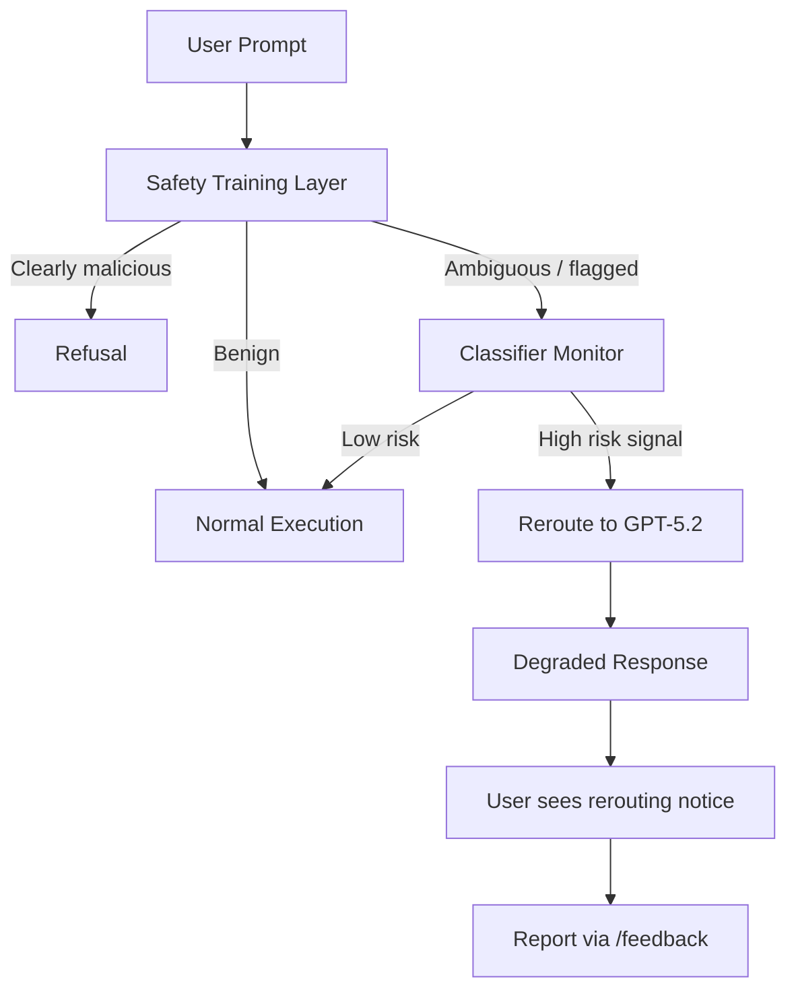
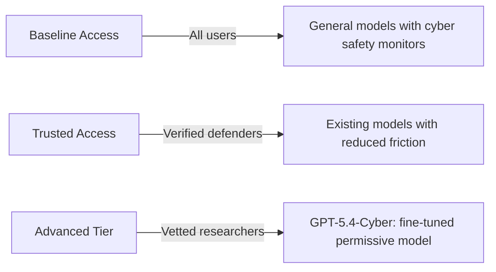

# Codex CLI Cyber Safety: Understanding Model Rerouting, Trusted Access, and the False Positive Problem


---

If your Codex CLI sessions have suddenly slowed down or you have spotted the banner "Your conversations have multiple flags for possible cybersecurity risk. Responses may take longer," you have hit the cyber safety classifier. This article explains what it is, why it exists, what triggers it, and how to navigate the system — whether you are a regular developer caught in a false positive or a security professional who needs unrestricted access.

## Why Cyber Safety Exists

GPT-5.3-Codex was the first model OpenAI classified as **High** cybersecurity capability under the Preparedness Framework [^1]. That designation means the model can "remove existing bottlenecks to scaling cyber operations, including by automating end-to-end cyber operations against reasonably hardened targets, or by automating the discovery and exploitation of operationally relevant vulnerabilities" [^2].

In practice, the same capabilities that let Codex find and fix bugs in your codebase can also discover exploitable vulnerabilities at scale. OpenAI opted for a precautionary deployment model rather than waiting for evidence of harm [^3].

## How the Classifier Works

The system operates as a three-layer pipeline that runs alongside every Codex session:



### Layer 1: Safety Training

The model itself is trained to refuse clearly malicious requests — credential theft, exploit generation for unauthorised access, and similar unambiguous misuse [^4].

### Layer 2: Automated Classifier Monitors

Classifier-based monitors evaluate the conversation in real time. When they detect signals associated with suspicious cyber activity, the entire request is rerouted to GPT-5.2, a less cyber-capable model [^4]. The rerouting is visible in two places:

- An in-product notice in the CLI or App
- The `model` field in API response logs

### Layer 3: Account-Level Enforcement

Repeated flags can escalate to account-level mitigations, where all requests are rerouted until the user either resolves the flags through the Trusted Access programme or waits for the enforcement to lift [^4].

## What Triggers False Positives

The classifier is pattern-based, and legitimate development work frequently trips it. Community reports on the Codex GitHub repository document dozens of false positive cases [^5] [^6] [^7] [^8]. Common triggers include:

| Activity | Why it triggers |
|---|---|
| Working with authentication/OAuth code | Credential-adjacent patterns |
| Parsing network protocols | Resembles network reconnaissance |
| Writing security test suites | Exploit-adjacent language |
| Container escape debugging | Sandbox evasion patterns |
| Cookie/session handling code | Credential harvesting similarity |
| Binary format parsing | Reverse engineering signals |
| ONNX model optimisation | ⚠️ Reported as false positive even for ML work [^7] |
| Web scraping with cookies | Data exfiltration patterns [^8] |

One particularly telling report from April 2026 shows a user flagged whilst doing routine UI refactoring on their own authorised codebase, with no security-related prompts involved [^5]. The response from OpenAI collaborators — "Thanks for reporting. This will help us tune our classifier" — indicates the system is still being calibrated.

## The Impact on Your Workflow

When rerouting occurs, you experience three concrete effects:

1. **Model downgrade**: Your requests execute on GPT-5.2 instead of your configured model (GPT-5.3-Codex, GPT-5.4, or GPT-5.5). GPT-5.2 has meaningfully lower coding capability [^9].

2. **Latency increase**: The rerouting pipeline adds overhead. Responses visibly slow down, sometimes significantly.

3. **Capability reduction**: GPT-5.2 has stricter refusal boundaries around anything security-adjacent, so even legitimate security work may receive refusals rather than helpful responses.

## Configuration Strategies for Minimising False Positives

Whilst you cannot disable the classifier, you can reduce the likelihood of triggering it through careful prompt and configuration hygiene.

### AGENTS.md: Frame Your Intent

Add explicit context about your project's domain to help the classifier understand your work is legitimate:

```markdown
## Project Context

This is an internal authentication library for [Company Name].
All security-related code is for defending our own systems.
This project has no offensive security purpose.

## Testing Policy

Security test suites validate our own API endpoints.
All test targets are localhost or staging environments we own.
```

### Prompt Structure: Lead with Intent

When working on security-adjacent code, front-load the defensive context:

```bash
# Instead of:
codex "Find vulnerabilities in the auth module"

# Prefer:
codex "Review the auth module for security weaknesses so we can fix them before release. Focus on OWASP Top 10 compliance."
```

### Config Profile for Security Work

Create a dedicated profile in `~/.codex/config.toml` that selects a model less likely to trigger escalation:

```toml
[profile.security-review]
model = "gpt-5.4-mini"
reasoning_effort = "medium"
```

GPT-5.4-mini is not classified as High cyber capability and is less likely to trigger the rerouting pipeline, though it also has lower overall capability.

## Trusted Access for Cyber

If you are a security professional who genuinely needs unrestricted access to advanced models, OpenAI provides the **Trusted Access for Cyber** programme [^10].

### Three Tiers

OpenAI now maintains at least three practical access tiers [^11]:



### GPT-5.4-Cyber

Announced on 14 April 2026, GPT-5.4-Cyber is a fine-tuned variant of GPT-5.4 with a lowered refusal boundary for legitimate security work [^11]. It includes capabilities such as binary reverse engineering that the standard models restrict [^12]. Access is limited to vetted security vendors, organisations, and researchers through an iterative deployment [^12].

### How to Apply

- **Individual verification**: Visit `chatgpt.com/cyber` to verify your identity
- **Enterprise teams**: Request access through your OpenAI representative
- **Security researchers**: Apply for the invite-only advanced programme offering more permissive models [^4]

## Handling a False Positive

If you have been incorrectly flagged, follow this sequence:

1. **Report immediately**: Use `/feedback` in the CLI to report the false positive [^4]. This feeds directly into classifier tuning.

2. **Check the model field**: Run `codex exec --json "echo test" | jq '.model'` to confirm whether your requests are being rerouted.

3. **Review your recent prompts**: Identify which prompts may have triggered the classifier. Reframe security-adjacent language.

4. **Consider Trusted Access**: If your work routinely involves security topics, apply for Trusted Access rather than fighting false positives repeatedly.

5. **Switch models temporarily**: Use `codex --model gpt-5.4-mini` to continue working whilst the flag is resolved.

## Enterprise Implications

For teams deploying Codex CLI across an organisation, the cyber safety system has specific implications:

### Managed Configuration

Enterprise administrators can set model defaults in `managed_config.toml` to avoid models that trigger the highest level of scrutiny:

```toml
[model]
default = "gpt-5.4"
```

### Security Team Onboarding

Security teams should be onboarded to Trusted Access before deploying Codex CLI. Without it, legitimate security audit workflows will consistently trigger rerouting, making the tool effectively unusable for its intended purpose [^10].

### Audit Trail Awareness

When rerouting occurs, the model change is logged in rollout files. Teams with compliance requirements should be aware that their sessions may execute on different models than configured, and audit trails should account for this [^13].

## The Broader Picture

The cyber safety system represents a fundamental tension in agentic coding tools: the same capabilities that make Codex CLI powerful for legitimate development — deep code understanding, vulnerability analysis, autonomous execution — are precisely the capabilities that require safeguarding.

OpenAI's approach of classifier-based monitoring with tiered access is pragmatic but imperfect. The false positive rate remains high enough to affect everyday development work [^5] [^6]. The `/feedback` mechanism and classifier tuning suggest the system is evolving, but developers should expect occasional friction, particularly when working on authentication, networking, or security-adjacent code.

For most developers, the practical advice is straightforward: frame your prompts with clear defensive intent, use `/feedback` when falsely flagged, and apply for Trusted Access if security work is a regular part of your role. The classifier will improve over time — your reports directly contribute to that improvement.

## Citations

[^1]: OpenAI, "Introducing GPT-5.3-Codex," February 2026. [https://openai.com/index/introducing-gpt-5-3-codex/](https://openai.com/index/introducing-gpt-5-3-codex/)

[^2]: OpenAI, "GPT-5.3-Codex System Card," February 2026. [https://openai.com/index/gpt-5-3-codex-system-card/](https://openai.com/index/gpt-5-3-codex-system-card/)

[^3]: Fortune, "OpenAI's new model leaps ahead in coding capabilities—but raises unprecedented cybersecurity risks," February 2026. [https://fortune.com/2026/02/05/openai-gpt-5-3-codex-warns-unprecedented-cybersecurity-risks/](https://fortune.com/2026/02/05/openai-gpt-5-3-codex-warns-unprecedented-cybersecurity-risks/)

[^4]: OpenAI, "Cyber Safety — Codex Developers Documentation," April 2026. [https://developers.openai.com/codex/concepts/cyber-safety](https://developers.openai.com/codex/concepts/cyber-safety)

[^5]: GitHub Issue #19533, "False positive cyber-safety flag on benign software engineering work," April 2026. [https://github.com/openai/codex/issues/19533](https://github.com/openai/codex/issues/19533)

[^6]: GitHub Issue #12125, "A false positive cyber-safety flag," February 2026. [https://github.com/openai/codex/issues/12125](https://github.com/openai/codex/issues/12125)

[^7]: GitHub Issue #19594, "False positive cyber-risk flag disrupted Kaggle ONNX Runtime competition workflow," April 2026. [https://github.com/openai/codex/issues/19594](https://github.com/openai/codex/issues/19594)

[^8]: GitHub Issue #19245, "False positive security-risk flag during local yt-dlp GUI refactor using own cookies.txt," April 2026. [https://github.com/openai/codex/issues/19245](https://github.com/openai/codex/issues/19245)

[^9]: OpenAI, "Introducing GPT-5.2-Codex," 2026. [https://openai.com/index/introducing-gpt-5-2-codex/](https://openai.com/index/introducing-gpt-5-2-codex/)

[^10]: OpenAI, "Introducing Trusted Access for Cyber," 2026. [https://openai.com/index/trusted-access-for-cyber/](https://openai.com/index/trusted-access-for-cyber/)

[^11]: OpenAI, "Trusted access for the next era of cyber defense," April 2026. [https://openai.com/index/scaling-trusted-access-for-cyber-defense/](https://openai.com/index/scaling-trusted-access-for-cyber-defense/)

[^12]: MarkTechPost, "OpenAI Scales Trusted Access for Cyber Defense With GPT-5.4-Cyber," April 2026. [https://www.marktechpost.com/2026/04/20/openai-scales-trusted-access-for-cyber-defense-with-gpt-5-4-cyber-a-fine-tuned-model-built-for-verified-security-defenders/](https://www.marktechpost.com/2026/04/20/openai-scales-trusted-access-for-cyber-defense-with-gpt-5-4-cyber-a-fine-tuned-model-built-for-verified-security-defenders/)

[^13]: OpenAI, "Codex CLI Features Documentation," April 2026. [https://developers.openai.com/codex/cli/features](https://developers.openai.com/codex/cli/features)
