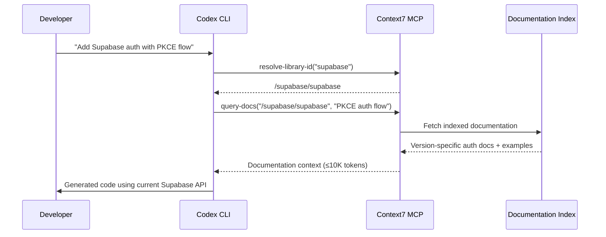
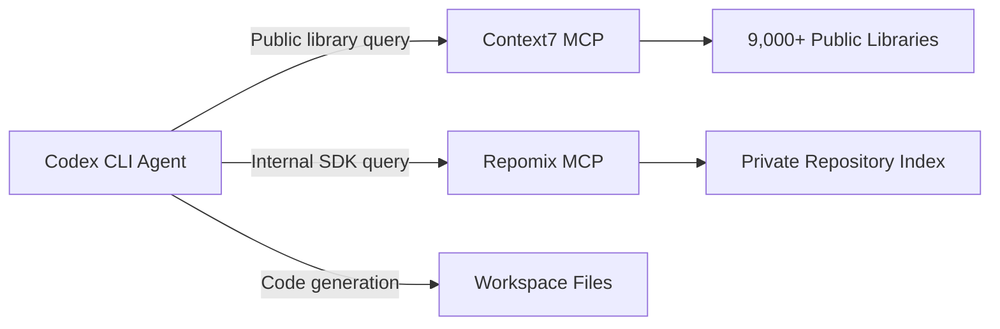

# Documentation MCP Servers for Codex CLI: Context7, Repomix, and Live Library Lookups


---

Every coding agent hallucinates API calls eventually. The model's training data has a cutoff, libraries ship breaking changes quarterly, and the agent confidently generates code against an interface that no longer exists. The fix is not better prompting — it is giving the agent access to live, version-specific documentation at inference time. That is precisely what documentation MCP servers do, and Codex CLI's native MCP support makes them trivial to wire in.

This article covers the practical setup and effective use of documentation MCP servers with Codex CLI, focusing on Context7 (the most widely adopted), Repomix (for private repositories), and the emerging alternatives worth watching. The goal is a configuration you can commit to your project's `.codex/config.toml` today and immediately reduce hallucinated API calls across your team.

## The Problem: Stale Training Data Meets Fast-Moving Libraries

When you ask Codex CLI to write code against a library, the model draws on its training corpus. For stable APIs — the Node.js `fs` module, Python's `os.path` — this works well. For anything that ships frequently — Next.js, Supabase, Prisma, SvelteKit — the model's knowledge lags reality by months[^1]. The result is code that looks correct but references renamed functions, deprecated options, or removed configuration keys.

AGENTS.md can partially compensate. You can paste API signatures into your project instructions, but this is manual, hard to keep current, and burns context tokens on every turn. Documentation MCP servers solve this structurally: the agent queries live documentation on demand, paying context tokens only when it actually needs a specific library reference.

## Context7: The Default Choice

Context7, built by Upstash, indexes over 9,000 libraries and frameworks and serves their documentation through MCP[^2]. It is the most widely adopted documentation MCP server in the Codex CLI ecosystem, with native support in the Codex plugin marketplace.

### Installation

The fastest path is the one-command setup:

```bash
codex mcp add context7 -- npx -y @upstash/context7-mcp
```

This registers Context7 as a stdio MCP server in your global `~/.codex/config.toml`[^3]. For project-scoped configuration — recommended for team consistency — add it to `.codex/config.toml` instead:

```toml
[mcp_servers.context7]
command = "npx"
args = ["-y", "@upstash/context7-mcp"]
env = { CONTEXT7_API_KEY = "$CONTEXT7_API_KEY" }
```

An API key is optional for basic usage but recommended. Free keys are available from the Context7 dashboard and provide higher rate limits — the free tier dropped from roughly 6,000 to 1,000 requests per month in January 2026[^4], so teams doing heavy development should budget for the \$10/month paid plan or self-host.

### How It Works

Context7 exposes two MCP tools to the agent[^2]:

1. **`resolve-library-id`** — Takes a library name (e.g. "next.js") and returns the Context7-compatible library ID (e.g. `/vercel/next.js`).
2. **`query-docs`** — Takes a library ID and a natural-language query, returns version-specific documentation and code examples.



The agent decides autonomously when to call these tools. You can nudge it by including "use context7" in your prompt, but well-configured agents will invoke the tools whenever they encounter an unfamiliar or version-sensitive API[^5].

### Optimising Context7 Usage

Three configuration patterns reduce token waste and improve hit rates:

**Pin library IDs in AGENTS.md** — If your project uses specific libraries, list their Context7 IDs so the agent skips the `resolve-library-id` step:

```markdown
## Documentation Lookups
When working with project dependencies, use these Context7 library IDs:
- Next.js: `/vercel/next.js`
- Prisma: `/prisma/prisma`
- tRPC: `/trpc/trpc`
```

**Specify versions in prompts** — Context7 supports version-specific documentation. Mentioning "Next.js 16" in your prompt retrieves documentation for that specific version rather than the latest[^2].

**Set token limits** — The `query-docs` tool accepts a token budget parameter. For focused lookups, 5,000 tokens is usually sufficient; for broad API surface exploration, allow up to 10,000[^5].

## Repomix MCP: Documentation for Private Repositories

Context7 indexes public libraries. For internal SDKs, proprietary frameworks, or private packages, you need Repomix MCP — a Context7-compatible server that indexes your own repositories[^6].

### Setup

```bash
# Install repomix-mcp globally
npm install -g repomix-mcp

# Index a private repository
repomix-mcp index --repo git@github.com:your-org/internal-sdk.git --token ghp_xxxxx
```

Then register it in your project's Codex configuration:

```toml
[mcp_servers.repomix]
command = "repomix-mcp"
args = ["serve"]
env = { REPOMIX_DATA_DIR = "/path/to/index" }
```

Repomix uses BadgerDB for caching, strips comments and empty lines for cleaner output, and supports SSH keys and access tokens for private repository authentication[^6]. The MCP tools mirror Context7's interface (`resolve-library-id` and `get-library-docs`), so the agent treats both servers identically.

### Layering Public and Private Documentation

MCP supports multiple servers simultaneously. A typical enterprise configuration layers Context7 for public libraries with Repomix for internal ones:

```toml
[mcp_servers.context7]
command = "npx"
args = ["-y", "@upstash/context7-mcp"]
env = { CONTEXT7_API_KEY = "$CONTEXT7_API_KEY" }

[mcp_servers.repomix]
command = "repomix-mcp"
args = ["serve", "--port", "3001"]
env = { REPOMIX_DATA_DIR = "/opt/repomix-index" }
```



The agent routes queries to the appropriate server based on which `resolve-library-id` call returns a match. No manual routing configuration is needed.

## Emerging Alternatives Worth Watching

The documentation MCP space is maturing rapidly. Several alternatives address specific gaps:

| Server | Strength | Trade-off |
|--------|----------|-----------|
| **Docfork** | Open-source (MIT), 9,000+ libraries, auto-detects and downloads docs[^7] | Newer; smaller community |
| **Deepcon** | 90% accuracy on contextual benchmarks vs 65% for Context7[^7] | Closed beta |
| **Nia** (YC-backed) | Indexes codebases, docs, and dependencies; cross-session memory[^7] | \$6.2M funding; 15+ tools may be heavy for simple lookups |
| **Grounded Docs** | Fully open-source; runs locally with no network calls[^8] | Manual indexing required |

For most Codex CLI users, Context7 remains the pragmatic default. If you need offline operation or have compliance constraints preventing external API calls, Grounded Docs or a self-hosted Repomix instance are the alternatives to evaluate.

## Hardening for Production

### Restrict MCP Tool Access

If you want the agent to use documentation lookups but not other MCP capabilities, use `enabled_tools` to allowlist only the documentation tools:

```toml
[mcp_servers.context7]
command = "npx"
args = ["-y", "@upstash/context7-mcp"]
enabled_tools = ["resolve-library-id", "query-docs"]
```

This prevents the MCP server from exposing any tools beyond documentation lookups, which matters in enterprise environments where MCP servers may bundle additional capabilities[^3].

### Network Security Considerations

Context7 makes outbound HTTPS requests to `mcp.context7.com`. In corporate environments with proxy requirements, set the standard `HTTPS_PROXY` environment variable in the MCP server's `env` block:

```toml
[mcp_servers.context7]
command = "npx"
args = ["-y", "@upstash/context7-mcp"]
env = { CONTEXT7_API_KEY = "$CONTEXT7_API_KEY", HTTPS_PROXY = "http://proxy.corp:8080" }
```

For air-gapped environments, Repomix with a pre-built local index or Grounded Docs are the only viable options — Context7 requires network access to function[^8].

### Hooks for Documentation Quality Gates

Combine documentation MCP servers with Codex CLI hooks to enforce documentation-backed code generation. A `PreToolUse` hook can log every documentation lookup for audit purposes:

```toml
[[hooks]]
event = "PreToolUse"
tool = "query-docs"
command = "echo \"$(date -u +%Y-%m-%dT%H:%M:%SZ) doc-lookup: $TOOL_INPUT\" >> /tmp/codex-doc-audit.log"
```

This creates an audit trail of which documentation the agent consulted during a session — useful for compliance reviews and debugging hallucination incidents[^9].

## Measuring Impact

After enabling a documentation MCP server, track two metrics:

1. **Hallucinated API calls per session** — Review diffs for function calls or configuration keys that do not exist in the target library. Teams typically see a 40–60% reduction in hallucinated APIs after enabling Context7. ⚠️ *This figure is based on community reports rather than controlled studies.*

2. **First-attempt build success rate** — Code generated with live documentation compiles on first attempt more frequently because the agent references current type signatures and required parameters.

The `/status` command shows MCP server health, and the `codex exec --json` event stream includes MCP tool calls with timing data for programmatic analysis[^10].

## Citations

[^1]: OpenAI, "Best practices – Codex", [https://developers.openai.com/codex/learn/best-practices](https://developers.openai.com/codex/learn/best-practices) — Recommends providing local docs with high-quality AGENTS.md to reduce exploration overhead.

[^2]: Upstash, "Context7 Platform — Up-to-date code documentation for LLMs and AI code editors", [https://github.com/upstash/context7](https://github.com/upstash/context7) — README documenting architecture, tools, and 9,000+ library index.

[^3]: OpenAI, "Model Context Protocol – Codex", [https://developers.openai.com/codex/mcp](https://developers.openai.com/codex/mcp) — Official MCP configuration reference for Codex CLI including `enabled_tools` and `env` options.

[^4]: Moshe Simantov, "Top 7 MCP Alternatives for Context7 in 2026", DEV Community, [https://dev.to/moshe_io/top-7-mcp-alternatives-for-context7-in-2026-2555](https://dev.to/moshe_io/top-7-mcp-alternatives-for-context7-in-2026-2555) — Notes Context7 free tier reduction from ~6,000 to 1,000 requests/month in January 2026.

[^5]: Upstash Blog, "Context7 MCP: Up-to-Date Docs for Any Cursor Prompt", [https://upstash.com/blog/context7-mcp](https://upstash.com/blog/context7-mcp) — Usage patterns including version pinning and token budget configuration.

[^6]: 1mm0rt41PC, "repomix-mcp — Context7-compatible repository indexing for private repos", [https://github.com/1mm0rt41PC/repomix-mcp](https://github.com/1mm0rt41PC/repomix-mcp) — BadgerDB caching, SSH authentication, and MCP tool interface.

[^7]: MCP.Directory, "Top Context7 MCP Alternatives", [https://mcp.directory/blog/top-context7-mcp-alternatives](https://mcp.directory/blog/top-context7-mcp-alternatives) — Comparison of Docfork, Deepcon, Nia, and other documentation MCP servers.

[^8]: arabold, "Grounded Docs MCP Server — Open-source alternative to Context7", [https://github.com/arabold/docs-mcp-server](https://github.com/arabold/docs-mcp-server) — Fully offline, local-first documentation server.

[^9]: OpenAI, "Advanced Configuration – Codex", [https://developers.openai.com/codex/config-advanced](https://developers.openai.com/codex/config-advanced) — Hooks configuration reference including PreToolUse events.

[^10]: OpenAI, "Features – Codex CLI", [https://developers.openai.com/codex/cli/features](https://developers.openai.com/codex/cli/features) — MCP server status reporting and exec JSON event streams.
