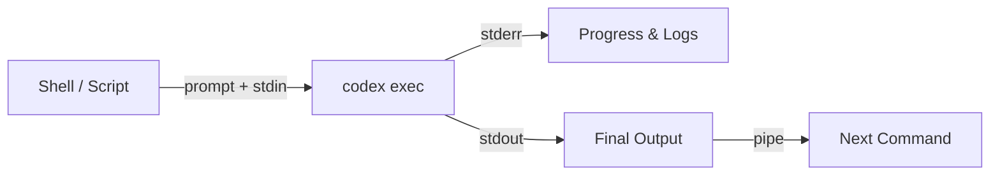
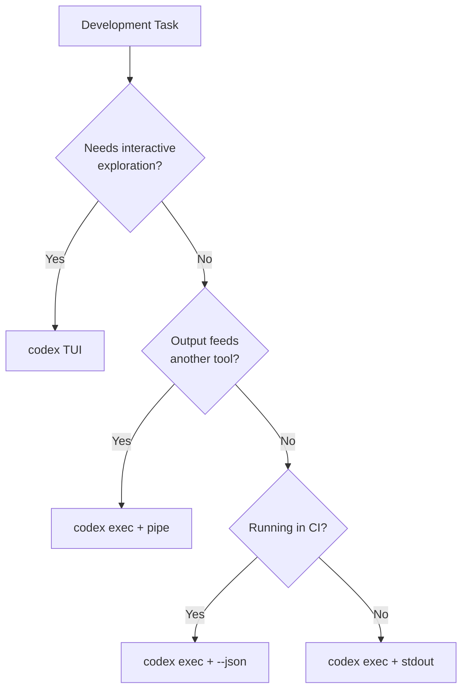

# Codex CLI exec Recipes: Practical One-Liners and Shell Patterns for Daily Development


---

The interactive TUI gets most of the attention, but `codex exec` is where Codex CLI earns its keep in professional workflows. It runs Codex non-interactively, streams progress to stderr, and prints only the final agent message to stdout — making it a first-class Unix citizen you can pipe, redirect, and compose just like `grep` or `jq`[^1]. This article collects twelve field-tested recipes that solve real daily development problems, each ready to paste into your terminal, Makefile, or CI pipeline.

## How codex exec Works

Before the recipes, a quick refresher on the execution model. When you run `codex exec "your prompt"`, Codex enters the agent loop: it reads your repository, calls the model, and executes any tool calls (file reads, shell commands) until the model decides it is done[^2]. The final response goes to stdout. Everything else — progress indicators, tool call logs, reasoning traces — goes to stderr.



Key flags to know:

| Flag | Purpose |
|------|---------|
| `--sandbox read-only` | Default — agent reads but cannot write[^3] |
| `--sandbox workspace-write` | Agent may edit files and run commands |
| `-m MODEL` | Override the default model for this invocation |
| `--json` | Emit JSON Lines events instead of plain text[^4] |
| `--output-schema schema.json` | Enforce a JSON Schema on the final response[^1] |
| `-o FILE` | Write the final message to a file |
| `--ephemeral` | Do not persist the session (no resume later)[^1] |
| `-p PROFILE` | Load a named profile from config.toml[^5] |

With that vocabulary in place, here are the recipes.

## Recipe 1: Generate a Conventional Commit Message

```bash
git diff --cached | codex exec "Write a single conventional commit message \
(type(scope): description) for these staged changes. Output ONLY the \
message, no explanation." | git commit -F -
```

Pipe the staged diff to Codex, ask for a single commit message, and feed it straight into `git commit`. The `--cached` flag ensures you are describing exactly what will be committed. For more structured output, add `--output-schema` with a schema requiring `type`, `scope`, and `description` fields[^1].

## Recipe 2: Summarise a PR Diff

```bash
gh pr diff 42 | codex exec "Summarise this pull request diff. \
List: (1) what changed, (2) why it likely changed, (3) any risks. \
Use bullet points."
```

This pairs the GitHub CLI's `gh pr diff` with Codex to produce a human-readable summary. Useful for reviewing colleagues' PRs before opening the full diff, or for generating PR description drafts. The output goes to stdout, so pipe it to `gh pr comment 42 --body -` to post it directly[^6].

## Recipe 3: Explain an Unfamiliar File

```bash
codex exec "Explain what src/engine/scheduler.rs does. \
Cover the key data structures, the public API, and any \
non-obvious design decisions. Be concise."
```

No piping needed here — Codex reads the file from the workspace directly. This is faster than grepping through unfamiliar code when you have just joined a project or are reviewing a contribution to an area you do not own. Add `-m gpt-5.5` if you want deeper reasoning on complex files[^7].

## Recipe 4: Batch-Fix Lint Errors

```bash
npm run lint 2>&1 | codex exec \
  --sandbox workspace-write \
  "Fix every lint error reported in this output. \
   Do not change logic or behaviour — only fix lint violations. \
   Run the linter again after fixing to verify."
```

Pipe your linter's output as context, grant write access with `--sandbox workspace-write`, and let Codex fix and verify in a loop. The agent will call `npm run lint` again after applying fixes to confirm the errors are resolved[^2]. Works equally well with `ruff check` for Python, `cargo clippy` for Rust, or `golangci-lint run` for Go.

## Recipe 5: Generate Test Stubs for Changed Files

```bash
git diff --name-only HEAD~1 | codex exec \
  --sandbox workspace-write \
  "For each file listed in stdin, generate a test file with stubs \
   covering the public API. Follow existing test conventions in the \
   repo. Do NOT implement assertions — just create the structure."
```

This uses the prompt-plus-stdin pattern[^8]: the file list arrives via stdin, the instruction via the command-line prompt. Codex reads each file, infers the testing framework from existing tests, and creates stub files. Particularly useful after a feature branch introduces several new modules.

## Recipe 6: Scan for Security Issues

```bash
codex exec "Perform a security review of this repository. \
Focus on: SQL injection, command injection, hardcoded secrets, \
insecure deserialization, and path traversal. \
Report findings as a markdown table with columns: \
File, Line, Severity, Description, Recommendation."
```

Codex reads the codebase, identifies patterns, and produces a structured report. For CI integration, add `--output-schema` to enforce a JSON array of findings and pipe the result into your issue tracker[^1]. Note that this is not a substitute for dedicated SAST tools — it is a complement that catches logic-level issues scanners miss[^9].

## Recipe 7: Generate Release Notes from Git Log

```bash
git log --oneline v2.3.0..HEAD | codex exec \
  "Generate release notes from these commits. \
   Group by: Features, Bug Fixes, Breaking Changes, Other. \
   Use markdown formatting. Include the commit hash in parentheses."
```

Feed a range of commits and get back grouped, formatted release notes. For public-facing changelogs, add a constraint like "Write for end users, not developers — omit internal refactoring details"[^6].

## Recipe 8: Convert a Struct Between Languages

```bash
cat internal/models/user.go | codex exec \
  "Convert this Go struct to a TypeScript interface. \
   Preserve field names (convert to camelCase). \
   Map Go types to TypeScript equivalents. \
   Add JSDoc comments from Go comments."
```

A common task when maintaining polyglot codebases or generating API client types from server-side models. The prompt-plus-stdin pattern keeps the instruction separate from the data[^8].

## Recipe 9: Explain a CI Failure

```bash
gh run view 12345 --log-failed | codex exec \
  "Analyse this CI failure log. Identify: \
   (1) the root cause, (2) the specific test or step that failed, \
   (3) a suggested fix. Be concise."
```

Pipe failed CI logs directly into Codex for rapid triage. On large log outputs, you may want to truncate with `tail -200` before piping to keep within context limits. For automated pipelines, combine with `--output-schema` to produce structured JSON that a bot can post as a PR comment[^10].

## Recipe 10: Extract and Consolidate TODOs

```bash
codex exec "Find all TODO, FIXME, HACK, and XXX comments in this \
repository. Output a markdown table with columns: \
File, Line, Type, Comment Text. Sort by type, then file."
```

Codex walks the workspace, reads files, and collates the results. Unlike `grep -rn 'TODO'`, the agent understands context — it can distinguish a `TODO` in a code comment from the word appearing in a string literal or documentation.

## Recipe 11: Produce a Structured JSON Report

```bash
codex exec \
  --output-schema ./schemas/repo-health.json \
  -o report.json \
  "Analyse this repository's health. Assess: \
   test coverage estimation, dependency freshness, \
   documentation completeness, and code style consistency."
```

The `--output-schema` flag constrains the model's final response to match your JSON Schema[^1]. Combined with `-o` to write to a file, this turns Codex into a report generator whose output is machine-parseable. Feed `report.json` into dashboards, Slack notifications, or quality gates.

Your schema might look like:

```json
{
  "$schema": "https://json-schema.org/draft/2020-12/schema",
  "type": "object",
  "properties": {
    "test_coverage": { "type": "string" },
    "dependency_freshness": { "type": "string" },
    "documentation_score": { "type": "number", "minimum": 0, "maximum": 10 },
    "style_issues": {
      "type": "array",
      "items": { "type": "string" }
    }
  },
  "required": ["test_coverage", "dependency_freshness", "documentation_score"]
}
```

## Recipe 12: Resume Yesterday's Analysis with New Instructions

```bash
codex exec resume --last \
  "Now generate replacement stubs for everything you flagged yesterday."
```

The `resume` subcommand reloads the previous session's transcript — plan history, tool outputs, approvals — and lets you continue with a follow-up prompt[^1]. This is particularly useful for multi-phase workflows: audit on day one, remediate on day two, without re-reading the entire codebase.

## Composing Recipes: A Makefile Pattern

Wrapping these one-liners in a Makefile gives your team a discoverable, standardised toolkit:

```makefile
.PHONY: commit-msg pr-summary lint-fix security-scan release-notes

commit-msg:
 @git diff --cached | codex exec "Write a conventional commit \
   message for these staged changes. Output ONLY the message." \
   | git commit -F -

pr-summary:
 @gh pr diff $(PR) | codex exec "Summarise this PR diff in \
   bullet points: what changed, why, and risks." \
   | gh pr comment $(PR) --body -

lint-fix:
 @npm run lint 2>&1 | codex exec --sandbox workspace-write \
   "Fix every lint error. Re-run the linter to verify."

security-scan:
 @codex exec --output-schema ./schemas/security.json \
   -o security-report.json \
   "Security review: SQL injection, secrets, path traversal."

release-notes:
 @git log --oneline $(FROM)..HEAD | codex exec \
   "Generate release notes grouped by Features, Fixes, Breaking."
```

Run `make commit-msg` instead of typing the full command. New team members discover available recipes by reading the Makefile — no tribal knowledge required.

## Performance and Cost Tips

A few practical considerations when using `codex exec` at scale:

1. **Use profiles for cost control.** Create a `fast` profile with `model = "gpt-5.4-mini"` and low reasoning effort for simple tasks like commit messages, and a `deep` profile with `model = "gpt-5.5"` for security scans[^5].

2. **Keep stdin concise.** Pipe only what the agent needs. `git diff --cached` is better than `git diff` when you only care about staged changes.

3. **Use `--ephemeral` for throwaway runs.** If you will not resume the session, skip the disk write[^1].

4. **Reasoning-token reporting.** Since v0.125, `codex exec --json` reports reasoning-token usage, so you can track what each recipe actually costs[^4].

```bash
codex exec --json "Summarise the repo" 2>/dev/null \
  | jq 'select(.type == "usage") | .usage'
```

1. **Prompt caching.** The Responses API automatically caches prompt prefixes[^11]. Recipes that share a common system prompt and AGENTS.md preamble benefit from higher cache-hit rates across sequential invocations.

## When to Reach for codex exec vs. the TUI

The TUI remains the right choice for exploratory work — debugging a tricky issue, designing an architecture, or pairing with the agent on a complex refactor. Reach for `codex exec` when:

- The task is **well-defined** and does not need interactive clarification.
- The output feeds **another command** or script.
- You are running in **CI/CD** where no terminal is available.
- You want **reproducible, scriptable** invocations your team can share.



## Conclusion

`codex exec` turns Codex CLI from an interactive assistant into a composable Unix tool. Each recipe above solves a concrete daily problem with a single command. Start with the ones that match your most frequent friction points — commit messages, PR summaries, lint fixes — and expand from there. Wrap them in a Makefile, add `--output-schema` where you need machine-readable output, and you have a team-wide agentic toolkit that costs nothing to maintain.

## Citations

[^1]: OpenAI, "Non-interactive mode – Codex," OpenAI Developers, 2026. [https://developers.openai.com/codex/noninteractive](https://developers.openai.com/codex/noninteractive)

[^2]: OpenAI, "Unrolling the Codex agent loop," OpenAI Blog, 2026. [https://openai.com/index/unrolling-the-codex-agent-loop/](https://openai.com/index/unrolling-the-codex-agent-loop/)

[^3]: OpenAI, "Command line options – Codex CLI," OpenAI Developers, 2026. [https://developers.openai.com/codex/cli/reference](https://developers.openai.com/codex/cli/reference)

[^4]: OpenAI, "Changelog – Codex," OpenAI Developers, April 2026. [https://developers.openai.com/codex/changelog](https://developers.openai.com/codex/changelog)

[^5]: OpenAI, "Advanced Configuration – Codex," OpenAI Developers, 2026. [https://developers.openai.com/codex/config-advanced](https://developers.openai.com/codex/config-advanced)

[^6]: OpenAI, "Features – Codex CLI," OpenAI Developers, 2026. [https://developers.openai.com/codex/cli/features](https://developers.openai.com/codex/cli/features)

[^7]: OpenAI, "Models – Codex," OpenAI Developers, 2026. [https://developers.openai.com/codex/models](https://developers.openai.com/codex/models)

[^8]: OpenAI, "Codex exec stdin piping," GitHub PR #15917, 2026. [https://github.com/openai/codex/pull/15917/files](https://github.com/openai/codex/pull/15917/files)

[^9]: OpenAI, "Automating Code Quality and Security Fixes with Codex CLI on GitLab," OpenAI Cookbook, 2026. [https://developers.openai.com/cookbook/examples/codex/secure_quality_gitlab](https://developers.openai.com/cookbook/examples/codex/secure_quality_gitlab)

[^10]: OpenAI, "Best practices – Codex," OpenAI Developers, 2026. [https://developers.openai.com/codex/learn/best-practices](https://developers.openai.com/codex/learn/best-practices)

[^11]: OpenAI, "Prompt Caching 201," OpenAI Cookbook, 2026. [https://developers.openai.com/cookbook/examples/prompt_caching_201](https://developers.openai.com/cookbook/examples/prompt_caching_201)
