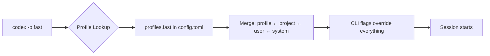
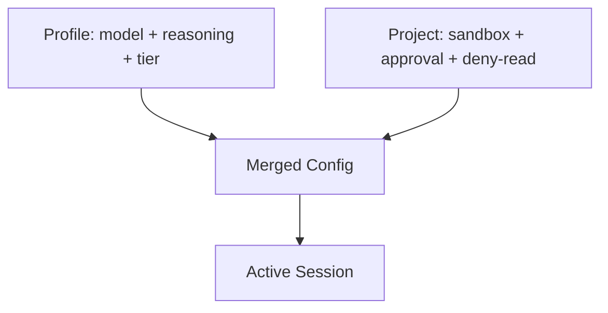
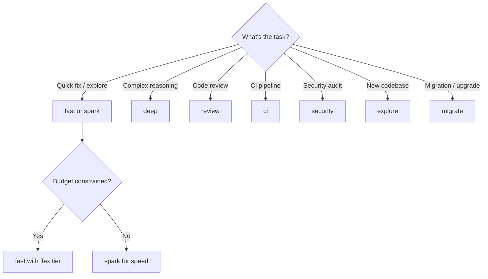

# Codex CLI Named Profiles: A Cookbook of Ready-to-Use Configuration Templates


Named profiles are one of the most underused features in Codex CLI. Instead of juggling CLI flags or maintaining separate config files, a single `codex -p deep` switches your entire configuration — model, reasoning effort, sandbox policy, service tier — in one argument. This article provides eight battle-tested profiles you can drop into your `~/.codex/config.toml` and start using immediately.

## How Profiles Work

A profile is a `[profiles.<name>]` section in your `config.toml` that overrides top-level defaults when activated[^1]. The precedence chain runs: CLI flags → profile values → project config → user config → system config → defaults[^2].

```toml
# ~/.codex/config.toml — top-level defaults
model = "gpt-5.4"
approval_policy = "on-request"
sandbox_mode = "workspace-write"

# Activate with: codex -p fast
[profiles.fast]
model = "gpt-5.4-mini"
model_reasoning_effort = "low"
service_tier = "fast"
```

Invoke any profile with `codex --profile <name>` or the shorthand `codex -p <name>`[^1]. You can also set a default profile at the top level with `profile = "daily"` — the `--profile` flag overrides it per invocation[^1].



## Profile Keys Reference

Not every `config.toml` key works inside a profile. The profile-compatible keys are[^3]:

| Key | Example | Purpose |
|---|---|---|
| `model` | `"gpt-5.5"` | Model selection |
| `model_reasoning_effort` | `"high"` | Reasoning depth (minimal → xhigh) |
| `model_verbosity` | `"low"` | Response verbosity |
| `service_tier` | `"flex"` | Speed/cost tier |
| `web_search` | `"disabled"` | Web search behaviour |
| `personality` | `"pragmatic"` | Communication style |
| `plan_mode_reasoning_effort` | `"high"` | Plan mode override |
| `model_instructions_file` | `"./review.md"` | Custom system instructions |
| `model_catalog_json` | `"./catalog.json"` | Model catalogue override |

Sandbox, approval, and agent keys remain top-level or project-scoped — profiles focus on the model and interaction layer[^3].

## The Cookbook: Eight Ready-to-Use Profiles

### 1. `fast` — Flow State

For quick questions, small fixes, and codebase exploration where latency matters more than depth.

```toml
[profiles.fast]
model = "gpt-5.4-mini"
model_reasoning_effort = "low"
service_tier = "fast"
personality = "pragmatic"
web_search = "disabled"
```

**When to use:** Renaming variables, explaining a function, generating a quick test stub. GPT-5.4-mini uses roughly 30% of the credits that GPT-5.4 consumes for comparable tasks[^4], and Fast tier delivers tokens 1.5× faster at 2.5× the cost[^5]. At low reasoning effort, responses arrive in seconds.

**Cost profile:** ~19 credits per 1M input tokens[^6].

### 2. `deep` — Complex Reasoning

For multi-file refactors, architectural decisions, and tasks requiring sustained logical chains.

```toml
[profiles.deep]
model = "gpt-5.5"
model_reasoning_effort = "xhigh"
model_verbosity = "high"
personality = "pragmatic"
```

**When to use:** Debugging a race condition across three services, planning a database migration, reasoning about security implications. GPT-5.5 at `xhigh` reasoning effort produces the most thorough analysis available[^7].

**Cost profile:** ~125 credits per 1M input tokens[^6]. Reserve for tasks where correctness justifies the spend.

### 3. `review` — Code Review

For reviewing diffs, auditing PRs, and running `/review` on your own changes before committing.

```toml
[profiles.review]
model = "gpt-5.4"
model_reasoning_effort = "high"
model_verbosity = "medium"
personality = "pragmatic"
model_instructions_file = "~/.codex/review-instructions.md"
web_search = "disabled"
```

**When to use:** Running `codex -p review` then `/review` before every commit. The custom instructions file can enforce your team's review checklist — security, performance, naming conventions, test coverage[^8].

### 4. `ci` — Headless CI/CD

For `codex exec` in pipelines where determinism and cost control matter.

```toml
[profiles.ci]
model = "gpt-5.4-mini"
model_reasoning_effort = "medium"
service_tier = "flex"
web_search = "disabled"
personality = "pragmatic"
```

**When to use:** `codex exec -p ci --output-schema report.json "Review this PR for security issues"`. Flex tier provides a 50% cost discount for tasks that tolerate slightly higher latency[^5]. Pair with `--ignore-user-config` and `--ignore-rules` for fully hermetic runs[^9].

**Cost profile:** With Flex tier's 50% discount and GPT-5.4-mini's low token cost, this is the cheapest profile in the cookbook — roughly 9.4 credits per 1M input tokens.

### 5. `security` — Security Audit

For vulnerability scanning, dependency auditing, and security-focused code review.

```toml
[profiles.security]
model = "gpt-5.2-codex"
model_reasoning_effort = "high"
model_verbosity = "high"
web_search = "cached"
model_instructions_file = "~/.codex/security-instructions.md"
```

**When to use:** GPT-5.2-Codex was specifically optimised for cybersecurity workflows, achieving 56.4% on SWE-Bench Pro and 64.0% on Terminal-Bench 2.0 for security-related tasks[^10]. Enable cached web search so the agent can verify CVE details against public databases.

### 6. `explore` — Codebase Onboarding

For understanding unfamiliar codebases, reading documentation, and architecture discovery.

```toml
[profiles.explore]
model = "gpt-5.5"
model_reasoning_effort = "medium"
model_verbosity = "high"
personality = "friendly"
web_search = "cached"
```

**When to use:** First day on a new codebase. GPT-5.5's 400K context window in Codex[^7] handles large file reads without premature compaction. The `friendly` personality produces more explanatory responses suited to learning.

### 7. `spark` — Ultra-Fast Iteration

For rapid prototyping, REPL-style interactions, and tasks where response time is everything.

```toml
[profiles.spark]
model = "gpt-5.3-codex-spark"
model_reasoning_effort = "low"
service_tier = "fast"
personality = "pragmatic"
web_search = "disabled"
```

**When to use:** Spike prototypes, quick format conversions, generating boilerplate. Spark is optimised for near-instant coding iteration[^4]. Note: currently available to ChatGPT Pro users only.

### 8. `migrate` — Code Modernisation

For legacy migration, framework upgrades, and large-scale codebase transformations.

```toml
[profiles.migrate]
model = "gpt-5.5"
model_reasoning_effort = "high"
model_verbosity = "medium"
personality = "pragmatic"
plan_mode_reasoning_effort = "xhigh"
```

**When to use:** TypeScript migration, framework upgrades, API version bumps. The split reasoning effort — `high` for execution, `xhigh` for planning — ensures thorough analysis during the planning phase without burning credits on routine file transformations[^11].

## Combining Profiles with Project Config

Profiles define *how* the agent thinks. Project config defines *what* it can do. Use both:

```toml
# .codex/config.toml — project-level
sandbox_mode = "workspace-write"
approval_policy = "on-request"

[sandbox_workspace_write]
writable_roots = ["src/", "tests/"]

[deny_read_paths]
patterns = [".env*", "credentials/**"]
```

Then invoke with `codex -p deep` — the profile's model and reasoning settings merge with the project's sandbox and security policies[^2].



## Mid-Session Profile Switching

You cannot switch profiles mid-session, but you can adjust reasoning effort on the fly with `Alt+,` (lower) and `Alt+.` (raise) keyboard shortcuts[^12]. For a full profile switch, start a new session:

```bash
# Start a review, then switch to deep analysis
codex -p review
# ... review work ...
# New session with different profile
codex -p deep
```

## Decision Framework



## Practical Recommendations

1. **Start with three profiles.** `fast`, `deep`, and `ci` cover 80% of workflows. Add others as your usage patterns emerge.

2. **Set a default profile.** Add `profile = "fast"` at the top level so `codex` without flags uses your most common configuration[^1].

3. **Use shell aliases for ergonomics.** `alias cx='codex -p fast'` and `alias cxd='codex -p deep'` reduce friction.

4. **Version project profiles.** Commit `.codex/config.toml` with project-scoped profiles so every team member uses the same settings[^8].

5. **Monitor cost per profile.** Use `codex exec --json` to capture reasoning token usage[^13] and track which profiles consume the most credits.

## Citations

[^1]: OpenAI, "Advanced Configuration — Codex," [https://developers.openai.com/codex/config-advanced](https://developers.openai.com/codex/config-advanced), accessed April 2026.
[^2]: OpenAI, "Config basics — Codex," [https://developers.openai.com/codex/config-basic](https://developers.openai.com/codex/config-basic), accessed April 2026.
[^3]: OpenAI, "Configuration Reference — Codex," [https://developers.openai.com/codex/config-reference](https://developers.openai.com/codex/config-reference), accessed April 2026.
[^4]: OpenAI, "Models — Codex," [https://developers.openai.com/codex/models](https://developers.openai.com/codex/models), accessed April 2026.
[^5]: OpenAI, "Speed — Codex," [https://developers.openai.com/codex/speed](https://developers.openai.com/codex/speed), accessed April 2026.
[^6]: OpenAI, "Pricing — Codex," [https://developers.openai.com/codex/pricing](https://developers.openai.com/codex/pricing), accessed April 2026.
[^7]: OpenAI, "Introducing GPT-5.5," [https://openai.com/index/introducing-gpt-5-5/](https://openai.com/index/introducing-gpt-5-5/), April 2026.
[^8]: OpenAI, "Best practices — Codex," [https://developers.openai.com/codex/learn/best-practices](https://developers.openai.com/codex/learn/best-practices), accessed April 2026.
[^9]: OpenAI, "Command line options — Codex CLI," [https://developers.openai.com/codex/cli/reference](https://developers.openai.com/codex/cli/reference), accessed April 2026.
[^10]: OpenAI, "Introducing GPT-5.2-Codex," referenced in Cybersecurity News coverage, April 2026.
[^11]: OpenAI, "Codex Prompting Guide," [https://developers.openai.com/cookbook/examples/gpt-5/codex_prompting_guide](https://developers.openai.com/cookbook/examples/gpt-5/codex_prompting_guide), accessed April 2026.
[^12]: OpenAI/Codex, "feat(tui): shortcuts to change reasoning level temporarily," PR #18866, [https://github.com/openai/codex/pull/18866](https://github.com/openai/codex/pull/18866), April 2026.
[^13]: OpenAI, "Codex CLI v0.125.0 Release Notes," [https://github.com/openai/codex/releases](https://github.com/openai/codex/releases), April 2026.
