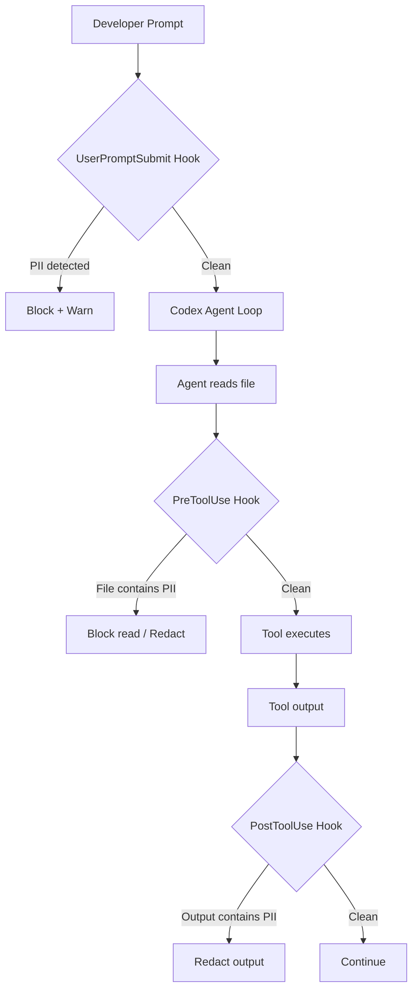

# Codex CLI and OpenAI Privacy Filter: Preventing PII Leakage in Agent Workflows with Local On-Device Scanning


---

When a coding agent reads your codebase, it ingests everything in its context window — configuration files, test fixtures, log samples, database seeds. If any of those contain personally identifiable information (PII), that data flows to the model provider's API. OpenAI's Privacy Filter, released on 16 April 2026 as an open-weight Apache 2.0 model [^1], gives Codex CLI practitioners a local, high-throughput scanning layer that can intercept PII before it ever leaves the machine. This article shows how to wire it into your Codex CLI workflow using hooks, `codex exec` pipelines, and enterprise managed configuration.

## What Privacy Filter Is (and Isn't)

Privacy Filter is a 1.5-billion-parameter bidirectional token-classification model that detects and redacts PII in text [^2]. It runs locally on CPU or GPU, supports a 128K-token context window, and achieves a 96% F1 score on the PII-Masking-300k benchmark (94.04% precision, 98.08% recall) [^3]. It ships with a CLI tool (`opf`), fine-tuning support, and evaluation tooling.

It detects eight span types [^4]:

| Span Type | Examples |
|-----------|----------|
| `private_person` | Full names, usernames |
| `private_email` | Email addresses |
| `private_phone` | Phone numbers |
| `private_address` | Physical addresses |
| `private_date` | Dates of birth |
| `private_url` | Personal URLs |
| `account_number` | Bank accounts, IDs |
| `secret` | API keys, tokens, passwords |

Crucially, OpenAI's own documentation states that Privacy Filter is "a redaction and data minimization aid, not an anonymization, compliance, or safety guarantee" [^4]. It is a defence-in-depth layer, not a compliance checkbox.

## Installation

Privacy Filter installs from the GitHub repository [^4]:

```bash
git clone https://github.com/openai/privacy-filter.git
cd privacy-filter
pip install -e .
```

This creates the `opf` command-line tool. Verify:

```bash
opf "Alice Smith lives at 42 Oak Lane and her API key is sk-abc123"
```

You should see redacted output with `[PRIVATE_PERSON]`, `[PRIVATE_ADDRESS]`, and `[SECRET]` placeholders.

For CPU-only environments (CI runners, locked-down workstations):

```bash
opf --device cpu "text to scan"
```

## Architecture: Where Privacy Filter Sits in the Codex CLI Stack

The key insight is that Codex CLI's hooks system [^5] provides interception points where Privacy Filter can scan content *before* it reaches the model. The integration follows a three-layer pattern:



Three hooks, three interception points, one model running locally.

## Pattern 1: Scanning Prompts with UserPromptSubmit

The `UserPromptSubmit` hook fires when the user submits a prompt. This catches the most common PII leak: developers pasting customer data, log snippets, or error messages containing real names and emails directly into the prompt.

Create a scanning script at `~/.codex/hooks/pii-scan-prompt.sh`:

```bash
#!/usr/bin/env bash
set -euo pipefail

# Read the prompt from stdin (Codex passes hook context as JSON)
PROMPT=$(jq -r '.prompt // empty' < /dev/stdin)

if [ -z "$PROMPT" ]; then
  exit 0
fi

# Run Privacy Filter on the prompt text
RESULT=$(echo "$PROMPT" | opf --device cpu 2>/dev/null)

# If the output differs from input, PII was found
if [ "$RESULT" != "$PROMPT" ]; then
  echo '{"decision": "block", "reason": "PII detected in prompt. Redact sensitive data before submitting."}'
  exit 2
fi

exit 0
```

Wire it into `~/.codex/config.toml`:

```toml
[features]
codex_hooks = true

[[hooks.UserPromptSubmit]]
matcher = ".*"

[[hooks.UserPromptSubmit.hooks]]
type = "command"
command = "bash ~/.codex/hooks/pii-scan-prompt.sh"
timeout = 10
statusMessage = "Scanning prompt for PII..."
```

When PII is detected, Codex blocks the submission and displays the reason. The developer can then redact the sensitive data and resubmit.

## Pattern 2: PreToolUse File-Read Interception

The `PreToolUse` hook fires before tool calls execute. When the agent attempts to read a file that contains PII — say a test fixture with real customer data — this hook can intercept and block the read.

Create `~/.codex/hooks/pii-scan-file.py`:

```python
#!/usr/bin/env python3
"""Scan files for PII before Codex reads them."""
import json
import subprocess
import sys

def main():
    context = json.load(sys.stdin)
    tool_name = context.get("tool_name", "")

    # Only scan file-reading operations
    if tool_name not in ("Read", "Bash"):
        sys.exit(0)

    # Extract file path from tool arguments
    args = context.get("tool_arguments", {})
    file_path = args.get("file_path", "")

    if not file_path or not file_path.strip():
        sys.exit(0)

    try:
        result = subprocess.run(
            ["opf", "--device", "cpu", "-f", file_path],
            capture_output=True, text=True, timeout=15
        )

        with open(file_path, "r") as f:
            original = f.read()

        if result.stdout.strip() != original.strip():
            response = {
                "permissionDecision": "deny",
                "reason": f"PII detected in {file_path}. "
                          f"Clean the file before allowing agent access."
            }
            json.dump(response, sys.stdout)
            sys.exit(2)
    except (subprocess.TimeoutExpired, FileNotFoundError, UnicodeDecodeError):
        # Non-text files or timeout — allow through
        pass

    sys.exit(0)

if __name__ == "__main__":
    main()
```

```toml
[[hooks.PreToolUse]]
matcher = "^(Read|Bash)$"

[[hooks.PreToolUse.hooks]]
type = "command"
command = "python3 ~/.codex/hooks/pii-scan-file.py"
timeout = 20
statusMessage = "Scanning file for PII..."
```

## Pattern 3: PostToolUse Output Scanning

The `PostToolUse` hook runs after a tool completes. This catches PII that appears in tool output — for example, a database query that returns real customer records, or a `grep` that surfaces log lines containing email addresses.

```toml
[[hooks.PostToolUse]]
matcher = "^(Bash|mcp_.*)$"

[[hooks.PostToolUse.hooks]]
type = "command"
command = "python3 ~/.codex/hooks/pii-scan-output.py"
timeout = 15
statusMessage = "Scanning tool output for PII..."
```

The output scanning script follows the same pattern as the file scanner but reads `tool_output` from the hook context instead.

## Pattern 4: Batch Scanning with codex exec

For CI/CD pipelines, combine Privacy Filter with `codex exec` to scan codebases before the agent touches them:

```bash
#!/usr/bin/env bash
# pre-scan.sh — Run before codex exec in CI

# Scan all text files in the working directory
find . -type f \( -name "*.json" -o -name "*.csv" -o -name "*.yaml" \
  -o -name "*.yml" -o -name "*.env" -o -name "*.sql" \
  -o -name "*.log" -o -name "*.txt" \) | while read -r file; do

  ORIGINAL=$(cat "$file")
  REDACTED=$(opf --device cpu -f "$file" 2>/dev/null)

  if [ "$REDACTED" != "$ORIGINAL" ]; then
    echo "WARNING: PII detected in $file"
    FOUND_PII=true
  fi
done

if [ "$FOUND_PII" = true ]; then
  echo "::error::PII detected in workspace. Clean data before running agent."
  exit 1
fi
```

Integrate into a GitHub Actions workflow:

```yaml
- name: Scan workspace for PII
  run: bash scripts/pre-scan.sh

- name: Run Codex agent
  uses: openai/codex-action@v1
  with:
    prompt: "Fix failing tests and update documentation"
    model: gpt-5.5
```

## Performance Considerations

Privacy Filter processes text in a single forward pass rather than token-by-token [^4], making it fast enough for hook-based scanning. Practical benchmarks on common hardware:

| Hardware | Throughput | Hook Latency |
|----------|-----------|--------------|
| M-series Mac (GPU) | ~50K tokens/s | < 1s for typical files |
| Standard CI runner (CPU) | ~8K tokens/s | 2-5s for typical files |
| GPU server (A100) | ~200K tokens/s | < 0.5s |

For hook timeouts, set conservative values: 10s for prompt scanning, 20s for file scanning on CPU. If latency is unacceptable, restrict scanning to known-sensitive paths using `deny_read_paths` in `config.toml` for outright blocking and reserve Privacy Filter hooks for directories that need read access but might contain PII.

## Fine-Tuning for Your Domain

Privacy Filter supports fine-tuning on labelled data [^4], which is valuable for organisations whose codebases contain domain-specific PII patterns (medical record numbers, internal employee IDs, proprietary account formats):

```bash
opf train /path/to/labelled-data.jsonl \
  --output-dir ~/.opf/custom-checkpoint \
  --epochs 3
```

Then point your hooks at the custom checkpoint:

```bash
opf --checkpoint ~/.opf/custom-checkpoint -f "$file"
```

The training data format uses standard JSONL with BIOES boundary labels, documented in the repository's examples directory [^4].

## Enterprise Deployment with Managed Configuration

For organisations using Codex CLI's managed configuration [^6], Privacy Filter hooks can be enforced across all developer machines via `requirements.toml`:

```toml
# Distributed via MDM or cloud-managed config
[features]
codex_hooks = true

[[hooks.UserPromptSubmit]]
matcher = ".*"

[[hooks.UserPromptSubmit.hooks]]
type = "command"
command = "opf-codex-scan prompt"
timeout = 10
statusMessage = "Corporate PII scan..."
```

This ensures that PII scanning cannot be bypassed by individual developers, addressing a common compliance requirement in regulated industries.

## Defence in Depth: Combining with Existing Controls

Privacy Filter hooks complement — but do not replace — Codex CLI's existing data protection mechanisms:

| Layer | Mechanism | What It Protects |
|-------|-----------|-----------------|
| Filesystem | `deny_read_paths` [^5] | Blocks agent access to sensitive directories entirely |
| Environment | `shell_environment_policy` [^7] | Strips credentials from subprocess environments |
| Network | Sandbox network isolation [^5] | Prevents data exfiltration via network calls |
| Content | **Privacy Filter hooks** | Scans actual content for PII patterns |
| Review | Guardian auto-review [^8] | Second-model review of sensitive operations |

The content-scanning layer fills a gap that the other mechanisms cannot: `deny_read_paths` blocks entire files, but Privacy Filter can flag *specific PII within files the agent legitimately needs to read*.

## Current Limitations

- **English-centric**: Privacy Filter's accuracy drops on non-English text and non-Western naming conventions [^4]. ⚠️ Organisations with multilingual codebases should evaluate F1 scores on their own data before relying on it.
- **Not a compliance guarantee**: The model is a detection aid, not a GDPR or HIPAA compliance tool. Human review remains necessary for high-sensitivity domains [^4].
- **Hook overhead**: Adding three scanning hooks increases per-turn latency by 2-10 seconds on CPU. Use targeted matchers to limit scanning scope.
- **Binary files**: Privacy Filter only processes text. Images, PDFs, and compiled artefacts need separate scanning tools.

## Practical Recommendations

1. **Start with prompts only**: Wire up the `UserPromptSubmit` hook first. This catches the highest-risk vector (developers pasting real data) with minimal performance impact.
2. **Scope file scanning narrowly**: Use `matcher` patterns and path-based conditions to scan only directories likely to contain data fixtures, logs, or configuration.
3. **Fine-tune for your domain**: The base model catches common PII patterns. Invest an afternoon fine-tuning on your organisation's labelled data for domain-specific identifiers.
4. **Combine with deny_read_paths**: Block known-sensitive directories outright; use Privacy Filter for the grey areas.
5. **Monitor hook performance**: Track hook latency via rollout file analysis [^9] to catch scanning bottlenecks before they degrade developer experience.

## Citations

[^1]: [Introducing OpenAI Privacy Filter](https://openai.com/index/introducing-openai-privacy-filter/) — OpenAI, 16 April 2026
[^2]: [OpenAI's new Privacy Filter runs on your laptop so PII never hits the cloud](https://thenewstack.io/openai-privacy-filter-pii/) — The New Stack, April 2026
[^3]: [Benchmarking OpenAI's Privacy Filter](https://www.tonic.ai/blog/benchmarking-openai-privacy-filter-pii-detection) — Tonic.ai, April 2026
[^4]: [OpenAI Privacy Filter GitHub Repository](https://github.com/openai/privacy-filter) — OpenAI, Apache 2.0
[^5]: [Codex CLI Hooks Documentation](https://developers.openai.com/codex/hooks) — OpenAI Developers
[^6]: [Codex Managed Configuration](https://developers.openai.com/codex/managed-config) — OpenAI Developers
[^7]: [Codex Advanced Configuration — shell_environment_policy](https://developers.openai.com/codex/config-advanced) — OpenAI Developers
[^8]: [Codex Agent Approvals and Security](https://developers.openai.com/codex/agent-approvals-security) — OpenAI Developers
[^9]: [Codex CLI Features — Rollout Files](https://developers.openai.com/codex/cli/features) — OpenAI Developers
