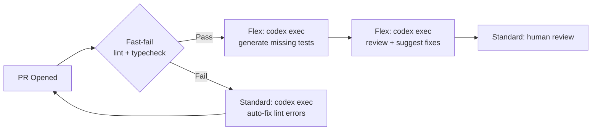
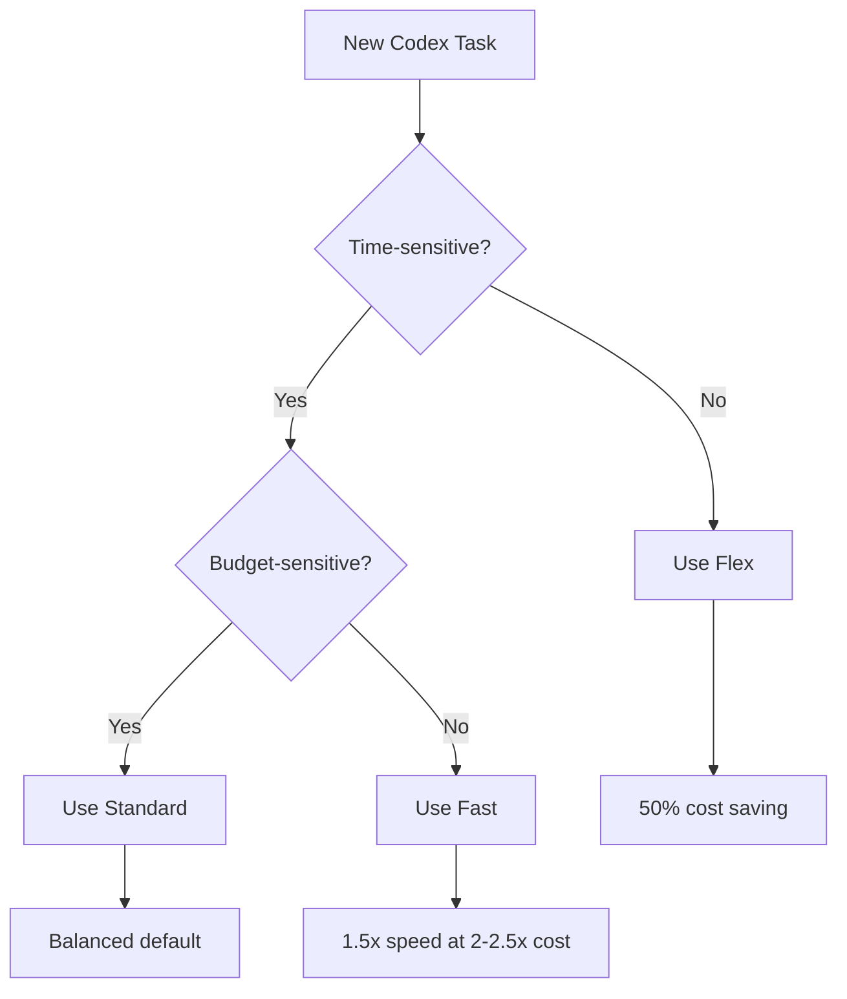

# Codex CLI Service Tiers Explained: Flex, Standard, and Fast Mode for Cost and Speed Optimisation


---

Every `codex exec` invocation and every interactive session burns tokens. Whether you are running a quick lint fix or a six-hour codebase migration, the service tier you choose determines how much you pay and how long you wait. Since v0.124 stabilised service-tier configuration and v0.125 added profile round-tripping across TUI, MCP, and app-server surfaces [^1], Codex CLI now gives you fine-grained control over the cost–speed trade-off. This article explains the three tiers — Flex, Standard, and Fast — shows how to configure each, and provides practical patterns for mixing them in real workflows.

## The Three Service Tiers

Codex CLI inherits OpenAI's API service-tier model [^2] and layers its own Fast mode on top. The result is three distinct operating points:

| Tier | Relative Cost | Latency | Best For |
|------|--------------|---------|----------|
| **Flex** | ~50% of Standard | Variable; seconds to minutes | Batch CI, background migrations, overnight eval sweeps |
| **Standard** | Baseline | Normal | Interactive development, pair programming, ad-hoc tasks |
| **Fast** | 2–2.5× Standard | ~1.5× faster token generation | Latency-critical demos, real-time iteration, rapid prototyping |

### Flex Tier

Flex processing routes your request through a lower-priority queue, pricing tokens at Batch API rates — roughly half the standard cost [^3]. The trade-off is unpredictable latency: most requests complete within seconds, but under load they can take several minutes. Occasionally, requests return a `429 Resource Unavailable` error when capacity is exhausted; you are not charged for these failures [^3].

Flex is ideal for workloads where you do not need an immediate answer:

- Nightly `codex exec` runs that generate test suites or refactor boilerplate
- CI pipelines where a few extra minutes of wall-clock time are acceptable
- Evaluation sweeps with `promptfoo` or custom eval harnesses
- Batch documentation generation across many files

### Standard Tier

Standard is the default. Requests are processed with normal priority and standard token pricing [^4]. Most interactive Codex sessions run on Standard without any explicit configuration.

### Fast Mode

Fast mode increases token generation speed by approximately 1.5× by routing to higher-priority inference infrastructure [^5]. The cost is significant: GPT-5.5 consumes credits at 2.5× the Standard rate, and GPT-5.4 at 2× [^5]. Fast mode currently supports GPT-5.5 and GPT-5.4 only.

Use Fast mode when latency directly affects your productivity — live demos, rapid iteration loops where you are blocked waiting for output, or short interactive sessions where the extra cost is negligible relative to your time.

## Configuration

### Setting the Service Tier Globally

Add `service_tier` to your `~/.codex/config.toml`:

```toml
# Default to Standard (this is the built-in default)
service_tier = "auto"

# Or opt into Flex for all sessions
service_tier = "flex"
```

### Fast Mode

Fast mode uses a separate feature flag alongside the service tier:

```toml
service_tier = "fast"

[features]
fast_mode = true
```

You can also toggle Fast mode mid-session with slash commands [^5]:

```bash
/fast on      # Enable Fast mode for this session
/fast off     # Revert to Standard
/fast status  # Check current state
```

### Per-Session Overrides

Override the tier for a single run without touching config:

```bash
# Flex for a batch migration
codex -c service_tier='"flex"' exec "Migrate all CommonJS imports to ESM"

# Fast for a quick interactive fix
codex -c service_tier='"fast"' -c features.fast_mode=true "Fix the failing auth test"
```

### Profile-Based Tier Switching

The most ergonomic approach is to encode tiers into named profiles [^6]. Since v0.125, profiles round-trip across TUI, MCP sandbox state, and app-server sessions [^1], so the tier you choose persists correctly regardless of how you launch Codex.

```toml
# ~/.codex/config.toml

model = "gpt-5.4"
service_tier = "auto"

[profiles.batch]
model = "gpt-5.4-mini"
service_tier = "flex"
approval_policy = "never"
sandbox_mode = "workspace-write"
model_reasoning_effort = "low"

[profiles.review]
model = "gpt-5.5"
service_tier = "auto"
approval_policy = "on-request"
model_reasoning_effort = "high"

[profiles.sprint]
model = "gpt-5.5"
service_tier = "fast"
model_reasoning_effort = "medium"
```

Invoke a profile from the CLI:

```bash
codex --profile batch exec "Add missing JSDoc to all exported functions"
codex --profile review "Review the changes in this PR"
codex --profile sprint "Implement the Redis caching layer"
```

## Cost Modelling

The following table shows approximate credit consumption per million output tokens across tiers and models, based on current pricing [^4][^5]:

| Model | Flex | Standard | Fast |
|-------|------|----------|------|
| GPT-5.5 | ~375 credits | 750 credits | ~1,875 credits |
| GPT-5.4 | ~200 credits | 400 credits | ~800 credits |
| GPT-5.4-mini | ~2.25 credits | 4.50 credits | N/A |

GPT-5.4-mini does not support Fast mode, but its Standard rate is already so low that Flex savings are marginal in absolute terms. For high-volume batch work, pairing GPT-5.4-mini with Flex yields the cheapest possible output.

### Prompt Caching Stacks with Tiers

Prompt caching applies a 90% discount on cached input tokens [^4], and this discount stacks with the Flex discount. A `codex exec` pipeline that processes many files with the same AGENTS.md preamble benefits doubly: the cached prefix is discounted, and the per-token rate is halved. Structure your batch jobs to maximise cache hits by processing similar files in sequence.

## Practical Patterns

### Pattern 1: Tiered CI Pipeline



The fast-fail gate runs native tooling (no LLM cost). Test generation and automated review use Flex because wall-clock time is not the bottleneck — the PR will sit in a review queue regardless. Auto-fix on lint failure uses Standard for faster turnaround so the developer gets feedback promptly.

### Pattern 2: Interactive Session with Dynamic Switching

Start a session on Standard. When you hit a straightforward but large refactoring task, drop to Flex:

```bash
# In the TUI, switch mid-session:
/config service_tier flex

# Run the bulk operation
Rename all occurrences of UserService to AccountService across the codebase

# Switch back for interactive work
/config service_tier auto
```

### Pattern 3: Overnight Batch with Monitoring

Combine Flex with `codex exec --json` to run cost-aware batch jobs. The `--json` flag reports reasoning-token usage per turn [^1], letting you monitor spend in real time:

```bash
codex --profile batch exec --json \
  "Refactor the payments module to use the new billing API" \
  | tee /tmp/refactor.jsonl \
  | jq -r 'select(.type=="usage") | "Input: \(.input_tokens) Output: \(.output_tokens)"'
```

Pipe the JSONL stream to your observability stack (Datadog, Grafana, or a simple `jq` script) to alert if token consumption exceeds a budget threshold.

### Pattern 4: Subagent Delegation with Mixed Tiers

When orchestrating multi-agent workflows, assign tiers by role. The orchestrator agent runs on Standard (it needs low latency to coordinate), while worker subagents run on Flex (they execute in parallel and latency is amortised):

```toml
# Orchestrator config
model = "gpt-5.4"
service_tier = "auto"

[agents.worker]
description = "Handles individual file refactoring tasks"
config_file = "worker-config.toml"
```

```toml
# worker-config.toml
model = "gpt-5.4-mini"
service_tier = "flex"
model_reasoning_effort = "low"
```

## Error Handling for Flex

Flex requests can fail with `429 Resource Unavailable` when capacity is constrained [^3]. Codex CLI's built-in retry logic handles transient failures, but for `codex exec` pipelines in CI you should implement a fallback strategy:

```bash
# Try Flex first; fall back to Standard on failure
codex --profile batch exec "Generate unit tests for src/auth/" 2>/tmp/codex-err.log \
  || codex --profile review exec "Generate unit tests for src/auth/"
```

For SDK-level integrations, set client timeouts to at least 15 minutes for Flex requests to accommodate queue delays [^3].

## When to Use Each Tier



**Choose Flex** when the task runs unattended, in CI, or overnight. The 50% saving compounds quickly across large batch runs.

**Choose Standard** for normal interactive development. It is the sensible default for the majority of Codex sessions.

**Choose Fast** sparingly — when you are actively blocked on output and your time is more valuable than the extra credits. Fast mode on GPT-5.5 at 2.5× cost can burn through a Pro plan's 5-hour allocation rapidly [^7].

## Limitations and Caveats

- **Flex availability is not guaranteed.** Under heavy load, requests may be rejected entirely. Do not depend on Flex for time-critical workflows [^3].
- **Fast mode only supports GPT-5.5 and GPT-5.4.** GPT-5.4-mini and older models are not eligible [^5].
- **Fast mode with ChatGPT sign-in only.** API-key authentication uses standard API pricing regardless of the `service_tier` setting [^5].
- **Profiles are experimental.** The `[profiles.*]` syntax may change in future releases and is not yet supported in the IDE extension [^6].
- ⚠️ Some users have reported that Fast mode does not always deliver a perceptible speed improvement while still charging at the elevated rate [^8]. Monitor your own experience before committing to Fast for extended sessions.

## Citations

[^1]: OpenAI, "Codex Changelog — v0.124 and v0.125," April 2026. [https://developers.openai.com/codex/changelog](https://developers.openai.com/codex/changelog)

[^2]: OpenAI, "Flex Processing — OpenAI API Docs," 2026. [https://developers.openai.com/api/docs/guides/flex-processing](https://developers.openai.com/api/docs/guides/flex-processing)

[^3]: OpenAI, "Flex Processing Guide," 2026. [https://developers.openai.com/api/docs/guides/flex-processing](https://developers.openai.com/api/docs/guides/flex-processing)

[^4]: OpenAI, "Codex Pricing," April 2026. [https://developers.openai.com/codex/pricing](https://developers.openai.com/codex/pricing)

[^5]: OpenAI, "Speed — Codex," April 2026. [https://developers.openai.com/codex/speed](https://developers.openai.com/codex/speed)

[^6]: OpenAI, "Advanced Configuration — Codex," 2026. [https://developers.openai.com/codex/config-advanced](https://developers.openai.com/codex/config-advanced)

[^7]: OpenAI, "Models — Codex," April 2026. [https://developers.openai.com/codex/models](https://developers.openai.com/codex/models)

[^8]: GitHub Issue #18692, "GPT-5.4 Fast mode often feels no faster than Standard, but still consumes credits at 2x," April 2026. [https://github.com/openai/codex/issues/18692](https://github.com/openai/codex/issues/18692)
