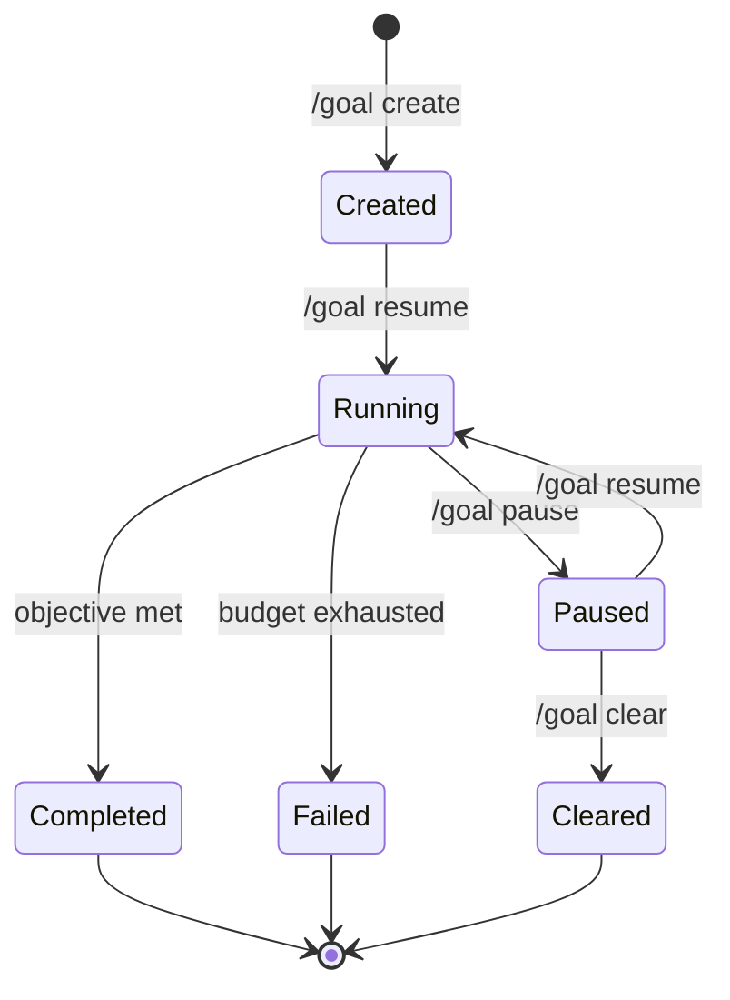

# Codex CLI v0.128: Goal Workflows, Configurable Keymaps, and Built-In Self-Update


---

Version 0.128.0, released on 30 April 2026, is a feature-dense release that finally delivers three capabilities the community has requested for months: persistent goal workflows with pause/resume controls, a `/keymap` slash command for remapping TUI shortcuts, and a built-in `codex update` subcommand that ends the "which package manager did I install with?" problem[^1]. Alongside these headline features, the release ships external agent session imports, MultiAgentV2 refinements with explicit thread caps, and the usual round of sandbox and network hardening. This article unpacks every significant change with practical configuration examples.

## The `codex update` Subcommand

Prior to v0.128, updating Codex CLI meant remembering your installation method. npm users ran `npm install -g @openai/codex@latest`, Homebrew users ran `brew upgrade codex`, and binary-install users downloaded a fresh tarball[^2]. Two separate GitHub issues (#9274 and #11169) tracked the demand for a unified self-update command[^3][^4].

The new `codex update` subcommand detects the installation method and applies the correct upgrade path:

```bash
# Check for available updates without applying
codex update --check

# Apply the update
codex update

# Force update even if on the latest version
codex update --force
```

The command reports the current version, the latest available version, and the installation source before proceeding[^1]. For enterprise environments where admins manage package distribution centrally, `codex update` respects the `CODEX_UPDATE_DISABLED=1` environment variable to prevent users from self-updating past an approved version.

## Persistent `/goal` Workflows

### From Session-Scoped to Persistent

The earlier goal mode, introduced around v0.116 and covered in our April 16 article, gave sessions a stated objective but lost state when the session ended[^5]. In v0.128, `/goal` workflows persist across sessions via the app-server APIs, meaning a long-running objective survives terminal crashes, machine reboots, and deliberate pauses[^1].

### How It Works

A goal workflow combines a stated objective with model tools, runtime continuation logic, and TUI lifecycle controls:



The TUI controls map directly to slash commands:

```bash
# Create a new persistent goal
/goal create "Migrate the authentication module from Express middleware to Hono"

# Pause the current goal (state persisted to app-server)
/goal pause

# Resume the most recent goal
/goal resume

# Clear a completed or abandoned goal
/goal clear
```

When a goal is active, the agent's system prompt includes the objective text and any accumulated progress notes. The model tools layer means the agent can invoke structured tool calls — file reads, shell commands, web searches — within the goal's permission profile, and each step is checkpointed to the app-server backend[^1].

### Practical Use Case: Overnight Refactoring

Goals unlock a pattern where you define an objective, let the agent work through it over hours, and review results asynchronously:

```bash
# Start a goal at end of day
codex --profile team-standard
/goal create "Refactor all repository access classes to use the new UnitOfWork pattern. Run tests after each file. Stop if any test suite fails."

# Detach (Ctrl+C or close terminal) — goal persists
# Next morning, resume and review
codex resume --last
/goal status
```

The agent picks up exactly where it left off, with full context from prior turns.

## Configurable TUI Keymaps with `/keymap`

### The Customisation Gap

Codex CLI's TUI has accumulated keyboard shortcuts across 30+ releases: `Ctrl+O` to copy, `Ctrl+R` for prompt history, `Ctrl+G` for the editor, `Alt+.`/`Alt+,` for reasoning effort[^6]. Until v0.128, these bindings were hardcoded. Developers using tmux, screen, or specific terminal emulators frequently reported conflicts — `Ctrl+O` clashes with tmux's prefix in some configurations, and `Alt+.` collides with readline's "insert last argument" on many shells[^7].

### The `/keymap` Command

The new `/keymap` slash command opens an interactive viewer showing all current bindings and allows remapping:

```bash
# View all current keybindings
/keymap

# Remap a specific action
/keymap copy Ctrl+Shift+C
/keymap reasoning-up Ctrl+]
/keymap reasoning-down Ctrl+[
```

Remappings persist in `~/.codex/config.toml` under a new `[tui.keymap]` section:

```toml
[tui.keymap]
copy = "Ctrl+Shift+C"
reasoning-up = "Ctrl+]"
reasoning-down = "Ctrl+["
editor = "Ctrl+E"
prompt-history = "Ctrl+P"
```

This is a configuration-only change — it does not affect `codex exec` or any non-interactive mode[^1].

## `/statusline` and `/title` Customisation

Two additional TUI commands round out the customisation story:

**`/statusline`** opens an interactive editor for the footer bar. You can reorder, add, or remove status items — model name, token count, active profile, sandbox mode, session ID — by toggling entries in a checklist[^1][^6].

**`/title`** configures what appears in your terminal's window or tab title during an active session. This is particularly useful for multi-session workflows where you have several Codex instances running in different tmux panes:

```toml
[tui.title]
format = "{model} | {profile} | {cwd_basename}"
show_turn_count = true
action_required_prefix = "! "
```

The `action_required_prefix` setting means your terminal tab visually flags when Codex is waiting for approval — a small but meaningful improvement for developers who context-switch between panes.

## External Agent Session Imports

Version 0.128 introduces the ability to import sessions from external agents into Codex[^1]. The feature targets teams running heterogeneous agent stacks — perhaps Claude Code for initial prototyping and Codex for CI integration — who want to consolidate context.

The import handles:

- **Background processing** — large session transcripts are ingested asynchronously without blocking the TUI
- **Title handling** — imported sessions receive a title derived from the source agent's metadata
- **Context preservation** — the imported conversation history becomes part of the Codex thread's context window, subject to the same compaction rules as native turns

This complements the existing `codex mcp-server` capability for the reverse direction (other agents consuming Codex)[^8].

## MultiAgentV2 Refinements

The multi-agent orchestration system receives several configuration controls that make production deployments more predictable[^1]:

```toml
[multi_agent_v2]
max_concurrent_threads = 4
wait_timeout_seconds = 300
root_agent_hint = "coordinator"
subagent_depth_limit = 3
```

- **Thread caps** (`max_concurrent_threads`) — prevents runaway parallelism from consuming your entire token budget in minutes
- **Wait-time controls** — sets a deadline for subagent responses before the orchestrator times out and proceeds
- **Root/subagent hints** — explicit role declarations replace the previous heuristic-based detection
- **Depth handling** — hard limits on subagent nesting prevent recursive delegation loops

These controls address the practical problems teams encountered when deploying the v1 multi-agent system at scale, where unbounded thread creation could exhaust rate limits within a single orchestration run[^9].

## Permission Profile Enhancements

Building on v0.125's profile persistence work, v0.128 adds built-in defaults and CLI-level profile selection for sandboxed runs[^1]:

```bash
# List available built-in profiles
codex sandbox --list-profiles

# Run with a specific built-in profile
codex sandbox --permissions-profile restricted

# Override current working directory controls
codex --profile custom -c "permissions.cwd_policy=locked"
```

Built-in profiles provide sensible starting points — `restricted`, `standard`, and `permissive` — that teams can extend rather than building from scratch. The `cwd_policy` control determines whether the agent can change its working directory during execution, addressing a class of sandbox escape vectors where agents navigated outside the intended project root[^10].

## Plugin and Hook Improvements

The plugin system gains several operational improvements[^1]:

- **Remote uninstall** — previously, removing a marketplace-installed plugin required manual config editing; now `/plugins remove <name>` handles cleanup
- **Plugin-bundled hooks** — plugins can ship with pre/post hooks that activate automatically on installation, enabling patterns like "install the ESLint plugin and automatically lint before every commit"
- **Hook enablement state** — individual hooks can be toggled on/off without removing them from configuration
- **Remote bundle caching** — marketplace plugins are cached locally after first download, reducing startup latency on subsequent sessions

## Bug Fixes Worth Knowing

### Resume and Interruption

The most user-visible fix addresses **stale interrupt hangs** — a long-standing irritation where pressing `Ctrl+C` during a tool call would leave the session in a limbo state requiring a force-kill[^1]. The agent now cleanly cancels the in-flight operation and returns to the prompt within two seconds.

### Network Security Hardening

Managed network policies gain several defences[^1]:

- **Deferred denials** — network requests to denied hosts now fail with clear error messages rather than hanging
- **IPv6 host matching** — permission policies now correctly match IPv6 addresses, closing a bypass vector
- **`git -C` approval** — the agent correctly requests approval when using `git -C <path>` to operate on directories outside the current sandbox scope

### Windows Sandbox

Windows users benefit from fixes to pseudoconsole startup, elevated runner processes, and named-pipe validation — collectively addressing the most common "Codex won't start" reports from Windows enterprise deployments[^1].

## Upgrade Path

```bash
# If you're already on a version that supports codex update
codex update

# Otherwise, the traditional methods still work
npm install -g @openai/codex@latest
# or
brew upgrade codex
```

Verify your version after updating:

```bash
codex --version
# Expected: 0.128.0
```

## What This Means for Your Workflow

Version 0.128 represents a maturity milestone. The `/goal` workflow turns Codex from a session-oriented tool into a persistent task runner. `/keymap` eliminates the last major TUI friction point for power users. And `codex update` removes an embarrassingly mundane source of support tickets.

For teams running multi-agent orchestration, the MultiAgentV2 thread caps and depth limits are essential guardrails that should be configured before any production deployment. For solo developers, the headline feature is probably the stale interrupt fix — small in the changelog, enormous in daily quality of life.

## Citations

[^1]: [Codex CLI v0.128.0 release notes](https://github.com/openai/codex/releases/tag/rust-v0.128.0), OpenAI, 30 April 2026
[^2]: [Codex CLI installation guide](https://developers.openai.com/codex/cli), OpenAI Developers
[^3]: [Add `codex upgrade` command for self-updates - Issue #9274](https://github.com/openai/codex/issues/9274), GitHub
[^4]: [Feature request: add `codex update` command for one-step self-update - Issue #11169](https://github.com/openai/codex/issues/11169), GitHub
[^5]: [Codex CLI Goal Mode: Persistent Objectives and Token Budgets](https://codex.danielvaughan.com/2026/04/16/codex-cli-goal-mode-persistent-objectives-token-budgets/), Daniel Vaughan, 16 April 2026
[^6]: [Codex CLI features](https://developers.openai.com/codex/cli/features), OpenAI Developers
[^7]: [Codex CLI slash commands](https://developers.openai.com/codex/cli/slash-commands), OpenAI Developers
[^8]: [Codex CLI as MCP Server](https://codex.danielvaughan.com/2026/03/30/codex-cli-as-mcp-server/), Daniel Vaughan, 30 March 2026
[^9]: [Codex changelog](https://developers.openai.com/codex/changelog), OpenAI Developers
[^10]: [Codex CLI v0.125: Permission Profile Persistence](https://codex.danielvaughan.com/2026/04/25/codex-cli-v0125-permission-profile-persistence/), Daniel Vaughan, 25 April 2026
