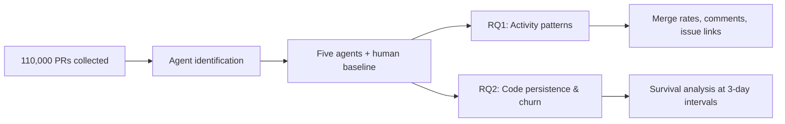
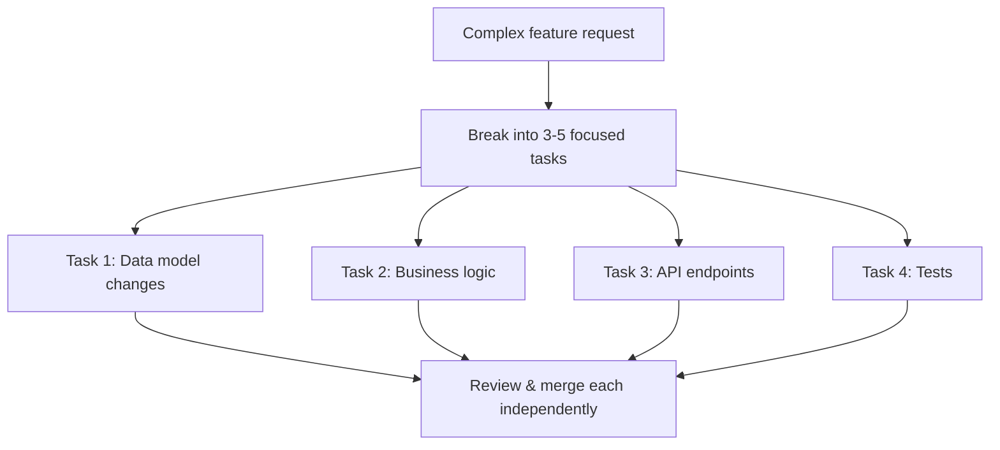

# Agent-Generated Code Churns Faster: What 110,000 Pull Requests Reveal and How to Configure Codex CLI for Durable Output


---

A new MSR 2026 study of 110,000 open-source pull requests across five coding agents finds that agent-generated code is rewritten and deleted significantly faster than human-authored code[^1]. The numbers are uncomfortable: at every three-day interval measured, human additions persisted at roughly double the rate of agent-authored lines[^1]. Code churn — the ratio of changed or deleted lines to total additions — was consistently higher for every agent studied, including Codex[^1].

This article synthesises the paper's Codex-specific findings, cross-references them with industry-wide code quality data, and offers concrete Codex CLI configuration patterns to push your agent output towards the durable end of the spectrum.

## The Study at a Glance

Popescu et al. constructed a dataset of approximately 110,000 open-source pull requests submitted between June and August 2025, covering five autonomous agents — OpenAI Codex, Claude Code, GitHub Copilot, Google Jules, and Devin — alongside 20,910 human-authored PRs as a control group[^1].

Two research questions drove the analysis:

1. **RQ1:** How do agent-authored PRs differ from human PRs in collaboration signals and development progress?
2. **RQ2:** How do agent-authored PRs affect code maintenance trajectories compared to human code?



## Codex-Specific Findings

The data paints a nuanced picture of how Codex is used in the wild.

### Small Changes, Fast Merges

Codex produced the **smallest median change size** among the five agents[^1]. Its median PR merge time was 0.5 minutes — effectively instant — compared to a human median of 0.4 hours[^1]. The combination suggests Codex is overwhelmingly used for small, routine modifications where the developer reviews locally before submitting the PR.

### Concentrated in Low-Visibility Repositories

75.3% of Codex PRs targeted zero-star repositories[^1]. This mirrors patterns seen in Jules (75.7%) and contrasts with Claude Code (51.7%) and human PRs (40.5%)[^1]. The implication is clear: Codex is disproportionately used for personal projects and early-stage work rather than high-visibility open-source libraries.

### Minimal Collaboration Signals

Codex PRs rarely received review comments and were seldom linked to issues[^1]. Copilot, by contrast, linked roughly 50% of its PRs to issues[^1]. The low interaction rate reinforces the hypothesis that Codex serves as a fast-loop local tool rather than a collaborative review mechanism.

### The Churn Problem

Despite these favourable speed metrics, Codex-authored code exhibited higher churn across all measured intervals than human code[^1]. At three-day intervals, approximately 50% of human additions persisted unchanged; agent-authored code fell well below that line[^1]. The difference was statistically significant (p < 0.001)[^1].

## Broader Industry Data Supports the Pattern

The MSR 2026 findings align with wider observations. Industry surveys report that teams using AI code generation experience 41% higher code churn and 7.2% decreased delivery stability[^2]. Code duplication increases approximately fourfold[^2], and AI-generated code introduces 1.7x more total issues than human-written code across maintainability, logic, and security categories[^3]. By 2026, 75% of technology decision-makers face moderate to severe technical debt linked to AI-speed practices[^3].

The pattern is consistent: AI agents trade durability for velocity. The code ships faster but requires more subsequent rework.

## Why Agent Code Churns

Three structural factors drive the churn differential.

### 1. Pattern Replication over Reuse

Agents tend to replicate code patterns rather than import existing abstractions[^2]. When a codebase already contains a utility function, Codex may generate a near-duplicate instead of referencing it. The duplicate works initially but becomes a maintenance liability as the original evolves.

### 2. Shallow Verification Loops

Without explicit instructions, Codex evaluates its own output — and self-evaluation is unreliable in codebases with real complexity[^4]. When tests are absent or weak, the agent declares success based on compilation alone, leaving logic errors for humans to discover later.

### 3. Missing Architectural Context

AGENTS.md files with vague instructions like "write clean code" provide no actionable constraint[^4]. When Codex lacks specific knowledge about module boundaries, naming conventions, and dependency policies, it makes reasonable but inconsistent choices that create friction with the existing codebase.

## Configuring Codex CLI for Durable Output

The good news: every factor above is addressable through configuration. The following patterns target the root causes identified by the research.

### Write a Precision AGENTS.md

Move from aspirational statements to concrete, machine-readable rules.

```markdown
# AGENTS.md

## Architecture
- All database access goes through `src/db/repository.ts`. Never call Prisma directly from route handlers.
- Shared utilities live in `src/lib/`. Search there before creating new helpers.
- Components follow the compound pattern: `ComponentName/index.tsx`, `ComponentName.styles.ts`, `ComponentName.test.tsx`.

## Conventions
- Use named exports, never default exports.
- Error types extend `AppError` from `src/errors.ts`.
- All public functions require JSDoc with `@param` and `@returns`.

## Verification
- Run `npm test -- --coverage` after every change. Coverage must not decrease.
- Run `npm run lint` before considering work complete.
- If modifying API routes, run `npm run test:integration`.
```

A short, precise AGENTS.md is more effective than a long, vague one[^4]. Start with five rules; add more only after observing repeated mistakes.

### Enforce Test Verification with Hooks

Codex CLI hooks provide lifecycle events that can enforce quality gates before the agent considers work complete[^5]. A `PostToolUse` hook can verify that tests pass after every file write:

```toml
# .codex/config.toml

[[hooks]]
event = "PostToolUse"
tool = "write_file"
command = "npm test -- --bail 2>&1 | tail -20"
timeout_ms = 30000
on_failure = "stop"
```

The `on_failure = "stop"` directive halts the agent loop when tests fail, forcing the agent to address failures before proceeding rather than accumulating breakage across multiple edits[^5].

### Use /review Before Committing

The `/review` command runs a dedicated reviewer pass across your uncommitted changes[^6]. Configure custom review instructions that explicitly target churn-producing patterns:

```markdown
<!-- .codex/review-instructions.md -->
Flag the following:
1. Any new utility function that duplicates existing code in src/lib/
2. Functions longer than 40 lines without test coverage
3. Direct database calls outside src/db/
4. Missing error handling (bare try/catch, swallowed errors)
5. Type assertions or `any` usage without justification
```

Reference this file from your AGENTS.md to ensure every `/review` run applies the same criteria[^4].

### Raise Reasoning Effort for Architectural Work

The `model_reasoning_effort` configuration key controls how deeply the model reasons about each response[^7]. For routine edits — renaming, formatting, simple bug fixes — `low` or `medium` effort is sufficient. For architectural changes where durability matters, increase it:

```toml
# Profile for architectural work
[profiles.architecture]
model = "gpt-5.5"
model_reasoning_effort = "high"
```

Switch profiles with `codex --profile architecture` when working on code that must persist[^7].

### Decompose Tasks to Reduce Scope Drift

The research found that larger agent-authored changes correlate with higher churn rates[^1]. Codex already produces the smallest median changes among the five agents studied, but you can reinforce this pattern:



One thread per task, not one thread per project[^4]. Each focused task produces a smaller, more reviewable diff that is less likely to require rework.

### Add a PostToolUse Duplication Check

To combat the pattern-replication problem, add a hook that warns when new code may duplicate existing utilities:

```bash
#!/usr/bin/env bash
# scripts/check-duplication.sh
# Runs after file writes to detect potential duplication

CHANGED_FILE="$1"
if [[ "$CHANGED_FILE" == *.ts ]] || [[ "$CHANGED_FILE" == *.js ]]; then
    # Extract new function names and check for similar existing ones
    npx jscpd --min-lines 5 --threshold 10 "$CHANGED_FILE" 2>/dev/null
fi
```

```toml
[[hooks]]
event = "PostToolUse"
tool = "write_file"
command = "bash scripts/check-duplication.sh"
timeout_ms = 15000
on_failure = "warn"
```

⚠️ The `jscpd` approach catches textual duplication but not semantic equivalence. It serves as a coarse signal rather than a definitive check.

## Measuring Your Own Churn Rate

The paper's methodology is reproducible. Track three metrics on your own Codex-assisted PRs:

1. **Survival rate**: What percentage of lines added by Codex remain unchanged after 7 days? After 30 days?
2. **Churn ratio**: `(lines_modified + lines_deleted) / lines_added` within the first two weeks post-merge.
3. **Rework rate**: How many follow-up commits in the same files within 7 days?

Git log queries can surface these numbers cheaply:

```bash
# Lines surviving after 7 days in files touched by a specific PR
git log --since="7 days ago" --numstat -- <files_from_pr> | \
  awk '{added+=$1; deleted+=$2} END {print "Churn:", deleted/added}'
```

If your Codex output trends above 0.3 churn ratio consistently, tighten your AGENTS.md and hook configuration before scaling usage.

## The Takeaway

The MSR 2026 data does not argue against using coding agents. Codex produces the smallest, fastest-merging PRs of any agent studied, and its merge rate exceeds the human baseline[^1]. The research argues that agent output requires **deliberate durability engineering** — precise instructions, automated verification, and architectural guardrails — to match the longevity of human-authored code.

Treating Codex as a fast typist who needs clear specification produces durable code. Treating it as an autonomous developer who can infer your architecture does not.

---

## Citations

[^1]: R. M. Popescu, D. Gros, A. Botocan, R. Pandita, P. Devanbu, and M. Izadi, "Investigating Autonomous Agent Contributions in the Wild: Activity Patterns and Code Change over Time," MSR 2026 Technical Track, [arxiv.org/abs/2604.00917](https://arxiv.org/abs/2604.00917), April 2026.

[^2]: AI-Generated Code Statistics 2026, Net Corp Software Development, [netcorpsoftwaredevelopment.com](https://www.netcorpsoftwaredevelopment.com/blog/ai-generated-code-statistics), 2026.

[^3]: AI-Generated Code Quality Metrics and Statistics for 2026, Second Talent, [secondtalent.com](https://www.secondtalent.com/resources/ai-generated-code-quality-metrics-and-statistics-for-2026/), 2026.

[^4]: OpenAI, "Best practices — Codex," [developers.openai.com/codex/learn/best-practices](https://developers.openai.com/codex/learn/best-practices), 2026.

[^5]: OpenAI, "Hooks — Codex CLI," [developers.openai.com/codex/hooks](https://developers.openai.com/codex/hooks), 2026.

[^6]: OpenAI, "Features — Codex CLI," [developers.openai.com/codex/cli/features](https://developers.openai.com/codex/cli/features), 2026.

[^7]: OpenAI, "Configuration Reference — Codex," [developers.openai.com/codex/config-reference](https://developers.openai.com/codex/config-reference), 2026.
